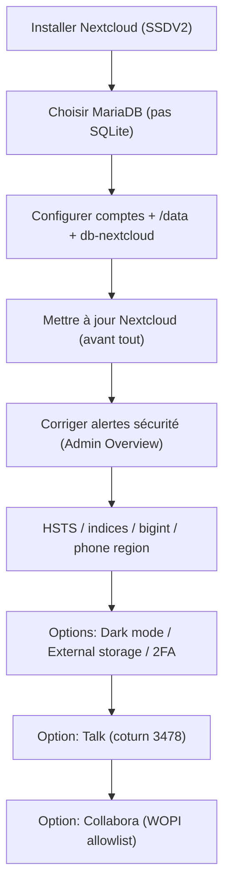

!!! abstract "🧾 Abstract"
    Ce guide couvre une installation Nextcloud **propre et durable** sur SSDV2 : **MariaDB** (recommandé), fin des alertes de sécurité principales, durcissement (HSTS), ajout de fonctionnalités (thème sombre, stockage externe, 2FA), puis options avancées (**Talk** via coturn et **Collabora**).  
    Objectif : une instance **stable**, **sécurisée** et **maintenable**.

---

## ✅ TL;DR

- ✅ Utilisez **MariaDB** (évitez SQLite)
- ✅ Après installation : corrigez les alertes (**HSTS**, **indices**, **bigint**, **région téléphone**)
- ✅ Ajoutez : thème sombre, stockage externe, 2FA
- ✅ Options : Talk (coturn 3478) / Collabora (WOPI allowlist)

!!! tip "🧠 Variables à remplacer"
    - `TON_USER` = votre user Linux (minuscule)  
    - `ndd.tld` = votre domaine (minuscule)  
    - “Commenter” = ajouter `#` en début de ligne

---

## 🎯 Objectifs

- 🚀 Installer Nextcloud via SSDV2
- 🗄️ Utiliser MariaDB pour éviter les limites de SQLite
- 🔐 Régler les alertes de sécurité (admin overview)
- 🧩 Ajouter confort : dark mode, external storage, 2FA
- 🎥 Option : Talk
- 📝 Option : Collabora (avec résolution WOPI)

---

## ✅ Pré-requis

- [ ] Nextcloud déployé via SSDV2 (Traefik OK)
- [ ] Domaine : `https://nextcloud.ndd.tld` accessible
- [ ] Accès SSH au serveur
- [ ] Vous savez relancer des containers Docker

!!! danger "⚠️ HSTS"
    HSTS augmente la sécurité mais peut **durcir** l’accès si vous cassez TLS / désactivez Cloudflare / changez de certificat.
    Activez-le uniquement quand **tout est stable**.

---

## 🗺️ Vue d’ensemble (workflow)



---

# 1) 🧱 Installation Nextcloud (MariaDB recommandé)

## Pourquoi MariaDB (et pas SQLite)

SQLite peut fonctionner au début, mais MariaDB évite des soucis de perf/locks et rend l’instance plus robuste.

!!! tip "✅ Choix recommandé"
    **MariaDB** dès le départ = moins de migrations, moins de surprises.

---

## Paramètres MariaDB à renseigner (dans l’installer Nextcloud)

Référence visuelle (vos valeurs peuvent varier) :


Valeurs recommandées :

- **Login admin Nextcloud** : choisissez le vôtre (ne gardez pas “toto” 😄)
- **Password admin Nextcloud** : **fort**
- **Répertoire des données** : `/data`
- **Utilisateur DB** : `nextcloud`
- **Password DB** : `nextcloud` *(vous pouvez mettre mieux, mais gardez cohérent avec votre stack)*
- **Nom DB** : `nextcloud`
- **Hôte DB** : `db-nextcloud`

Cliquez **Installer**.

!!! example "📌 Exemple (rappel)"
    - Data dir : `/data`  
    - DB host : `db-nextcloud`

---

## ✅ Mise à jour immédiate (avant toute autre opération)

!!! warning "Très important"
    Mettez Nextcloud à jour **avant** d’appliquer d’autres réglages ou d’installer des apps.

> Le tuto d’origine mentionne “20.0.4”, mais la logique reste valide : appliquez toujours les étapes sur la **version actuelle** de votre instance.

---

# 2) 🔐 Régler les alertes sécurité (Admin Overview)

Les alertes se trouvent ici :

- `https://nextcloud.ndd.tld/settings/admin/overview`


---

## 2.1 ✅ Alerte HSTS (Strict-Transport-Security)

Message typique :
> L'en-tête HTTP "Strict-Transport-Security" n'est pas configurée…

Éditez :

```bash
nano /opt/seedbox/docker/TON_USER/nextcloud/conf/nginx/site-confs/default
```

Ajoutez (dans le server block, comme sur l’exemple) :

```nginx
add_header Strict-Transport-Security "max-age=63072000; includeSubdomains; preload";
```

Exemple visuel :


Redémarrez :

```bash
docker restart nextcloud db-nextcloud
```

!!! danger "HSTS & preload"
    `preload` + `includeSubdomains` = très strict.
    Assurez-vous que **tous** vos sous-domaines sont bien en HTTPS stable.

---

## 2.2 ✅ Alerte indices DB manquants

Entrez dans le conteneur :

```bash
docker exec -ti nextcloud bash
```

Puis :

```bash
occ db:add-missing-indices
```

---

## 2.3 ✅ Alerte conversion bigint (filecache)

Toujours dans le conteneur :

```bash
docker exec -ti nextcloud bash
```

Puis :

```bash
occ db:convert-filecache-bigint
```

Confirmez `y` si demandé.

!!! warning "⏳ Durée"
    Cette opération peut durer longtemps selon le volume de fichiers.

---

## 2.4 ✅ Alerte région téléphone (default_phone_region)

Éditez :

```bash
nano /opt/seedbox/docker/TON_USER/nextcloud/conf/www/nextcloud/config/config.php
```

Ajoutez (dans le tableau PHP, proche de la fin) :

```php
'default_phone_region' => 'FR',
```

Exemple :

```php
'dbhost' => 'XXX',
'dbport' => '',
'dbtableprefix' => 'oc',
'mysql.utf8mb4' => true,
'dbuser' => 'XXX',
'dbpassword' => 'XXX',
'installed' => true,
'default_phone_region' => 'FR',
```

Redémarrez :

```bash
docker restart nextcloud db-nextcloud
```

!!! success "✅ Résultat attendu"
    Les avertissements de sécurité majeurs disparaissent et vous retrouvez votre “V” vert. ✅


---

# 3) 🌙 Ajouter un mode sombre (Dark mode)

App recommandée : **Breeze Dark**

- `https://apps.nextcloud.com/apps/breezedark`


Dans Nextcloud :
- Applications → rechercher `dark` → installer

!!! tip "🧹 Cache"
    Videz le cache navigateur et rechargez la page si vous ne voyez pas le changement.

---

# 4) 🗂️ Monter votre home (External Storage) — sans modifier de fichiers

Référence (tuto d’origine) :
- `https://mondedie.fr/d/10779-docker-monter-le-home-dans-nextcloud`

Méthode “Nextcloud-native” :

1. Applications → installer **External storage support**
2. Paramètres → **Stockages externes**
3. Remplissez :

- Nom : libre
- Type : **Local**
- Auth : **Aucune**
- Chemin :

    - Si vous utilisez Gdrive : `/home/TON_USER/Medias/`
    - Sinon : `/home/TON_USER/local/`

4. Cliquez sur `...` → **Permettre le partage**
5. Vérifiez le ✅ vert

!!! warning "Permissions"
    Si le stockage ne se monte pas, c’est souvent un souci de droits (UID/GID) entre conteneur et host.

---

# 5) 🔐 Activer la double authentification (2FA TOTP)

App : **Two-Factor TOTP Provider**

Illustration :


Étapes :

1. Applications → installer **Two-Factor TOTP Provider**
2. Paramètres utilisateur → Sécurité :
   - `https://ndd.tld/settings/user/security`
3. Scanner le QR Code avec votre app (Google Authenticator, etc.)
4. Entrez le code dans Nextcloud pour valider

!!! tip "📱 App TOTP"
    Google Authenticator fonctionne, mais vous pouvez aussi utiliser Aegis (Android) ou 2FAS, etc.

---

# 6) 💬 Nextcloud Talk (option)

## Installation Nextcloud + Talk

Mettre à jour le script :

```bash
cd /opt/seedbox-compose/ && git pull
```

Installer Nextcloud via SSDV2 :

```bash
cd /opt/seedbox-compose/ && ./seedbox.sh
```

Dans le menu :
- option `2`
- puis `1`
- sélectionner **Nextcloud** (Espace) → OK

Installer **Talk** dans Nextcloud :
- `https://nextcloud.ndd.tld/settings/apps` → rechercher “Talk”

Configurer Talk :
- `https://nextcloud.ndd.tld/settings/admin/talk`

Renseigner :

- **STUN** : `IP_DU_SERVEUR:3478`
- **TURN** : `IP_DU_SERVEUR:3478`
- **Secret** : valeur après `static-auth-secret` dans :

```bash
nano /opt/seedbox/docker/VOTRE_USER/coturn/turnserver.conf
```

!!! danger "🔥 Port 3478"
    Pensez à ouvrir le port **3478** (iptables/UFW selon votre politique),
    sinon Talk ne fonctionnera pas correctement.

!!! success "✅ Talk OK"
    Après ces réglages + port 3478, Talk devient fonctionnel.

---

# 7) 📝 Nextcloud + Collabora (option)

## 7.1 Vous avez déjà Nextcloud (sans pertes de données)

Mettre à jour :

```bash
cd /opt/seedbox-compose/ && git pull
```

Copier le fichier docker app :

```bash
cp /opt/seedbox-compose/includes/dockerapps/nextcloud.yml /opt/seedbox/conf
```

Réinitialiser Nextcloud via SSDV2 :

```bash
cd /opt/seedbox-compose/ && ./seedbox.sh
```

Menu :
- option `2`
- puis `3` (réinitialiser)
- sélectionner **Nextcloud** (Espace) → OK

Installer Collabora côté Nextcloud :
- `https://nextcloud.ndd.tld/settings/apps`

Configurer Collabora :
- `https://nextcloud.ndd.tld/settings/admin/richdocuments`

Renseignez votre sous-domaine Collabora :
- `https://collabora.ndd.tld`
puis **Apply**.

---

## 7.2 Vous n’avez pas encore Nextcloud

Mettre à jour + installer :

```bash
cd /opt/seedbox-compose/ && git pull
cd /opt/seedbox-compose/ && ./seedbox.sh
```

Menu :
- option `2`
- puis `1` (installer)
- sélectionner **Nextcloud** → OK

Puis installez/configurez Collabora comme ci-dessus.

---

## 7.3 Erreur “Unauthorized WOPI host” (fix)

Procédure :

1) Extraire le fichier :

```bash
docker cp collabora:/etc/loolwsd/loolwsd.xml /opt/loolwsd.xml
```

2) Éditer :

```bash
nano /opt/loolwsd.xml
```

3) Dans la section `<storage>`, ajouter des hosts autorisés (IP + domaine Nextcloud) :

```xml
<host desc="Regex pattern of hostname to allow or deny." allow="true">1\.2\.3\.4</host>
<host desc="Regex pattern of hostname to allow or deny." allow="true">nextcloud.votredomaine.tld</host>
```

4) Réinjecter :

```bash
docker cp /opt/loolwsd.xml collabora:/etc/loolwsd/loolwsd.xml
```

!!! success "✅ Résultat attendu"
    Collabora accepte Nextcloud comme hôte WOPI, et l’édition de documents fonctionne.

---

# ✅ Checklists

## Post-install (essentiel)

- [ ] Instance accessible : `https://nextcloud.ndd.tld`
- [ ] DB : MariaDB (`db-nextcloud`) utilisée
- [ ] Nextcloud mis à jour
- [ ] Admin Overview : alertes principales corrigées
- [ ] HSTS appliqué (si décidé et stable)

## Options (confort)

- [ ] Dark mode (Breeze Dark)
- [ ] External storage monté + partage autorisé
- [ ] 2FA TOTP activé

## Options (avancé)

- [ ] Talk configuré (STUN/TURN/secret) + port 3478 ouvert
- [ ] Collabora configuré + WOPI OK

---

## 🧪 Validation rapide (tests)

```bash
# état containers
docker ps --format "table {{.Names}}\t{{.Status}}\t{{.Ports}}"

# logs nextcloud (diagnostic)
docker logs --tail=200 nextcloud
docker logs --tail=200 db-nextcloud
```

!!! tip "🧩 Diagnostic"
    Si Nextcloud charge mais que l’installation DB échoue, regardez d’abord les logs de `db-nextcloud`.

---

## 🧯 Rollback (secours)

- Annuler HSTS : retirer la ligne `add_header Strict-Transport-Security ...` puis :
  ```bash
  docker restart nextcloud db-nextcloud
  ```

- Si une commande `occ` a été lancée trop tôt :
  - laissez terminer (index/bigint), puis relancez un check

!!! warning "Rollback ≠ magie"
    Certaines opérations DB (indices/bigint) modifient le schéma. C’est généralement positif, mais ce n’est pas “undo”.
