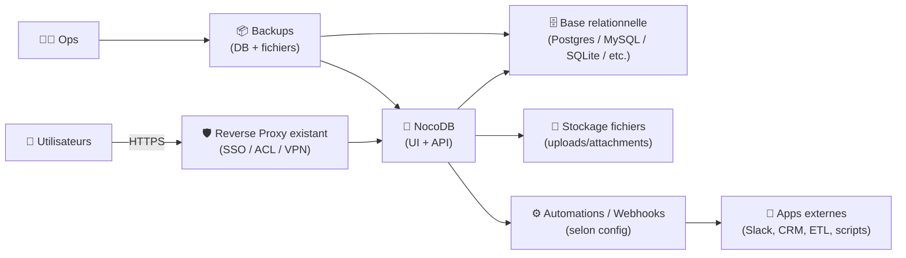
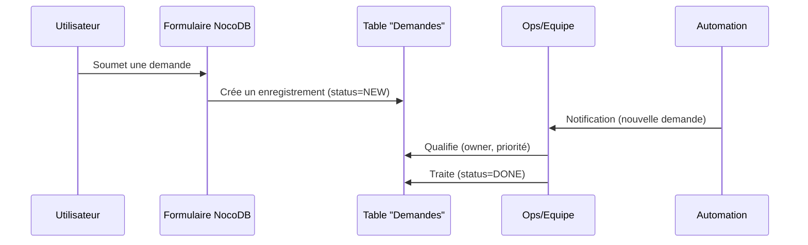

# 🧠 NocoDB — Présentation & Exploitation Premium (Airtable-like sur base relationnelle)

### Interface “smart spreadsheet” au-dessus de MySQL/PostgreSQL/SQLite/etc.
Optimisé pour reverse proxy existant • RBAC • Automations • API • Exploitation durable

---

## TL;DR

- **NocoDB** transforme une base relationnelle en **interface type tableur** (vues, filtres, formulaires, relations).
- Il sert de **couche produit** au-dessus de ta DB : collaboration, permissions, API, automatisation légère.
- Une config premium = **modélisation propre**, **RBAC maîtrisé**, **audit des accès**, **sauvegardes DB + fichiers**, **tests** + **rollback**.

Docs : https://nocodb.com/docs/

---

## ✅ Checklists

### Pré-usage (avant d’ouvrir à une équipe)
- [ ] DB “source of truth” identifiée (Postgres/MySQL/SQLite…)
- [ ] Modèle de données minimal validé (tables, clés, relations)
- [ ] Convention de nommage (tables/colonnes) définie
- [ ] Rôles & périmètres d’accès définis (qui voit/modifie quoi)
- [ ] Politique d’API keys (rotation, scopes) définie
- [ ] Stratégie de sauvegarde/restauration validée

### Post-configuration (qualité opérationnelle)
- [ ] Un user “read-only” ne peut rien casser (tests réels)
- [ ] Les relations + contraintes clés sont cohérentes
- [ ] Les vues “métier” existent (grille, kanban, galerie, calendrier si utilisé)
- [ ] Exports/automations testés (au moins 1 scénario)
- [ ] Procédure rollback documentée et testée

---

> [!TIP]
> NocoDB est excellent quand la base est **bien modélisée** et que tu construis des **vues orientées métier** (pas une reproduction brute du schéma).

> [!WARNING]
> Ne traite pas NocoDB comme un “outil magique” qui corrige un schéma bancal :  
> mauvais modèle → vues incohérentes → permissions difficiles → dette opérationnelle.

> [!DANGER]
> N’expose pas NocoDB sans contrôle d’accès (SSO/forward-auth/VPN), surtout si l’instance donne accès à des données sensibles.

---

# 1) NocoDB — Vision moderne

NocoDB n’est pas juste “un Airtable open-source”.

C’est :
- 🧱 Une **couche d’expérience** au-dessus d’une DB relationnelle
- 🧠 Un **constructeur de vues** (grille, kanban, galerie, formulaires)
- 🔐 Un **outil de gouvernance** (permissions, espaces/projets, partage)
- 🔌 Un **hub d’intégration** (API, webhooks/automations selon edition/features)

Repo : https://github.com/nocodb/nocodb  
Site : https://nocodb.com/

---

# 2) Architecture globale



---

# 3) Philosophie premium (5 piliers)

1. 🧱 **Modèle de données solide** (clés, relations, contraintes)
2. 🪟 **Vues orientées métier** (pas “tout le schéma”)
3. 🔐 **RBAC clair** (lecture/écriture/admin) + partage contrôlé
4. 🔌 **API/Automations gouvernées** (keys, rotation, journalisation)
5. 🧪 **Validation + rollback** (tests fonctionnels + restauration)

---

# 4) Modélisation “qui tient” (schéma → expérience)

## 4.1 Règles de base
- Une table = une entité métier (Clients, Commandes, Tickets…)
- Utilise des **IDs stables** (UUID ou auto-incrément, mais cohérent)
- Relations explicites :
  - 1-N : Client → Commandes
  - N-N : via table pivot (Commandes_Produits)

## 4.2 Convention de nommage (simple et durable)
- Tables : `snake_case` ou `PascalCase`, mais **une seule règle**
- Colonnes :
  - dates : `created_at`, `updated_at`
  - bool : `is_active`
  - FK : `customer_id`
- Évite les espaces et accents si tu utilises l’API intensivement

> [!TIP]
> Le meilleur “no-code” commence par un schéma propre. Tu gagnes ensuite sur tout : vues, permissions, API, exports.

---

# 5) Vues & UX (ce qui fait la valeur)

## 5.1 Vues recommandées (pack premium)
- **Vue Grille** : administration / édition rapide
- **Vue Kanban** : pipeline (statut) : `todo → doing → done`
- **Vue Galerie** : fiches visuelles (produits, assets)
- **Vue Formulaire** : collecte (intake) maîtrisée

## 5.2 Stratégie “vues métier”
- Une vue = une intention (support, sales, ops)
- Ajoute filtres & tris par défaut
- Cache les colonnes inutiles pour l’équipe

---

# 6) Permissions & Partage (RBAC propre)

Objectif : **minimiser les erreurs humaines**.

## 6.1 Modèle conseillé
- **Admins** : schéma, intégrations, paramètres
- **Editors** : édition sur tables/vues autorisées
- **Readers** : lecture seule

## 6.2 Partage (règles)
- Partage public : **exception**
- Partage interne : OK, mais **date d’expiration** si possible
- Pour données sensibles : accès via SSO/VPN seulement

> [!WARNING]
> Teste toujours avec un compte “Reader” : c’est la seule façon de valider que tu n’exposes pas trop.

---

# 7) API & Automations (gouvernance)

## 7.1 API
- Utilise des **API keys** dédiées par intégration (pas une clé “partout”)
- Rotation régulière (mensuelle/trimestrielle)
- Log des usages (au moins côté reverse proxy / SIEM)

## 7.2 Automations / Webhooks
- Utilise des webhooks pour :
  - notifier (Slack/Teams)
  - déclencher un job (CI/CD, ETL)
  - synchroniser (CRM, helpdesk)
- Toujours prévoir :
  - retries
  - idempotence (éviter doublons)
  - circuit breaker (stop si erreurs en boucle)

---

# 8) Workflows premium (exemples concrets)

## 8.1 “Collecte → Qualification → Traitement” (formulaire)


## 8.2 “Pipeline commercial” (kanban)
- Colonnes : `Lead → Qualified → Proposal → Won/Lost`
- Actions :
  - template de vue par équipe
  - champs obligatoires avant passage d’étape (via discipline + process)

---

# 9) Sécurité (sans recettes firewall)

## Principes indispensables
- Accès uniquement via **reverse proxy existant** (HTTPS)
- Auth forte (SSO/forward-auth) ou VPN
- Headers de sécurité côté proxy (HSTS, etc.)
- Limiter l’exposition des endpoints API si possible (ACL / rate-limit)

> [!DANGER]
> Les données sont le produit : traite NocoDB comme une application “métier critique”.

---

# 10) Validation / Tests / Rollback

## 10.1 Tests de validation (smoke + fonctionnels)
```bash
# 1) Santé HTTP (remplacer URL)
curl -I https://nocodb.example.tld | head

# 2) Vérifier login page charge
curl -s https://nocodb.example.tld | head -n 20

# 3) Test fonctionnel (manuel recommandé)
# - créer un enregistrement
# - modifier un champ
# - vérifier relation 1-N
# - vérifier qu’un Reader ne peut pas modifier
```

## 10.2 Tests de sécurité (indispensables)
- Compte Reader :
  - ✅ peut lire les vues autorisées
  - ❌ ne peut pas modifier/supprimer
- API key “integration-x” :
  - ✅ accès uniquement à ce qui est nécessaire
  - ❌ pas d’accès admin

## 10.3 Rollback (plan simple)
- A) Rollback applicatif : revenir à une version précédente (tag d’image / package)
- B) Rollback data : restaurer DB + fichiers (attachments) depuis backup
- C) Rollback config : revenir à une config reverse proxy connue stable

> [!TIP]
> Pour chaque upgrade : backup → upgrade → tests → sinon rollback immédiat.

---

# 11) Erreurs fréquentes (et correctifs)

- ❌ “Tout le monde admin” → fuite/casse
  - ✅ crée des rôles simples + scopes par projet/table
- ❌ Schéma instable (colonnes renommées tout le temps)
  - ✅ geler le schéma, itérer via migrations planifiées
- ❌ API keys partagées
  - ✅ une clé par intégration + rotation
- ❌ Aucune restauration testée
  - ✅ test mensuel sur une instance de staging

---

# 12) Sources — Images Docker (format demandé, URLs brutes)

## 12.1 Image officielle (stable)
- `nocodb/nocodb` (Docker Hub) : https://hub.docker.com/r/nocodb/nocodb  
- Doc NocoDB “Docker” (référence l’image) : https://nocodb.com/docs/self-hosting/installation/docker  
- Repo upstream (référence de l’image) : https://github.com/nocodb/nocodb  

## 12.2 Image “daily” (builds fréquents)
- `nocodb/nocodb-daily` (Docker Hub) : https://hub.docker.com/r/nocodb/nocodb-daily/tags  
- Profil Docker Hub `nocodb` : https://hub.docker.com/u/nocodb  

## 12.3 LinuxServer.io (si existant)
- Liste des images LSIO (vérification) : https://www.linuxserver.io/our-images  
- À date, NocoDB n’apparaît pas comme image LSIO dédiée dans cette liste (à revalider si ça change).

---

# ✅ Conclusion

NocoDB est une **couche produit** au-dessus de ta base :
- 🧱 si ton modèle est propre
- 🔐 si tes permissions sont claires
- 🔌 si tes intégrations sont gouvernées
- 🧪 si tu testes et sais revenir en arrière

Tu obtiens une “smart database UI” exploitable par les équipes, sans sacrifier la rigueur d’une DB relationnelle.