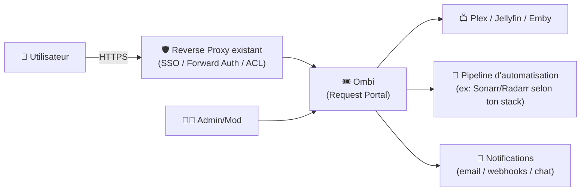
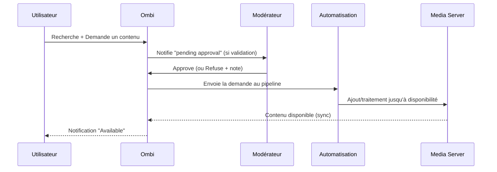

# 🎟️ Ombi — Présentation & Configuration Premium (Sans install / Sans Nginx / Sans Docker / Sans UFW)

### Portail de demandes “grand public” pour Plex / Jellyfin / Emby
Optimisé pour reverse proxy existant • Permissions & modération • Notifications • Qualité d’exploitation

---

## TL;DR

- **Ombi** est un **portail de demandes** : tes utilisateurs demandent films/séries, toi tu valides (ou auto-acceptes), et Ombi synchronise avec tes services.
- Il s’intègre à **Plex / Jellyfin / Emby** + à ton écosystème d’automatisation (souvent Sonarr/Radarr).
- Une config premium = **auth solide**, **rôles & approbations**, **catégories & quotas**, **notifications propres**, **observabilité**, **tests & rollback**.

---

## ✅ Checklists

### Pré-configuration (avant d’ouvrir aux users)
- [ ] Définir la politique : auto-approve vs validation manuelle
- [ ] Définir les rôles : Admin / Modérateur / Utilisateur
- [ ] Définir l’intégration média (Plex/Jellyfin/Emby) + permissions côté media server
- [ ] Définir la stratégie “qualité & pipeline” (qui traite les demandes, comment)
- [ ] Définir le canal de notifications (email/Discord/Telegram/etc. selon ton stack)
- [ ] Définir l’exposition : uniquement derrière ton reverse proxy existant + auth

### Post-configuration (go-live)
- [ ] Un user standard peut : chercher, demander, suivre l’état
- [ ] Un modérateur peut : approuver/refuser, commenter, gérer exceptions
- [ ] Les demandes créent bien un item “traitable” dans ton pipeline (selon ton intégration)
- [ ] Les notifications partent correctement (test réel)
- [ ] Les logs sont propres (pas de boucle d’erreurs de sync)

---

> [!TIP]
> Ombi sert à **réduire la friction** : “je veux ce film” devient un workflow clair, traçable, et modéré.

> [!WARNING]
> Les demandes peuvent devenir du spam si tu n’as pas : quotas, règles, et un minimum de modération.

> [!DANGER]
> N’expose pas Ombi sans contrôle d’accès. C’est une interface de gestion + données utilisateurs + intégrations.

---

# 1) Ombi — Vision moderne

Ombi n’est pas un simple formulaire.

C’est :
- 🧑‍🤝‍🧑 Un **portail self-service** pour tes utilisateurs
- ✅ Un **outil de modération** (approve/refuse/notes)
- 🔄 Un **système de sync** avec ton media server
- 🔔 Un **hub de notification** (statuts, demandes, changements)
- 📊 Un **point d’entrée** vers l’automatisation (selon ton écosystème)

Repo (référence produit) :
- https://github.com/Ombi-app/Ombi

Docs officielles :
- https://docs.ombi.app/

---

# 2) Architecture globale



---

# 3) Philosophie premium (5 piliers)

1. 🔐 **Accès & identité** (auth/SSO, rôles)
2. ✅ **Gouvernance** (modération, auto-approve maîtrisé)
3. 🧭 **Expérience utilisateur** (recherche claire, statuts compréhensibles)
4. 🔔 **Notifications** (signal > bruit)
5. 🧪 **Validation / Rollback** (tests simples, retour arrière documenté)

---

# 4) Identité, rôles et gouvernance (le cœur “pro”)

## Rôles recommandés
- 👑 **Admin** : configuration globale, connecteurs, maintenance
- 🛠️ **Moderator** : approuve/refuse, gère exceptions, notes
- 👤 **User** : demande + suivi

## Politique d’approbation (patterns efficaces)
### Option A — “Auto-approve contrôlé”
- Auto-approve pour certains groupes (famille, staff)
- Validation manuelle pour invités / externes

### Option B — “Validation manuelle”
- Recommandé si tu as beaucoup d’utilisateurs
- Réduit les demandes inutiles et les doublons

> [!TIP]
> Même en auto-approve, garde une règle : **quotas + blacklist** + logs/notifications.

---

# 5) Intégration Plex / Jellyfin / Emby (principes qui évitent 80% des soucis)

## Bonnes pratiques
- Utilise un compte/service dédié côté media server si possible (permissions minimales)
- Vérifie la sync initiale (bibliothèques, utilisateurs, accès)
- Valide la latence de sync (éviter “ça a été demandé mais rien n’apparaît”)

## Tests fonctionnels (rapides)
- Ombi voit bien la bibliothèque existante (recherche)
- Ombi reconnaît un contenu déjà présent (évite doublon)
- Un user apparaît correctement (si tu relies identité)

---

# 6) Expérience utilisateur (UX premium)

## Ce que tes users doivent comprendre en 10 secondes
- “Je peux chercher”
- “Je demande”
- “Je vois le statut”
- “Je reçois une notif quand c’est dispo”

## Statuts recommandés (lisibles)
- Requested → Pending approval → Approved → Processing → Available / Denied

> [!WARNING]
> Si tes statuts ne sont pas clairs, tu vas recevoir des “c’est quand que c’est dispo ?” toute la journée.

---

# 7) Notifications (signal, pas bruit)

## Stratégie premium
- Notifier **uniquement** :
  - nouvelle demande (modérateurs)
  - demande approuvée/refusée (demandeur)
  - disponibilité (demandeur)

## Anti-bruit
- Agréger les notifications si possible
- Éviter les notifications de “sync routine” ou “scan” vers des canaux humains

---

# 8) Sécurité applicative (sans recettes proxy)

## Exposition
- Accès uniquement via ton reverse proxy existant
- Ajoute une couche d’auth forte (SSO/forward-auth) si instance accessible hors LAN/VPN

## Hygiène
- Mots de passe forts (si auth locale)
- Désactiver/limiter les comptes inutiles
- Garder Ombi à jour

Doc reverse proxy (références officielles) :
- https://docs.ombi.app/info/reverse-proxy/

---

# 9) Workflows premium (incident & modération)

## 9.1 Workflow “demande standard”


## 9.2 Modération “pro”
- Refus avec **motif standardisé** (ex: “déjà dispo”, “pas dans la charte”, “trop volumineux”)
- Notes internes (audit trail)
- Exceptions (liste blanche) pour certains users

---

# 10) Validation / Tests / Rollback

## Smoke tests (tech)
```bash
# 1) Service répond (depuis ton réseau)
curl -I http://OMBI_HOST:PORT | head

# 2) Si tu as une URL via proxy
curl -I https://ombi.example.tld | head
```

## Tests fonctionnels (métier)
- User standard : demande un film “test”
- Modérateur : approuve
- Vérifie : statut évolue + notification part
- Vérifie : “déjà présent” est détecté (anti-doublon)

## Rollback (opérationnel)
- Sauvegarder la config avant changement
- Si régression : revenir à l’ancienne config + redémarrer
- Garder un changelog interne (date / quoi / pourquoi)

> [!TIP]
> Définis un “test de non-régression” minimal (5 minutes) après chaque changement.

---

# 11) Sources — Images Docker (format URLs brutes)

## 11.1 Image communautaire la plus citée (LinuxServer.io)
- `linuxserver/ombi` (Docker Hub) : https://hub.docker.com/r/linuxserver/ombi  
- Doc LinuxServer “docker-ombi” : https://docs.linuxserver.io/images/docker-ombi/  
- Repo de packaging (référence de l’image) : https://github.com/linuxserver/docker-ombi  
- Tags (voir versions) : https://hub.docker.com/r/linuxserver/ombi/tags  
- Variante registry LSIO (lscr.io) : https://lscr.io/linuxserver/ombi  

## 11.2 Image côté GitHub Packages (LinuxServer)
- Package `linuxserver/ombi` (GHCR) : https://github.com/orgs/linuxserver/packages/container/package/ombi  

## 11.3 Référence produit Ombi (upstream)
- Repo principal : https://github.com/Ombi-app/Ombi  
- Docs Ombi : https://docs.ombi.app/  
- Page “Docker Containers” (docs) : https://docs.ombi.app/info/docker-containers/  

---

# ✅ Conclusion

Ombi “premium”, c’est :
- 🔐 accès maîtrisé + rôles clairs
- ✅ modération ou auto-approve contrôlé
- 🔔 notifications utiles
- 🧭 UX simple pour les users
- 🧪 tests rapides + rollback documenté

Résultat : moins de demandes en DM, plus de traçabilité, et un pipeline média plus propre.