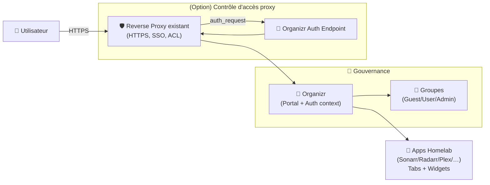
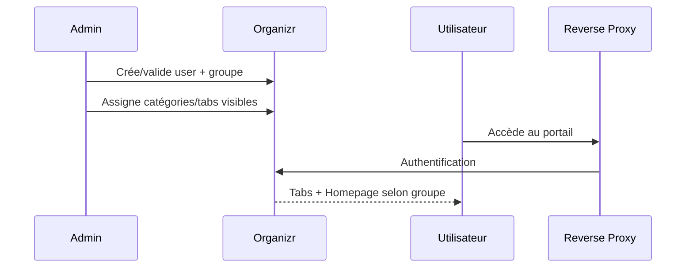
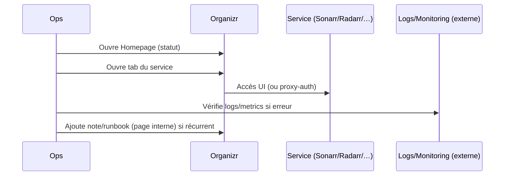

# 🧭 Organizr — Présentation & Configuration Premium (Sans install / Sans Nginx / Sans Docker / Sans UFW)

### Portail unifié “homelab & ops” : accès centralisé, SSO proxy-auth, gouvernance par groupes
Optimisé pour reverse proxy existant • Scoping par groupes • Homepage widgets • Runbooks & exploitation

---

## TL;DR

- **Organizr** est un **portail web** qui centralise tes services (Sonarr/Radarr/Plex/etc.) via **tabs**, **catégories** et **widgets homepage**.
- Son super-pouvoir “premium” : **contrôler l’accès** aux apps via **groupes** et, si souhaité, **Server Authentication / Proxy Auth SSO** (auth au niveau reverse proxy).
- Une config pro = **naming**, **groupes**, **tabs propres**, **homepage utile**, **SSO maîtrisé**, **tests & rollback**.

Docs officielles (point d’entrée) : https://docs.organizr.app/

---

## ✅ Checklists

### Pré-configuration (avant d’ouvrir aux utilisateurs)
- [ ] Définir les **groupes** (Guest / User / PowerUser / Admin) et la gouvernance
- [ ] Définir le périmètre : “Organizr = portail” vs “Organizr = contrôle d’accès proxy”
- [ ] Standardiser **noms / catégories / icônes / URLs** (sinon ça devient un marque-pages chaotique)
- [ ] Décider : **onglets intégrés (iframe)** vs **lien externe** vs **SSO proxy-auth**
- [ ] Lister les services “critiques” (Plex, Sonarr, Radarr, etc.) + qui a le droit d’y accéder

### Post-configuration (qualité opérationnelle)
- [ ] Un user “Guest” ne voit que les tabs publics
- [ ] Un user “Team A” ne voit pas les tabs “Team B”
- [ ] La homepage affiche les **indicateurs utiles** (état services, demandes, activité)
- [ ] Les redirections/proxys ne cassent pas les cookies (tests)
- [ ] Un plan de rollback existe (désactiver ServerAuth/SSO, revenir à accès direct interne)

---

> [!TIP]
> Traite Organizr comme un “**front door**” : navigation + visibilité + gouvernance.  
> Si tu veux du logging/alerting/historique : fais-le ailleurs, Organizr n’est pas une stack d’observabilité.

> [!WARNING]
> Le piège classique : “mettre 80 tabs sans structure”.  
> Si tu veux que ça tienne dans le temps : **catégories + conventions + groupes**.

> [!DANGER]
> Proxy Auth SSO / Server Authentication implique des règles côté reverse proxy.  
> Un mauvais réglage peut soit **bloquer tout le monde**, soit **laisser passer trop large**. Teste toujours avec 2 comptes.

---

# 1) Organizr — Vision moderne

Organizr n’est pas “juste un dashboard”.

C’est :
- 🧭 Un **hub de navigation** (tabs + catégories)
- 🔐 Une **couche de gouvernance** (groupes + permissions d’affichage)
- 🧩 Un “**control plane**” pour le reverse proxy (Server Authentication / Proxy Auth SSO)
- 🏠 Une **homepage opérationnelle** (widgets par service)

Références :
- Tab Management : https://docs.organizr.app/tab-management
- Homepage : https://docs.organizr.app/features/homepage

---

# 2) Architecture globale

Docs “Reverse Proxies” : https://docs.organizr.app/help/tutorials/reverse-proxies  
Docs “Server Authentication” : https://docs.organizr.app/features/server-authentication  
Docs “Proxy Auth SSO” : https://docs.organizr.app/features/sso/proxy-auth-sso

---

# 3) Philosophie premium (5 piliers)

1. 👥 **Groupes simples et lisibles** (et testés)
2. 🧱 **Information architecture** (catégories + conventions)
3. 🏠 **Homepage utile** (signal > bruit)
4. 🔐 **SSO/ServerAuth** uniquement si tu en as le besoin réel
5. 🧪 **Validation / rollback** documentés (pas “au feeling”)

---

# 4) Auth & Groupes (le cœur de la gouvernance)

## 4.1 Backends d’authentification (choix)
Organizr propose plusieurs backends (dont backend interne, LDAP, etc.).  
Doc : https://docs.organizr.app/features/authentication-backends  
LDAP : https://docs.organizr.app/features/authentication-backends/ldap-backend

## 4.2 Modèle de groupes recommandé (simple)
- **Guest** : tabs publics (statut, landing, read-only)
- **User** : usage standard (apps non sensibles)
- **PowerUser** : tools avancés (download managers, indexers, admin panels limités)
- **Admin** : configuration Organizr + accès sensibles

> [!TIP]
> “Moins de groupes, mieux c’est” au début. Tu pourras raffiner ensuite.

---

# 5) Tabs & Catégories (éviter le chaos)

## 5.1 Conventions de naming (exemples)
- Catégories : `Média`, `Infra`, `Downloads`, `Sécurité`, `Monitoring`, `Outils`
- Tabs : `Plex`, `Jellyfin`, `Sonarr`, `Radarr`, `Bazarr`, `Prowlarr`, `qBittorrent`, `Grafana`

Doc : https://docs.organizr.app/tab-management

## 5.2 Types de tabs (stratégie)
- **Lien externe** : le plus sûr et simple (pas d’iframe)
- **iFrame** : pratique mais attention aux headers, cookies, CSP, X-Frame-Options
- **Proxy Auth SSO** : expérience “1 login”, mais nécessite rigueur

> [!WARNING]
> Les apps ne supportent pas toutes l’auth par header/SSO. Vérifie la doc par application avant d’insister.

---

# 6) Homepage (signal opérationnel)

La homepage doit répondre à : “**Tout va bien ?**” et “**Où ça casse ?**”

Bon pattern :
- 5 à 10 widgets max
- 1 widget par domaine (média, downloads, infra)
- permissions par groupe sur chaque widget

Doc : https://docs.organizr.app/features/homepage

Exemples de modules :
- Plex module : https://docs.organizr.app/features/homepage/plex-homepage-item
- Sonarr module : https://docs.organizr.app/features/homepage/sonarr-homepage-item

> [!TIP]
> Mets en avant ce qui déclenche des actions : demandes en attente, erreurs, quotas, statut reverse proxy, saturation disque (si tu exposes cette info ailleurs).

---

# 7) Server Authentication / Proxy Auth SSO (quand tu veux “Organizr comme garde-barrière”)

## 7.1 Server Authentication (concept)
Objectif : empêcher l’accès direct à `https://domaine.tld/sonarr` sans passer par Organizr (et ses groupes).  
Doc : https://docs.organizr.app/features/server-authentication

## 7.2 Proxy Auth SSO (concept)
Objectif : **une session Organizr** qui donne accès à certaines apps compatibles via headers d’auth.  
Doc : https://docs.organizr.app/features/sso/proxy-auth-sso

> [!WARNING]
> Ces fonctionnalités touchent à la sécurité d’accès aux apps.  
> Le meilleur standard : **tests avec comptes de groupes différents** + scénario “accès direct app” + scénario “depuis Organizr”.

---

# 8) Workflows premium (usage quotidien)

## 8.1 Onboarding utilisateur (flow)

## 8.2 Incident “un service ne répond plus” (flow)

---

# 9) Validation / Tests / Rollback

## 9.1 Tests fonctionnels (check rapide)
- Connexion :
  - compte Admin : voit tout
  - compte User : voit seulement les catégories “User”
  - compte Guest : voit uniquement public
- Tabs :
  - 3 services critiques s’ouvrent sans erreur
  - les iFrames (si utilisés) n’affichent pas “refused to connect”
- Homepage :
  - widgets essentiels visibles selon groupe
  - pas de surcharge (temps de chargement raisonnable)

## 9.2 Tests “accès direct” (si ServerAuth/SSO activés)
- En tant que **non autorisé** :
  - accès direct à l’app doit être refusé/redirect
- En tant qu’**autorisé** :
  - accès via Organizr fonctionne
  - accès direct suit la règle attendue (selon ta politique)

## 9.3 Rollback (plan simple)
- Si ServerAuth/SSO casse l’accès :
  - désactiver temporairement le mécanisme côté reverse proxy
  - revenir à “Organizr = portail seulement”
  - corriger la segmentation par groupes et retester

> [!DANGER]
> Toujours garder un chemin “admin break-glass” (ex: accès interne/VPN direct) pour reprendre la main si le proxy-auth bloque tout.

---

# 10) Sources — Images Docker (format demandé, URLs brutes)

## 10.1 Image officielle la plus citée
- `organizr/organizr` (Docker Hub) : https://hub.docker.com/r/organizr/organizr  
- Docs Organizr “Installing Organizr” (section Docker) : https://docs.organizr.app/installation/installing-organizr  
- Organisation GitHub Organizr (références projets) : https://github.com/organizr  

## 10.2 Image LinuxServer.io (existe mais indiquée comme dépréciée)
- `linuxserver/organizr` (Docker Hub) : https://hub.docker.com/r/linuxserver/organizr  
- Tags (mention DEPRECATED) : https://hub.docker.com/r/linuxserver/organizr/tags  
- Doc LinuxServer (image dépréciée) : https://docs.linuxserver.io/deprecated_images/docker-organizr/  

## 10.3 Images “OrganizrTools” (historique / communauté)
- `organizrtools/organizr-v2` (Docker Hub) : https://hub.docker.com/r/organizrtools/organizr-v2/  
- Profil Docker Hub “Organizr Tools” : https://hub.docker.com/u/organizrtools  
- Base image Organizr (Docker Hub) : https://hub.docker.com/r/organizr/base/  

---

# ✅ Conclusion

Organizr “premium” = un portail qui reste propre dans le temps grâce à :
- 👥 groupes clairs + tests
- 🧱 structure (catégories + conventions)
- 🏠 homepage utile
- 🔐 SSO/ServerAuth uniquement si tu en as besoin, et toujours avec rollback

Docs officielles (démarrage + features) :
https://docs.organizr.app/