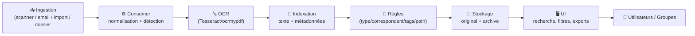
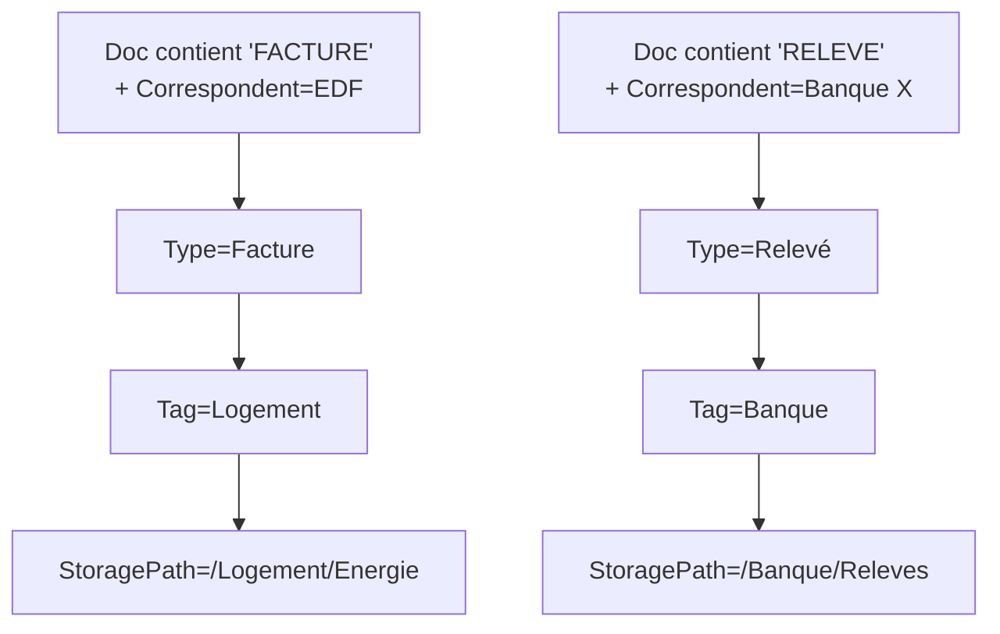
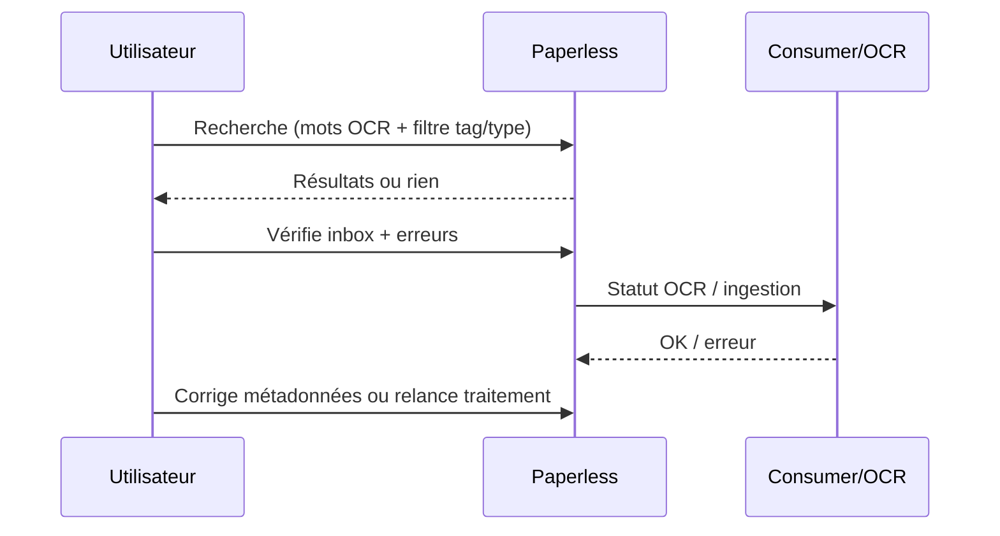

# 📄 Paperless-ngx — Présentation & Configuration Premium (Sans install / Sans Docker / Sans Nginx)

### GED personnelle & pro : ingestion → OCR → indexation → recherche → automatisation
Optimisé pour reverse proxy existant • Qualité OCR maîtrisée • Gouvernance (tags/owners) • Exploitation durable

---

## TL;DR

- **Paperless-ngx** transforme tes documents (scan, PDF, mail, imports) en **archives recherchables** : OCR + index + métadonnées.
- Le “cœur premium” = **pipeline d’ingestion propre**, **règles d’auto-classement**, **OCR robuste**, **taxonomie stable**.
- En exploitation : **backups testés**, **validation**, **rollback**, **hygiène sécurité** (accès contrôlé, secrets, logs).

---

## ✅ Checklists

### Pré-configuration (avant d’ingérer en masse)
- [ ] Définir une taxonomie simple : Tags / Types / Correspondents / Storage Paths
- [ ] Définir les langues OCR réelles (pas “tout”) + qualité scan
- [ ] Définir la stratégie de nommage fichiers exportés
- [ ] Définir règles d’auto-tri : correspondents, types, tags, storage paths
- [ ] Définir la politique d’accès (qui voit quoi) + groups
- [ ] Définir un “runbook ingestion” (scanner / email / dossier d’entrée)

### Post-configuration (qualité & confiance)
- [ ] Import test : 10 documents variés (facture, courrier, contrat, scan photo, PDF natif)
- [ ] Vérifier OCR : recherche fonctionne sur 3 mots clés par doc
- [ ] Vérifier règles : au moins 70% auto-classé correctement
- [ ] Vérifier stockage : paths corrects, aucun “tout va dans inbox”
- [ ] Vérifier sauvegardes : restauration validée sur un environnement test
- [ ] Vérifier permissions : un user non-admin ne voit pas tout

---

> [!TIP]
> Commence avec une taxonomie **minimaliste** (10–20 tags max), puis itère.  
> Le chaos vient des tags “fourre-tout” et des règles trop agressives.

> [!WARNING]
> L’OCR dépend surtout de la **qualité du scan** (DPI, contraste, rotation) et du bon choix de langue.  
> Plus de langues ≠ meilleur OCR : ça peut dégrader la précision.

> [!DANGER]
> N’ingère pas 5 000 documents avant d’avoir validé : taxonomie + règles + OCR + backups.  
> Sinon tu passes des semaines à “démêler” des métadonnées.

---

# 1) Paperless-ngx — Vision moderne

Paperless-ngx n’est pas juste un “scan + OCR”.

C’est :
- 🧾 Une **GED** orientée automatisation (règles, correspondents, tags)
- 🔎 Un **moteur de recherche** (texte OCR + métadonnées)
- 🧠 Un **classement assisté** (matching, suggestions, règles)
- 🗂️ Un **référentiel** (contrats, factures, RH perso, garanties, santé, admin)

Cas d’usage typiques :
- Factures & abonnements (tri automatique fournisseur)
- Contrats & garanties (recherche instantanée + tags)
- Courriers administratifs (dossier “impôts”, “banque”, “assurance”)
- Archives famille (docs importants, scolarité, santé)

---

# 2) Architecture globale (pipeline GED)



Idée clé : **tout doit être optimisé autour de l’ingestion**.

---

# 3) Modèle de données (ce qui rend la doc “gérable”)

## Objets principaux
- **Document**
- **Correspondent** : émetteur (EDF, Banque X, Assurance Y)
- **Document Type** : facture, contrat, relevé, courrier…
- **Tags** : labels transverses (impôts, santé, logement, voiture)
- **Storage Paths** : règles de rangement “physique” (dossiers)
- **Custom Fields** (si besoin) : numéro client, référence contrat, etc.

## Taxonomie premium (simple & durable)
- Document Types : 10–20 max (ex: Facture, Contrat, Relevé, Courrier, Notice, Garantie)
- Tags : 10–30 max (ex: Impôts, Banque, Assurance, Santé, Logement, Travail, Enfants)
- Correspondents : au fil de l’eau (source de vérité)
- Storage Paths : par domaine (ex: `/Banque`, `/Assurance`, `/Logement`, `/Santé`)

> [!TIP]
> **Document Type = “forme”** (ce que c’est)  
> **Tag = “thème”** (où ça s’applique)  
> Ça évite les doublons et les tags inutiles.

---

# 4) OCR Premium (qualité, langue, pièges)

## Règles d’or
- Scan recommandé : **300 DPI**, noir & blanc ou niveaux de gris, pages bien droites
- OCR : choisir **les langues réellement utiles** (ex: `fra` + `eng`)
- PDFs natifs : éviter de “re-OCR” inutilement (selon tes réglages)

## Stratégie langue recommandée
- Base : `fra`
- Ajouter `eng` si documents bilingues / tech
- Éviter 6+ langues “au cas où”

## Contrôle qualité OCR (routine)
- Tester 10 docs : factures, courriers, scans photos, PDF natifs
- Vérifier recherche sur : nom fournisseur, montant, référence, date

---

# 5) Règles & Automatisation (le vrai “premium”)

## Philosophie
- Peu de règles, mais **fiables**
- Privilégier des signaux forts :
  - Correspondent (email/source)
  - Mots clés récurrents (ex: “Facture”, “Relevé”, “Contrat”)
  - Références (IBAN partiel, n° client) via custom fields si besoin

## Exemple logique (auto-classification)


## “Inbox” comme buffer, pas comme destination
- Inbox = zone tampon
- Objectif : < 5% de docs qui restent “non classés”

> [!WARNING]
> Ne mets pas une règle “catch-all” trop tôt (ex: tout tagger “Admin”).  
> Tu masques les erreurs au lieu de les corriger.

---

# 6) Nommage & Organisation des fichiers (export stable)

Objectif : des fichiers exportés “lisibles” et cohérents.

## Convention premium (exemple)
- Date + correspondent + type + titre court
- Langue/qualité si utile
- Éviter les noms trop longs

Exemple de rendu attendu :
- `2026-01-15 - EDF - Facture - Electricite.pdf`
- `2025-12-31 - BanqueX - Releve - CompteCourant.pdf`

> [!TIP]
> Le meilleur nommage = celui qui reste stable dans le temps et ne dépend pas d’un champ fragile.

---

# 7) Sécurité & Accès (sans recette firewall / reverse-proxy)

## Principes
- Accès uniquement via contrôle existant (SSO/forward-auth/VPN/ACL)
- Comptes nominaux (éviter “admin partagé”)
- Groupes : lecture vs édition, séparation perso/pro si besoin
- Secrets : clés/MDP/SMTP dans un coffre (ou au minimum variables d’environnement protégées)

## Hygiène “anti-fuite”
- Éviter d’ingérer des documents contenant secrets en clair sans chiffrement disque
- Masquer/limiter l’accès aux logs (stack traces peuvent contenir infos)

---

# 8) Workflows premium (usage quotidien)

## 8.1 “Traitement hebdo” (15 minutes)
1) Ouvrir inbox
2) Corriger 5–20 documents (type/tag/correspondent)
3) Ajuster une règle si motif récurrent
4) Vérifier un échantillon OCR (recherche 1 mot clé)

## 8.2 “Incident doc manquant”
- Recherche par :
  - date approximative
  - correspondent
  - mots OCR (montant, ref client)
  - tag “domaine”
- Si introuvable :
  - vérifier ingestion (dossier/email)
  - vérifier que le doc n’est pas “en erreur OCR”
  - vérifier filtres UI (type/tag)



---

# 9) Validation / Tests / Rollback (exploitation)

## Tests fonctionnels (smoke)
```bash
# 1) Vérifier que l’UI répond (adapte l’URL)
curl -I https://paperless.example.tld | head

# 2) Vérifier qu’un import test est bien indexé (à faire via UI)
# - Importer un PDF natif + un scan
# - Rechercher 3 mots contenus dans le doc
```

## Tests “qualité”
- OCR : 90% des mots clés trouvés sur les docs test
- Règles : 70% auto-classification correcte sur échantillon
- Permissions : un user standard ne voit pas les docs d’un autre périmètre

## Rollback (principe)
- Revenir à une version antérieure = restauration **DB + fichiers**
- Toujours faire :
  - backup avant upgrade
  - upgrade
  - tests smoke
  - sinon rollback immédiat

> [!DANGER]
> Un “backup” non testé n’est pas un backup.  
> La validation de restauration doit être répétée (mensuelle / trimestrielle).

---

# 10) Sources — Images Docker (format demandé, URLs brutes)

## 10.1 Image officielle (recommandée par le projet)
- `ghcr.io/paperless-ngx/paperless-ngx` (docs admin : référence l’image) : https://docs.paperless-ngx.com/administration/  
- `paperless-ngx/paperless-ngx` (repo officiel) : https://github.com/paperless-ngx/paperless-ngx  
- `paperlessngx/paperless-ngx` (Docker Hub) : https://hub.docker.com/r/paperlessngx/paperless-ngx  
- Tags (Docker Hub) : https://hub.docker.com/r/paperlessngx/paperless-ngx/tags  

## 10.2 Image LinuxServer.io (existe, mais statut “deprecated” côté LSIO)
- `linuxserver/paperless-ngx` (Docker Hub) : https://hub.docker.com/r/linuxserver/paperless-ngx  
- Doc LSIO “deprecated images” : https://docs.linuxserver.io/deprecated_images/docker-paperless-ngx/  
- Doc Paperless-ngx (section migration depuis LSIO) : https://docs.paperless-ngx.com/setup/  

## 10.3 Documentation produit (pour configuration & concepts)
- Home docs : https://docs.paperless-ngx.com/  
- Configuration : https://docs.paperless-ngx.com/configuration/  
- Administration (upgrade, pinning, etc.) : https://docs.paperless-ngx.com/administration/  

---

# ✅ Conclusion

Paperless-ngx “premium”, ce n’est pas l’installation : c’est la **qualité du système**.

- 📥 Ingestion propre (sources maîtrisées)
- 🔤 OCR fiable (langues + scan)
- 🧩 Règles simples et robustes
- 🗂️ Taxonomie stable (types/tags/paths)
- 🧪 Validation + rollback (backups testés)

Résultat : tu retrouves n’importe quel document en quelques secondes, et le système reste maintenable sur la durée.