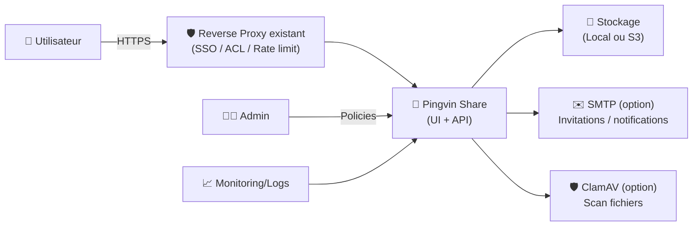
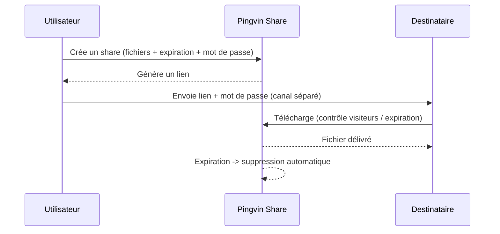

# 🐧 Pingvin Share — Présentation & Configuration Premium (File Sharing “WeTransfer-like”)

### Partage de fichiers auto-hébergé : liens temporisés, mots de passe, limites de visiteurs, reverse share, S3
Optimisé pour reverse proxy existant • Gouvernance • Sécurité • Exploitation durable

---

## TL;DR

- **Pingvin Share** = plateforme de partage de fichiers **self-hosted**, alternative à WeTransfer.
- Tu crées un **lien de partage** (expiration, mot de passe, limite de visites), et tu peux aussi créer des **Reverse Shares** (les gens t’envoient des fichiers).
- Config premium = **règles de rétention**, **providers (local/S3)**, **auth (OIDC/LDAP)**, **scan sécurité (ClamAV)**, **templates & process**, **tests + rollback**.

---

## ✅ Checklists

### Pré-configuration (avant ouverture aux utilisateurs)
- [ ] Domaine/URL finale décidée (ex: `share.domaine.tld`) + reverse proxy existant prêt
- [ ] Politique de partage définie : expiration par défaut, taille max, mots de passe obligatoires ?
- [ ] Politique de confidentialité : qui peut partager ? qui peut télécharger ?
- [ ] Choix du stockage : **local** ou **S3** (selon volumétrie/backup/DR)
- [ ] Auth : comptes locaux vs **OIDC**/**LDAP**
- [ ] Stratégie “Anti-abus” : limites visiteurs, quotas, logs, modération

### Post-configuration (qualité opérationnelle)
- [ ] Upload/download testés (petit fichier + gros fichier)
- [ ] Expiration vérifiée (auto-suppression attendue)
- [ ] Reverse share vérifié (réception de fichiers)
- [ ] Auth vérifiée (OIDC/LDAP si activé)
- [ ] Routine de nettoyage (shares expirés) contrôlée
- [ ] Backups/restore validés (stockage + DB selon ton mode)

---

> [!TIP]
> Pingvin Share est parfait pour : échanges ponctuels, clients/famille, équipes internes — **sans dépendre d’un cloud public**.

> [!WARNING]
> Les **fichiers partagés** peuvent contenir du sensible. Applique des règles simples : **expiration courte**, **mot de passe**, **limite de visiteurs**.

> [!DANGER]
> Ne le rends pas public sans contrôle : **auth**, anti-abus, et règles de rétention strictes.  
> **Important** : le repo d’origine a été **archivé le 29 juin 2025** (lecture seule). Prends en compte la stratégie de maintenance (fork/alternative).  
> Voir : https://github.com/stonith404/pingvin-share/issues/857

---

# 1) Pingvin Share — Vision moderne

Pingvin Share n’est pas juste “un upload de fichiers”.

C’est :
- 🔗 Un **générateur de liens** de partage contrôlés
- ⏳ Un système de **rétention** (expiration)
- 🔒 Une couche de **sécurité fonctionnelle** (mot de passe, limites visiteurs)
- 🔁 Un mode **Reverse Share** (collecte de fichiers)
- 🧩 Des intégrations : **OIDC/LDAP**, **S3**, **ClamAV**

Fonctionnalités (liste officielle) :
- https://stonith404.github.io/pingvin-share/introduction/
- https://github.com/stonith404/pingvin-share

---

# 2) Architecture globale



---

# 3) Le modèle “premium” (5 piliers)

1. 🎛️ **Politiques de partage** (expiration, mot de passe, limites)
2. 🧱 **Stockage robuste** (local maîtrisé ou S3 pour scaler)
3. 🔐 **Identité** (OIDC/LDAP si nécessaire)
4. 🧼 **Hygiène** (nettoyage, quotas, anti-abus)
5. 🧪 **Validation / tests / rollback** (indispensable avant ouverture)

---

# 4) Politiques de partage (ce qui fait la qualité)

## Paramètres “métier” à trancher
- Expiration par défaut : 1–7 jours (recommandé)
- Mot de passe :
  - obligatoire si externe
  - optionnel si interne/SSO
- Limite visiteurs : utile contre la diffusion involontaire
- Taille max :
  - alignée sur ton infra (reverse proxy, stockage, bande passante)
- Téléchargements :
  - limiter le nombre si besoin (anti-abus)

> [!TIP]
> Une règle simple qui marche :  
> **Externe** = expiration courte + mot de passe obligatoire + limite visiteurs.  
> **Interne** = expiration moyenne + SSO + quotas.

---

# 5) Reverse Shares (collecte de fichiers)

Le **Reverse Share** inverse le flux : tu génères un lien et **les autres uploadent** vers toi.

Cas d’usage :
- collecte de pièces jointes client
- réception de docs administratifs
- “dropbox” temporaire pour une équipe

> [!WARNING]
> Reverse share = surface d’entrée. Renforce : quotas, expiration courte, scan AV (si possible), et contrôle d’accès.

---

# 6) Stockage (local vs S3) — stratégie durable

## Local
✅ simple, performant, facile à comprendre  
⚠️ attention aux backups, DR, espace disque, croissance

## S3
✅ scalabilité, DR simplifié, offsite natif  
⚠️ gouvernance (policies), coûts, latence, permissions

Pingvin Share mentionne des providers (local et S3) :
- https://github.com/stonith404/pingvin-share

---

# 7) Authentification (OIDC/LDAP) & Gouvernance

## Approche recommandée
- Si usage “entreprise” : **OIDC** (SSO) en priorité
- Si usage “annuaire interne” : **LDAP**
- Si usage “famille/petit groupe” : comptes locaux + règles strictes

Fonctionnalités auth (référence) :
- https://github.com/stonith404/pingvin-share

> [!TIP]
> Même avec SSO, garde une procédure “break-glass” (compte admin local protégé, accès limité).

---

# 8) Configuration : UI vs fichier YAML (premium)

Pingvin Share peut être configuré :
- via l’UI (`/admin/config`)
- via un fichier YAML (mode “infrastructure as config”)

Doc configuration :
- https://stonith404.github.io/pingvin-share/setup/configuration/

## Choix premium
- **UI** : rapide, pratique pour itérer
- **YAML** : reproductible, versionnable, idéal prod

> [!WARNING]
> En mode YAML, l’UI de config peut être désactivée/moins pertinente : privilégie GitOps.

---

# 9) “Uploads larges” — points d’attention

La doc indique qu’un reverse proxy intégré existe “par défaut” mais n’est **pas optimisé** pour les gros uploads, et suggère d’utiliser un reverse proxy externe si besoin.
- https://stonith404.github.io/pingvin-share/setup/installation/

> [!TIP]
> Si tu as des gros fichiers :  
> assure-toi que **ton reverse proxy existant** est configuré pour les tailles et timeouts adaptés (upload body size, timeouts, buffering).

---

# 10) Workflows premium

## 10.1 Partage sécurisé (séquence)


## 10.2 Reverse share (collecte)
- tu crées un lien de dépôt
- le destinataire upload
- tu récupères le contenu sans échange de comptes

---

# 11) Validation / Tests / Rollback

## Smoke tests (réseau & service)
```bash
# Page répond
curl -I https://share.example.tld | head

# Vérifie que l’endpoint renvoie du contenu
curl -s https://share.example.tld | head -n 5
```

## Tests fonctionnels (manuel, mais incontournable)
- créer un partage (petit fichier)
- mettre une expiration courte (ex: 5 minutes) et vérifier la disparition
- activer mot de passe + tenter accès sans mot de passe
- tester reverse share (upload depuis un autre réseau/utilisateur)
- tester upload “gros fichier” (taille représentative)

## Rollback (plan simple)
- revenir à la configuration précédente (UI export / YAML versionné)
- si stockage S3 : valider que l’objet existe et les permissions sont intactes
- si stockage local : restaurer répertoire + DB selon ton mode (à documenter)

> [!TIP]
> Le rollback doit être faisable en < 15 minutes : c’est un critère de prod, pas un “bonus”.

---

# 12) Erreurs fréquentes (et fixes)

- ❌ Upload gros fichiers échoue  
  ✅ Ajuster limites/timeouts du reverse proxy existant + vérifier stockage

- ❌ Fichiers expirés qui s’accumulent  
  ✅ Vérifier job/cleanup, règles d’expiration, monitoring espace disque

- ❌ Liens partagés trop largement  
  ✅ Mot de passe obligatoire + limite visiteurs + expiration plus courte

- ❌ Besoin d’accès entreprise  
  ✅ Activer OIDC/LDAP + gouvernance rôles + audit

---

# 13) Sources — Images Docker (avec URLs brutes)

## 13.1 Image communautaire la plus citée
- `stonith404/pingvin-share` (Docker Hub) : https://hub.docker.com/r/stonith404/pingvin-share  
- Doc Pingvin Share “Configuration” (référence config + montage possible) : https://stonith404.github.io/pingvin-share/setup/configuration/  
- Repo (référence amont) : https://github.com/stonith404/pingvin-share  

## 13.2 État du projet (maintenance)
- Issue “Project Archived” (29 Jun 2025) : https://github.com/stonith404/pingvin-share/issues/857  
- Releases (si besoin de pinner une version) : https://github.com/stonith404/pingvin-share/releases  

## 13.3 LinuxServer.io (LSIO)
- Collection d’images LSIO (vérification) : https://www.linuxserver.io/our-images  
- À ce jour, pas d’image officielle LSIO dédiée “pingvin-share” listée dans la collection ci-dessus.

---

# ✅ Conclusion

Pingvin Share est une excellente brique “partage de fichiers” si tu le pilotes comme un service pro :
- politiques de partage strictes,
- stockage maîtrisé,
- auth adaptée (OIDC/LDAP si besoin),
- hygiène (expiration/cleanup),
- tests + rollback documentés.

Et comme le projet amont a été archivé, pense “durabilité” :
- pinner une version stable,
- surveiller la sécurité,
- envisager un fork/alternative si ton contexte l’exige.