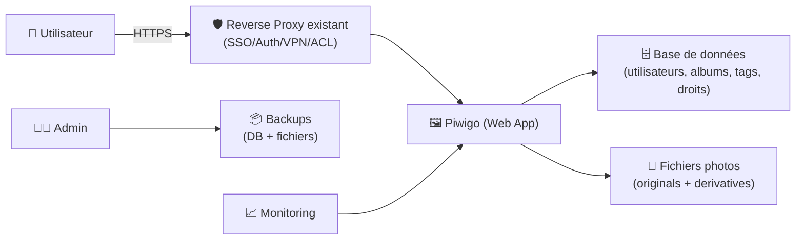

# 🖼️ Piwigo — Présentation & Exploitation Premium (Galerie photo, gouvernance, performance)

### Photo gallery “pro” : albums, tags, utilisateurs, permissions, plugins, API
Optimisé pour reverse proxy existant • Organisation durable • Recherche efficace • Exploitation sereine

---

## TL;DR

- **Piwigo** est une **galerie photo web** orientée **organisation + partage + gouvernance** (albums, tags, droits).
- Il excelle quand tu veux : **un portail photo familial/asso/entreprise**, avec **contrôle d’accès**, **métadonnées**, **plugins**, et **workflow d’import**.
- Une config premium = **taxonomie albums/tags**, **droits propres**, **stratégie d’import**, **perfs (derivatives/cache)**, **backups** + **tests/rollback**.

---

## ✅ Checklists

### Pré-configuration (avant d’ouvrir au public interne/externe)
- [ ] Définir le modèle d’organisation : albums par année/événement, tags transverses
- [ ] Décider qui peut : uploader / éditer / voir (groupes, permissions)
- [ ] Définir le workflow d’import : UI vs sync/FTP vs automatisé
- [ ] Fixer les règles de nommage (albums, tags, titres, descriptions)
- [ ] Préparer une stratégie perfs : tailles “derivatives”, cache, quotas

### Post-configuration (qualité opérationnelle)
- [ ] Navigation simple : 3 clics max pour retrouver une photo
- [ ] Recherche utile : tags cohérents + descriptions minimales
- [ ] Permissions validées : un compte “invité” ne voit que le périmètre prévu
- [ ] Import/reconnaissance métadonnées OK (EXIF, dates, orientation)
- [ ] Sauvegarde + restauration testées (DB + fichiers)

---

> [!TIP]
> La recette “premium” : **albums = structure**, **tags = transversal**, **groupes = gouvernance**.  
> Albums racontent une histoire, tags font la recherche.

> [!WARNING]
> Les photos = données sensibles (visages, lieux, familles, infos EXIF).  
> Mets en place une **politique claire** (qui voit quoi, ce qu’on publie, ce qu’on anonymise).

> [!DANGER]
> Ne confonds pas “galerie” et “backup”.  
> Piwigo n’est pas un coffre-fort : garde des sauvegardes séparées et testées.

---

# 1) Piwigo — Vision moderne

Piwigo n’est pas juste une galerie “jolie”.

C’est :
- 🗂️ Un **gestionnaire de collection** (albums, tags, filtres)
- 👥 Un **portail de partage** (utilisateurs, groupes, permissions)
- 🧩 Une **plateforme extensible** (plugins, thèmes)
- 🔗 Un **hub d’intégration** (API, import/sync, automatisations)

---

# 2) Architecture globale



---

# 3) Modèle de données & organisation (ce qui fait la différence)

## 3.1 Albums (structure narrative)
Bon pattern (simple et durable) :
- `2026 / 2026-02 Ski / Jour 1`
- `2026 / 2026-02 Ski / Jour 2`
- `Famille / Anniversaires / 2025`

Règles premium :
- 1 album = 1 “événement” ou 1 “thème”
- des descriptions courtes mais utiles (où, quand, qui, contexte)
- éviter les albums “fourre-tout” : ils tuent la recherche

## 3.2 Tags (recherche transversale)
Tags recommandés (exemples) :
- Personnes : `pers:alice`, `pers:bob`
- Lieux : `lieu:paris`, `lieu:alpes`
- Type : `type:portrait`, `type:paysage`
- Projet : `proj:association`, `proj:marketing`

> [!TIP]
> Préfixes de tags = tu évites la dérive (“Paris”, “paris”, “PARIS”) et tu rends la recherche instantanée.

## 3.3 Permissions (gouvernance)
Approche saine :
- Groupes par “public” : `famille`, `amis`, `clients`, `interne`
- Droits par albums (ou ensembles) :
  - `famille` voit tout “Famille”
  - `clients` ne voit que “Projet X”
  - `invités` = lecture limitée

---

# 4) Workflows premium (import & publication)

## 4.1 Import : trois stratégies
- **UI Web** : simple, idéal petites séries
- **Sync/FTP/outil d’import** : idéal gros volumes
- **Automatisation** : ingestion régulière (par lot)

Objectif premium :
- ingestion fiable
- conservation des métadonnées
- pas de doublons
- dérivés générés correctement

## 4.2 Publication “propre”
- vérifier l’orientation (EXIF)
- masquer/retirer EXIF si nécessaire (privacy)
- ajouter tags minimum (lieu + personnes + type)
- activer commentaires uniquement si modération prévue

---

# 5) Performance & Qualité (gros volume sans douleur)

## 5.1 Derivatives (tailles d’images)
Piwigo génère des tailles dérivées (miniatures, affichage, etc.).

Recommandations premium :
- limiter le nombre de tailles si tu n’en as pas besoin
- choisir des tailles qui matchent tes usages (mobile / desktop / fullscreen)
- générer les derivatives en “batch” après import massif

> [!WARNING]
> Les dérivés peuvent prendre du temps sur grosse photothèque : planifie l’opération, surveille CPU/disque.

## 5.2 Cache & navigation
- privilégier un thème léger si tu as beaucoup d’images
- réduire l’overfetch (éviter pages trop lourdes)
- surveiller les temps de réponse quand tu dépasses plusieurs dizaines de milliers de photos

---

# 6) Sécurité d’accès (sans recettes d’installation)

Objectifs :
- accès uniquement via ton reverse proxy existant
- HTTPS obligatoire
- authentification adaptée :
  - SSO (si entreprise)
  - comptes locaux + MFA côté proxy
  - accès VPN pour les collections sensibles

Bonnes pratiques premium :
- compte admin distinct du compte quotidien
- principe du moindre privilège (uploader ≠ admin)
- journaux d’accès conservés côté proxy (utile en incident)

---

# 7) Validation / Tests / Rollback

## 7.1 Tests de validation (smoke tests)
```bash
# 1) L'app répond (si URL dispo)
curl -I https://photos.example.tld | head

# 2) Vérifier que l'auth est bien active (attendu: redirect login / 401)
curl -I https://photos.example.tld | sed -n '1,10p'
```

Tests fonctionnels (manuel, 5 minutes) :
- login utilisateur “lecture seule” → accès limité OK
- import de 10 photos → affichage OK
- recherche par tag `lieu:*` → résultats cohérents
- téléchargement (si activé) conforme aux règles

## 7.2 Plan de rollback (simple)
Scénarios courants :
- plugin casse un écran → désactiver plugin, vider cache, re-test
- thème incompatible → revenir au thème précédent
- migration/upgrade problématique → restaurer **DB + fichiers** depuis backup

> [!TIP]
> Avant toute mise à jour (core/plugins) : snapshot backup, puis smoke tests.  
> Un rollback doit être faisable en “mode recette”, sans improvisation.

---

# 8) Erreurs fréquentes (et comment les éviter)

- ❌ Albums “fourre-tout” → ✅ structure annuelle + événement + sous-albums
- ❌ Tags incohérents (Paris/paris/PARIS) → ✅ préfixes et conventions
- ❌ Trop de plugins → ✅ 5–10 max, avec revue trimestrielle
- ❌ Droits trop larges → ✅ groupes + tests “compte invité”
- ❌ Imports massifs sans plan → ✅ batch + derivatives planifiés

---

# 9) Sources — Images Docker (format demandé, URLs brutes)

## 9.1 Image officielle (Piwigo)
- `piwigo/piwigo` (Docker Hub) : https://hub.docker.com/r/piwigo/piwigo  
- Tags (Docker Hub) : https://hub.docker.com/r/piwigo/piwigo/tags  
- Organisation Piwigo sur Docker Hub : https://hub.docker.com/u/piwigo  
- Repo (packaging image) : https://github.com/Piwigo/piwigo-docker  

## 9.2 Image LinuxServer.io (si tu préfères LSIO)
- `linuxserver/piwigo` (Docker Hub) : https://hub.docker.com/r/linuxserver/piwigo  
- Tags (Docker Hub) : https://hub.docker.com/r/linuxserver/piwigo/tags  
- Doc LSIO (docker-piwigo) : https://docs.linuxserver.io/images/docker-piwigo/  
- Repo LSIO (référence image) : https://github.com/linuxserver/docker-piwigo  
- Catalogue LSIO (présence de Piwigo) : https://www.linuxserver.io/our-images  

---

# ✅ Conclusion

Piwigo “premium” = une photothèque qui reste agréable **à 1 000 comme à 100 000 photos** :
- structure d’albums claire
- tags normalisés
- permissions gouvernées
- perfs maîtrisées (derivatives/cache)
- exploitation sûre (tests + rollback + backups)

Si tu m’envoies ton besoin (familial, asso, entreprise, volume approximatif), je peux te générer une **taxonomie albums/tags** et un **modèle de pages “standards”** (règles de publication, privacy, workflow d’import) au format Piwigo-ready.