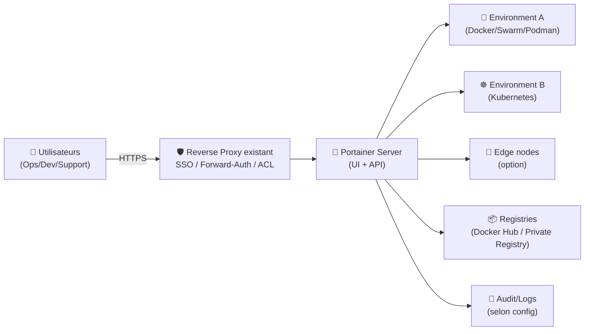
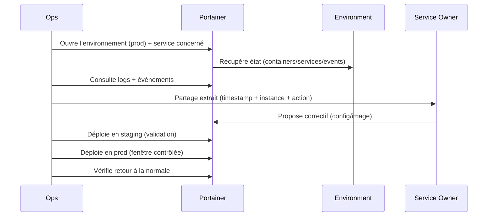

# 🧭 Portainer — Présentation & Exploitation Premium (Sans install / Sans Nginx / Sans Docker / Sans UFW)

### Console de gestion pour Docker / Swarm / Kubernetes / Podman : environnements, accès, gouvernance, opérations
Optimisé pour reverse proxy existant • RBAC • Environnements multi-sites • Exploitation durable

---

## TL;DR

- **Portainer** est une **plateforme de management** pour environnements conteneurisés (Docker, Swarm, Kubernetes, Podman).
- Valeur : **gérer**, **sécuriser**, **standardiser** les opérations (déploiements, stacks/manifests, configs, secrets, accès).
- En “premium ops” : **RBAC + environnements**, **gouvernance**, **process de changement**, **audit**, **validation/rollback**.

---

## ✅ Checklists

### Pré-usage (avant d’ouvrir Portainer aux équipes)
- [ ] Définir le périmètre : Docker only vs Kubernetes vs multi-orchestrateurs
- [ ] Stratégie d’accès : SSO via reverse proxy / auth interne / MFA (selon ton existant)
- [ ] Modèle d’organisation : Teams / roles / environnements
- [ ] Politique “production” : qui peut déployer, qui peut lire, qui peut toucher aux secrets
- [ ] Conventions : naming (stacks, namespaces), labels/annotations, tags d’images, registre(s)
- [ ] Plan d’audit : journaux, traces, responsabilité (“qui a fait quoi”)

### Post-configuration (qualité opérationnelle)
- [ ] Users/Teams : droits minimaux validés (tests réels)
- [ ] Environnements : regroupés, nommés, documentés (owner + criticité)
- [ ] Templates/standards : modèle unique pour déployer (stack template / helm / manifests)
- [ ] Sauvegarde de config Portainer (si applicable) + stratégie de restauration
- [ ] Runbook “incident Portainer” (accès, panne, rollback)

---

> [!TIP]
> Portainer est excellent pour **industrialiser** la gestion multi-environnements (surtout quand les équipes ne veulent pas toutes faire du CLI).

> [!WARNING]
> Portainer peut devenir un “**point de contrôle**” central. Ton RBAC + ton auth doivent être propres, sinon tu crées un “super-admin panel” exposé.

> [!DANGER]
> Accorder “admin” trop largement = **risque majeur** (secrets, exec shell, déploiements en prod).  
> Le mode premium = **moindre privilège + audit + validations**.

---

# 1) Portainer — Vision moderne

Portainer n’est pas juste une “UI Docker”.

C’est :
- 🧩 Une **couche de gouvernance** (RBAC, teams, policies selon édition/features)
- 🌐 Un **hub multi-environnements** (serveurs, clusters, edges)
- 🚀 Un **outil de delivery** (stacks, manifests, Helm selon contexte)
- 🧰 Un **centre d’opérations** (logs, consoles, événements, dépannage)

---

# 2) Architecture globale (référence)



---

# 3) Philosophie premium (5 piliers)

1. 🔐 **Contrôle d’accès** (SSO/proxy + RBAC)
2. 🧭 **Environnements gouvernés** (owner, criticité, séparation prod/non-prod)
3. 📦 **Standards de déploiement** (templates, conventions, tags immuables)
4. 🧪 **Validation & change management** (checklists, tests, approbations)
5. 🧾 **Audit & traçabilité** (qui a fait quoi, quand, où)

---

# 4) RBAC / Teams / Modèle d’accès (ce qui fait la différence)

## Modèle recommandé “3 niveaux”
- 👑 **Platform Admins** : très peu (1–3), responsabilité plateforme
- 🧑‍🔧 **Environment Maintainers** : admins sur un périmètre (ex: cluster X)
- 👀 **Readers / Operators** : lecture, actions limitées (redémarrage, logs, etc.)

## Règles premium
- **Prod** ≠ **Non-prod** : séparer les environnements et les droits
- Limiter l’accès à :
  - **Console/exec** (shell) : ultra restreint
  - **Secrets/configs** : restreint
  - **Registries credentials** : restreint

> [!TIP]
> Un bon RBAC se teste avec un compte “faible” :  
> “Est-ce que je peux accidentellement voir/éditer un secret prod ?” → si oui, c’est trop permissif.

---

# 5) Environnements : organisation & gouvernance

## Conventions de naming (exemples)
- `prod-paris-docker-01`
- `staging-paris-k8s-01`
- `lab-nas-docker`

## Métadonnées “ops”
- Owner (équipe responsable)
- Criticité (tier)
- Fenêtres de maintenance
- Runbook associé (lien interne)

> [!WARNING]
> Sans conventions, Portainer devient une “liste de serveurs” ingérable.  
> Le premium = **catalogue d’environnements**.

---

# 6) Delivery : déployer sans chaos

## Stratégies qui évitent les incidents
- Images “pinnées” par tag versionné (éviter `latest` en prod)
- “Template de stack” standard (mêmes labels, mêmes healthchecks)
- Déploiement par étapes (staging → prod)
- Rollback prêt (image précédente + config précédente)

## Gouvernance des registres
- Registres privés pour prod (si possible)
- Credentials gérés (rotation)
- Politique : qui peut pousser quoi / où

---

# 7) Observabilité : ce que Portainer apporte (et ce qu’il n’apporte pas)

## Apporte bien
- Vue conteneurs/services
- Logs (selon runtime)
- Actions (restart, scale, redeploy)
- Événements (selon environnement)

## N’est pas un remplacement
- D’un SIEM/observabilité complet (ELK/Loki/Prometheus/Grafana)
- D’une politique de sécurité (c’est un outil, pas une barrière)

> [!TIP]
> Portainer = console d’opérations.  
> Pour l’historique long terme : centraliser logs/metrics ailleurs.

---

# 8) Workflows premium (incident & changement)

## 8.1 Incident triage (séquence)


## 8.2 Change management (simple et robuste)
- Ticket/issue : objectif, impact, rollback
- Déploiement staging
- Smoke tests
- Déploiement prod
- Validation post-change
- Post-mortem si incident

---

# 9) Validation / Tests / Rollback

## Tests “smoke” (après changement)
```bash
# Vérifier que l’UI répond (exemples)
curl -I https://portainer.example.tld | head

# Vérifier qu’une API répond (si exposée via proxy, dépend de ton setup)
curl -I https://portainer.example.tld/api/status | head
```

## Tests fonctionnels (manuel)
- Un compte Reader :
  - peut voir l’état + logs
  - ne peut pas modifier une stack prod
- Un Maintainer d’environnement :
  - peut redeployer dans son périmètre
  - ne voit pas les secrets hors périmètre

## Rollback (principes)
- Revenir à l’image précédente (tag versionné)
- Revenir à la configuration précédente (stack/manifests)
- Restaurer paramètres Portainer (si tu as un backup applicable)
- En dernier recours : désactiver temporairement accès externes (via ton reverse proxy existant)

> [!WARNING]
> Le rollback doit être **documenté** et testable.  
> Un rollback “dans la tête” n’existe pas.

---

# 10) Sources — Images Docker (format demandé : URLs brutes)

## 10.1 Images Portainer les plus utilisées (officielles)
- `portainer/portainer-ce` (Docker Hub) : https://hub.docker.com/r/portainer/portainer-ce  
- Docs Portainer “Install CE” (référence Server/Agent, images) : https://docs.portainer.io/start/install-ce  
- Docs Portainer “Install CE with Docker on Linux” (mention images et paramètres) : https://docs.portainer.io/start/install-ce/server/docker/linux  
- `portainer/agent` (Docker Hub) : https://hub.docker.com/r/portainer/agent  
- Docs Portainer “Install Portainer Agent on Docker Standalone” : https://docs.portainer.io/admin/environments/add/docker/agent  

## 10.2 Dépôts de référence (code / upstream)
- Repo GitHub Portainer Agent : https://github.com/portainer/agent  
- Profil Docker Hub Portainer (publisher) : https://hub.docker.com/u/portainer  

## 10.3 LinuxServer.io (LSIO) — disponibilité d’image
- Liste officielle des images LSIO : https://www.linuxserver.io/our-images  
- À date, Portainer **n’apparaît pas** comme image LSIO dédiée dans la liste officielle (référence ci-dessus).

---

# ✅ Conclusion

Portainer est une excellente “console de contrôle” si tu l’emploies en mode premium :
- RBAC strict + SSO/proxy
- environnements gouvernés (prod/non-prod)
- standards de déploiement
- validation & rollback documentés
- audit et traçabilité

Sinon, il devient vite un “super panneau admin” risqué.