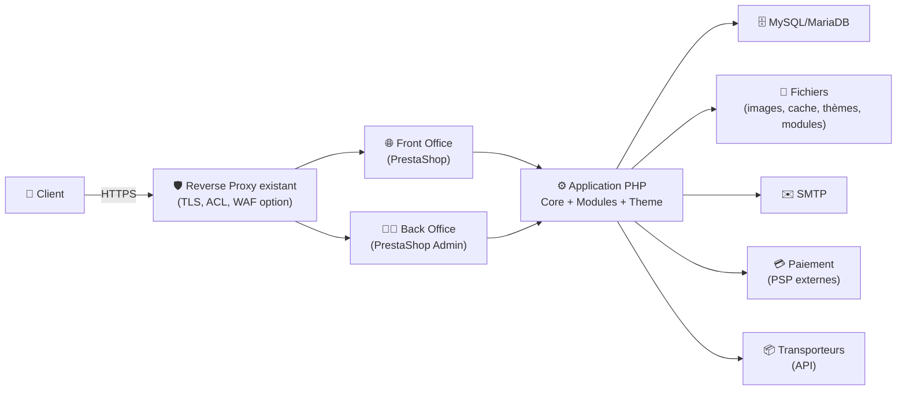
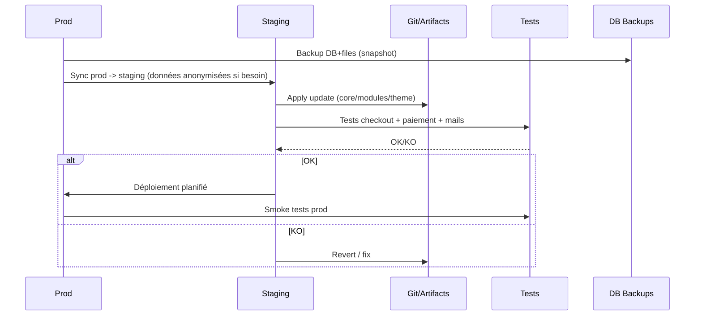

# 🛒 PrestaShop — Présentation & Exploitation Premium (Architecture + Gouvernance + Performance + Sécurité)

### Plateforme e-commerce open-source : catalogue, commandes, paiements, modules, multiboutique
Optimisé pour reverse proxy existant • Qualité de prod • Maintenance durable • Observabilité & rollback

---

## TL;DR

- **PrestaShop** est une plateforme e-commerce **modulaire** (modules + thèmes) avec un **Back-Office** complet.
- La stabilité en prod repose sur : **gouvernance des modules**, **pipeline de mise à jour**, **perf (cache + DB)**, **sécurité (admin + secrets)**, **backups testés**.
- Pour éviter les “shops fragiles” : **zéro bricolage** sur le core, privilégier **overrides propres** + **versions maîtrisées**.

---

## ✅ Checklists

### Pré-prod (avant ouverture boutique)
- [ ] Nom de domaine + HTTPS via reverse proxy existant
- [ ] Base de données dédiée, sauvegardes automatiques (DB + fichiers)
- [ ] Stratégie modules : liste autorisée + provenance + process d’update
- [ ] Stratégie thème : child theme / pipeline assets / versioning
- [ ] Stratégie e-mail (SMTP) + tests transactionnels
- [ ] Paiements & transporteurs testés (parcours complet)
- [ ] Cache + performance validés (TTFB, pages catégories, checkout)
- [ ] Journalisation et accès admin tracés (minimum)

### Go-live (jour J)
- [ ] Mode maintenance OFF, debug OFF
- [ ] Admin URL durcie (chemin unique) + accès restreint
- [ ] Comptes admin : 1 par personne, MFA si possible
- [ ] Sauvegardes : restauration testée (au moins 1 fois)
- [ ] SEO de base (robots, sitemap, canonical, redirections)
- [ ] Paiement réel (petit montant) + remboursement testé
- [ ] Plan rollback prêt (version N-1 + dump DB)

---

> [!TIP]
> En prod : **pas de modifications directes du core**.  
> Tout changement doit être versionné (thème/module/override) + testable + réversible.

> [!WARNING]
> La majorité des pannes viennent de : **modules non maîtrisés**, **mises à jour non testées**, **cache mal réglé**, **DB qui gonfle**.

> [!DANGER]
> Exposer le Back-Office publiquement sans contrôle d’accès (ACL/SSO/VPN) est un risque majeur : brute force, vol de session, admin takeover.

---

# 1) PrestaShop — Vision moderne

PrestaShop, c’est :
- 🧱 **Core** (moteur boutique : catalogue, panier, commandes, clients)
- 🧩 **Modules** (paiement, livraison, marketing, ERP, etc.)
- 🎨 **Thèmes** (front) + overrides / customisations
- 🧑‍💻 **Back-Office** (gestion produits, commandes, CMS, stats)
- 🔗 **Intégrations** (PS Webservice / API selon besoins, connecteurs)

Objectif “premium” :
- Une boutique **maintenable**, **performante**, **sécurisée**, **upgradable**.

---

# 2) Architecture globale



---

# 3) Modèle de personnalisation (ce qui doit être “propre”)

## 3.1 Règle d’or : core immuable
- ✅ Personnaliser via :
  - **Thème** (ou child theme)
  - **Module** (idéalement maison ou éditeur réputé)
  - **Override** (avec parcimonie)
- ❌ Éviter :
  - modifications directes des fichiers core
  - “patchs” non versionnés
  - modules inconnus / non maintenus

## 3.2 Gouvernance modules (policy simple)
- **Allowlist** : liste des modules autorisés
- **Source** : marketplace officielle / éditeur / dépôt interne
- **Versioning** : pin versions + changelog interne
- **Compat** : compat PrestaShop + PHP + thème
- **Rollback** : module désactivable sans casser checkout

> [!TIP]
> Traite les modules comme des dépendances applicatives : review, test, rollback.

---

# 4) Données & Performance (où se gagnent les ms)

## 4.1 Cache (approche saine)
- Objectif : réduire TTFB sur pages “lourdes” (catégories, recherche, panier)
- Éléments clés :
  - cache template / smarty
  - cache des pages/partials (selon stratégie)
  - cache d’opcodes (côté PHP)
  - CDN pour images (optionnel)

## 4.2 Base de données (hygiène)
- Index & tables : surveiller croissance (orders, carts, connections, logs)
- Éviter la DB “poubelle” :
  - logs verbeux sans rotation
  - paniers abandonnés jamais purgés
  - modules qui créent des tables sans maintenance

## 4.3 Médias
- Images produits : poids maîtrisé, formats modernes si possible
- Thumbnails : génération contrôlée, éviter de régénérer en prod sans plan

---

# 5) Sécurité Premium (sans recettes proxy spécifiques)

## 5.1 Back-Office (surface la plus critique)
- Chemin admin non standard (répertoire admin renommé)
- Accès restreint :
  - ACL IP (bureau/VPN)
  - ou SSO/forward-auth via reverse proxy existant
- Comptes :
  - 1 compte / personne
  - mots de passe forts
  - MFA via module si contexte sensible
- Session :
  - HTTPS strict
  - cookies sécurisés (selon config plateforme)

## 5.2 Secrets & config
- Ne jamais committer :
  - identifiants DB
  - clés API paiement/transport
  - secrets SMTP
- Séparer “runtime secrets” et code (env/secret manager si possible)

## 5.3 Hygiène applicative
- Debug OFF en prod
- Réduire les endpoints inutiles
- Auditer modules (permissions, endpoints, injections, logs de données perso)

> [!WARNING]
> Beaucoup de failles en e-commerce proviennent de modules tiers.  
> Mets en place un cycle : **audit léger + update régulière + tests checkout**.

---

# 6) Multiboutique (si applicable)

## Quand l’utiliser
- Plusieurs catalogues/marques
- Plusieurs pays/langues avec règles distinctes
- Une gouvernance centralisée

## Risques
- Complexité modules (compat multi-store inégale)
- Règles taxes/prix plus difficiles
- Débogage plus long

> [!TIP]
> Si tu n’as pas besoin de multiboutique, n’active pas.  
> Si tu l’actives : documente précisément “qui gère quoi” (stocks, prix, CMS).

---

# 7) Workflows premium (exploitation & changements)

## 7.1 Cycle d’une mise à jour (safe)


## 7.2 “Runbook checkout” (ce qui doit toujours être testé)
- Ajouter au panier
- Changer quantité/attributs
- Code promo
- Frais de port
- Paiement (au moins 1 PSP)
- Confirmation e-mail
- Création facture / statut commande
- Remboursement / annulation (selon process)

---

# 8) Validation / Tests / Rollback

## 8.1 Smoke tests techniques (exemples)
```bash
# Vérifier que le front répond et renvoie du HTML
curl -I https://shop.example.tld | head

# Vérifier que l'admin répond (si exposé via ton proxy)
curl -I https://shop.example.tld/admin-xxxx/ | head

# Vérifier que les assets principaux se chargent
curl -I https://shop.example.tld/themes/ | head
```

## 8.2 Tests fonctionnels “minimum viable”
- Page catégorie (chargement < seuil acceptable)
- Produit (images + déclinaisons)
- Panier & checkout complet
- Paiement réel (petit montant) + remboursement
- Email transactionnel (commande, reset password)
- Back-Office : création produit + mise à jour stock

## 8.3 Rollback (principes)
- Rollback doit couvrir **code + DB**
- Deux approches :
  - **Rollback applicatif** (revenir à l’artefact N-1)
  - **Rollback DB** (restaurer dump/snapshot)
- Toujours garder une fenêtre de compatibilité :
  - modules/core qui modifient le schéma DB doivent être traités avec prudence

> [!DANGER]
> Une mise à jour qui migre la DB sans plan de rollback = risque de downtime long.  
> Avant migration : backup + test de restauration + staging.

---

# 9) Erreurs fréquentes (et remèdes)

- ❌ Trop de modules “marketing” empilés  
  ✅ rationaliser, mesurer l’impact perf, supprimer les doublons

- ❌ Checkout cassé après update  
  ✅ staging obligatoire + tests checkout + rollback prêt

- ❌ DB qui grossit (paniers, logs)  
  ✅ purge/rotation + audit tables + monitoring taille

- ❌ Admin exposé publiquement  
  ✅ restreindre par IP/VPN/SSO + durcir comptes

- ❌ Thème modifié sans versioning  
  ✅ dépôt git + pipeline assets + tags de release

---

# 10) Sources — Images Docker (format URLs brutes)

## 10.1 Image officielle la plus citée
- `prestashop/prestashop` (Docker Hub) : https://hub.docker.com/r/prestashop/prestashop/  
- Tags `prestashop/prestashop` : https://hub.docker.com/r/prestashop/prestashop/tags  
- Doc PrestaShop “Installing with Docker” : https://devdocs.prestashop-project.org/9/basics/installation/environments/docker/  
- Repo “PrestaShop/docker” (référence tooling) : https://github.com/PrestaShop/docker  

## 10.2 Images “dev / bleeding edge”
- `prestashop/prestashop-git` (Docker Hub) : https://hub.docker.com/r/prestashop/prestashop-git/  

## 10.3 Images internes (non orientées prod)
- `prestashop/docker-internal-images` (Docker Hub) : https://hub.docker.com/r/prestashop/docker-internal-images  
- Repo “docker-internal-images” : https://github.com/PrestaShop/docker-internal-images  

## 10.4 LinuxServer.io (LSIO)
- Catalogue des images LSIO : https://www.linuxserver.io/our-images  
- (À date) pas d’image “PrestaShop” dédiée listée dans leur catalogue : https://www.linuxserver.io/our-images  

---

# ✅ Conclusion

PrestaShop “premium” = une boutique qui :
- reste **upgradable** (core immuable, modules gouvernés),
- tient la charge (cache + DB hygiène),
- reste **sécurisée** (admin contrôlé, secrets propres),
- et reste **opérable** (tests, backups, rollback documenté).

Si tu me donnes ton contexte (mono/multiboutique, taille catalogue, PSP, reverse proxy/SSO), je peux te générer une section “standards internes” (naming modules, process release, runbooks incident checkout) au même format.