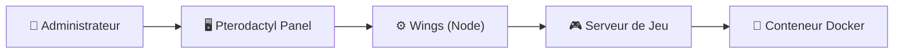
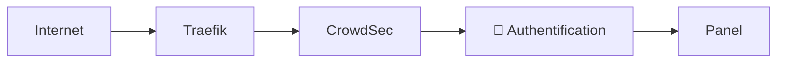
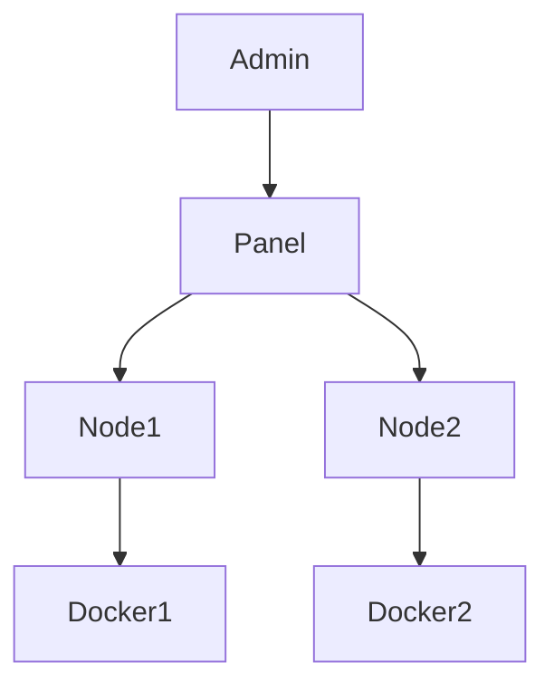
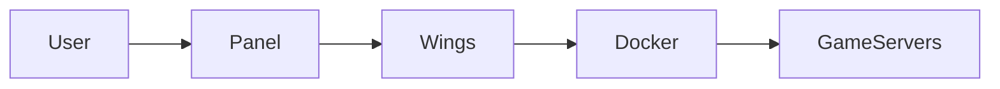
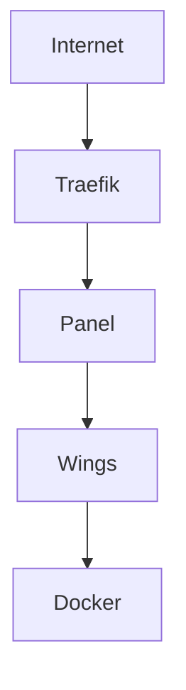
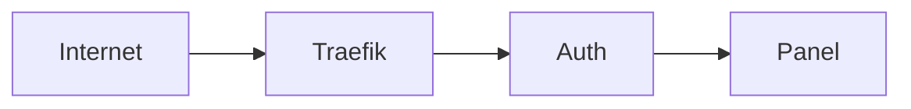
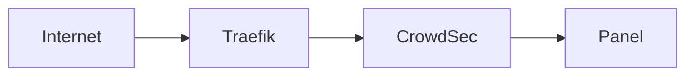

# 🎮 Pterodactyl — Plateforme de Gestion de Serveurs Gaming

!!! abstract ""
    **Déployez et gérez vos serveurs de jeux comme un professionnel.**  
    Infrastructure isolée • Gestion centralisée • Performance optimisée • Sécurisé via Reverse Proxy

---

# 🎯 Qu’est-ce que Pterodactyl ?

Pterodactyl est un **panel de gestion de serveurs de jeux open-source**.

Il permet :

- 🎮 Déploiement de serveurs Minecraft, Rust, ARK, CS, etc.
- 👥 Gestion multi-utilisateurs
- 📊 Supervision des ressources
- ⚙️ Configuration avancée
- 🔐 Isolation sécurisée

---

# 🧠 Architecture Technique

Pterodactyl repose sur deux composants majeurs :

1. **Panel Web (Interface)**
2. **Wings (Daemon Node)**

---

## 🏗️ Architecture Globale



---

# 🔎 Fonctionnement

### 🖥️ Le Panel

- Interface web moderne
- Gestion des utilisateurs
- Allocation RAM / CPU / Ports
- Gestion des instances

---

### ⚙️ Wings

- Agent installé sur le serveur
- Lance les serveurs via Docker
- Isole chaque instance
- Applique les limites ressources

---

### 🐳 Docker

Chaque serveur de jeu :

- Est isolé
- A ses propres ressources
- Est redémarrable indépendamment
- Ne compromet pas l’hôte

---

# 💎 Pourquoi l’intégrer à SSDv2 ?

Dans l’écosystème SSDv2 :

- Reverse proxy Traefik déjà présent
- HTTPS automatique
- Sécurisation possible via Authelia
- Protection CrowdSec
- Uniformité Docker

👉 Pterodactyl devient une brique parfaitement intégrée.

---

# 🛡️ Sécurisation Recommandée

Architecture sécurisée :



Recommandations :

- Ne jamais exposer Wings publiquement
- Utiliser HTTPS uniquement
- Activer CrowdSec
- Restreindre IP si possible

---

# 📊 Cas d’usage

| Usage | Description |
|--------|-------------|
| 🎮 Gaming communautaire | Héberger serveurs pour amis |
| 🏢 Infrastructure multi-serveurs | Gestion centralisée |
| 🧪 Tests Dev | Environnements isolés |
| 🌍 Hébergement public | Gestion multi-clients |

---

# 🚀 Déploiement Typique SSDv2



Permet :

✔ Multi-nodes  
✔ Scalabilité  
✔ Isolation  
✔ Gestion centralisée  

---

---

# ⚙️ Configuration Recommandée Pterodactyl (SSDV2)

Cette configuration est optimisée pour :

- Docker
- Traefik
- SSDv2
- Sécurisation Reverse Proxy
- Hébergement gaming stable

---

# 🧠 Architecture Comprendre Avant Configurer

Pterodactyl fonctionne en deux parties :

1. 🖥️ Panel (interface web)
2. ⚙️ Wings (daemon node)



Le Panel gère.
Wings exécute.
Docker isole.

---

# 🖥️ 1️⃣ Configuration du Panel

## 🌐 URL

Exemple :

```
https://panel.votredomaine.com
```

Ne jamais exposer en HTTP.

---

## ⚙️ Paramètres importants (.env)

Vérifier :

```
APP_URL=https://panel.votredomaine.com
APP_ENV=production
APP_DEBUG=false
```

Base de données :

- Utiliser MariaDB/PostgreSQL stable
- Mot de passe fort
- Accès local uniquement

---

## 📧 Email

Configurer SMTP proprement :

- Gmail / Mailgun / SMTP dédié
- Obligatoire pour reset password
- Obligatoire pour notifications

---

# ⚙️ 2️⃣ Configuration Wings (Node)

Wings ne doit PAS être exposé publiquement.

Dans `/etc/pterodactyl/config.yml` :

Vérifier :

```
api:
  host: 0.0.0.0
  port: 8080
```

Mais :

- Firewall doit bloquer accès externe
- Seul le Panel doit pouvoir communiquer

---

# 🔥 3️⃣ Firewall Recommandé

Architecture sécurisée :



Règles recommandées :

- Ouvrir ports jeux uniquement
- Bloquer port Wings externe
- Bloquer accès base de données externe

---

# 🐳 4️⃣ Isolation Docker

Chaque serveur de jeu :

- A son conteneur
- A ses limites RAM
- A ses limites CPU
- Est redémarrable indépendamment

Dans Panel :

Configurer pour chaque serveur :

- Memory limit
- CPU limit
- Disk limit
- I/O limit si possible

---

# 📊 5️⃣ Allocation Ressources

Recommandation VPS 8GB RAM :

- 1 serveur Minecraft : 2–4GB
- Laisser 1–2GB pour système
- Ne jamais allouer 100% RAM

Toujours garder marge sécurité.

---

# 🔐 6️⃣ Sécurisation via Traefik

Ne jamais exposer panel directement.

Configuration recommandée :



Recommandations :

- HTTPS obligatoire
- Authentification externe possible
- CrowdSec en amont

---

# 🛡️ 7️⃣ Protection CrowdSec

Panel est une cible fréquente :

- Brute-force
- Scans bots

Architecture recommandée :



Activer collection HTTP dans CrowdSec.

---

# ⚡ 8️⃣ Performance & Stabilité

Recommandations :

- Activer swap si VPS faible RAM
- Surveiller usage CPU
- Redémarrer Wings si crash
- Logs activés

Ne jamais :

- Installer plugins douteux
- Donner accès root aux utilisateurs

---

# 💾 9️⃣ Sauvegardes

Sauvegarder :

- Base de données panel
- `/var/lib/pterodactyl`
- Config Wings

Planifier sauvegarde régulière.

---

# 🚨 Erreurs fréquentes

❌ Exposer Wings publiquement  
❌ Pas de HTTPS  
❌ RAM allouée à 100%  
❌ Pas de firewall  
❌ Pas de sauvegarde  
❌ Exposer base de données  

---

# 🧠 Résumé Configuration Premium

✔ Panel sécurisé via reverse proxy  
✔ Wings non exposé  
✔ Docker isolé  
✔ Firewall strict  
✔ CrowdSec actif  
✔ Ressources maîtrisées  

---

# 🎯 Conclusion Technique

Une configuration Pterodactyl bien pensée :

- Sépare contrôle et exécution
- Isole chaque serveur de jeu
- Protège l’infrastructure
- Permet scalabilité multi-nodes

Dans SSDv2, Pterodactyl devient :

🎮 Une plateforme gaming professionnelle  
🏗️ Une infrastructure scalable  
🛡️ Un environnement sécurisé  
🐳 Une orchestration Docker propre

---


# 🔥 Avantages Clés

<div class="features-grid">

<div class="feature-card">
<h3>🎮 Multi-jeux</h3>
<p>Support Minecraft, Rust, ARK, etc.</p>
</div>

<div class="feature-card">
<h3>🐳 Isolation Docker</h3>
<p>Chaque serveur est conteneurisé.</p>
</div>

<div class="feature-card">
<h3>📊 Contrôle Ressources</h3>
<p>Limitation RAM / CPU / IO.</p>
</div>

<div class="feature-card">
<h3>🛡️ Sécurité</h3>
<p>Intégration Traefik + CrowdSec possible.</p>
</div>

</div>

---

# 🧠 Vision Infrastructure

Pterodactyl transforme un simple VPS en :

- 🎮 Plateforme gaming professionnelle
- 🏗️ Infrastructure scalable
- 🔐 Environnement sécurisé
- ⚡ Système centralisé

---

# ⚠️ Bonnes pratiques

- Séparer panel et nodes si possible
- Sauvegardes régulières
- Monitoring ressources
- Firewall strict
- Pas d’exposition directe Wings

---

# 🎯 Conclusion

Pterodactyl dans SSDv2 permet :

- 🎮 Hébergement gaming propre
- 🐳 Isolation sécurisée
- 🌐 Accès via reverse proxy
- 🛡️ Protection multicouche
- 📈 Scalabilité multi-nodes

Ce n’est pas juste un panel.

C’est une **infrastructure gaming moderne** prête à évoluer.