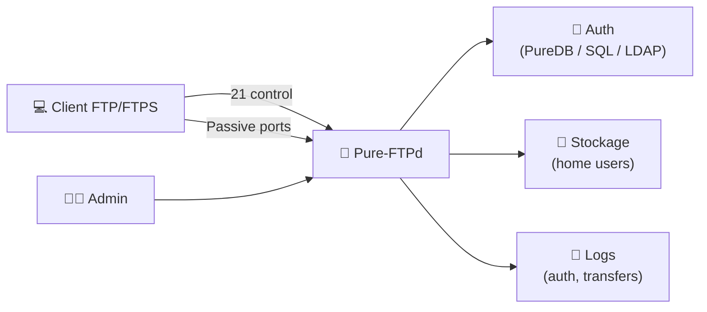
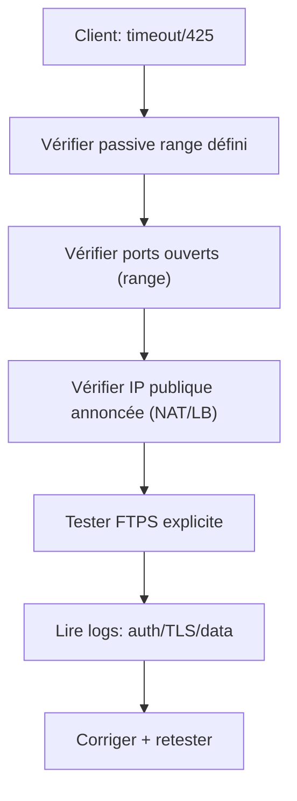

# 🧱 Pure-FTPd — Présentation & Configuration Premium (FTP/FTPS “propre”, exploitable, gouverné)

### Serveur FTP orienté sécurité, virtual users, quotas, chroot, TLS/FTPS
Optimisé pour reverse proxy existant (si besoin) • Gouvernance par comptes • Observabilité • Tests & Rollback

---

## TL;DR

- **Pure-FTPd** est un serveur FTP/FTPS **production-grade** : simple, efficace, sécurisé par défaut, très utilisé en hébergement.
- Le “premium” n’est pas dans l’installation, mais dans :
  - 🔐 **FTPS (TLS)** bien configuré
  - 🧰 **Virtual users** (PureDB / SQL / LDAP)
  - 🧱 **Chroot** + permissions strictes
  - 📦 **Quotas / limites / anti-abus**
  - 🧪 **Validation** + **rollback** documenté

---

## ✅ Checklists

### Pré-configuration (avant ouverture au réseau)
- [ ] Choisir le mode d’auth : **PureDB (virtual users)** / **LDAP** / **MySQL/PostgreSQL**
- [ ] Définir l’objectif : **upload uniquement**, **download**, ou **bi-directionnel**
- [ ] Définir la stratégie réseau : ports **control (21)** + **passive range**
- [ ] Décider : **FTP interne** (LAN) ou **FTPS obligatoire** (Internet)
- [ ] Définir la politique d’accès : chroot, write whitelist, quotas, vitesse
- [ ] Définir la politique logs : niveau, format, rotation

### Post-configuration (go-live)
- [ ] Test client FTP + FTPS (explicite) OK
- [ ] Test passive mode OK (NAT/Firewall/Load balancer)
- [ ] Un user ne peut pas sortir de son home (chroot validé)
- [ ] Upload et permissions fichiers corrects (UID/GID, umask)
- [ ] Quotas & limites actives (si requises)
- [ ] Logs lisibles + rotation OK
- [ ] Plan de rollback prêt (désactivation TLS stricte / retour conf précédente)

---

> [!TIP]
> FTP “marche” facilement, mais **FTPS + passive + NAT** est l’endroit où 90% des configs se cassent.  
> La clé : **passive ports fixes**, **adresse publique annoncée**, **TLS cohérent**, **tests systématiques**.

> [!WARNING]
> FTP transmet les identifiants en clair.  
> Sur Internet : **FTPS obligatoire** (ou mieux : SFTP via SSH si ton besoin le permet).

> [!DANGER]
> N’ouvre jamais un serveur FTP/FTPS sans chroot + quotas/limites + logs, sinon tu invites l’abus (bruteforce, remplissage disque, exfiltration).

---

# 1) Pure-FTPd — Vision moderne

Pure-FTPd est :
- 🛡️ **sécurisé** par conception (options claires, chroot, restrictions)
- ⚡ **performant** et léger
- 🧩 **flexible** : virtual users PureDB, SQL, LDAP
- 📦 **opérationnel** : quotas, ratios, limites de connexions, bande passante

Cas d’usage typiques :
- dépôt d’assets (builds, exports, médias)
- échanges B2B “legacy” (clients imposant FTP/FTPS)
- hébergement multi-comptes (virtual users)
- “dropbox” contrôlée (upload-only)

---

# 2) Architecture globale

---

# 3) Philosophie premium (5 piliers)

1. 🔒 **FTPS** (TLS) cohérent, moderne, sans downgrade
2. 🧱 **Confinement** : chroot + permissions + umask
3. 🧑‍🤝‍🧑 **Virtual users** : gouvernance propre + audits possibles
4. 🧯 **Anti-abus** : limites connexions, vitesse, quotas, ratio
5. 🧪 **Validation / Rollback** : tests passifs, TLS, droits, stockage

---

# 4) Authentification & Modèles d’utilisateurs

## 4.1 Virtual users (PureDB) — souvent le meilleur compromis
- Comptes gérés par Pure-FTPd (db “puredb”)
- Facile à automatiser
- Bon pour multi-clients / multi-dossiers

Concept “virtual users” :  
- Documentation projet : https://www.pureftpd.org/project/pure-ftpd/doc/  
- Repo upstream : https://github.com/jedisct1/pure-ftpd

## 4.2 SQL (MySQL/PostgreSQL) — quand tu veux gouvernance centrale
- utile si tu as déjà un SI utilisateurs
- provisioning par outil interne

## 4.3 LDAP — quand l’entreprise impose annuaire
- centralisation
- RBAC via groupes (selon intégration)

> [!TIP]
> Pour “partage B2B” : PureDB suffit dans 80% des cas et réduit drastiquement la complexité.

---

# 5) FTPS (TLS) — configuration “propre” (principes)

Objectifs :
- Chiffrer identifiants + données
- Réduire les suites obsolètes
- Éviter le downgrade (si possible)
- Certificat valide (Let’s Encrypt ou PKI interne)

## 5.1 FTPS explicite vs implicite
- **Explicite (AUTH TLS sur port 21)** : le plus courant
- **Implicite (port 990)** : plus “legacy”, parfois demandé par certains clients

> [!WARNING]
> Certains clients FTP sont très capricieux avec TLS. Prévois un runbook “compatibilité client”.

## 5.2 Certificats (pratiques recommandées)
- Certificat avec **SAN** correct (FQDN)
- Renouvellement automatisé (si LE)
- Chaîne complète (fullchain)

Doc TLS Pure-FTPd :  
https://www.pureftpd.org/project/pure-ftpd/doc/

---

# 6) Mode passif — la zone “incidents” à maîtriser

## Pourquoi le passif casse souvent
En mode passif :
- le serveur ouvre un port “data” aléatoire (ou dans une plage)
- derrière NAT/LB, il faut annoncer la **bonne IP publique**
- les ports doivent être **ouverts** et **fixes** (range)

## Recommandations premium
- définir un **passive port range** (ex: 30000–31000)
- annoncer l’IP publique (ou FQDN) si NAT
- tester avec un client GUI + un client CLI

---

# 7) Confinement & permissions (éviter l’exfiltration / le chaos)

## 7.1 Chroot
- chaque user enfermé dans son répertoire
- pas de “remontée” possible

## 7.2 UMASK & ownership
- standardiser l’owner (UID/GID)
- umask cohérente :
  - upload partagé équipe : umask plus permissive
  - espace individuel : plus strict

> [!TIP]
> Décide très tôt : “les fichiers uploadés doivent être lisibles par qui ?”  
> Sinon tu vas te battre contre des permissions incohérentes.

---

# 8) Anti-abus & QoS (indispensable sur Internet)

Options typiques à activer (selon usage) :
- limite connexions simultanées par IP / par user
- limite de vitesse (download/upload)
- quotas (par user / par répertoire)
- ratio (optionnel, souvent en hébergement)
- bannissement/anti bruteforce (via ton système existant)

> [!WARNING]
> Sans quotas, un seul user compromis peut remplir ton disque en quelques minutes.

---

# 9) Observabilité & exploitation (ce qui fait gagner du temps)

## 9.1 Logs utiles (ce qu’on veut voir)
- auth OK/KO (IP, user)
- création/suppression fichiers
- transferts (début/fin, taille, durée)
- erreurs TLS / handshake
- erreurs passive (timeout, port unreachable)

Issue “logging” (contexte image docker populaire) :  
https://github.com/stilliard/docker-pure-ftpd/issues/17

## 9.2 “Runbook incident” (modèle rapide)
- Symptôme (client : timeout / auth fail / TLS fail)
- Vérifier : DNS, cert, ports passifs, logs auth, quotas/disque
- Isoler : un client ou tous ?
- Corriger / retester
- Post-mortem : pourquoi c’est arrivé, prévention

---

# 10) Validation / Tests / Rollback

## 10.1 Tests fonctionnels (client)
- Test FTP (si autorisé en LAN)
- Test FTPS explicite (obligatoire en prod)
- Test upload/download
- Test listing répertoires
- Test chroot (aucune sortie possible)

## 10.2 Tests réseau (passif)
- Connexion OK
- Transfert OK en passif
- Pas de “425 Can't open data connection”
- Pas de timeouts aléatoires (souvent NAT/ports)

## 10.3 Tests sécurité
- Mauvais mot de passe → log clair, pas d’info leak
- Tentatives répétées → limitation/ban via ton dispositif existant
- Vérifier qu’un user ne lit pas un autre répertoire

## 10.4 Rollback (stratégie simple)
- Garder la conf précédente (copie horodatée)
- Si TLS casse des clients : rollback temporaire sur suites plus larges (planifié), puis correction
- Si passif casse : rollback sur l’ancienne plage de ports / annonce d’IP

---

# 11) Mermaid — Workflow “debug passif / TLS”

---

# 12) Sources — Images Docker (URLs brutes, format demandé)

## 12.1 Image communautaire la plus citée
- `stilliard/pure-ftpd` (Docker Hub) : https://hub.docker.com/r/stilliard/pure-ftpd/  
- Repo de packaging (référence de l’image) : https://github.com/stilliard/docker-pure-ftpd  

## 12.2 Alternative populaire (Alpine + options SQL/LDAP)
- `crazymax/pure-ftpd` (Docker Hub) : https://hub.docker.com/r/crazymax/pure-ftpd/  
- Repo/documentation (référence image) : https://github.com/crazy-max/docker-pure-ftpd  

## 12.3 Autre image (communautaire, autre approche PureDB)
- `instrumentisto/pure-ftpd` (repo packaging) : https://github.com/instrumentisto/pure-ftpd-docker-image  

## 12.4 LinuxServer.io (LSIO)
- Liste des images LSIO (vérification de présence) : https://www.linuxserver.io/our-images  
- À date de la vérification, **pas d’image Pure-FTPd dédiée LSIO** visible dans leur catalogue public : https://www.linuxserver.io/our-images  

---

# ✅ Conclusion

Pure-FTPd “premium”, ce n’est pas “juste un FTP” :
- 🔐 FTPS solide
- 🧱 confinement strict (chroot + permissions)
- 🧑‍🤝‍🧑 auth gouvernée (PureDB/LDAP/SQL)
- 🧯 anti-abus (quotas/limites)
- 🧪 tests + rollback

Résultat : un service compatible “legacy” mais **opérationnel**, **sécurisé** et **maintenable**.