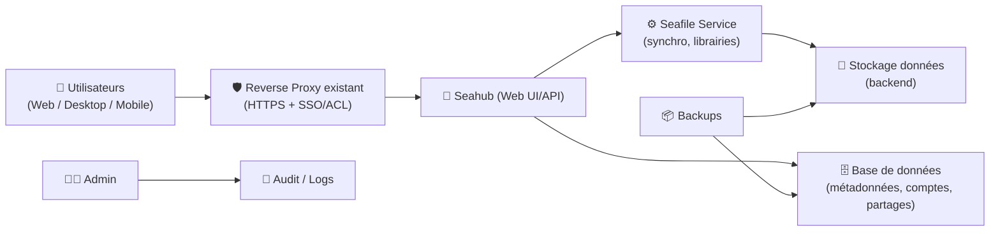
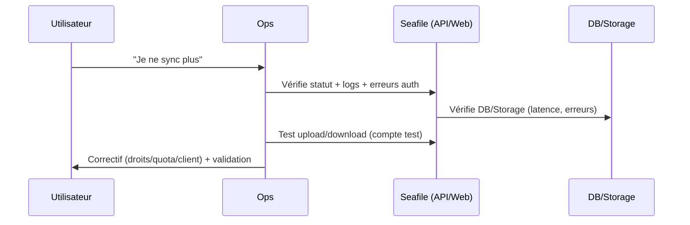

# ☁️ Seafile — Présentation & Configuration Premium (Sans install / Sans Nginx / Sans Docker / Sans UFW)

### Cloud privé orienté performance : bibliothèques, permissions fines, clients sync, partage contrôlé
Optimisé pour reverse proxy existant • SSO/LDAP possible • Gouvernance “pro” • Exploitation durable

---

## TL;DR

- **Seafile** = solution de **sync & partage** type “cloud privé”, centrée sur la **performance** et la **gestion par bibliothèques**.
- Une approche premium = **gouvernance des espaces**, **droits minimaux**, **partage maîtrisé**, **rétention / historique**, **sauvegardes testées**, **monitoring**, **plan de rollback**.
- À cadrer dès le début : **modèle de bibliothèques**, **groupes**, **règles de liens publics**, **politique de versions**, **stratégie SSO/LDAP**.

---

## ✅ Checklists

### Pré-configuration (avant d’ouvrir aux utilisateurs)
- [ ] Définir le modèle d’espaces (Groupes ↔ Bibliothèques ↔ Projets)
- [ ] Choisir politique de partage (liens publics autorisés ? expirations ? mots de passe ?)
- [ ] Définir politique de versions/versionsing + corbeille + rétention
- [ ] Décider SSO/LDAP vs comptes locaux (et “qui administre quoi”)
- [ ] Fixer limites (taille max upload, types de fichiers, quota par groupe)
- [ ] Définir stratégie backups + test de restauration (DB + données + config)

### Post-configuration (go-live)
- [ ] Tests droits : un utilisateur ne voit que son périmètre
- [ ] Tests de sync (client desktop + mobile) sur 1 bibliothèque “pilote”
- [ ] Tests de partage : lien public (si autorisé) avec expiration/mot de passe
- [ ] Validation versions : restore d’un fichier + restore depuis corbeille
- [ ] Journalisation/logs : incidents traçables (auth, partages, erreurs)

---

> [!TIP]
> Seafile est excellent pour des **équipes** qui veulent un cloud privé rapide, avec une **structure** et des permissions plus strictes qu’un simple partage SMB.

> [!WARNING]
> Le point le plus “piégeux” en prod : **gouvernance des partages** (liens publics), **rétention** (versions/corbeille) et **tests de restauration** (pas juste “on a un backup”).

> [!DANGER]
> Ne valide jamais la mise en prod tant que tu n’as pas fait **au moins une restauration complète** (fichier + bibliothèque + base), sur un environnement de test.

---

# 1) Seafile — Vision moderne

Seafile n’est pas un “disque réseau web”.

C’est :
- 🧱 Un système basé sur des **bibliothèques** (espaces logiques)
- 🔄 Un moteur de **sync** performant (clients desktop/mobile)
- 🧩 Un modèle **groupes/permissions** pour gouverner l’accès
- 🕒 Une gestion d’**historique** (versions) + **corbeille**
- 🔗 Des partages contrôlés (internes, externes, liens avec règles)

---

# 2) Architecture globale (conceptuelle)



---

# 3) Modèle de données (pour une gouvernance qui tient)

## Concepts à maîtriser
- **Utilisateur** : identité (local / LDAP / SSO selon setup)
- **Groupe** : périmètre d’équipe (le plus important pour gouverner)
- **Bibliothèque** : “bucket” logique (projet, produit, client)
- **Dossiers/fichiers** : contenus
- **Partages** :
  - internes (user ↔ user / groupe)
  - externes (liens publics) avec règles

> [!TIP]
> Pour une org “pro” : **groupe d’abord**, bibliothèque ensuite.  
> Évite les bibliothèques “personnelles” partout : c’est ingouvernable.

---

# 4) Stratégie premium d’organisation (recommandée)

## Modèle “Groupe = équipe, Bibliothèques = produits/projets”
- Groupe : `Team-Infra`
  - Bibliothèque : `RUNBOOKS`
  - Bibliothèque : `ARCHI`
  - Bibliothèque : `VENDORS`
- Groupe : `Team-Produit`
  - Bibliothèque : `Specs`
  - Bibliothèque : `Design`
- Groupe : `Team-Support`
  - Bibliothèque : `KB`
  - Bibliothèque : `Clients`

### Règles simples
- 1 bibliothèque = 1 objectif clair
- Convention de nommage stable (majuscules, préfixes)
- Propriétaire (owner) identifié pour chaque bibliothèque

---

# 5) Permissions & Partages (là où tout se joue)

## Rôles “minimum viable”
- 👑 **Admin** : paramétrage global, identité, politiques
- ✍️ **Owner/Manager** (par groupe/bibliothèque) : gestion des membres + structure
- 👀 **Member** : lecture/écriture selon besoin

## Politique “anti-fuite” (recommandée)
- Liens publics :
  - désactivés par défaut
  - si activés : **expiration obligatoire** + **mot de passe** + **journalisation**
- Interdire le “share to anyone” sans expiration
- Quotas par groupe pour éviter dérives

> [!WARNING]
> Un lien public sans expiration = “fuite lente” garantie (copié/collé, transféré, oublié).

---

# 6) Versions, corbeille, rétention (qualité + maîtrise des coûts)

## Pourquoi c’est critique
- protège contre erreurs humaines (suppression, overwrite)
- réduit impact ransomware (retour à une version saine)
- contrôle la croissance stockage

## Paramétrage “premium”
- Versions : activées sur bibliothèques sensibles
- Corbeille : activée + purge planifiée
- Rétention :
  - courte sur bibliothèques “temp”
  - plus longue sur “legal/contrats/runbooks”

> [!TIP]
> Documente une règle lisible : “Versions 30 jours / Corbeille 14 jours” par exemple (adaptée à ton métier).

---

# 7) Authentification (SSO/LDAP) & posture d’accès

## Approche recommandée
- SSO/LDAP si entreprise (cycle de vie comptes, offboarding)
- Comptes locaux seulement pour break-glass (admin d’urgence)

## Bonnes pratiques
- Désactiver/limiter les inscriptions ouvertes
- MFA via IdP (si SSO)
- Journaux d’auth centralisés (si possible)

---

# 8) Performance & UX (ce qui fait aimer Seafile)

## Ce qui influe le plus
- Taille et nombre de fichiers (petits fichiers très nombreux = plus coûteux)
- Historique/versions
- Indexation / thumbnails / previews
- Latence réseau (clients sync)

## Optimisation “sans magie”
- Bibliothèques “granulaires” (éviter un monolithe énorme)
- Rétention raisonnable
- Préviews/thumbnails : activer si utile, sinon limiter
- Clients : définir bonnes pratiques (exclusions, sélectif)

---

# 9) Exploitation : Monitoring, Logs, Backups (sans recettes d’install)

## Ce qu’il faut suivre
- Disponibilité web + API
- Erreurs applicatives (auth, uploads, sync)
- Santé DB (latence, erreurs)
- Stockage : capacité + IOPS
- Files d’attente thumbnails/previews si activées

## Backups (exigence “pro”)
À sauvegarder :
- DB (métadonnées : comptes, droits, partages, références)
- Données (bibliothèques)
- Config (paramètres, secrets, intégrations)

Test minimum :
- restaurer 1 fichier
- restaurer 1 bibliothèque complète
- restaurer “après incident” (rollback)

> [!DANGER]
> Un backup non testé = pas un backup. C’est une hypothèse.

---

# 10) Workflows premium (runbooks & incident)

## 10.1 Triage incident “sync ne marche plus”


## 10.2 Check “partage externe”
- le lien a-t-il une expiration ?
- mot de passe ?
- scope limité (dossier plutôt que bibliothèque entière) ?
- journalisation / audit disponible ?

---

# 11) Validation / Tests / Rollback (opérationnel)

## Tests de validation (avant prod)
```bash
# Santé HTTP (adapter l’URL)
curl -I https://seafile.example.tld | head

# Test perf simple (upload/download depuis client) : 1 fichier 100MB + 1 dossier 1000 petits fichiers
# (manuel) vérifier temps, erreurs, cohérence
```

## Tests de permissions (obligatoire)
- user A (Team-A) :
  - ✅ voit bibliothèques Team-A
  - ❌ ne voit pas Team-B
- user externe (si autorisé) :
  - ✅ accès lien avec mot de passe
  - ❌ accès après expiration

## Rollback (plan simple)
- restaurer DB + données à un point cohérent (même timestamp)
- invalider liens publics générés pendant l’incident (si nécessaire)
- communiquer : “ce qui est revenu” vs “ce qui est perdu” (fenêtre)

---

# 12) Erreurs fréquentes (et comment les éviter)

- ❌ Gouvernance inexistante → sprawl de bibliothèques, partages incontrôlés  
  ✅ Modèle Groupe→Bibliothèques + owners + règles de partage

- ❌ Rétention illimitée → explosion stockage  
  ✅ Versions/corbeille avec purge + quotas

- ❌ Backups non testés → DR impossible  
  ✅ Tests mensuels de restauration

- ❌ “Tout le monde admin” → risques + erreurs  
  ✅ Rôles minimaux + délégation par groupe

---

# 13) Sources — Images Docker (format demandé, URLs brutes)

## 13.1 Image officielle la plus citée (Community Edition)
- `seafileltd/seafile-mc` (Docker Hub) : https://hub.docker.com/r/seafileltd/seafile-mc/  
- Tags (versions) `seafileltd/seafile-mc` : https://hub.docker.com/r/seafileltd/seafile-mc/tags  
- Doc “Deploy Seafile with Docker” (référence l’image) : https://haiwen.github.io/seafile-admin-docs/11.0/docker/deploy_seafile_with_docker/  
- Doc “Upgrade Seafile Docker” : https://haiwen.github.io/seafile-admin-docs/13.0/upgrade/upgrade_docker/  
- Profil Docker Hub Seafile Ltd (éditeur) : https://hub.docker.com/u/seafileltd  

## 13.2 Documentation “env vars / images” (utile pour comprendre les composants)
- Variables d’environnement (images & paramètres) : https://manual.seafile.com/latest/config/env/  

## 13.3 LinuxServer.io (LSIO)
- Collection d’images LSIO (référence pour vérifier si une image existe) : https://www.linuxserver.io/our-images  
- Demande historique “Request Seafile” (indique qu’il n’y avait pas d’image LSIO officielle au moment du thread) : https://discourse.linuxserver.io/t/request-seafile/338  

## 13.4 Images communautaires (à utiliser avec prudence)
- `sabaitech/seafile` (Docker Hub, ancien) : https://hub.docker.com/r/sabaitech/seafile  
- `tinysnake/seafile` (Docker Hub, ancien) : https://hub.docker.com/r/tinysnake/seafile  

> [!WARNING]
> Les images communautaires non maintenues récemment peuvent poser des risques (sécurité, compat, migrations). Privilégie l’image officielle sauf contrainte spécifique.

---

# ✅ Conclusion

Seafile devient “premium” quand tu le traites comme une **plateforme gouvernée** :
- 🧱 modèle groupe/bibliothèque clair
- 🔐 partages stricts (expirations, mots de passe, audit)
- 🕒 rétention/versions maîtrisées
- 📦 backups testés + rollback
- 📈 monitoring des points critiques

Résultat : un cloud privé rapide, stable, et exploitable sans stress.