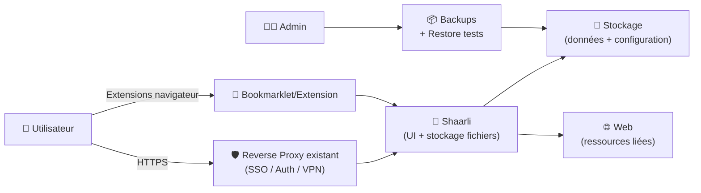

# 🔖 Shaarli — Présentation & Exploitation Premium (Bookmarks “no-db”, rapide, durable)

### Gestionnaire de favoris personnel + partage de liens minimaliste
Optimisé pour gouvernance • Organisation • Sécurité d’accès (via reverse proxy existant) • Backups • Workflows d’équipe

---

## TL;DR

- **Shaarli** = gestionnaire de favoris **léger**, **sans base de données** (fichiers), pensé “single-user” mais utilisable en petit collectif.
- Points forts : **simplicité**, **tags**, **recherche**, **permalinks**, **archivage**, **export/import**, **plugins**.
- Version “premium ops” : conventions de tags, modèles de posts, workflow de tri, stratégie d’archivage, backups, validation & rollback.

Docs & repo : https://shaarli.readthedocs.io/  
Code : https://github.com/shaarli/Shaarli

---

## ✅ Checklists

### Pré-usage (gouvernance)
- [ ] Définir le modèle de tags (vocabulaire contrôlé)
- [ ] Définir ce qui est “public” vs “privé”
- [ ] Définir un format de titre/description (modèle)
- [ ] Définir la stratégie d’archivage (capture / snapshot / notes)
- [ ] Documenter le “triage” : Inbox → Curated → Evergreen

### Post-configuration (qualité opérationnelle)
- [ ] Recherche efficace (tags + mots-clés) validée sur 20 liens
- [ ] Exports testés (HTML/JSON/Markdown selon besoins)
- [ ] Backups testés + restauration validée
- [ ] Workflow “inbox → curé” adopté par les utilisateurs

---

> [!TIP]
> Shaarli devient excellent quand tu le traites comme une **base de connaissance de liens** : pas juste “stocker”, mais **classer + résumer + retrouver**.

> [!WARNING]
> Les liens peuvent contenir des infos sensibles (URLs internes, tokens dans querystrings, dashboards).  
> Hygiène : **redaction** des secrets + tags “sensitive”.

> [!DANGER]
> Ne confonds pas “simple” avec “sans risque” : l’UI web expose des habitudes, des URLs internes, des ressources.  
> Mets toujours un contrôle d’accès via ton reverse proxy existant.

---

# 1) Shaarli — Vision moderne

Shaarli n’est pas un “Delicious clone” uniquement.

C’est :
- 🧠 Un **mémoire externe** (knowledge capture)
- 🏷️ Un **moteur d’indexation par tags**
- ✍️ Un **outil de curation** (notes, context, synthèse)
- 🔎 Un **retriever** rapide (recherche + filtres)
- 📤 Un **hub d’exports** (migration & pérennité)

---

# 2) Architecture globale (référence)



---

# 3) Modèle de curation premium (ce qui change tout)

## 3.1 Le pipeline “Inbox → Curated → Evergreen”
- **Inbox** : capture brute (tag `inbox`)
- **Curated** : tri + tags propres + description (tag `curated`)
- **Evergreen** : liens de référence (tag `evergreen` + domaine)

### Convention simple (recommandée)
- `status/inbox`, `status/curated`, `status/evergreen`
- `type/article`, `type/video`, `type/tool`, `type/paper`, `type/doc`
- `topic/security`, `topic/docker`, `topic/observability`, etc.
- `team/core`, `team/data`, etc. (si usage collectif)
- `sensitivity/internal`, `sensitivity/public`

> [!TIP]
> Les tags “status/*” évitent le chaos : tu sais toujours si un lien est juste capturé ou vraiment traité.

---

## 3.2 Modèle de fiche “lien premium”
Pour chaque lien important, viser :
- **Titre propre**
- **1–3 lignes de contexte**
- **Tags normalisés**
- **Pourquoi c’est utile / quand l’utiliser**
- **Alternatives (si pertinent)**
- **Date / version / état (obsolète ?)**
- **Extrait/archivage** (si contenu volatile)

---

# 4) Organisation & recherche (retrouvabilité)

## 4.1 Règles de nommage
- Préfixes optionnels :
  - `[DOC]` documentation
  - `[REF]` référence stable
  - `[HOWTO]` procédure
  - `[TOOL]` outil
  - `[PAPER]` publication

## 4.2 “Tag hygiene” (anti-dérive)
- Limiter les synonymes (ex: `k8s` OU `kubernetes`, pas les deux)
- Éviter les tags phrases longues
- Utiliser des namespaces (ex: `topic/*`, `type/*`, `status/*`)

> [!WARNING]
> Sans vocabulaire contrôlé, la recherche devient “je crois que j’avais tagué ça…” → perte de temps.

---

# 5) Partage & confidentialité (usage “petit collectif”)

Shaarli est historiquement “personnel”, mais tu peux organiser un usage collectif **si** tu cadres :
- tags `team/*`
- séparation public/privé
- revue périodique (nettoyage + liens morts)

## Stratégie simple “public vs privé”
- Liens “public” : tag `visibility/public`
- Liens “privé” : tag `visibility/private`

---

# 6) Plugins / fonctionnalités à valeur ajoutée (selon contexte)

Selon la version / plugins activés, tu peux viser :
- 🔗 **Permalinks** propres
- 🧩 **Bookmarklet** (capture rapide)
- 🗃️ **Import/Export** (migration, sauvegardes)
- 🧾 **RSS/Atom** (suivi)
- 🧠 **Notes** (contextualiser)
- 🧪 **Filtres** & recherche avancée

Point d’entrée doc : https://shaarli.readthedocs.io/

---

# 7) Workflows premium (exploitation quotidienne)

## 7.1 Routine “5 minutes par jour”
- Ouvrir `status/inbox`
- Prendre 5 liens :
  - supprimer doublons
  - renommer
  - tag `type/*` + `topic/*`
  - ajouter 1–2 lignes de contexte
  - passer en `status/curated`

## 7.2 Routine “mensuelle”
- Vérifier `status/evergreen` :
  - liens morts
  - docs obsolètes
  - remplacer par source plus stable
  - ajouter “version/date”

---

# 8) Dépannage & anti-pièges (pratique)

## Symptôme : “je ne retrouve rien”
- Causes :
  - trop de tags “libres”
  - pas de tags “status”
  - descriptions vides
- Fix :
  - imposer `status/*` + `type/*`
  - mettre une règle “1 phrase minimum” pour `status/curated`

## Symptôme : “trop de doublons”
- Fix :
  - routine hebdo : `search` sur domaine + titre
  - ajouter tag `dedupe/checked`

---

# 9) Validation / Tests / Rollback

## Tests de validation (fonctionnels)
```bash
# Vérifier l'accès HTTP(s) via l'URL habituelle
curl -I https://shaarli.example.tld | head

# Vérifier export (selon UI) : faire un export et vérifier qu'il contient le dernier lien ajouté (manuel)
# Vérifier recherche : retrouver un lien par tag + mot-clé (manuel)
```

## Rollback (principe)
- Restaurer :
  - le dossier de données (contenu + config)
- Vérifier :
  - page d’accueil OK
  - recherche OK
  - exports OK

> [!TIP]
> Un rollback “pro” = tu sais restaurer et vérifier en moins de 10 minutes, sans improviser.

---

# 10) Sources — Images Docker (URLs brutes uniquement)

## 10.1 Image communautaire la plus citée (Docker Hub)
- `shaarli/shaarli` (Docker Hub) : https://hub.docker.com/r/shaarli/shaarli  
- Tags `shaarli/shaarli` (Docker Hub) : https://hub.docker.com/r/shaarli/shaarli/tags/  
- Profil Docker Hub (publisher) : https://hub.docker.com/u/shaarli  

## 10.2 Image officielle recommandée (GitHub Container Registry)
- Doc Shaarli “Docker” (mentionne GHCR) : https://shaarli.readthedocs.io/en/master/Docker.html  
- Package GHCR `ghcr.io/shaarli/shaarli` : https://github.com/orgs/shaarli/packages/container/package/shaarli  

## 10.3 Référence upstream (build / sources)
- Repo principal Shaarli : https://github.com/shaarli/Shaarli  
- Dockerfile (repo) : https://github.com/shaarli/Shaarli/blob/master/Dockerfile  
- Releases (notes Docker) : https://github.com/shaarli/Shaarli/releases  

## 10.4 LinuxServer.io (LSIO)
- Liste des images LSIO (vérification) : https://www.linuxserver.io/our-images  

> Note : à date des sources ci-dessus, Shaarli n’apparaît pas comme image dédiée LinuxServer.io (à confirmer si LSIO publie une image ultérieurement via la page “our-images”).

---

# ✅ Conclusion

Shaarli “premium” = une base de liens **curée**, **retrouvable**, **pérenne** :
- pipeline Inbox → Curated → Evergreen
- tags normalisés (status/type/topic/team)
- notes courtes mais utiles
- exports/backups testés + rollback clair

Résultat : moins de “je l’ai vu passer où déjà ?”, plus de “je le retrouve en 5 secondes”.