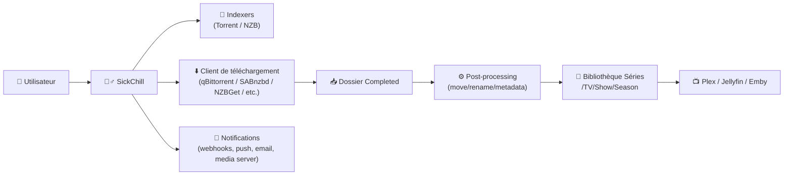
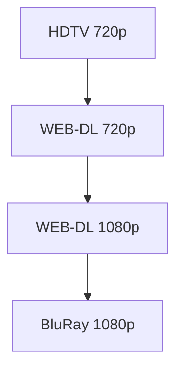
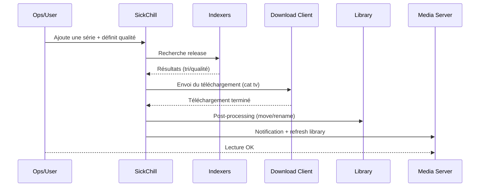

# 🧟‍♂️ SickChill — Présentation & Configuration Premium (Sans install / Sans Docker / Sans Nginx)

### Automatisation intelligente de séries TV : recherche, téléchargement, post-traitement, renommage, notifications
Optimisé pour écosystème *indexers + client download + bibliothèque* • Qualité maîtrisée • Exploitation durable

---

## TL;DR

- **SickChill** automatise la gestion de tes **séries TV** : surveille, cherche, télécharge, traite, renomme, classe, notifie.
- Il s’intègre à :
  - **Indexers** (NZB/Torrent)
  - **Client de téléchargement** (torrent/usenet)
  - **Bibliothèque** (ton stockage + media server)
- Une config premium = **qualité + chemins + post-processing + anti-chaos + validation + rollback**.

---

## ✅ Checklists

### Pré-configuration (avant d’activer l’automatisation)
- [ ] Bibliothèque structurée (dossiers stables, permissions OK)
- [ ] Client de téléchargement opérationnel + catégorie dédiée “tv”
- [ ] Indexers fiables (peu mais bons) + tests OK
- [ ] Stratégie qualité (1080p/720p, x265, proper, etc.) définie
- [ ] Nommage & post-processing décidés (renommage, sous-dossiers saison, etc.)
- [ ] Notifications (Plex/Jellyfin/Emby, Discord, email…) prêtes

### Post-configuration (validation)
- [ ] Import d’une série test OK (1 épisode)
- [ ] Un téléchargement test se **post-processe** correctement (move/rename)
- [ ] Le fichier final est au bon endroit + bon nom
- [ ] Les épisodes déjà présents ne sont pas dupliqués
- [ ] Les logs sont propres (pas de boucle d’erreurs)

---

> [!TIP]
> SickChill est excellent quand tu traites ta médiathèque comme un **pipeline** : *indexers → download client → completed → post-processing → library → media server*.

> [!WARNING]
> Le #1 des problèmes = **mauvais chemins** (SickChill ne trouve pas “completed”, ou renomme au mauvais endroit).

> [!DANGER]
> N’active pas “remove completed downloads” / “cleaning agressif” tant que tu n’as pas validé le post-processing sur une série test.  
> Une mauvaise règle peut supprimer ou déplacer n’importe quoi.

---

# 1) SickChill — Vision moderne

SickChill n’est pas juste un “téléchargeur auto”.

C’est :
- 🧠 un **moteur de décision qualité**
- 🔎 un **orchestrateur de recherche** (indexers)
- 📦 un **gestionnaire de bibliothèque** (renommage, organisation)
- 🔄 un **automate de post-traitement** (move/copy, détection, corrections)
- 📣 un **hub de notifications** (media servers, services, webhooks)

Site & docs : https://sickchill.github.io/  
Repo principal : https://github.com/SickChill/sickchill

---

# 2) Architecture globale



---

# 3) Philosophie “Premium” (5 piliers)

1. 🎯 **Qualité** : profils réalistes + upgrades maîtrisés  
2. 🧭 **Chemins** : completed / library / temp stables et cohérents  
3. ⚙️ **Post-processing** : règles simples, testées, idempotentes  
4. 🗂️ **Nommage** : structure propre (Show/Season/Episode) + multi-sources  
5. 📈 **Exploitation** : logs, tests, rollback, discipline de changements  

---

# 4) Organisation des fichiers (le socle)

## Structure recommandée
- Une racine “TV”
- Une série = un dossier
- Saisons en sous-dossiers (souvent la meilleure maintenabilité)

Exemple :
```
/data/media/tv/
  The Expanse/
    Season 01/
      The Expanse - S01E01 - Dulcinea.mkv
```

> [!TIP]
> La stabilité des chemins est plus importante que la perfection du naming.  
> Si tu changes de structure tous les mois, l’automatisation se dégrade.

---

# 5) Qualité & Stratégie d’upgrade (éviter le chaos)

## Stratégie simple (recommandée)
- Cible : **1080p**
- Fallback : **720p**
- Bloque les sources “LQ” si ta politique est “qualité stable”

### Logique d’upgrade
- Autoriser upgrade uniquement si :
  - meilleure source/qualité
  - taille cohérente
  - release group acceptable
  - pas de churn infini



> [!WARNING]
> Trop permissif = SickChill retélécharge en boucle.  
> Trop strict = il ne corrige jamais les mauvaises releases.  
> Le bon réglage = “upgrade utile, pas obsessionnel”.

---

# 6) Indexers (recherche propre, résultats propres)

## Règles premium
- Peu d’indexers, mais fiables
- Tests réguliers
- Limite les sources “exotiques” qui cassent le matching

## Anti-faux positifs
- Privilégier “matching fort” (nom d’épisode, numéro exact, season pack contrôlé)
- Éviter les releases au naming douteux
- Ajuster la tolérance aux variations (selon tes sources)

---

# 7) Client de téléchargement (catégories & post-processing)

## Conventions recommandées
- Une catégorie dédiée : `tv`
- Un dossier “completed” stable (même path logique pour tout le pipeline)
- Un dossier “incomplete” séparé si usenet (hygiène)

> [!TIP]
> Ton pipeline doit être “lisible” : si tu ne peux pas l’expliquer en 30 secondes, il est trop compliqué.

---

# 8) Post-processing (le cœur opérationnel)

## Objectif
Transformer un fichier “download” en un fichier “library” :
- vérifié
- bien placé
- bien nommé
- prêt pour Plex/Jellyfin

## Règles premium (simples)
- Préférer **move/rename** vers la library (plutôt que des copies partout)
- Activer le renommage une fois la structure validée
- Garder les logs activables facilement en cas de bug

> [!WARNING]
> Si tu utilises des hardlinks ailleurs (ex: workflow type Sonarr/Radarr), assure-toi que ton approche est cohérente.
> SickChill peut être très bon, mais n’ajoute pas une “deuxième logique” contradictoire.

---

# 9) Nommage (propre, stable, compatible media servers)

## Format recommandé (lisible)
- Série : `Show Name`
- Episode : `Show Name - S01E02 - Episode Title.ext`

Exemple :
```
Severance - S01E01 - Good News About Hell.mkv
```

> [!TIP]
> Ajoute la qualité dans le nom seulement si tu en as besoin pour l’audit humain.  
> Sinon, garde les noms sobres et laisse le media server gérer les infos.

---

# 10) Notifications (piloter l’écosystème)

## Cibles typiques
- Plex / Jellyfin / Emby : refresh bibliothèque
- Discord/Slack : “new episode downloaded”
- Email : erreurs critiques
- Trakt : suivi (selon usage)

## Principe premium
- Notifier **utile**, pas bruyant :
  - succès : résumé
  - erreurs : actionnable (lien + extrait log + contexte)

---

# 11) Workflows premium (incident & debug)



---

# 12) Validation / Tests / Rollback (pro)

## Tests “smoke” (rapides)
```bash
# Vérifier que l’app répond (local / réseau)
curl -I http://SICKCHILL_HOST:PORT | head

# Vérifier rapidement l’espace disque (souvent cause #1 d’échecs)
df -h

# Vérifier permissions/ownership sur la bibliothèque (exemple)
ls -la /data/media/tv | head
```

## Test fonctionnel minimal (obligatoire)
1. Ajouter **1 série test** (petite)
2. Lancer recherche sur **1 épisode**
3. Confirmer :
   - téléchargement ok
   - post-processing ok
   - fichier final bien nommé
   - media server voit l’épisode

## Rollback (sans douleur)
- Exporter / sauvegarder la configuration avant changement majeur
- Revenir à :
  - l’ancienne règle de naming
  - l’ancien chemin “completed”
  - l’ancienne politique qualité
- Toujours changer **une variable à la fois**, et valider.

> [!DANGER]
> Un rollback n’est utile que s’il est **rapide**.  
> Si tu dois “réinventer” la config en urgence, ce n’est pas un rollback.

---

# 13) Erreurs fréquentes (et fixes)

## “Downloaded but not processed”
Causes :
- completed path incorrect
- catégorie client incohérente
- permissions insuffisantes
Fix :
- vérifier le chemin exact de “completed”
- vérifier ownership RW sur library
- lancer un test sur 1 épisode

## “Mauvais épisode / mauvais matching”
Causes :
- indexers trop permissifs
- releases au naming douteux
Fix :
- réduire le nombre d’indexers
- augmenter la précision de matching
- préférer sources mieux structurées

## “Retéléchargements infinis”
Causes :
- upgrades trop permissifs
- taille/qualité incohérentes
Fix :
- resserrer les critères d’upgrade
- limiter les qualities acceptées
- définir des seuils min/max réalistes

---

# 14) Sources — Images Docker (comme demandé)

## 14.1 Image “officielle” la plus évidente
- `sickchill/sickchill` (Docker Hub) : https://hub.docker.com/r/sickchill/sickchill  
- Repo SickChill (référence upstream) : https://github.com/SickChill/sickchill  
- Site/Docs SickChill : https://sickchill.github.io/  

## 14.2 Image LinuxServer.io (existe, mais attention au statut)
- `linuxserver/sickchill` (Docker Hub) : https://hub.docker.com/r/linuxserver/sickchill  
- Docs LSIO (SickChill listé en “deprecated images”) : https://docs.linuxserver.io/deprecated_images/docker-sickchill/  
- Package GHCR linuxserver/sickchill (tags) : https://github.com/orgs/linuxserver/packages/container/sickchill/458783598?tag=amd64-version-2024.3.1  

---

# ✅ Conclusion

SickChill est une brique “TV automation” puissante quand tu poses les fondations :
- chemins stables
- qualité maîtrisée
- post-processing testable
- naming clair
- validation + rollback

Fais-le simple, robuste, et documenté — et tu obtiens une automatisation fiable au quotidien.