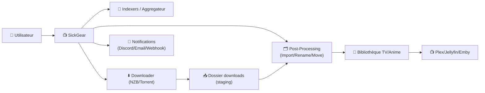
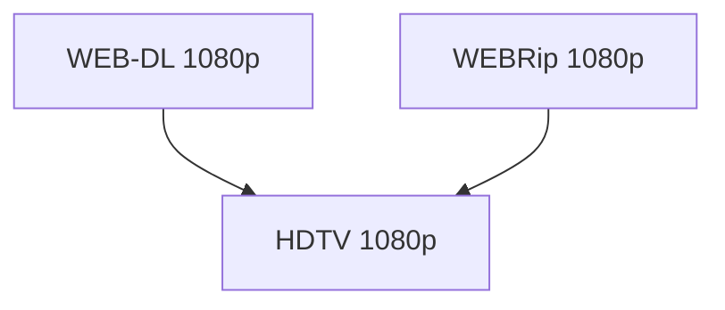
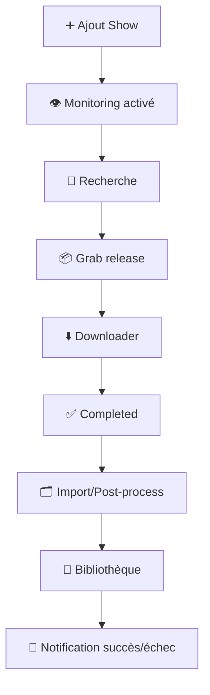
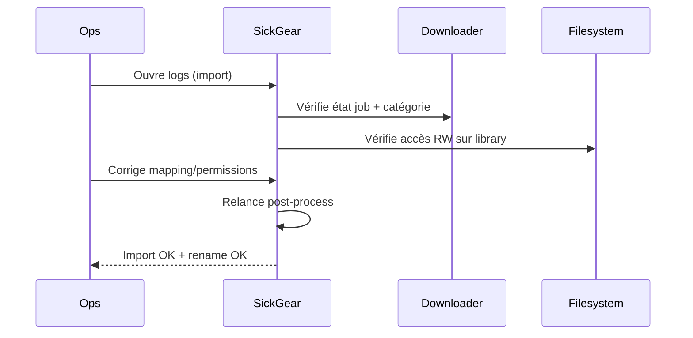

# 📺 SickGear — Présentation & Configuration Premium (Sans install)

### PVR TV/Anime : suivi, recherche, automatisation, renommage, intégrations
Optimisé pour reverse proxy existant • Qualité maîtrisée • Indexers/Downloaders • Exploitation durable

---

## TL;DR

- **SickGear** automatise la gestion de séries/animés : **suivi**, **recherche d’épisodes**, **envoi au downloader**, **post-traitement**, **organisation**, **notifications**.
- Une config “premium” = **indexers propres**, **règles qualité cohérentes**, **post-processing solide**, **naming strict**, **logs exploitables**, **accès sécurisé**.

---

## ✅ Checklists

### Pré-configuration (avant de brancher la prod)
- [ ] Bibliothèques **TV / Anime** propres (dossiers stables, droits OK)
- [ ] Client(s) de téléchargement choisis (NZB/Usenet, torrent) + catégories
- [ ] Indexers (ou agrégateur type Prowlarr) prêts
- [ ] Stratégie “Qualité” définie (ex: 1080p WEB-DL > 1080p HDTV)
- [ ] Convention de nommage (dossier show + fichiers épisodes) validée
- [ ] Stratégie de notifications (Discord/Email/Webhook) définie

### Post-configuration (validation)
- [ ] 1 show test : ajout → recherche → download → import → renommage OK
- [ ] “Failed downloads” géré correctement (retry / marqueur / nettoyage)
- [ ] Un épisode “upgrade” remplace bien une version inférieure (si activé)
- [ ] Les logs sont lisibles et les erreurs indexer/downloader identifiables
- [ ] Les permissions sont correctes (pas de “permission denied” en post-process)

---

> [!TIP]
> Le meilleur ROI vient de : **qualité + post-processing + naming**.  
> Si ces 3 briques sont propres, tout le reste devient stable.

> [!WARNING]
> Les problèmes #1 sur SickGear : **mauvais chemins** (import), **catégories downloader** incohérentes, **qualité trop permissive**.

> [!DANGER]
> Treat SickGear comme un outil “ops” : logs potentiellement sensibles, accès privilégié, intégrations externes.

---

# 1) SickGear — Vision moderne

SickGear n’est pas juste “un suivi d’épisodes”.

C’est :
- 🧠 Un **moteur de décision** (qualité, upgrades, rules)
- 🔎 Un **orchestrateur d’indexers**
- ⬇️ Un **dispatcher vers downloaders**
- 🗂️ Un **pipeline de post-traitement** (rename, move, metadata, nettoyage)
- 🔔 Un **hub de notifications** (état, échecs, succès)

---

# 2) Architecture globale



---

# 3) Philosophie de configuration premium (5 piliers)

1. 🎯 **Qualité & upgrades** (règles simples, efficaces)
2. 🗂️ **Post-processing fiable** (import propre, idempotent)
3. 🧾 **Nommage strict** (prévisible pour tous les outils)
4. 🔎 **Indexers propres** (peu, mais bons ; fallback raisonnable)
5. 🔔 **Observabilité** (logs, alertes, runbooks de dépannage)

---

# 4) Qualité : stratégie “réaliste & stable”

## 4.1 Principe
- Définir une **qualité cible**
- Définir des **fallbacks**
- Autoriser les **upgrades** uniquement si ça apporte un vrai gain

### Exemple logique 1080p (générique)


> [!TIP]
> En pratique : garde peu de paliers. Trop de paliers = décisions floues + bruit.

## 4.2 Limites de taille (sanity check)
Objectif : éviter les “micro releases” compressées ou les monstruosités.

Exemple 1080p (à ajuster) :
- Minimum : 800MB–1.2GB (épisode long)
- Target : 1.5GB–3.5GB
- Maximum : 6GB–10GB

---

# 5) Indexers : qualité, redondance, hygiène

## 5.1 Règles premium
- 2 à 4 indexers max au début
- Un indexer “principal” + un “fallback”
- Éviter les doublons identiques (même source, mêmes résultats)
- Ajuster “search frequency” pour éviter throttling / ban

## 5.2 Santé indexer
Signaux d’alerte :
- timeouts répétés
- résultats vides sur shows populaires
- erreurs d’auth / quotas

Action :
- réduire fréquence
- vérifier credentials
- remplacer l’indexer plutôt que d’empiler

---

# 6) Downloader : catégories & cohérence (clé de voûte)

## 6.1 Catégories dédiées
- `tv` (ou `sickgear`) pour séparer des autres flux
- dossier staging distinct si possible

Pourquoi :
- meilleur routage
- moins de collisions
- post-processing plus fiable

## 6.2 Post-process “idempotent”
Idée : si SickGear repasse sur un même fichier, il ne doit pas “casser” la bibliothèque.
Bonnes pratiques :
- déplacer/renommer de manière déterministe
- éviter les scripts destructifs sans garde-fous
- logs explicites

---

# 7) Bibliothèque & naming : lisible, durable, compatible

## 7.1 Structure recommandée
```
/data/media/tv/
  Show Name (Year)/
    Season 01/
      Show Name - S01E01 - Episode Title.ext
```

## 7.2 Pourquoi c’est premium
- compatible Plex/Jellyfin/Emby
- résiste aux migrations
- facilite debug (tu vois tout de suite “quoi est quoi”)

> [!WARNING]
> Évite les noms “exotiques” ou variables (espaces doubles, tags random). La stabilité du naming = moins de bugs.

---

# 8) Anime (si tu l’utilises) : spécificités

## 8.1 Indexers & numérotation
Anime = souvent :
- numérotation alternative
- releases multi-versions
- tags (sub/dub, group, v2/v3)

Recommandations :
- définir une source “référence” (indexer) prioritaire
- limiter les formats tolérés
- surveiller les conflits d’épisodes

> [!TIP]
> Commence “strict” (peu de règles, qualité claire) puis assouplis au besoin.

---

# 9) Notifications & “Ops mode”

## 9.1 Ce qu’on veut recevoir (utile)
- échec download / import
- manque d’épisode attendu
- upgrade effectué
- indexer en panne (si signalé)

## 9.2 Format premium d’une alerte
Inclure :
- show + SxxExx
- qualité trouvée
- indexer/downloader utilisé
- lien direct vers l’item
- extrait de log (court)

---

# 10) Workflows premium

## 10.1 Ajout d’un show (flow)


## 10.2 Incident “import qui échoue” (séquence)


---

# 11) Validation / Tests / Rollback

## Tests “smoke” (simples)
```bash
# 1) L’UI répond (adapter host/port)
curl -I http://SICKGEAR_HOST:SICKGEAR_PORT | head

# 2) Test indexer (manuel UI) : une recherche sur un show populaire doit retourner des résultats
# 3) Test downloader (manuel UI) : envoi d’un grab test et vérif que le job arrive avec la bonne catégorie
```

## Tests fonctionnels (1 show, 1 épisode)
- Ajouter un show test
- Forcer une recherche
- Vérifier :
  - job arrive chez le downloader
  - completed détecté
  - import réussi
  - fichier renommé
  - épisode marqué “downloaded”
  - notification envoyée (si activée)

## Rollback (opérationnel)
- rollback “config” : restaurer config SickGear (si tu fais des snapshots)
- rollback “règles” : revenir à un profil qualité minimal
- rollback “pipeline” : désactiver temporairement upgrades / post-process agressif

> [!TIP]
> Après toute modification majeure (qualité, naming, post-process), fais un test sur 1 show “bac à sable”.

---

# 12) Erreurs fréquentes (et solutions rapides)

- ❌ “Import échoue / fichiers introuvables”  
  ✅ vérifier chemins (staging vs library), droits, mapping, catégories

- ❌ “Télécharge la mauvaise qualité”  
  ✅ resserrer profils qualité + tailles + limiter fallback

- ❌ “Boucle de recherches / spam indexers”  
  ✅ augmenter intervals, réduire indexers, revoir shows “paused”

- ❌ “Nom des fichiers incohérent”  
  ✅ fixer templates + standardiser une structure unique

---

# 13) Sources — Images Docker (comme ton format)

## 13.1 Image officielle SickGear
- `sickgear/sickgear` (Docker Hub) : https://hub.docker.com/r/sickgear/sickgear  
- Repo “SickGear” (référence upstream) : https://github.com/SickGear/SickGear  
- Repo “SickGear.Docker” (packaging containers) : https://github.com/SickGear/SickGear.Docker  

## 13.2 Image LinuxServer.io (LSIO)
- `linuxserver/sickgear` (Docker Hub) : https://hub.docker.com/r/linuxserver/sickgear  
- Doc LinuxServer “docker-sickgear” : https://docs.linuxserver.io/images/docker-sickgear/  
- Repo de packaging LSIO : https://github.com/linuxserver/docker-sickgear  

---

# ✅ Conclusion

SickGear “premium”, c’est :
- une politique qualité simple et cohérente,
- un pipeline post-processing fiable,
- une bibliothèque propre + naming stable,
- des indexers maîtrisés,
- des notifications utiles,
- des tests reproductibles.

Résultat : moins de clics, moins de bruit, plus de stabilité.