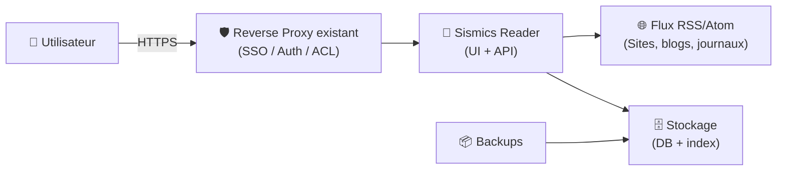

# 📰 Sismics Reader — Présentation & Configuration Premium (RSS/Atom “Own Your Feeds”)

### Lecteur de flux auto-hébergé : simple, rapide, “Google Reader-like”
Optimisé pour reverse proxy existant • Organisation propre • Exploitation durable • Multi-appareils

---

## TL;DR

- **Sismics Reader** est un lecteur **RSS/Atom** open-source orienté “Google Reader features”.
- Objectif : **reprendre le contrôle de tes flux** (abonnements, dossiers, lecture plus tard, marquer lu, recherche).
- Version “premium” = **taxonomie**, **règles d’usage**, **sauvegardes**, **tests**, **rollback**, et une **surface d’accès maîtrisée** via ton reverse proxy existant.

---

## ✅ Checklists

### Pré-usage (avant d’embarquer d’autres personnes)
- [ ] Définir une structure de dossiers (ex: Tech / Actu / DevOps / Sécurité / Blogs persos)
- [ ] Décider de la “doctrine” : *Inbox zéro* vs *Read later*
- [ ] Définir la politique d’import/export (OPML, fréquence, propriété)
- [ ] Fixer les limites : nombre de flux, taille de rétention, pièces jointes (si applicable)
- [ ] Préparer un runbook “incident lecture” (latence, flux HS, duplication, sync)

### Post-configuration (qualité opérationnelle)
- [ ] Import OPML testé + export OPML validé
- [ ] “Marquer lu” + “Tout marquer lu” cohérents avec ton workflow
- [ ] Recherche utile (titres, contenu selon configuration)
- [ ] Plan de sauvegarde/restauration documenté + test de restore
- [ ] Logs propres (pas d’erreurs récurrentes sur les fetchers)

---

> [!TIP]
> Le vrai gain vient de la **discipline de lecture** (dossiers + routine + tri), pas du nombre de fonctionnalités.

> [!WARNING]
> Les flux peuvent contenir des liens malveillants / tracking. Considère Reader comme une surface “web content”.

> [!DANGER]
> Ne confonds pas “reader” et “archivage long terme” : pour conserver des articles sur des années, prévois une stratégie (exports, bookmarking, notes, ou outil d’archivage dédié).

---

# 1) Vision moderne

Sismics Reader n’est pas juste un agrégateur.

C’est :
- 🧠 Un **centre de tri** (inbox, dossiers, marquage)
- 🔎 Un **outil de recherche** (retrouver une info rapidement)
- 🔁 Un **système de routine** (lecture quotidienne/hebdo)
- 🧩 Un **pont OPML** (migration, portabilité)

Référence produit (site officiel) :
- https://www.sismics.com/reader/

---

# 2) Architecture globale



---

# 3) Modèle d’organisation (la “taxonomie premium”)

## 3.1 Dossiers (structure recommandée)
Exemple simple et durable :
- **01_Inbox** (tout arrive ici si tu veux)
- **Tech**
- **DevOps**
- **Sécurité**
- **Produit**
- **News**
- **Blogs**
- **LongRead** (lecture longue)
- **Veille** (à relire / à compiler)

> [!TIP]
> Évite 50 dossiers. 8–12 dossiers bien nommés suffisent largement.

## 3.2 Règles de lecture (doctrine)
Deux écoles “propre” :
1) **Inbox zéro** : tu tries vite → tu marques lu → tu archives ailleurs ce qui compte.
2) **Read later** : tu “étoiles” / mets de côté, et tu traites en batch.

---

# 4) Fonctionnalités clés (attentes réalistes)

Selon versions/implémentation, Reader vise les “Google Reader features” :
- Abonnements RSS/Atom
- Dossiers / organisation
- Marquer lu / non lu
- Favoris / sauvegarde (selon usage)
- Import/Export OPML (portabilité)
- Recherche (selon indexation)

Référence projet (GitHub) :
- https://github.com/sismics/reader

---

# 5) OPML — Portabilité (et anti lock-in)

## 5.1 Import OPML (migration)
Workflow recommandé :
- importer l’OPML une seule fois
- renommer/normaliser les dossiers
- supprimer les doublons
- stabiliser les flux “instables” (changements d’URL, redirects)

## 5.2 Export OPML (sauvegarde “essentielle”)
Le minimum viable :
- export OPML régulier (hebdo/mensuel)
- stocké avec tes backups

> [!WARNING]
> OPML = tes abonnements. Ce n’est pas l’historique des articles. Les deux sont différents.

---

# 6) Qualité de la veille (méthode premium)

## 6.1 Curate ton “signal-to-noise”
- coupe les flux à fort bruit (clickbait, trop d’articles/jour)
- privilégie : blogs d’auteurs, changelogs, bulletins hebdo
- regroupe les “news” dans 1 dossier séparé (sinon ça pollue tout)

## 6.2 Routine de lecture (efficace)
- 10 minutes/jour : tri rapide, marque lu
- 30 minutes/hebdo : “LongRead” + synthèse
- note ce qui compte (liens, décisions, actions)

---

# 7) Sécurité & Accès (sans recettes reverse proxy)

## 7.1 Principes
- accès via ton reverse proxy existant (SSO/ACL si possible)
- limiter qui peut se connecter
- appliquer un cloisonnement réseau si tu es en multi-service

## 7.2 Hygiene
- mots de passe uniques
- rotation si partage d’équipe
- logs d’accès surveillés via ton infra (proxy)

---

# 8) Exploitation : sauvegardes & restauration (pro)

## 8.1 Ce qu’il faut sauvegarder
- Base de données / stockage applicatif
- Configuration applicative (si séparée)
- Export OPML (abonnements)

## 8.2 Test de restauration (obligatoire)
Checklist restore (très simple) :
- [ ] restaurer DB + config
- [ ] vérifier login
- [ ] vérifier la liste des flux
- [ ] vérifier un rafraîchissement de flux
- [ ] vérifier recherche / lecture

> [!TIP]
> Un backup non testé = pas un backup.

---

# 9) Validation / Tests / Rollback

## 9.1 Smoke tests (réseau + app)
```bash
# HTTP répond
curl -I https://reader.example.tld | head

# Vérifier que la page charge quelque chose
curl -s https://reader.example.tld | head -n 20
```

## 9.2 Tests fonctionnels
- Import OPML (petit fichier d’abord)
- Abonnement à un flux “stable” (ex: blog personnel) + refresh OK
- Marquer lu / non lu
- Recherche (mot clé simple)

## 9.3 Rollback (plan simple)
- restaurer DB + config depuis backup
- réimport OPML si nécessaire
- vérifier refresh + login
- documenter le “retour arrière” en 5–10 lignes maximum

---

# 10) Dépannage (les classiques)

## 10.1 Flux ne se met pas à jour
Causes fréquentes :
- URL du flux changée
- endpoint en erreur (403/429/timeout)
- redirections / TLS
Actions :
- tester l’URL du flux manuellement
- remplacer par une URL RSS alternative (si le site en fournit)
- réduire la fréquence si throttling

## 10.2 Doublons d’articles
Causes :
- variations d’URL (utm, tracking)
- même contenu via plusieurs flux
Actions :
- garder un seul flux “source”
- déplacer les agrégateurs dans un dossier à part
- documenter la règle “1 site = 1 flux principal”

---

# 11) Sources — Images Docker (format demandé : URLs brutes)

## 11.1 Image officielle la plus citée
- `sismics/reader` (Docker Hub) : https://hub.docker.com/r/sismics/reader  
- Détails de layers `sismics/reader:latest` : https://hub.docker.com/layers/sismics/reader/latest/images/sha256-04e399a61ce4f85aae83e5e789e6cae01fd567975a92d27fb6e241418e8e0cef  
- Repo upstream (référence produit) : https://github.com/sismics/reader  

## 11.2 LinuxServer.io (LSIO)
- Catalogue des images LinuxServer : https://www.linuxserver.io/our-images  
- Documentation “Images” LinuxServer : https://docs.linuxserver.io/images/  
- Note : à date, **pas d’image LSIO “Reader / Sismics Reader”** listée dans le catalogue officiel (à vérifier via recherche dans leur index d’images).

---

# ✅ Conclusion

Sismics Reader est un excellent “**centre de contrôle**” pour tes flux :
- organisation propre (dossiers + routine)
- portabilité (OPML)
- exploitation sérieuse (backups + restore test)
- accès maîtrisé (via ton reverse proxy existant)
