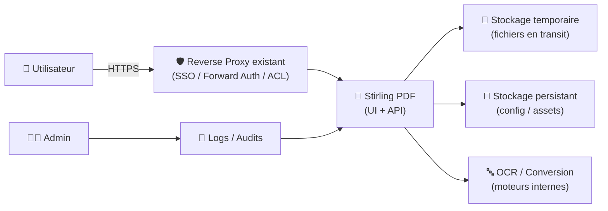
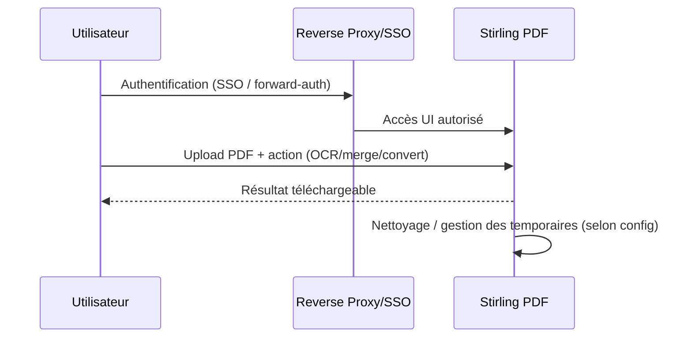

# 🧾 Stirling PDF — Présentation & Exploitation Premium (Sans install / Sans Docker / Sans Nginx)

### Plateforme PDF open-source “tout-en-un” : édition, conversion, automatisation, API — en privé
Optimisé pour Reverse Proxy existant • Contrôle d’accès • Gouvernance • Qualité opérationnelle

---

## TL;DR

- **Stirling PDF** = une **boîte à outils PDF web** (60+ outils) : signer, convertir, fusionner, compresser, OCR, redaction, etc.
- Point fort : **traitement local / privé** (pas d’envoi vers des SaaS) + **API** pour automatiser.
- Une mise en production “premium” = **auth**, **permissions**, **règles de rétention**, **journalisation**, **tests** et **rollback**.

Docs / projet :
- https://docs.stirlingpdf.com/
- https://github.com/Stirling-Tools/Stirling-PDF

---

## ✅ Checklists

### Pré-usage (avant ouverture aux équipes)
- [ ] Définir le périmètre : usage interne, public, ou via VPN/SSO
- [ ] Définir la politique de données : rétention, suppression, stockage temporaire
- [ ] Définir les profils d’utilisateurs : qui peut faire quoi (surtout OCR, conversion, redaction)
- [ ] Définir la stratégie d’automatisation : UI vs API (batch)
- [ ] Définir les limites : taille fichiers, quotas, taux de requêtes (si API exposée)

### Post-configuration (qualité opérationnelle)
- [ ] Les fichiers “temporaires” sont bien gérés (pas d’accumulation)
- [ ] Les outils critiques sont validés (OCR, conversion, signature, redaction)
- [ ] Logs exploitables (correlation id, erreurs claires)
- [ ] Plan de rollback documenté et testé
- [ ] Contrôle d’accès validé (tests “utilisateur restreint”)

---

> [!TIP]
> Stirling PDF est idéal comme **“PDF gateway interne”** : un endpoint privé pour traiter les PDF sans dépendre d’outils cloud.

> [!WARNING]
> Les PDFs peuvent contenir des données sensibles. Traite Stirling PDF comme un **service à accès contrôlé** (SSO, forward-auth, VPN, ACL).

> [!DANGER]
> Ne le mets pas “ouvert au monde” sans contrôle d’accès + durcissement : tu exposerais une surface applicative + des traitements lourds (OCR/conversions).

---

# 1) Stirling PDF — Vision moderne

Stirling PDF n’est pas juste un “merge/split”.

C’est :
- 🧰 **Un atelier PDF complet** (édition, conversion, nettoyage, compression)
- 🛡️ **Une option privée** (traitement local)
- 🤖 **Un moteur d’automatisation** via API (batch, pipelines)
- 🧩 **Une brique d’entreprise** (SSO/permissions selon configuration)

Page “Getting Started / Benefits” :
- https://docs.stirlingpdf.com/

---

# 2) Architecture globale (référence)



---

# 3) Ce que Stirling PDF fait réellement (cartographie outils)

## Catégories typiques
- 🧩 **Assembler / réorganiser**
  - fusion, split, reorder, rotate, extract pages
- 🧼 **Optimiser**
  - compression, nettoyage, correction métadonnées
- 🔁 **Convertir**
  - PDF ⇄ images, PDF ⇄ docs (selon capacités)
- 🛡️ **Sécuriser / confidentialité**
  - redaction, suppression d’infos, protections (selon options)
- ✍️ **Signer / annoter**
  - signature, tampons, annotations (selon outils)
- 🔤 **OCR**
  - rendre le texte recherchable, extraction (selon moteur/config)

Référence produit :
- https://github.com/Stirling-Tools/Stirling-PDF
- https://docs.stirlingpdf.com/

---

# 4) Philosophie “premium ops” (5 piliers)

1. 🔐 **Contrôle d’accès** : SSO/forward-auth, ACL, segmentation
2. 🧾 **Politique de données** : où vont les fichiers, combien de temps, qui y accède
3. 🧠 **Qualité fonctionnelle** : OCR, redaction, conversions validées sur corpus réel
4. 🤖 **Automatisation** : UI pour les humains, API pour les pipelines
5. 🧪 **Validation & rollback** : tests rapides, retour arrière en minutes

---

# 5) Gouvernance & sécurité applicative (sans recettes proxy)

## Recommandations de gouvernance
- “Users” (lecture/usage UI) vs “Ops” (accès logs/config) vs “Automation” (API keys)
- Segmentation d’accès :
  - par réseau (LAN/VPN)
  - par SSO/forward-auth
  - par règles de taux/quotas côté gateway si API exposée

## Points sensibles à cadrer
- **OCR** et conversions = charge CPU/RAM importante → contrôle d’usage
- **Redaction** : exige validation métier (ne pas confondre “masquer visuellement” vs “supprimer réellement”)
- **Fichiers temporaires** : risque de fuite si rétention mal gérée

---

# 6) API & Automatisation (quand on passe au niveau supérieur)

## Cas d’usage premium
- Traitement batch (ex: compresser tous les PDF d’un dossier)
- Pipeline “ingestion” (ex: OCR + redaction + export)
- Intégration outils internes (portail RH, facturation, ticketing)

Référence :
- https://github.com/Stirling-Tools/Stirling-PDF

> [!TIP]
> Si tu exposes l’API à des systèmes, passe par un gateway (auth + rate limit + logs) et garde Stirling PDF en backend privé.

---

# 7) Workflows premium (incident & exploitation)

## 7.1 “Utilisateur” (UI)


## 7.2 “Automatisation” (API)
- Un job appelle l’API
- Le gateway applique auth + quota
- Logs côté gateway + côté Stirling PDF
- Un runbook documente les erreurs fréquentes (timeouts, tailles, formats)

---

# 8) Validation / Tests / Rollback

## Tests de validation (smoke)
```bash
# 1) Service répond
curl -I https://stirling.example.tld | head

# 2) Vérifier présence page / endpoints (selon exposition)
curl -s https://stirling.example.tld | head -n 20
```

## Tests fonctionnels (mini-corpus)
Prépare un lot de PDFs :
- 1 PDF scanné (pour OCR)
- 1 PDF très lourd (performance)
- 1 PDF avec formulaires (compatibilité)
- 1 PDF multi-pages (merge/split/reorder)
- 1 PDF “sensible” (test redaction)

Valider :
- OCR : texte recherchable + export texte correct
- Conversion : rendu fidèle (polices, images)
- Compression : poids réduit sans dégrader excessivement
- Redaction : contenu réellement supprimé (test extraction texte + inspection)

## Rollback (opérationnel)
- Revenir à une config “safe” :
  - désactiver l’exposition API publique
  - réduire les outils lourds accessibles si besoin (OCR/conversions)
  - revenir à l’auth stricte (SSO only)
- Documenter : “symptôme → action → vérif → retour normal”

---

# 9) Limitations & bonnes pratiques

- Ce n’est pas un DMS complet : évite d’en faire un “stockage documentaire” long terme si ce n’est pas ton objectif.
- Pour l’historique, l’audit avancé, la recherche cross-doc : prévoir un SI de doc/archivage dédié.
- Pour la charge : OCR + conversion = dimensionnement et quotas.

---

# 10) Sources — Images Docker (URLs brutes, comme demandé)

## 10.1 Image officielle la plus citée
- `stirlingtools/stirling-pdf` (Docker Hub) : https://hub.docker.com/r/stirlingtools/stirling-pdf  
- Tags `stirlingtools/stirling-pdf` : https://hub.docker.com/r/stirlingtools/stirling-pdf/tags  
- Doc “Docker Install” (référence image/usage) : https://docs.stirlingpdf.com/Installation/Docker%20Install/  
- Repo upstream (référence) : https://github.com/Stirling-Tools/Stirling-PDF  

## 10.2 Image GitHub Container Registry (packages)
- Package container `s-pdf` (GHCR via GitHub Packages) : https://github.com/-/stirling-tools/packages/container/package/s-pdf  

## 10.3 LinuxServer.io (LSIO)
- Catalogue LSIO (pour vérifier si une image dédiée existe) : https://www.linuxserver.io/our-images  
- À date, Stirling PDF n’apparaît pas comme image LSIO dédiée dans le catalogue (vérification via la page ci-dessus).

---

# ✅ Conclusion

Stirling PDF est une **plateforme PDF privée** extrêmement pratique :
- pour standardiser les opérations PDF,
- pour automatiser via API,
- et pour réduire la dépendance aux SaaS.

En version “premium” : **accès contrôlé + politique de données + tests + rollback**.