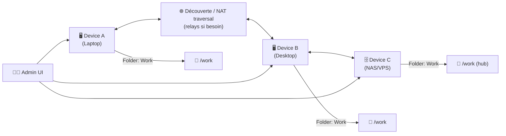
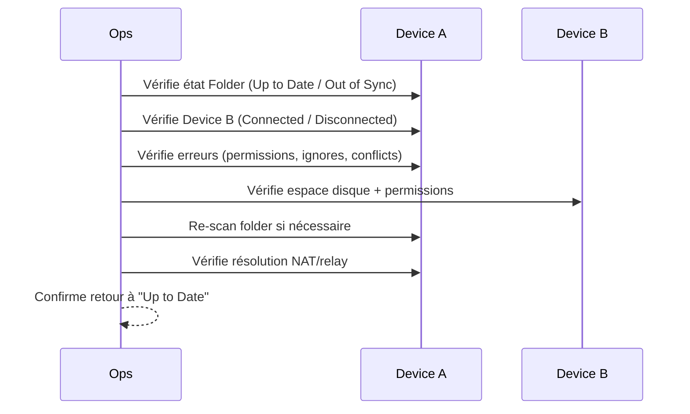

# 🔁 Syncthing — Présentation & Exploitation Premium (Sans install / Sans Docker / Sans Nginx / Sans UFW)

### Synchronisation P2P continue • Chiffrement TLS • Contrôle fin par dossiers • Performance & fiabilité
Optimisé pour reverse proxy existant • Gouvernance • Runbooks • Validation / Rollback

---

## TL;DR

- **Syncthing** synchronise des fichiers **en continu** entre plusieurs machines, en **pair-à-pair** (pas besoin de cloud).
- Chaque appareil a une **identité cryptographique** (Device ID) et les échanges sont **chiffrés**.
- La version “premium ops” = **modèle de dossiers clair**, **conventions**, **sécurité d’accès à l’UI**, **monitoring**, **procédures de test/rollback**, et **anti-pièges** (versions, conflits, permissions).

---

## ✅ Checklists

### Pré-configuration (avant de sync “en prod”)
- [ ] Définir le **périmètre** : quels dossiers, quelle criticité, quels SLA
- [ ] Définir la **topologie** : 2 nœuds, N nœuds, hub-and-spoke, mesh partiel
- [ ] Choisir la **stratégie de versioning** (recommandé si données sensibles)
- [ ] Choisir la stratégie de **permissions** (posix, ACL, “ignore permissions”)
- [ ] Décider comment gérer l’accès à l’UI (LAN/VPN/reverse proxy existant)
- [ ] Définir une politique d’**exclusions** (`.stignore`)

### Post-configuration (qualité & stabilité)
- [ ] Tous les dossiers passent en **Up to Date** (pas de “Out of Sync” permanent)
- [ ] Les conflits sont rares et compris (procédure de résolution)
- [ ] Les gros répertoires se resynchronisent correctement après reboot
- [ ] Un test “restauration depuis versions” est documenté
- [ ] Les logs sont exploitables (naming des devices/dossiers cohérent)

---

> [!TIP]
> Syncthing est excellent pour : documents personnels, configs, médias “froids”, partages de travail, backups “actifs”.  
> Pour du stockage “transactionnel” (bases de données) → approche dédiée.

> [!WARNING]
> Syncthing **n’est pas** un outil de version control. Pour Git, utilise Git (Syncthing peut synchroniser le répertoire, mais ce n’est pas “safe” comme mécanisme de workflow Git).  
> (Voir “Anti-pièges” plus bas.)

> [!DANGER]
> Si tu synchronises des fichiers qui changent **très rapidement** (DB, caches, VM images en écriture), tu augmentes fortement : conflits, corruptions logiques, rescan permanent, latence.

---

# 1) Syncthing — Vision moderne

Syncthing n’est pas un “cloud perso”.

C’est :
- 🔁 Un **moteur de synchronisation continue**
- 🔐 Un **réseau privé P2P chiffré**
- 🧠 Un **gestionnaire de dossiers** (politiques par folder)
- 🧩 Un système extensible (versions, ignores, détection, tuning)

Objectifs clés (philosophie projet) :
- Sécurité contre la perte de données
- Contrôle utilisateur
- Décentralisé

---

# 2) Architecture globale



---

# 3) Topologies recommandées (selon contexte)

## 3.1 Hub-and-spoke (souvent le plus “ops-friendly”)
- Un nœud central (NAS/VPS) + plusieurs clients
- Plus simple pour :
  - supervision
  - disponibilité
  - cohérence des copies

## 3.2 Mesh (puissant mais demande discipline)
- Tout le monde sync avec tout le monde
- Bien si équipe petite + devices souvent en ligne

## 3.3 “Cold mirror”
- Un nœud “miroir” reçoit tout, n’émet pas (ou n’émet que vers un second)
- Idéal pour backup actif + contrôle

> [!TIP]
> Si tu débutes : **hub-and-spoke** + versioning. C’est le combo le plus robuste.

---

# 4) Concepts essentiels (à maîtriser)

## 4.1 Device ID & Trust
- Chaque appareil a un **Device ID** (certificat)
- Un device n’échange rien tant qu’il n’est pas **explicitement approuvé**

## 4.2 Folder ID vs Folder Label
- **Folder ID** = identifiant technique (stabilité)
- **Label** = lisible (humain)
Recommandation :
- Folder ID stable type `work_docs`, `photos`, `configs`
- Label explicite : `📁 Work Docs (RW)` / `📁 Photos (RO)`

## 4.3 Versioning (le “pare-choc”)
Permet de récupérer :
- fichiers supprimés
- écrasements accidentels
- corruption “silencieuse” (selon découverte)

Modes typiques :
- Simple (garde N versions)
- Trash can (poubelle)
- Staggered (versions graduelles)

> [!WARNING]
> Le versioning consomme de l’espace : dimensionne et définis une politique (N versions / durée).

---

# 5) Stratégie “premium” par type de données

## Documents critiques (contrats, procédures, configs)
- Versioning : ✅ activé (staggered recommandé)
- “Watch for changes” : selon FS/OS, mais viser détection fiable
- Exclusions : caches, tmp, `.DS_Store`, `node_modules`, etc.

## Photos / médias
- RW sur 1 device “source” + RO sur les autres (souvent plus sûr)
- Exclusions : previews, caches d’applis

## Projets dev
- Code : ok
- Dépendances : exclure (`node_modules`, `vendor`, `target`, `.venv`)
- Builds : exclure (`dist`, `build`)
- **Git** : ok si tu sais ce que tu fais, mais ne remplace pas Git

---

# 6) Gouvernance & conventions (ce qui évite le chaos)

## Convention de nommage devices
- `laptop-pierre`
- `desktop-home`
- `nas-main`
- `vps-sync`

## Convention de nommage folders
- `work_docs`
- `photos_raw`
- `configs_dotfiles`
- `media_archive`

## Standard de tags/notes (dans ta doc interne)
Chaque folder doit avoir :
- owner
- RW/RO
- taille estimée
- versioning (oui/non, mode)
- exclusions `.stignore`
- “où est la source de vérité”

---

# 7) Performance & fiabilité (tuning “sain”)

## 7.1 Exclusions intelligentes (.stignore)
But : réduire scans, éviter fichiers volatils, diminuer conflits.

Exemples d’exclusions fréquentes :
- `**/.DS_Store`
- `**/Thumbs.db`
- `**/.Trash-*`
- `**/node_modules/`
- `**/.cache/`
- `**/tmp/`

> [!TIP]
> Le meilleur tuning = **moins de choses à sync** + structure propre.

## 7.2 Gestion des permissions
- Selon tes OS, tu peux choisir :
  - respecter permissions/ownership
  - ignorer permissions (plus simple cross-platform)

Règle :
- Multi-OS (Windows/macOS/Linux) → souvent mieux de **ne pas** tenter de répliquer fidèlement les permissions POSIX.

## 7.3 Gros volumes & première sync
- Première sync = coûteuse (hash/scan)
- Ensuite = incrémental
Bonnes pratiques :
- seed via LAN/local quand possible
- éviter Wi-Fi instable pour 1er sync massif

---

# 8) Anti-pièges (les vrais problèmes du terrain)

## 8.1 Sync d’une base de données en cours d’écriture
- Risque : incohérence, corruption logique
- Alternative : dumps/snapshots, replication DB native, sauvegardes

## 8.2 Git “comme Dropbox”
- Risque : conflits subtils, corruption de repo si manipulations
- Alternative :
  - Git pour VCS
  - Syncthing pour dossiers de travail non transactionnels
  - ou bare repo central + push/pull

## 8.3 Conflits (comment les réduire)
- Réduire l’édition concurrente
- Définir un owner RW (les autres RO)
- Exclure fichiers auto-générés
- Activer versioning

---

# 9) Workflows premium (incident & debug)

## 9.1 Triage rapide “pourquoi ça sync pas”


## 9.2 Procédure “conflit de fichier”
- Identifier la version “source de vérité”
- Conserver les deux copies
- Renommer/archiver la version conflit
- Réconcilier, puis laisser resync
- Documenter la cause (édition concurrente ? fichier volatile ?)

---

# 10) Validation / Tests / Rollback

## Tests de validation (fonctionnels)
```bash
# Test 1: créer un fichier sur Device A
echo "sync-test $(date)" > /path/to/folder/syncthing_test.txt

# Test 2: vérifier apparition sur Device B (manuel / automatisable)
# - le fichier doit apparaître avec contenu identique

# Test 3: test suppression + récupération via versioning (si activé)
rm /path/to/folder/syncthing_test.txt
# puis restaurer depuis l’interface de versioning / “trash can” selon config
```

## Rollback (principes)
- Si une règle `.stignore` casse un flux : revert `.stignore` + rescan
- Si versioning trop agressif : réduire rétention plutôt que désactiver
- Si un folder devient instable : passer temporairement en **RO** sur certains devices

> [!WARNING]
> Le rollback “sûr” = réduire la surface (moins de RW, moins de fichiers volatils), pas “forcer” la sync.

---

# 11) Sources — Images Docker (format demandé, URLs brutes uniquement)

## 11.1 Image officielle
- `syncthing/syncthing` (Docker Hub) : https://hub.docker.com/r/syncthing/syncthing  
- Doc Syncthing “README-Docker” (référence image & usage) : https://github.com/syncthing/syncthing/blob/main/README-Docker.md  
- Repo Syncthing (référence upstream) : https://github.com/syncthing/syncthing  

## 11.2 Image LinuxServer.io (si tu préfères LSIO)
- `linuxserver/syncthing` (Docker Hub) : https://hub.docker.com/r/linuxserver/syncthing  
- Doc LinuxServer “docker-syncthing” : https://docs.linuxserver.io/images/docker-syncthing/  
- Tags `linuxserver/syncthing` : https://hub.docker.com/r/linuxserver/syncthing/tags  
- Repo LSIO (packaging) : https://github.com/linuxserver/docker-syncthing  

## 11.3 Documentation officielle Syncthing
- Docs Syncthing (home) : https://docs.syncthing.net/  
- Getting Started : https://docs.syncthing.net/intro/getting-started.html  

---

# ✅ Conclusion

Syncthing “premium”, c’est :
- topologie claire (souvent hub-and-spoke)
- versioning comme pare-choc
- conventions (devices/folders/owners)
- exclusions intelligentes
- runbooks (conflits, déconnexions, rescan)
- validation & rollback documentés

Résultat : une sync P2P **fiable**, **contrôlée**, et **maintenable**.