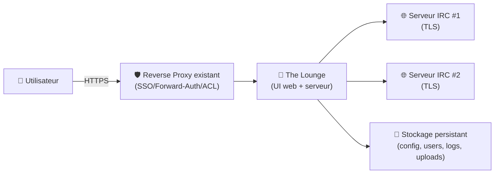
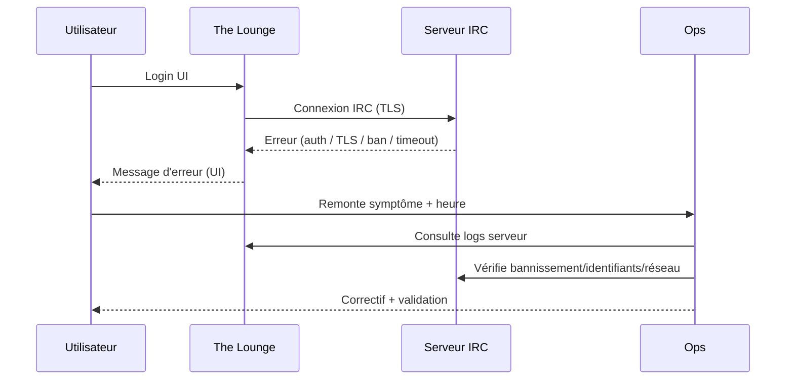

# 💬 The Lounge — Présentation & Configuration Premium (IRC Web Client auto-hébergé)

### Client IRC moderne en web : multi-serveurs, multi-canaux, historique, thèmes, LDAP (option), uploads
Optimisé pour reverse proxy existant • Sécurité & gouvernance • Exploitation durable

---

## TL;DR

- **The Lounge** est un **client IRC web** auto-hébergé (type “web IRC bouncer + UI” côté serveur).
- Valeur : accès IRC depuis navigateur, multi-serveurs, persistance sessions, logs/historique côté serveur, UX moderne.
- “Premium” = **auth/ACL**, **config propre**, **baseUrl/subpath maîtrisé**, **uploads**, **logs exploitables**, **tests + rollback**.

Docs officielles : https://thelounge.chat/docs/

---

## ✅ Checklists

### Pré-usage (avant ouverture aux utilisateurs)
- [ ] Définir le mode d’accès : LAN/VPN/SSO (via proxy) vs accès public très contrôlé
- [ ] Définir la politique d’auth : comptes locaux / LDAP (si besoin)
- [ ] Définir la gouvernance : qui peut créer des réseaux/serveurs, qui peut inviter
- [ ] Définir la stratégie d’uploads (activés ou non, taille max, URL publique)
- [ ] Définir conventions : nommage, salons “officiels”, canaux read-only (si organisation)

### Post-configuration (qualité opérationnelle)
- [ ] Connexion à un serveur IRC test OK (TLS si possible)
- [ ] Reconnexion automatique OK après redémarrage
- [ ] Uploads testés (si activés) + URLs correctement routées derrière le proxy
- [ ] Permissions/roles vérifiés (au minimum : admin vs users)
- [ ] Logs côté serveur exploitables (erreurs, connexions, uploads)

---

> [!TIP]
> The Lounge est idéal pour **équipes** (support, SRE, communautés) qui veulent un point d’entrée web propre à IRC, sans dépendre de clients locaux.

> [!WARNING]
> L’IRC peut exposer des métadonnées (nick, canaux, logs). Pense “données internes” : contrôle d’accès, rétention, et confidentialité.

> [!DANGER]
> Si tu actives `baseUrl` (subpath), tu dois aussi proxy correctement les **URLs d’uploads** ; sinon liens cassés / fuites de chemin.  
> Doc reverse proxy : https://thelounge.chat/docs/guides/reverse-proxies  
> Doc config `baseUrl` : https://thelounge.chat/docs/configuration

---

# 1) Vision moderne

The Lounge n’est pas un simple “webchat”.

C’est :
- 🧠 Un **client IRC** multi-serveurs avec UI web moderne
- 🔁 Une **session persistée** côté serveur (tu retrouves ton contexte)
- 🗂️ Un **hub** pour plusieurs équipes/canaux (si gouverné)
- 🔐 Une brique intégrable à une stratégie d’accès (proxy/SSO, LDAP option)

---

# 2) Architecture globale



---

# 3) Philosophie premium (5 piliers)

1. 🔐 **Accès** (VPN/SSO/ACL) + surface réduite
2. 👥 **Gouvernance** (admin, droits de création, politiques)
3. 🔗 **Reverse proxy propre** (headers, websocket, subpath si besoin)
4. 📎 **Uploads maîtrisés** (taille, chemins, URL publique)
5. 🧪 **Validation & rollback** (tests systématiques après changement)

---

# 4) Configuration clé (ce qui fait la différence)

## 4.1 `baseUrl` (subpath) — à activer seulement si nécessaire
- Si tu exposes via un **sous-dossier** (ex: `https://example.com/irc/`), configure `baseUrl`.
- Sinon, préfère un **sous-domaine** (ex: `irc.example.com`) : plus simple et moins fragile.

Référence :
- `baseUrl` dans la config : https://thelounge.chat/docs/configuration
- Guide reverse proxies (uploads + baseUrl) : https://thelounge.chat/docs/guides/reverse-proxies

## 4.2 WebSocket / Proxy headers (indispensable derrière un proxy)
Objectif : que The Lounge voie :
- le bon schéma (`https`)
- l’IP client réelle (selon ton proxy)
- les upgrades websocket (selon le proxy)

Guide : https://thelounge.chat/docs/guides/reverse-proxies

## 4.3 Uploads (optionnel, mais à traiter comme une surface sensible)
- Si tu actives les uploads : limite taille, et assure-toi que les URLs générées sont routées correctement (surtout avec `baseUrl`).
- Considère une politique interne : uploads autorisés seulement pour certains groupes/canaux.

---

# 5) Gouvernance & exploitation (multi-utilisateurs)

## Modèle simple recommandé
- **Admins** : config serveur, gestion users, politiques
- **Users** : usage IRC, pas de capacités “dangereuses” selon ton contexte

Bon réflexe :
- Documenter : serveurs IRC autorisés, règles TLS, canaux de référence, conventions de nick.

> [!TIP]
> Pour une org : crée un “Livre” interne (dans ton wiki) avec :
> - serveurs autorisés
> - channels officiels
> - règles de sécurité (pas de secrets en clair)
> - procédures incident (flood, takeover, bans)

---

# 6) Workflows premium (incident & support)

## 6.1 Flux “incident de connexion IRC”


## 6.2 Patterns de debug utiles
- `TLS handshake` / `certificate` / `verify`
- `authentication failed`
- `connection timeout`
- `banned` / `k-lined`
- `websocket` / `upgrade`

---

# 7) Validation / Tests / Rollback

## Tests de validation (après changement proxy/config)
```bash
# 1) La page répond
curl -I https://irc.example.com | head

# 2) Vérifier que le HTML se charge
curl -s https://irc.example.com | head -n 30

# 3) Test fonctionnel (manuel)
# - Connexion UI
# - Connexion à un serveur IRC
# - Envoi/réception message dans un canal
# - (si uploads activés) upload d'un fichier + clic sur l'URL
```

## Rollback (rapide et réaliste)
- Revenir à la **dernière config fonctionnelle** (fichier de config / variables)
- Si `baseUrl` vient d’être introduit : revenir à **sous-domaine** (souvent rollback le plus simple)
- Désactiver uploads si c’est la source du problème (temps de stabilisation)

> [!WARNING]
> Conserve une copie versionnée de la config (git privé / sauvegarde datée) : c’est ton rollback “1 minute”.

---

# 8) Sources — Images Docker (format demandé : URLs brutes)

## 8.1 Image officielle la plus citée
- `thelounge/thelounge` (Docker Hub) : https://hub.docker.com/r/thelounge/thelounge/  
- Repo image/packaging (référence GHCR + usage) : https://github.com/thelounge/thelounge-docker  
- Image GHCR (mentionnée dans le repo) : https://ghcr.io/thelounge/thelounge  

## 8.2 Image LinuxServer.io (si tu utilises l’écosystème LSIO)
- Doc LinuxServer The Lounge : https://docs.linuxserver.io/images/docker-thelounge/  
- `linuxserver/thelounge` (Docker Hub) : https://hub.docker.com/r/linuxserver/thelounge  

---

# ✅ Conclusion

The Lounge devient “premium” quand tu le traites comme un **service d’accès** (pas juste une app) :
- contrôle d’accès solide,
- reverse proxy propre (websocket + headers),
- `baseUrl` maîtrisé si subpath,
- uploads gouvernés,
- tests + rollback systématiques.

Docs officielles (config, reverse proxy, guides) :
- https://thelounge.chat/docs/configuration  
- https://thelounge.chat/docs/guides/reverse-proxies  