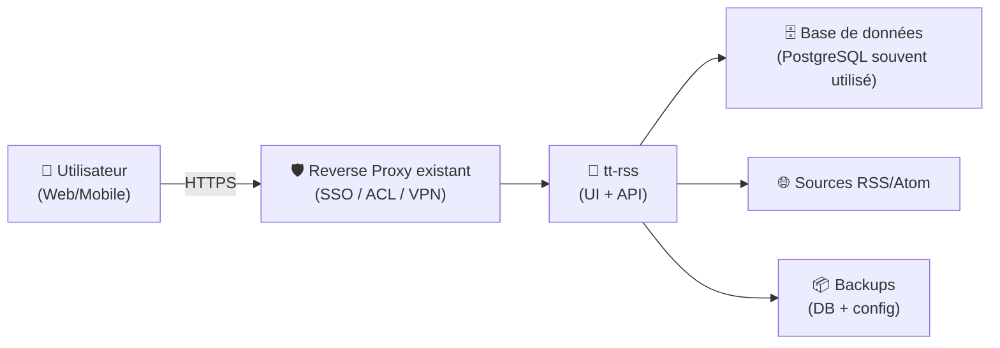
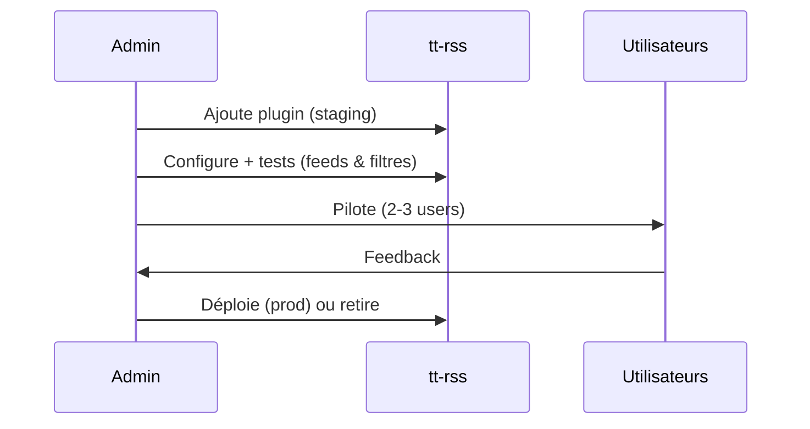

# 📰 Tiny Tiny RSS (tt-rss) — Présentation & Configuration Premium

### Agrégateur RSS/Atom auto-hébergé : contrôle, filtres, flux de travail, extensions
Optimisé pour reverse proxy existant • Multi-utilisateurs • Plugins • API • Exploitation durable

---

## TL;DR

- **tt-rss** = lecteur RSS/Atom web **flexible** et **auto-hébergeable**.
- La valeur “premium” vient de : **organisation**, **filtres**, **tags**, **scores**, **workflows**, **plugins**, **hygiène DB**, **sauvegardes/test/rollback**.
- C’est un outil “knowledge intake” : tu contrôles tes sources, ton tri, ton archivage.

Références projet : https://tt-rss.org/  
Repo : https://github.com/tt-rss/tt-rss

---

## ✅ Checklists

### Pré-configuration (avant d’ajouter 300 feeds)
- [ ] Définir la taxonomie : catégories / tags / labels “à lire plus tard”
- [ ] Définir le workflow : tri → lecture → marquage → archive
- [ ] Définir la politique de rétention : purge / archive / favoris
- [ ] Choisir la stratégie multi-device : web + app mobile compatible
- [ ] Lister les plugins réellement utiles (éviter la surcouche)

### Post-configuration (qualité opérationnelle)
- [ ] Les feeds critiques sont “silencieux” (peu de bruit, bons filtres)
- [ ] Les articles importants sont récupérables en 2 secondes (tags/recherche)
- [ ] Les mises à jour (schema) passent sans stress (procédure)
- [ ] Backups testés + rollback documenté

---

> [!TIP]
> Traite tt-rss comme un **pipeline d’attention** : tu ne lis pas “tout”, tu construis un système qui remonte le bon signal.

> [!WARNING]
> Les filtres mal conçus peuvent supprimer/masquer des contenus utiles. Commence par **tagger** plutôt que **jeter**.

> [!DANGER]
> Les flux RSS peuvent contenir des URLs et du contenu piégé. Applique une hygiène : accès protégé (SSO/VPN), mises à jour régulières, plugins minimaux.

---

# 1) Vision moderne

tt-rss n’est pas juste un “lecteur RSS”.

C’est :
- 🧠 un **moteur de tri** (filtres, scores, tags)
- 🗂️ un **système de classement** (catégories + labels)
- 🔎 une **base de recherche** (dans le temps, par source, par statut)
- 🧩 une **plateforme extensible** (plugins, API)

---

# 2) Architecture globale



---

# 3) Modèle mental premium : “Signal > Volume”

## 3.1 Taxonomie recommandée
- **Catégories** = sources/axes (ex: “Tech”, “Sécurité”, “Produit”, “Veille”)
- **Tags** = intention (ex: `read-later`, `to-share`, `to-test`, `critical`, `paper`)
- **Stars/Favoris** = rare, pour “à conserver”
- **Labels de statut** (si plugin/usage) = `inbox` → `review` → `archive`

## 3.2 Politique de rétention (anti-accumulation)
- Inbox = court terme
- Archive = moyen terme
- Favoris = long terme
- Purge automatique = uniquement pour sources “bruit”

> [!TIP]
> La meilleure config = celle où tu peux **arrêter de scroller** et revenir demain sans stress.

---

# 4) Filtres & règles (la partie “pro”)

## 4.1 Patterns utiles (exemples de stratégie)
Objectif : **tagger** et **prioriser**, pas supprimer.

- Si source = “security advisories” → tag `critical`
- Si titre contient `CVE-|RCE|0day|remote` → tag `urgent` + étoile
- Si source = “blogs généralistes” → tag `read-later`
- Si mot-clé = ton stack (ex: `traefik`, `postgres`, `kubernetes`) → tag `stack`

## 4.2 Workflow “inbox zero”
- Tout arrive dans “All articles”
- Les filtres posent des tags
- Tu lis par tag :
  - `urgent` (d’abord)
  - `stack`
  - `read-later`
- Tu archives en masse (ou marque lu) après tri

---

# 5) Plugins (minimalisme intelligent)

tt-rss est extensible : vise **peu de plugins**, mais bien choisis.

## 5.1 Règles de sélection
- ✅ plugin maintenu / compatible
- ✅ utile quotidiennement
- ✅ apporte une fonction non native (auth, UX, intégration)
- ❌ éviter les plugins “gadget” ou non maintenus

## 5.2 Séquence premium : plugin lifecycle


---

# 6) Comptes, modes & accès (sans recettes proxy)

## 6.1 Multi-utilisateurs vs Single-user
- **Single-user** : très simple, perso, faible friction
- **Multi-user** : équipes, doc partagée de veille, permissions/logique de séparation

## 6.2 Bonnes pratiques d’accès
- Accès derrière reverse proxy existant (SSO/ACL)
- Limiter l’exposition publique si possible (VPN/ACL)
- Mots de passe solides + rotation
- Réduire le nombre de comptes admin

---

# 7) Performance & hygiène (ce qui évite les “ça rame”)

## 7.1 Indicateurs simples
- Nombre total d’articles
- Taille DB
- Latence UI (all articles)
- Temps de mise à jour des feeds
- Erreurs d’update / schema

## 7.2 Leviers
- Rétention/purge raisonnable sur les sources bruit
- Réduire la fréquence des sources non critiques
- Désactiver plugins inutiles
- Maintenir DB propre (vacuum/maintenance selon moteur)

---

# 8) Validation / Tests / Rollback

## 8.1 Smoke tests (fonctionnels)
```bash
# Vérifier que l'URL répond (depuis ton réseau)
curl -I https://ttrss.example.tld | head

# Vérifier l'auth (manuel) : login, ouverture d'un flux, lecture d'un article

# Test "ingestion" : ajouter un feed test, vérifier qu'il se met à jour
```

## 8.2 Tests de non-régression (après changement)
- Les tags automatiques s’appliquent toujours
- La recherche fonctionne
- Les mises à jour de feeds ne sont pas bloquées
- Les articles s’ouvrent sur desktop + mobile

## 8.3 Rollback (principe)
- Revenir au dernier backup DB + config
- Désactiver le dernier plugin ajouté
- Revenir à la version précédente si une mise à jour casse un comportement

> [!TIP]
> Les “rollbacks faciles” viennent d’une règle : **changer une seule chose à la fois** (plugin OU règles OU upgrade).

---

# 9) Erreurs fréquentes (et comment les éviter)

- ❌ Trop de feeds sans tri → bruit, abandon
  - ✅ Solution : tags + filtres + rétention
- ❌ Plugins en pagaille → instabilité
  - ✅ Solution : minimalisme + staging
- ❌ Pas de tests mobile
  - ✅ Solution : valider un client mobile (API/compat) + workflow lecture
- ❌ DB qui grossit sans contrôle
  - ✅ Solution : purge sur sources bruit + maintenance

---

# 10) Sources — Images Docker (format “URLs brutes” comme demandé)

## 10.1 Images “recommandées” par le projet (maintainer)
- `supahgreg/tt-rss` (Docker Hub) : https://hub.docker.com/r/supahgreg/tt-rss/  
- `supahgreg/tt-rss-web-nginx` (Docker Hub) : https://hub.docker.com/r/supahgreg/tt-rss-web-nginx/  
- Guide d’installation du projet (liste Docker Hub + GHCR) : https://github.com/tt-rss/tt-rss/wiki/Installation-Guide  
- `ghcr.io/tt-rss/tt-rss` (GitHub Container Registry) : https://github.com/orgs/tt-rss/packages/container/package/tt-rss  
- `ghcr.io/tt-rss/tt-rss-web-nginx` (GitHub Container Registry) : https://github.com/orgs/tt-rss/packages/container/package/tt-rss-web-nginx  

## 10.2 Images communautaires très citées (historique)
- `cthulhoo/ttrss-fpm-pgsql-static` (Docker Hub) : https://hub.docker.com/r/cthulhoo/ttrss-fpm-pgsql-static  
- Discussion “migration” (cthulhoo → supahgreg) : https://github.com/tt-rss/tt-rss/discussions/5  

## 10.3 LinuxServer.io (statut historique / archivé)
- Repo archivé LSIO : https://github.com/linuxserver-archive/docker-tt-rss  
- Fil “request / contexte” (LSIO) : https://discourse.linuxserver.io/t/request-ttrss-tiny-tiny-rss/1142  

---

# ✅ Conclusion

tt-rss devient “premium” quand tu le conçois comme un **système de tri** :
- taxonomie claire,
- filtres qui priorisent,
- plugins minimaux,
- hygiène et tests,
- rollback facile.

Résultat : moins de bruit, plus de signal, et une veille qui tient dans le temps.