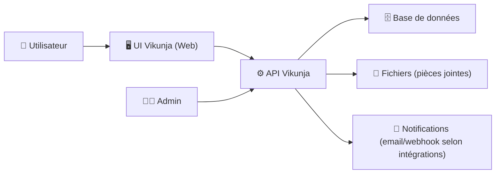
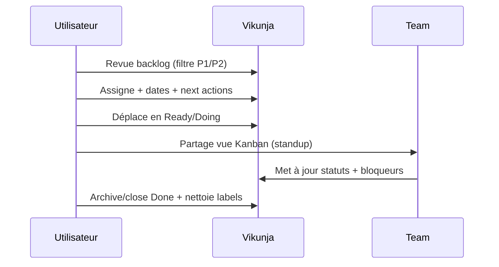

# ✅ Vikunja — Présentation & Exploitation Premium (Sans installation)

### Gestion de tâches “pro” : projets, vues, droits, partage, API — avec une approche durable
Optimisé pour reverse proxy existant • Gouvernance & permissions • Templates de workflow • Exploitation durable

---

## TL;DR

- **Vikunja** est une plateforme de gestion de tâches open-source (alternative moderne à Todoist/Wunderlist) avec **projets, listes, tâches**, vues (kanban, table…), **collaboration** et **API**.
- Une mise en place “premium” repose sur :
  - 🧭 une **structure** (espaces/projets) cohérente
  - 🔐 une **gouvernance** (rôles, partage, invitations) propre
  - 🧠 des **conventions** (naming, labels, priorités, templates)
  - 🧪 des **tests** (validation, rollback) + routine d’exploitation

Docs & projet : https://vikunja.io/docs/  
Repo : https://github.com/go-vikunja/vikunja

---

## ✅ Checklists

### Pré-usage (avant d’onboard une équipe)
- [ ] Définir la taxonomie : “Espaces / Projets / Listes” + conventions de nommage
- [ ] Définir le modèle de permissions (qui peut voir/éditer/partager)
- [ ] Fixer les règles de tri (priorités, dates, tags, vues)
- [ ] Décider : comptes locaux vs SSO (si applicable dans ton infra)
- [ ] Écrire 3 templates : Onboarding / Runbook / Roadmap

### Post-configuration (qualité)
- [ ] Un nouvel utilisateur comprend où ranger une tâche en 30 secondes
- [ ] Les partages sont maîtrisés (pas de “tout le monde admin”)
- [ ] Les vues “Kanban” et “Backlog” sont standardisées
- [ ] Les exports/backups (au moins DB) sont testés + restaurables
- [ ] Une routine hebdo existe : nettoyage + revue + archivage

---

> [!TIP]
> La plus grosse valeur de Vikunja n’est pas “ajouter des tâches”, mais **maintenir un système de priorisation** : vues + conventions + revues.

> [!WARNING]
> Sans conventions (noms, tags, dates), tu obtiens un “cimetière à tâches”. Standardise tôt.

> [!DANGER]
> Les permissions et partages peuvent devenir incontrôlables si tu laisses les utilisateurs “partager à la volée” sans modèle. Définis un cadre.

---

# 1) Vikunja — Vision moderne

Vikunja n’est pas juste une todo-list.

C’est :
- 🧩 un **système de projets** (roadmaps, produits, ops)
- 🧭 des **vues de pilotage** (kanban, liste, table, filtres)
- 🔐 une **collaboration** (partage, équipes, permissions)
- 🤖 une **plateforme intégrable** via **API**

À quoi ça sert vraiment :
- 📌 Roadmap produit
- 🧰 Runbooks / tâches d’exploitation
- 🧑‍💻 Backlog dev
- 🏢 Gestion d’équipe (rituels, actions, OKR)

---

# 2) Architecture globale (conceptuelle)

Docs (concept & configuration) : https://vikunja.io/docs/  
Repo : https://github.com/go-vikunja/vikunja

---

# 3) Modèle de données (ce qu’il faut comprendre pour bien structurer)

## Objets typiques
- **Projets / Listes** : “conteneurs” de tâches (selon ton modèle)
- **Tâches** : titres, descriptions, échéances, priorités
- **Labels** : classification transversale (ex: `Bug`, `Urgent`, `Client`)
- **Assignees** : qui fait
- **Due date / reminders** : quand
- **Relations** (selon usage) : dépendances / liens

> [!TIP]
> Utilise les **labels** pour ce qui traverse les projets (ex: `Security`, `Ops`, `Customer`), et la **structure projet** pour le “où”.

---

# 4) Gouvernance & Permissions (modèle premium simple)

## Stratégie recommandée (3 niveaux)
1) **Admins** : configuration, gestion utilisateurs, règles globales  
2) **Owners de projets** : structure + gestion des membres du projet  
3) **Contributeurs** : création/modif dans leur périmètre  

Bonnes pratiques :
- Crée des projets “socle” (ex: `00-Onboarding`, `00-Templates`)
- Verrouille l’édition de certains projets (templates) si possible
- Centralise les décisions : qui peut inviter/partager ?

> [!WARNING]
> Le partage “à la tâche” peut contourner la gouvernance. Préfère le partage **par projet**.

---

# 5) Conventions premium (ce qui évite le chaos)

## 5.1 Naming de projets
Exemples :
- `PROD — Roadmap`
- `OPS — Runbooks`
- `TEAM — Actions`
- `CLIENT — Support`

## 5.2 Labels standard (starter pack)
- `Urgent`
- `Bug`
- `Debt`
- `Security`
- `Blocked`
- `Waiting`

## 5.3 Priorités (règle simple)
- P1 = aujourd’hui / incident
- P2 = cette semaine
- P3 = ce sprint
- P4 = “un jour”

> [!TIP]
> Une tâche sans **prochaine action** devient du bruit. Encourage des titres “verbe + objet”.

---

# 6) Vues & Workflows (utilisable en équipe)

## 6.1 Kanban premium (minimal)
Colonnes recommandées :
- Backlog
- Ready
- Doing
- Review
- Done

## 6.2 Workflow “mature”
- Toute carte “Doing” doit avoir :
  - un assignee
  - une date (ou une raison explicite “sans date”)
  - des critères de done (checklist)

---

# 7) Automatisations & Intégrations (API mindset)

Pourquoi l’API est clé :
- synchroniser depuis Git (issues → tâches)
- créer automatiquement des tâches récurrentes
- dashboards (read-only) externes
- webhooks vers chat/alerting (si ton écosystème le permet)

Référence API (via docs/projet) :
- https://vikunja.io/docs/
- https://github.com/go-vikunja/vikunja

---

# 8) Séquence “usage premium” (rituel hebdo)

---

# 9) Validation / Tests / Rollback (opérationnel)

## Tests de validation (fonctionnels)
- [ ] Créer un projet “Sandbox”
- [ ] Ajouter 3 tâches + 2 labels + 1 assignee
- [ ] Tester une vue Kanban + un filtre (ex: `label:Urgent`)
- [ ] Partager le projet à un utilisateur test (read vs write)
- [ ] Vérifier pièces jointes (upload + lecture)

## Tests de sécurité (d’accès)
- [ ] Utilisateur “Reader” ne peut pas modifier
- [ ] Utilisateur “Contributor” ne peut pas changer la gouvernance
- [ ] Un projet privé n’apparaît pas en recherche globale (selon réglages)

## Rollback (principe)
- Revenir à un état sain = **restaurer DB + fichiers** (pièces jointes) depuis une sauvegarde connue
- Toujours tester une restauration sur un environnement de test avant de “compter” dessus

> [!DANGER]
> Un backup non testé = une hypothèse. Documente **la restauration**, pas seulement la sauvegarde.

---

# 10) Sources — Images Docker (comme demandé)

## 10.1 Image officielle la plus citée
- `vikunja/vikunja` (Docker Hub) : https://hub.docker.com/r/vikunja/vikunja  
- Doc “Installing” (section Docker) : https://vikunja.io/docs/installing/  
- Doc “Docker Walkthrough” : https://vikunja.io/docs/docker-walkthrough/  
- Repo (référence projet) : https://github.com/go-vikunja/vikunja  

## 10.2 Profil Docker Hub (éditeur)
- Organisation `vikunja` (Docker Hub) : https://hub.docker.com/u/vikunja  

## 10.3 LinuxServer.io (si image existe)
- Liste des images LinuxServer.io : https://www.linuxserver.io/our-images  
- (À vérifier dans ta stack : il n’y a pas d’image LSIO “vikunja” référencée dans la liste au moment de cette rédaction.)

---

# ✅ Conclusion

Vikunja devient vraiment “premium” quand tu le traites comme un **système de pilotage** :
- structure claire (projets),
- conventions simples (labels/priorités),
- gouvernance (partage maîtrisé),
- rituels (revue hebdo),
- et une exploitation sérieuse (tests + rollback).

Docs : https://vikunja.io/docs/