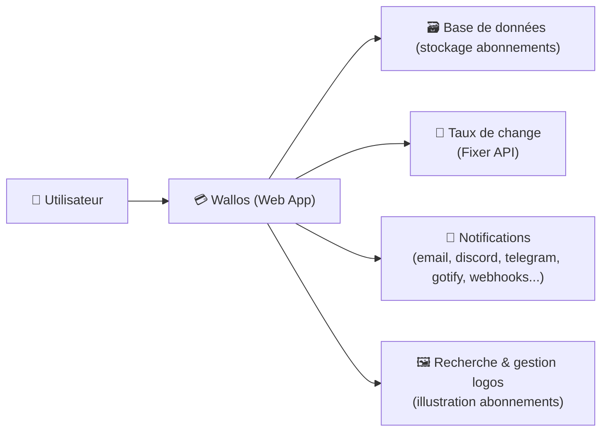
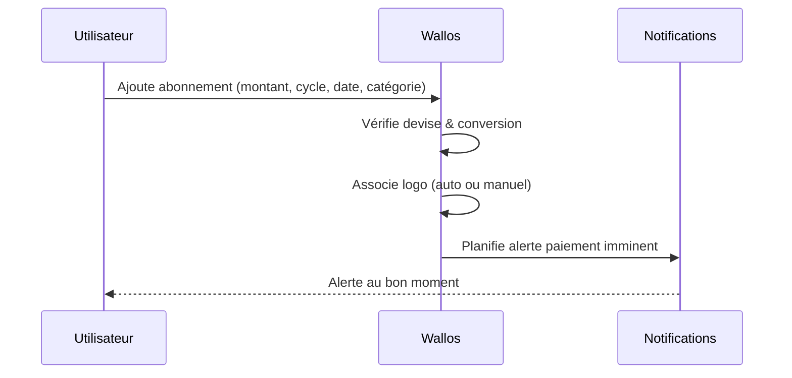

# 💳 Wallos — Présentation & Configuration Premium (Subscription Tracker)

### Suivi intelligent des abonnements : dépenses récurrentes, multi-devises, alertes, stats
Optimisé pour reverse proxy existant • OIDC possible • Notifications multi-canaux • Exploitation durable

---

## TL;DR

- **Wallos** te permet de **centraliser tes abonnements** (mensuels/annuels), de visualiser tes dépenses et d’anticiper les prélèvements.
- Force “premium” : **catégories propres**, **multi-devises + conversion**, **notifications fiables**, **gouvernance multi-membres**, **OIDC** si besoin.
- Objectif : une “source de vérité” de tes coûts récurrents + des alertes actionnables.

---

## ✅ Checklists

### Pré-configuration (avant d’onboarder des gens)
- [ ] Définir la **devise principale** + la politique multi-devises
- [ ] Définir une **taxonomie catégories** (simple, stable)
- [ ] Choisir le mode d’accès : compte(s) locaux vs **OIDC**
- [ ] Choisir le canal de notification : email / Discord / Telegram / Gotify / Webhook…
- [ ] Définir une convention pour les abonnements : nom, cycle, montant, date de paiement, tags

### Post-configuration (qualité opérationnelle)
- [ ] Une nouvelle subscription se crée en < 30s (process clair)
- [ ] Les alertes “paiement imminent” sont correctes (dates + fuseau)
- [ ] Les conversions de devise sont cohérentes (source + fréquence)
- [ ] Les stats donnent une lecture “mensuelle” fiable
- [ ] La gouvernance (membres / household) est comprise et utilisée

---

> [!TIP]
> Wallos est le plus utile quand tu le traites comme un **outil de pilotage** : “combien je dépense chaque mois, où, et comment réduire”.

> [!WARNING]
> Les données peuvent être sensibles (dépenses, habitudes, services). Limite l’accès et évite de publier l’instance.

> [!DANGER]
> Si la **taxonomie** (catégories / cycles / devises) change toutes les semaines, tes stats deviennent inutiles. Stabilise les conventions tôt.

---

# 1) Wallos — Vision moderne

Wallos n’est pas un tableur amélioré.

C’est :
- 📌 Un **registre** d’abonnements (montants, cycles, dates)
- 🔔 Un **système d’alertes** (paiements à venir, annulations, échéances)
- 🌍 Un **outil multi-devises** (conversion vers une devise de référence)
- 📊 Un **dashboard** (stats, tendances, lecture mensuelle)
- 👥 Une gestion “foyer/équipe” (membres, partage)

Références officielles :
- Projet : https://github.com/ellite/Wallos
- Landing page : https://wallosapp.com/
- Demo : https://demo.wallosapp.com/

---

# 2) Architecture globale



---

# 3) Philosophie Premium (5 piliers)

1. 🧭 **Conventions stables** (noms, cycles, catégories)
2. 🌍 **Multi-devises maîtrisé** (devise de référence + conversion)
3. 🔔 **Alertes actionnables** (bon timing, bon canal, bon contenu)
4. 👥 **Gouvernance** (membres/foyer, droits, séparation logique)
5. 🧪 **Validation & rollback** (tester les alertes et la cohérence des stats)

---

# 4) Modèle de données “propre” (ce qui rend les stats fiables)

## Conventions recommandées
- **Nom** : `Service — Plan` (ex: `Netflix — Standard`, `AWS — Lightsail`)
- **Cycle** : mensuel / annuel / custom (éviter “à la main”)
- **Date de paiement** : date réelle du prélèvement
- **Montant** : toujours TTC si c’est ton usage
- **Catégorie** : simple (10–20 max au départ)
- **Tags (si tu en utilises)** : `pro/perso`, `must-have/nice-to-have`, `famille`

## Catégories (taxonomie premium)
- Divertissement
- Productivité
- Cloud/Infra
- Télécom
- Maison
- Santé
- Transport
- Éducation
- Jeux
- Autres

> [!TIP]
> Le “bon” nombre de catégories, c’est celui qui te permet de décider : **où couper** et **où optimiser**.

---

# 5) Multi-devises & Conversion (sans surprises)

Wallos supporte :
- multi-devises
- conversion vers une devise principale via **Fixer API**

Recommandations :
- Choisir **1 devise de référence** (ex: EUR)
- Définir une cadence de mise à jour (ex: quotidienne)
- Éviter de changer la devise principale trop souvent (sinon comparaisons biaisées)

Référence (feature) : https://github.com/ellite/Wallos

---

# 6) Notifications (le cœur “automatisation”)

Wallos supporte plusieurs canaux (selon configuration) :
- email
- Discord
- Pushover
- Telegram
- Gotify
- webhooks

Recommandations premium :
- Un canal “fiable” (Gotify/Telegram) + un canal “backup” (email)
- Un message standard :
  - service
  - montant + devise
  - date de prélèvement
  - lien direct vers l’abonnement

> [!WARNING]
> Trop de notifications = tu ignores tout. Commence par “paiement imminent”, puis ajoute le reste.

---

# 7) OIDC (SSO) — quand tu veux un accès “entreprise”

Wallos mentionne un support **OIDC / OAuth**.
À viser si :
- tu veux centraliser l’identité (SSO)
- tu veux gérer l’accès via ton IdP (groupes, policies)
- tu veux éviter les comptes locaux multiples

Référence (section OIDC) : https://github.com/ellite/Wallos

---

# 8) Workflows premium (ce qui fait gagner du temps)

## 8.1 Onboarding d’un nouvel abonnement (process 30s)


## 8.2 “Audit mensuel” (réduction des coûts)
- Trier par montant décroissant
- Marquer `nice-to-have`
- Identifier les services doublons
- Décider : supprimer / downgrader / annualiser

---

# 9) Validation / Tests / Rollback

## Tests de validation (fonctionnels)
- Créer 3 abonnements de test :
  - mensuel EUR
  - annuel EUR
  - mensuel USD (conversion)
- Vérifier :
  - affichage “mensuel équivalent”
  - stats par catégorie
  - prochaine date de paiement correcte

## Tests notifications (pragmatiques)
- Mettre un abonnement “test” avec paiement demain
- Déclencher l’envoi (ou attendre le job planifié)
- Vérifier contenu + canal + absence de doublons

## Smoke tests (réseau / HTTP)
```bash
# Page répond (exemple)
curl -I https://wallos.example.tld | head

# Vérifier que la page contient un marqueur attendu (selon ton thème)
curl -s https://wallos.example.tld | head -n 20
```

## Rollback (logique applicative)
- Si une config casse les alertes ou la conversion :
  - revenir aux paramètres précédents (devise principale, API key, canaux)
  - désactiver temporairement les notifications
  - restaurer un export/backup applicatif si tu en as un (selon ton système)

> [!TIP]
> Le “rollback” le plus utile ici : revenir à une configuration simple (1 devise, 1 canal notif) puis réactiver progressivement.

---

# 10) Sources — Images Docker (format URLs brutes)

## 10.1 Image officielle (GHCR) la plus “upstream”
- `ghcr.io/ellite/wallos` (GitHub Container Registry / Packages) : https://github.com/users/ellite/packages/container/wallos  
- Repo officiel Wallos (référence upstream) : https://github.com/ellite/Wallos  
- Releases (versions applicatives) : https://github.com/ellite/Wallos/releases  

## 10.2 Image communautaire très citée (Docker Hub)
- `bellamy/wallos` (Docker Hub) : https://hub.docker.com/r/bellamy/wallos  
- Tags `bellamy/wallos` (versions disponibles) : https://hub.docker.com/r/bellamy/wallos/tags  
- Repo officiel Wallos (contexte & doc) : https://github.com/ellite/Wallos  

## 10.3 LinuxServer.io (LSIO)
- Liste officielle des images LSIO (Wallos non listé à date) : https://www.linuxserver.io/our-images  

---

# ✅ Conclusion

Wallos devient vraiment “premium” quand tu verrouilles :
- une taxonomie stable (catégories/cycles)
- une stratégie multi-devises cohérente
- des notifications utiles (pas bruyantes)
- une gouvernance claire (membres/foyer)
- des tests simples mais réguliers (dates, conversions, alertes)