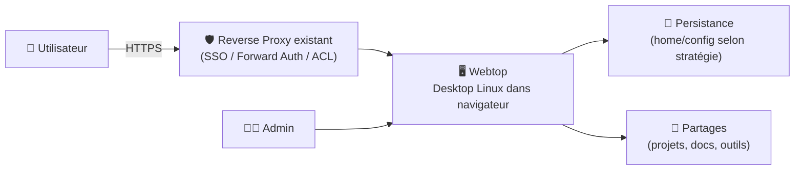

# 🖥️ Webtop (LinuxServer.io) — Présentation & Usage Premium (Desktop Linux dans le navigateur)

### Un bureau complet (XFCE/KDE/i3/MATE…) accessible via navigateur, pensé pour l’exploitation
Optimisé pour reverse proxy existant • Multi-flavors • Sessions outillées • Debug & support • Exploitation durable

---

## TL;DR

- **Webtop** fournit un **desktop Linux complet** dans le navigateur (plusieurs “flavors” : Ubuntu/KDE, Ubuntu/XFCE, Fedora/i3, Arch, etc.).
- Valeur : **poste de travail éphémère**, **boîte à outils admin**, **support utilisateur**, **bastion GUI**, **apps Linux** sans installer localement.
- Version “premium” : **séparation des usages**, **persistance maîtrisée**, **conventions**, **contrôle d’accès**, **tests** + **rollback**.

---

## ✅ Checklists

### Pré-usage (avant mise à dispo)
- [ ] Cas d’usage défini (support, toolbox ops, bureautique, dev, bastion)
- [ ] Flavor choisie (XFCE léger / KDE riche / i3 minimal / distro spécifique)
- [ ] Stratégie persistance (home/config) + politique “ce qui doit survivre”
- [ ] Stratégie d’accès (SSO/forward-auth/VPN) via reverse proxy existant
- [ ] Conventions (naming, utilisateurs, répertoires, mounts, droits)
- [ ] Politique “données sensibles” (clipboard, téléchargements, secrets)

### Post-configuration (qualité ops)
- [ ] Une session “standard” démarre en < 10s (selon infra)
- [ ] Persistance vérifiée (ce qui doit rester reste, le reste est jetable)
- [ ] Isolation confirmée (pas de fuite entre usages/équipes)
- [ ] Journaux utiles accessibles (app/webtop) + procédure de triage
- [ ] Runbook “Validation / Rollback” présent et testé

---

> [!TIP]
> Le meilleur usage de Webtop : **un environnement GUI outillé** “juste quand il faut”, sans gérer un parc de postes.

> [!WARNING]
> Webtop peut devenir un “poste permanent” si tu laisses tout persister. Décide explicitement ce qui est **jetable** vs **durable**.

> [!DANGER]
> Ne sous-estime pas la sensibilité : téléchargements, clipboard, cookies, tokens, sessions… Webtop doit être traité comme un **accès privilégié**.

---

# 1) Webtop — Vision moderne

Webtop n’est pas “un VNC dans un container”.

C’est :
- 🧰 Un **poste de travail** à la demande (GUI) pour outils Linux
- 🧑‍💻 Un **bastion graphique** (quand SSH ne suffit pas)
- 🧪 Un **environnement de test** (navigateur, clients, UI)
- 🛟 Un **outil support** (reproduire, guider, dépanner)

Idéal pour :
- “J’ai besoin de Firefox + outils + accès réseau interne”
- “Je dois lancer un client GUI (RDP, SFTP, DB GUI, etc.)”
- “Je veux un environnement standardisé pour une équipe”

---

# 2) Architecture globale



---

# 3) “Premium config mindset” (5 piliers)

1. 🔐 **Accès contrôlé** (SSO/VPN/ACL via reverse proxy existant)
2. 🧱 **Séparation des usages** (support vs ops vs dev) = instances/paramètres distincts
3. 💾 **Persistance maîtrisée** (home durable, cache/telechargements jetables)
4. 🧭 **Ergonomie & conventions** (dossiers, bookmarks, outils, policies)
5. 🧪 **Validation / Rollback** (tests simples, retour arrière clair)

---

# 4) Choisir la “flavor” (sans te tromper)

Webtop propose des variantes orientées usage :
- **XFCE** : léger, rapide, “toolbox” ops/support
- **KDE Plasma** : complet, confortable pour usage bureautique/GUI riche
- **i3** : minimaliste, performance, power users
- Distros variées (Ubuntu, Alpine, Fedora, Arch) selon besoins applicatifs

> [!TIP]
> Pour un “poste outillé” stable : Ubuntu (compat) + XFCE (légèreté) est souvent le meilleur départ.

---

# 5) Persistance & données (là où se gagne la propreté)

## 5.1 Stratégie recommandée : “durable + jetable”
- Durable :
  - configs applicatives utiles (bookmarks, profils outils)
  - scripts, snippets, templates
- Jetable :
  - dossiers temporaires
  - caches navigateur
  - téléchargements par défaut (sauf besoin)

## 5.2 Convention dossiers (exemple premium)
- `~/work` : projets (peut pointer vers un partage)
- `~/drop` : zone jetable (purge régulière)
- `~/secrets` : **à éviter** (privilégier vault/SSO) — ou chiffrer

> [!WARNING]
> Si tu permets la persistance des cookies de navigateur, tu permets aussi la persistance des sessions.

---

# 6) Workflows premium (support / ops / dev)

## 6.1 Support guidé
- Instance “Support” :
  - bookmarks préconfigurés (portails internes, monitoring, tickets)
  - outils légers (navigateur, viewer logs, clients)
  - pas de persistance sensible

## 6.2 Toolbox Ops
- Instance “Ops” :
  - outils réseau (curl, dig, nc), clients (SSH, DB, SFTP)
  - dossiers `~/runbooks` + `~/snippets`
  - accès strict (SSO + MFA)

## 6.3 Dev UI / QA
- Instance “QA” :
  - navigateurs multiples / profils
  - outils tests (postman-like, etc.)
  - accès environnements staging

---

# 7) Validation / Tests / Rollback

## Smoke tests (réseau + service)
```bash
# 1) Vérifier que l'URL répond (adaptation selon ton domaine)
curl -I https://webtop.example.tld | head

# 2) Vérifier que la page renvoie du contenu HTML
curl -s https://webtop.example.tld | head -n 20
```

## Tests fonctionnels (manuel, rapide)
- Connexion via reverse proxy existant
- Lancement navigateur + un outil (ex: terminal)
- Vérification persistance (créer un fichier “durable”, redémarrer, vérifier)
- Vérification isolation (un user/équipe ne voit pas les ressources d’une autre)

## Rollback (simple)
- Revenir au tag image précédent (si tu pin les versions)
- Restaurer la config persistée (si tu versionnes/backup)
- Désactiver temporairement l’accès externe (ACL côté reverse proxy)

> [!TIP]
> “Rollback rapide” = pin des tags + backup du volume config + checklist de tests 2 minutes.

---

# 8) Limitations & bonnes attentes

- Ce n’est pas un VDI complet (gestion de flotte, policies enterprise, etc.)
- La performance dépend :
  - CPU/RAM de l’hôte
  - codec/streaming
  - latence réseau
  - choix de flavor (XFCE vs KDE)

---

# 9) Sources — Images Docker (format demandé : URLs brutes)

## 9.1 Image LinuxServer.io (référence principale)
- `lscr.io/linuxserver/webtop` (Registry LSIO) : https://lscr.io/linuxserver/webtop  
- `linuxserver/webtop` (Docker Hub) : https://hub.docker.com/r/linuxserver/webtop  
- Tags (Docker Hub) : https://hub.docker.com/r/linuxserver/webtop/tags  
- Doc officielle LSIO “Webtop” : https://docs.linuxserver.io/images/docker-webtop/  
- Repo GitHub (packaging / build) : https://github.com/linuxserver/docker-webtop  

## 9.2 Références complémentaires (officiel)
- Documentation générale LinuxServer.io : https://docs.linuxserver.io/  
- Catalogue des images LSIO : https://www.linuxserver.io/our-images  
- Releases du repo : https://github.com/linuxserver/docker-webtop/releases  
- Packages (GHCR / packages) : https://github.com/linuxserver/docker-webtop/packages  

---

# ✅ Conclusion

Webtop est un **desktop Linux “as-a-service”** dans le navigateur.

Version premium = accès contrôlé + séparation des usages + persistance maîtrisée + conventions + tests + rollback.  
Résultat : un outil support/ops/dev **standardisé**, simple à maintenir, et exploitable au quotidien.