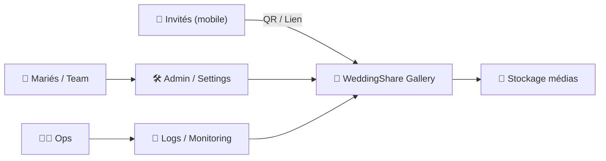
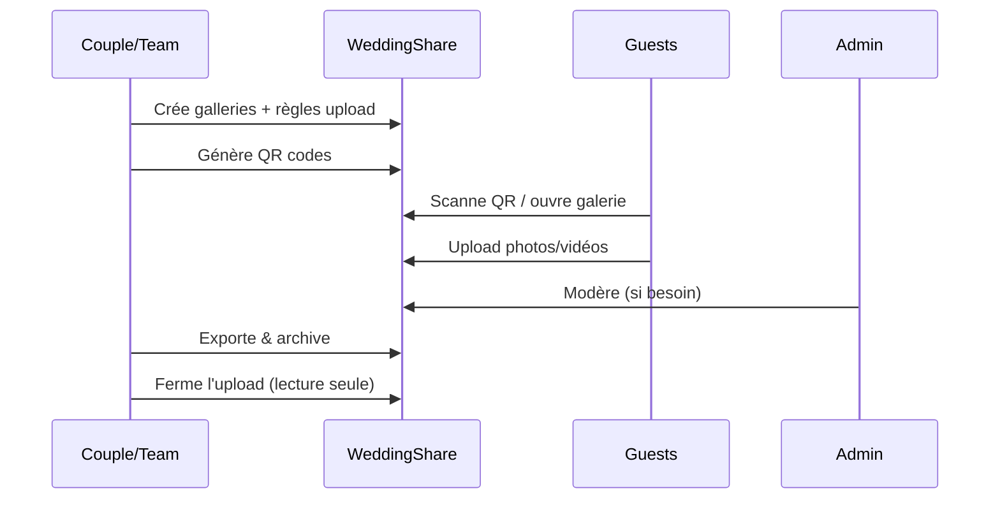

# 💍 WeddingShare — Présentation & Configuration Premium (Partage photo via QR Code)

### Galerie simple pour invités : voir + déposer des photos, sans friction
Optimisé pour reverse proxy existant • Galleries par événement • QR Codes • Modération légère • Exploitation durable

---

## TL;DR

- **WeddingShare** permet à tes invités de **voir** et **uploader** des photos/vidéos via une **galerie** accessible par **lien** ou **QR code**.
- La version “premium” repose sur : **galleries bien conçues**, **droits/accès maîtrisés**, **règles d’upload**, **modération**, **sauvegardes**, **tests** et **plan de rollback**.
- Objectif : **collecter les souvenirs** sans que les invités installent une app ni créent un compte (selon ton choix).

Docs officielles : https://docs.wedding-share.org/

---

## ✅ Checklists

### Pré-événement (avant de partager aux invités)
- [ ] Créer la/les **galleries** (ex: “Avant le mariage”, “Jour J”, “Soirée”)
- [ ] Définir le modèle d’accès : **public via lien** / **code** / **auth**
- [ ] Régler les limites : taille max fichier, types autorisés, nombre max par upload
- [ ] Activer une **stratégie anti-bêtises** : modération / validation / suppression
- [ ] Générer les **QR codes** + tester sur iOS/Android (caméra native)
- [ ] Écrire une mini consigne invité (2 lignes) + pictos

### Pendant l’événement (mode “ops”)
- [ ] Vérifier que l’upload fonctionne sur réseau réel (4G/Wi-Fi)
- [ ] Surveiller la volumétrie (stockage) + erreurs (logs)
- [ ] Modérer si nécessaire (doublons, contenus indésirables)
- [ ] Avoir un “Plan B” : album partagé alternatif si incident (option)

### Post-événement (consolidation)
- [ ] Export / archivage des médias (local + offsite)
- [ ] Nettoyage : doublons, fichiers corrompus, renommage si besoin
- [ ] Verrouiller la galerie (lecture seule) ou fermer l’upload
- [ ] Documenter “ce qui a marché / à améliorer” pour un prochain événement

---

> [!TIP]
> Le meilleur usage : **1 QR code par table** + un texte ultra simple :
> “Scanne, ajoute tes photos, merci ❤️”.

> [!WARNING]
> Si la galerie est “ouverte via lien”, considère que le lien peut circuler.
> Mets des limites (taille/types) et une modération minimale.

> [!DANGER]
> Photos = données personnelles. Si tu héberges publiquement, pense : contrôle d’accès, durée de conservation, et qui peut supprimer.

---

# 1) WeddingShare — Vision moderne

WeddingShare n’est pas un réseau social.

C’est :
- 📸 Une **boîte de dépôt** (uploads invités)
- 🖼️ Une **galerie** (consultation simple)
- 🔗 Un **partage sans friction** (QR code)
- 🧰 Un outil “événement” (pré → jour J → post)

Repo : https://github.com/Cirx08/WeddingShare

---

# 2) Architecture globale



---

# 3) Philosophie premium (5 piliers)

1. 🔒 **Accès maîtrisé** (qui peut voir / qui peut déposer)
2. 🧭 **Expérience invité** (ultra simple, QR + 2 actions)
3. 🧱 **Règles d’upload** (taille, formats, quotas)
4. 🧹 **Modération & hygiène** (suppression, signalement, tri)
5. ♻️ **Exploitation** (sauvegardes, tests, rollback)

---

# 4) Modèle “Galleries” (design qui évite le chaos)

## Patterns recommandés
- **1 seule galerie** si petit événement
- **3 galleries** si tu veux du tri naturel :
  - “Avant le mariage” (préparatifs)
  - “Jour J” (cérémonie)
  - “Soirée” (party)

## Nommage premium
- Court, lisible, sans emojis excessifs côté URL :
  - `jour-j`
  - `ceremonie`
  - `soiree`

> [!TIP]
> Plus tu segmentes, plus tu facilites la navigation… mais évite d’en faire 12.

---

# 5) QR Codes (le vrai “hack” d’adoption)

WeddingShare met en avant le partage via QR code (tables, faire-part, panneaux).

Bonnes pratiques :
- Contraste élevé (noir/blanc), marges suffisantes
- Ajoute sous le QR : l’URL en clair (fallback)
- Test réel : caméra iPhone + Android (pas juste un scanner app)

Docs (easy to share / QR) : https://docs.wedding-share.org/

---

# 6) Accès & Contrôle (choisir ton niveau de friction)

## Option A — “Ouvert via lien” (zéro friction)
✅ adoption maximale  
⚠️ nécessite limites + modération

## Option B — “Lien + code / secret”
✅ bon compromis  
✅ réduit les partages accidentels

## Option C — “Authentifié”
✅ contrôle maximal  
❌ friction (les invités détestent créer des comptes)

> [!WARNING]
> Dans l’événementiel, la friction tue l’usage. Si tu authentifies, fais-le simple (ex: code unique imprimé).

---

# 7) Règles d’upload (qualité + sécurité)

## Paramètres à fixer (stratégie premium)
- Taille max par fichier (évite les vidéos énormes)
- Types autorisés (ex: images + mp4)
- Nombre max par upload (évite le spam)
- Comportement en cas d’erreur (message clair, retry simple)

## Politique recommandée (équilibrée)
- Images : OK
- Vidéos : OK mais limitées (taille/durée)
- Interdire : archives, exécutables, formats “bizarres”

> [!TIP]
> Si tu veux de la qualité : encourage les invités à uploader le lendemain en Wi-Fi (panneau discret).

---

# 8) Modération & Hygiène (éviter le “dump” ingérable)

## Minimal viable moderation
- Suppression admin
- Tri par date
- Repérer doublons / flous / uploads accidentels

## Workflow “safe”
- Pendant l’événement : modération légère (seulement si nécessaire)
- Après : nettoyage + export + archivage, puis fermeture upload

---

# 9) Workflows premium (avant / pendant / après)



---

# 10) Validation / Tests / Rollback (propre)

## 10.1 Tests fonctionnels (avant impression des QR)
```bash
# Test d’accès (URL)
curl -I https://TON_DOMAINE_GALERIE | head

# Test upload (manuel recommandé)
# - iPhone Safari + caméra native
# - Android Chrome + caméra native
# Vérifier: upload OK, affichage OK, performance OK
```

Checklist de validation :
- [ ] QR → ouvre bien la bonne galerie
- [ ] Upload photo < limite : OK
- [ ] Upload vidéo (si autorisée) : OK
- [ ] Galerie affiche vite (réseau 4G moyen)
- [ ] Admin peut supprimer un média test

## 10.2 Rollback (scénarios réalistes)
- Si upload en panne : basculer temporairement en **lecture seule** + “plan B”
- Si spam : restreindre l’accès (code/secret) + purge
- Si config cassée : revenir à une configuration précédente (backup config/DB si utilisé)

> [!TIP]
> Le rollback le plus utile le jour J : **désactiver l’upload** temporairement plutôt que “bricoler” en prod.

---

# 11) Erreurs fréquentes (et fixes)

- ❌ QR imprimé trop petit / mauvais contraste  
  ✅ augmenter taille, marges, tester sur plusieurs téléphones

- ❌ Trop de friction (“crée un compte”)  
  ✅ préférer lien/code simple

- ❌ Upload de vidéos énormes → stockage saturé  
  ✅ plafonds stricts + post-upload en Wi-Fi

- ❌ Galerie unique trop chargée  
  ✅ 2–3 galleries thématiques

---

# 12) Sources — Images Docker (format URLs brutes)

## 12.1 Image communautaire la plus citée
- `cirx08/wedding_share` (Docker Hub) : https://hub.docker.com/r/cirx08/wedding_share  
- Repo (référence projet) : https://github.com/Cirx08/WeddingShare  
- Documentation officielle (liens GitHub + DockerHub) : https://docs.wedding-share.org/  

## 12.2 LinuxServer.io
- Aucune image LSIO “WeddingShare” listée dans la collection officielle (à vérifier si ça change) : https://www.linuxserver.io/our-images  

---

# ✅ Conclusion

WeddingShare est l’outil parfait si tu veux :
- ✅ collecte simple (QR)
- ✅ galerie accessible sans app
- ✅ contrôle “juste assez” (règles + modération)
- ✅ export + archivage propre après l’événement

La version premium = **expérience invité** + **règles** + **modération** + **tests/rollback** + **archivage**.