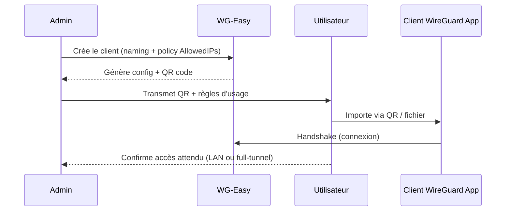

# 🛡️ WG-Easy — Présentation & Exploitation Premium (WireGuard + Web UI)

### VPN WireGuard administrable en quelques clics (clients, QR codes, règles)
Optimisé pour reverse proxy existant • Gouvernance & sécurité • Exploitation durable • Multi-clients

---

## TL;DR

- **WG-Easy** fournit une **interface web** pour gérer un serveur **WireGuard** : création/suppression de clients, QR codes, stats, configuration simplifiée.
- Le “premium” = **contrôle d’accès**, **politique d’adressage**, **règles d’accès (AllowedIPs)**, **journaux & dépannage**, **tests & rollback**.
- Attention : c’est un **outil d’administration VPN** → surface sensible, à traiter comme un composant critique.

Docs officielles (versionnées) : https://wg-easy.github.io/wg-easy/latest/  
Repo principal : https://github.com/wg-easy/wg-easy

---

## ✅ Checklists

### Pré-usage (avant d’ouvrir aux utilisateurs)
- [ ] Définir le **modèle réseau** : “accès LAN”, “full-tunnel”, ou “split-tunnel”
- [ ] Choisir la **plage VPN** (ex: `10.8.0.0/24`) et éviter toute collision
- [ ] Définir la politique **AllowedIPs** par profil (strict vs large)
- [ ] Définir qui administre (SSO/proxy headers / auth interne) et qui consomme
- [ ] Définir un standard “client naming” (ex: `u_prenom.nom_device`)
- [ ] Préparer une page interne “onboarding WireGuard” (QR + règles + dépannage)

### Post-configuration (qualité opérationnelle)
- [ ] 1 client test : handshake OK + accès attendu OK
- [ ] Test “accès interdit” (segment non autorisé) OK
- [ ] DNS via tunnel conforme (si utilisé)
- [ ] Procédure “revocation client” (rotation clé) testée
- [ ] Logs et plan de diagnostic documentés
- [ ] Rollback documenté (retour config + redémarrage)

---

> [!TIP]
> WireGuard est plus fiable quand tu restes **simple** : une plage VPN claire, des règles AllowedIPs propres, une approche split/full décidée.

> [!WARNING]
> Un “AllowedIPs trop large” transforme ton VPN en “clé passe-partout” vers tout ton réseau.

> [!DANGER]
> L’UI admin + les configs VPN = données sensibles. Ne traite pas WG-Easy comme une simple app “web”.

---

# 1) WG-Easy — Vision moderne

WG-Easy n’est pas “WireGuard”.

C’est :
- 🧠 Une **couche d’orchestration** (clients, clés, QR codes)
- 🧩 Un **catalogue de pairs** (naming, rotation, révocation)
- 🔄 Un **accélérateur d’exploitation** (moins d’erreurs humaines, onboarding rapide)

WireGuard reste le cœur (cryptographie + tunnel). WG-Easy simplifie la gestion au quotidien.

---

# 2) Architecture globale

```mermaid
flowchart LR
    User["📱 Client WireGuard\n(Mobile/Laptop)"] -->|UDP (WireGuard)| WG["🛡️ WireGuard Server\n(WG-Easy)"]
    Admin["🧑‍💻 Admin"] -->|HTTPS| RP["🛡️ Reverse Proxy existant\n(SSO / ACL)"]
    RP --> UI["🧩 WG-Easy Web UI"]
    UI --> WG
    WG --> LAN["🏠 Réseau privé\n(LAN/VLAN)"]
    WG --> Internet["🌍 Internet\n(option full-tunnel)"]
```

---

# 3) Modèles d’usage (choisir 1 stratégie claire)

## A) Accès LAN (le plus courant)
Objectif : accéder à tes services internes (NAS, HA, apps) depuis l’extérieur.
- Traffic vers LAN passe par le tunnel
- Internet sort localement depuis le client (pas via VPN)

## B) Full-tunnel (sécurité “tout passe par chez toi”)
Objectif : forcer tout le trafic du client via VPN (Wi-Fi public, pays étrangers, etc.).
- Nécessite NAT/routage correct côté serveur
- Impacts perf/latence, mais contrôle complet

## C) Split-tunnel strict (très propre pour prod)
Objectif : n’autoriser **que** quelques IP/ports/segments (moindre privilège).
- Excellent pour accès admin limité
- Moins de risques si un client est compromis

Docs “usage / scénarios” (à parcourir selon version) : https://wg-easy.github.io/wg-easy/latest/

---

# 4) Gouvernance “premium” des clients

## Convention de nommage (recommandée)
- `u_<prenom.nom>_<device>` (ex: `u_jean.dupont_iphone`)
- ou `svc_<app>_<env>` (ex: `svc_backup_prod`)

Pourquoi :
- 🔎 tri immédiat
- 🧠 audit simplifié
- 🧾 révocation propre (tu sais qui couper)

## Cycle de vie client (rotation)
- Création → test → usage
- Si perte de device / départ / suspicion → **révocation** immédiate
- Rotation régulière si conformité (optionnel)

---

# 5) Réseau & AllowedIPs (le “cœur stratégique”)

## 5.1 Plage VPN (Addressing plan)
Exemple classique : `10.8.0.0/24`
- `.1` = serveur
- `.2+` = clients

⚠️ Évite collisions avec :
- LAN (souvent `192.168.x.x`)
- VLAN/Cloud (`10.x.x.x`)
- autres VPN

## 5.2 AllowedIPs = ce que le client peut atteindre via le tunnel
### Split-tunnel “LAN only”
- AllowedIPs : le(s) segment(s) LAN (ex: `192.168.1.0/24`)

### Full-tunnel
- AllowedIPs : `0.0.0.0/0` (et `::/0` si IPv6)

### Split-tunnel strict
- AllowedIPs : quelques IP précises (ex: `192.168.1.10/32`, `192.168.1.20/32`)

> [!WARNING]
> AllowedIPs n’est pas “juste un paramètre client” : c’est une **politique d’accès**.

---

# 6) DNS via VPN (confort + contrôle)

Cas d’usage :
- Résolution de noms internes (`nas.local`, `service.intra`)
- Split-horizon DNS
- Blocage pub/malware via DNS interne (option)

Bonnes pratiques :
- Si tu actives DNS tunnel : documente le comportement (résolution interne vs externe)
- Évite les configs “hybrides” non documentées (source de tickets)

---

# 7) Sécurité d’accès (sans recettes proxy)

Approche premium (au choix, selon ton stack) :
- SSO/Forward-auth via reverse proxy existant (recommandé)
- Auth interne WG-Easy (si supportée/activée dans ta version)
- Accès VPN-only à l’UI admin (meta-sécurité)
- Restriction IP admin (allowlist) si possible

> [!DANGER]
> L’UI admin doit être considérée comme “panneau de contrôle VPN”. Restreindre l’accès est non négociable.

---

# 8) Workflows premium (onboarding & incident)

## 8.1 Onboarding utilisateur (séquence)


## 8.2 Incident “ça ne marche pas”
Checklist rapide (ordre recommandé) :
1. Handshake existe ?
2. IP du client attribuée ?
3. AllowedIPs correspond au besoin ?
4. Routage/NAT côté serveur (si full-tunnel) ?
5. DNS tunnel (si noms) ?
6. Pare-feu amont (port UDP WireGuard) ?

---

# 9) Validation / Tests / Rollback

## 9.1 Tests fonctionnels minimum
- Test 1 : handshake OK (mobile en 4G)
- Test 2 : accès à une ressource LAN attendue (ex: `ping 192.168.1.10` ou accès HTTP)
- Test 3 : accès **interdit** à une zone non autorisée (si split strict)
- Test 4 : DNS interne (si activé) : résolution + accès

## 9.2 Tests “qualité”
- Débit acceptable (selon uplink)
- Latence stable
- Reconnexion OK après changement de réseau (Wi-Fi ↔ 4G)

## 9.3 Rollback (pratique)
Objectif : revenir vite à un état fonctionnel.
- Revenir au dernier snapshot/config exporté
- Annuler une policy AllowedIPs trop large ou trop stricte
- Désactiver temporairement un réglage DNS problématique
- Révoquer un client problématique, en recréer un propre

> [!TIP]
> Documente un “rollback en 5 minutes” : quoi restaurer, où, et comment valider après.

---

# 10) Erreurs fréquentes (et correctifs)

- ❌ **Collision d’IP** (plage VPN chevauche LAN/VLAN)  
  ✅ Choisir une plage unique (ex: `10.8.0.0/24`) et la documenter

- ❌ **AllowedIPs mal définis** (trop large ou trop strict)  
  ✅ Alignement strict sur le scénario (LAN only / full / strict)

- ❌ **DNS interne mal compris** (résolution différente selon tunnel)  
  ✅ Documenter + tester avec 1 client avant généralisation

- ❌ **Rotation/révocation non faite** (device perdu)  
  ✅ Process de révocation immédiate + naming clair

---

# 11) Sources — Images Docker (format “URLs brutes”)

## 11.1 Image officielle (actuelle)
- `ghcr.io/wg-easy/wg-easy` (référence indiquée par le projet) : https://github.com/wg-easy/wg-easy  
- Documentation wg-easy (versionnée) : https://wg-easy.github.io/wg-easy/latest/  
- Page Docker Hub historique (mention “moved to GHCR”) : https://hub.docker.com/r/weejewel/wg-easy  

## 11.2 Images alternatives (à considérer avec prudence)
- `leduong/wg-easy` (Docker Hub) : https://hub.docker.com/r/leduong/wg-easy  

## 11.3 LinuxServer.io (LSIO)
- Pas d’image `wg-easy` dédiée LSIO ; LSIO propose une image **WireGuard** (sans l’UI wg-easy) :  
  - `lscr.io/linuxserver/wireguard` (docs LSIO) : https://docs.linuxserver.io/images/docker-wireguard/  
  - `linuxserver/wireguard` (Docker Hub) : https://hub.docker.com/r/linuxserver/wireguard  

---

# ✅ Conclusion

WG-Easy est un excellent “**control plane**” pour WireGuard : onboarding rapide, clients propres, révocation simple.

Le niveau “premium” vient de :
- politiques AllowedIPs bien pensées,
- gouvernance (naming, rotation),
- contrôle d’accès strict à l’UI,
- tests & rollback documentés.