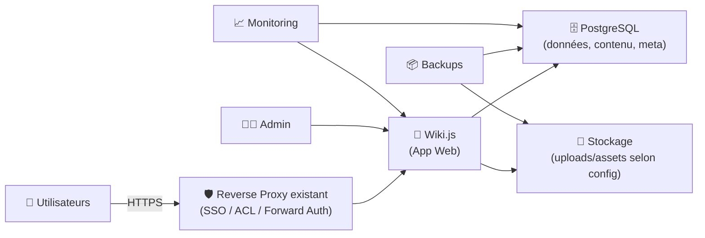
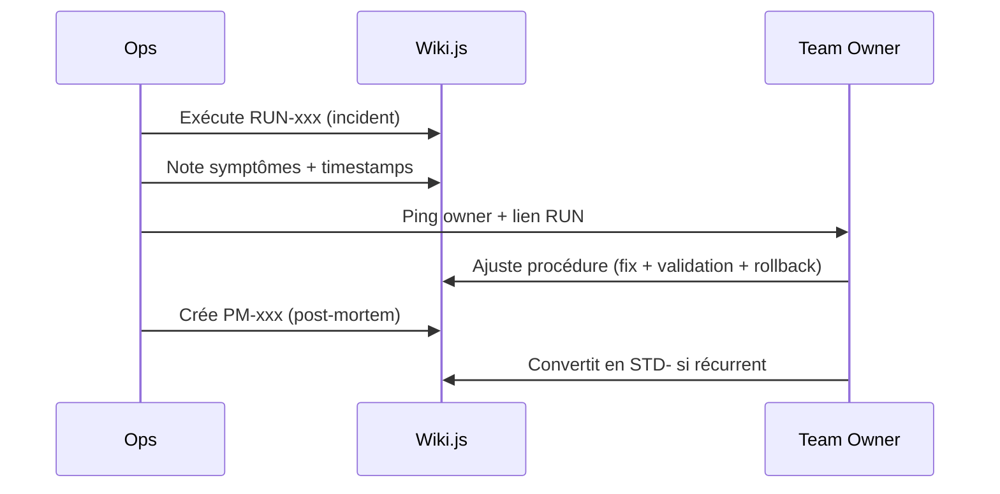

# 🧠 Wiki.js — Présentation & Exploitation Premium (Architecture + Gouvernance + Sécurité)

### Wiki moderne “docs-as-a-product” : Markdown, permissions fines, modules d’auth, recherche, workflows
Optimisé pour reverse proxy existant • SSO/LDAP/OIDC/SAML possibles • Performance durable • Maintenance propre

---

## TL;DR

- **Wiki.js** est un wiki moderne centré sur une expérience d’édition **Markdown** + une **gouvernance** (rôles, permissions, espaces).
- Il excelle pour : **runbooks**, **standards**, **onboarding**, **knowledge base**, **post-mortems**.
- Version “premium ops” : **structure**, **permissions**, **auth**, **conventions**, **validation/tests**, **rollback**, **backups** (DB + contenu).

---

## ✅ Checklists

### Pré-usage (avant d’ouvrir aux équipes)
- [ ] Domaine / sous-domaine choisi (recommandé : `wiki.domaine.tld`)
- [ ] Stratégie d’auth : Local + (SSO/OIDC/LDAP/SAML) selon besoin
- [ ] Modèle de gouvernance : espaces / équipes / owners
- [ ] Conventions : tags, naming, templates (RUN/STD/REF/PM)
- [ ] Politique d’édition : review/relecture (au minimum “owner” par espace)
- [ ] Plan de sauvegarde (DB + fichiers) + test de restauration

### Post-configuration (qualité opérationnelle)
- [ ] Les permissions sont testées (user “reader” vs “editor” vs “admin”)
- [ ] Les pages critiques ont un template (validation + rollback)
- [ ] Recherche utile (tags, titres, structure cohérente)
- [ ] Procédures incident “logs → diag → fix → post-mortem” documentées
- [ ] Mise à jour planifiée (cadence) + retour arrière documenté

---

> [!TIP]
> Wiki.js devient excellent quand tu le traites comme un **produit interne** : conventions, templates, ownership, et relecture.

> [!WARNING]
> La plupart des dérives viennent d’un “wiki fourre-tout”. Investis 30 minutes dans une taxonomie et tu gagnes des mois.

> [!DANGER]
> Évite les déploiements en **sous-dossier** (ex: `/wiki`) : c’est une source énorme d’erreurs reverse-proxy et ce n’est pas une cible support “simple” pour Wiki.js. Privilégie un sous-domaine.

---

# 1) Wiki.js — Vision moderne

Wiki.js n’est pas “un wiki à pages”.

C’est :
- ✍️ Un **éditeur Markdown** agréable + rendu riche
- 🧭 Une **plateforme de connaissance** (structure + tags + recherche)
- 🔐 Une **gouvernance** (rôles, permissions, espaces)
- 🧩 Un hub **auth modulaire** (Local + stratégies SSO)
- 🧠 Un moteur “documentation durable” (templates, standards, runbooks)

Sources : https://js.wiki/  
Repo : https://github.com/requarks/wiki  
Docs : https://docs.requarks.io/

---

# 2) Architecture globale



---

# 3) Modèle de contenu premium (pour éviter le chaos)

## 3.1 Une taxonomie simple qui marche
Crée 4 “familles” (pages modèles + tags) :

- **RUN-** Runbook (procédure actionnable)
- **STD-** Standard (règle / norme / convention)
- **REF-** Référence (infos stables : ports, endpoints, inventaires)
- **PM-** Post-mortem (retour d’incident)

## 3.2 Structure recommandée (par équipe)
- `/infra/` (runbooks, standards, architecture)
- `/product/` (specs, décisions, RFC)
- `/support/` (KB, scripts, réponses types)
- `/onboarding/` (parcours, checklists)

> [!TIP]
> Applique la règle : **un owner** par espace + une convention de tags. Sans owner, la doc meurt.

---

# 4) Gouvernance & Permissions (propre et maintenable)

## 4.1 Stratégie “3 rôles” (base saine)
- 👑 **Admins** : config système, auth, maintenance
- ✍️ **Editors** : créer/modifier dans leur espace
- 👀 **Readers** : lecture

## 4.2 “Owners” par espace
- Chaque espace (ex: `/infra/`) a :
  - 1 owner principal
  - 1 back-up
  - une règle de relecture (au minimum sur RUN/STD)

## 4.3 Politique de publication
- Brouillon → relecture → publication
- Toute page RUN doit contenir :
  - prérequis
  - procédure pas-à-pas
  - validation
  - rollback
  - liens utiles (dashboards/logs)

---

# 5) Authentification & SSO (modules)

Wiki.js utilise un modèle **“stratégies”** : tu peux activer plusieurs méthodes (ex: Local + OIDC).  
Le login admin “root” via **Local** reste un filet de sécurité.

Doc Auth : https://docs.requarks.io/auth

## 5.1 Stratégies typiques
- **Local** : indispensable pour admin break-glass
- **OAuth2 / OpenID Connect** : SSO moderne (Keycloak, Authentik, etc.)
- **SAML** : SSO entreprise (Azure AD/Entra, Okta, etc.)
- **LDAP/AD** : annuaire (selon stratégie disponible)

Doc SAML : https://docs.requarks.io/auth/saml

> [!WARNING]
> Même avec SSO, garde un compte admin local “break-glass” documenté et protégé (mot de passe fort + coffre).

---

# 6) Performance & Exploitation (ce qui tient dans le temps)

## 6.1 Bonnes pratiques de contenu
- Une page = une idée / un runbook
- Titres explicites + tags
- “Dernière révision” (date) + owner
- Captures d’écran : utiles mais pas comme unique source (préférer instructions + commandes)

## 6.2 Observabilité minimale
- Surveiller :
  - disponibilité HTTP
  - erreurs applicatives (logs)
  - santé PostgreSQL
  - espace disque (uploads + DB)
- Garder une page “RUN- Dépannage Wiki.js” :
  - symptômes
  - causes fréquentes
  - actions correctives
  - rollback

---

# 7) Subpath / Sous-dossier (point important)

Recommandation : **sous-domaine** plutôt que `/wiki`.

Ressources :
- FAQ “subfolder install path” (retours d’expérience + raisons) : https://beta.js.wiki/faq/subfolder-install-path
- Feedback “support subpath” (contexte produit) : https://feedback.js.wiki/wiki/p/support-hosting-wikijs-at-subpath

---

# 8) Validation / Tests / Rollback (opérationnel)

## 8.1 Smoke tests (rapides)
```bash
# 1) Service répond
curl -I https://wiki.example.tld | head

# 2) Contenu login visible (indicatif)
curl -s https://wiki.example.tld | head -n 20
```

## 8.2 Tests fonctionnels (à faire après changements)
- Connexion via stratégie SSO (utilisateur test)
- Permissions :
  - Reader ne peut pas éditer
  - Editor peut éditer uniquement son espace
  - Admin a accès config
- Upload d’un fichier (si utilisé)
- Recherche :
  - retrouve une page via titre + tags

## 8.3 Rollback (principes)
- Rollback “contenu” :
  - restaurer **DB PostgreSQL** + **uploads/assets**
- Rollback “config/auth” :
  - revenir à la conf précédente (export/notes)
  - conserver un accès admin Local

> [!TIP]
> Le test qui compte : une **restauration complète** sur une machine de test (DB + fichiers) au moins trimestrielle.

---

# 9) Workflows premium (incident & amélioration continue)



---

# 10) Sources — Images Docker (urls brutes, comme demandé)

## 10.1 Images officielles Wiki.js (upstream)
- `ghcr.io/requarks/wiki` (doc officielle Docker) : https://docs.requarks.io/install/docker  
- `requarks/wiki` (Docker Hub) : https://hub.docker.com/r/requarks/wiki  
- Repo upstream (référence produit) : https://github.com/requarks/wiki  

## 10.2 Image LinuxServer.io (si tu utilises l’écosystème LSIO)
- `lscr.io/linuxserver/wikijs` (docs LSIO) : https://docs.linuxserver.io/images/docker-wikijs/  
- `linuxserver/wikijs` (Docker Hub) : https://hub.docker.com/r/linuxserver/wikijs  
- Repo packaging LSIO : https://github.com/linuxserver/docker-wikijs  
- Releases LSIO (traçabilité) : https://github.com/linuxserver/docker-wikijs/releases  

---

# ✅ Conclusion

Wiki.js est idéal quand tu veux :
- une doc **Markdown** agréable,
- une **gouvernance** claire (rôles/espaces/owners),
- des **workflows** (runbooks, standards, post-mortems),
- et une exploitation “pro” (tests, rollback, backups).

Le secret : **structure + ownership + relecture**.