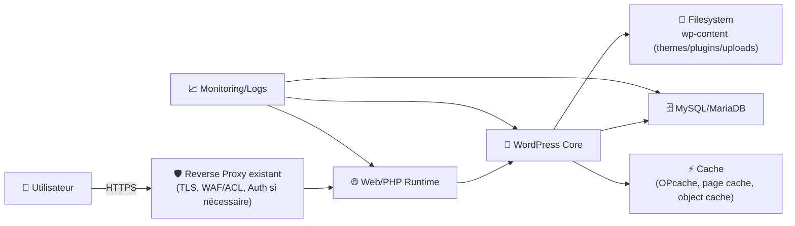
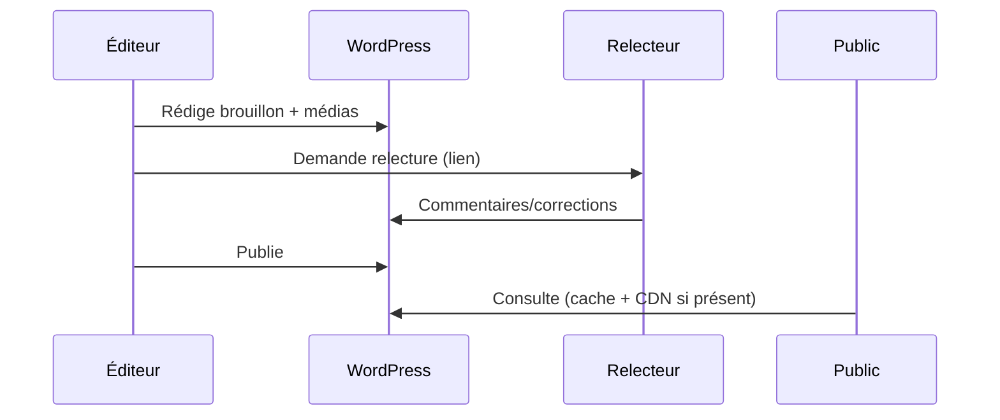

# 🧱 WordPress — Présentation & Exploitation Premium (Architecture + Sécurité + Qualité)

### CMS universel, extensible, mais exigeant côté gouvernance
Optimisé pour reverse proxy existant • Plugins maîtrisés • Performance durable • Maintenance propre

---

## TL;DR

- **WordPress** = noyau + thèmes + plugins → puissance énorme, mais le vrai enjeu = **gouvernance**.
- Version “premium” = **moins de plugins**, **mises à jour cadrées**, **rôles propres**, **durcissement**, **backups testés**, **plan de rollback**.
- Objectif : un WordPress **prévisible** (prod), pas un “Franken-site” fragile.

---

## ✅ Checklists

### Pré-prod (avant d’ouvrir au public)
- [ ] Stratégie de plugins (liste blanche, owners, alternatives)
- [ ] Rôles & permissions (admin limité, éditeurs cadrés)
- [ ] Stratégie de mise à jour (core/plugins/thèmes) + fenêtre de maintenance
- [ ] Backups (DB + `wp-content`) + restauration testée
- [ ] Politique de sécurité (XML-RPC, file edit, secrets, uploads)
- [ ] Observabilité minimale (logs web/PHP, erreurs WP, health checks)

### Post-prod (après go-live)
- [ ] Un compte admin “break glass” hors usage quotidien
- [ ] Plugin inventory (qui sert à quoi, quand le retirer)
- [ ] Page de statut interne : versions, dernière MAJ, dernier backup OK
- [ ] Procédure “incident contenu” (rollback DB) et “incident code” (rollback plugin/theme)
- [ ] Scan vulnérabilités (au moins mensuel) + réaction planifiée

---

> [!TIP]
> Le meilleur WordPress “pro” est souvent celui qui a **peu de plugins**, un thème sain, et des pratiques d’exploitation strictes.

> [!WARNING]
> WordPress est un aimant à attaques automatisées (wp-login, xmlrpc). La surface augmente vite avec chaque plugin.

> [!DANGER]
> “Donne admin à tout le monde” + “installe 30 plugins” = compromission quasi inévitable tôt ou tard.

---

# 1) WordPress — Vision moderne

WordPress n’est pas juste un moteur de blog.

C’est :
- 🧩 Un **framework CMS** (plugins + hooks)
- 🎨 Un système de rendu (thèmes, blocs Gutenberg)
- 🔐 Une plateforme multi-rôles (workflow éditorial)
- 🌍 Un écosystème (SEO, e-commerce, LMS, membership…)

Mais sa force implique un coût : **discipline**.

---

# 2) Architecture globale (référence)



---

# 3) Philosophie premium (6 piliers)

1. 🧾 **Gouvernance plugins** (liste blanche, owners, minimisation)
2. 🔐 **Durcissement** (XML-RPC, file edit, secrets, uploads)
3. 🧠 **Workflow éditorial** (rôles, relecture, publication)
4. ⚡ **Performance** (cache, images, DB hygiene)
5. 🧪 **Validation** (tests, staging, checks de régression)
6. 🧯 **Rollback** (DB + wp-content + versioning)

---

# 4) Modèle d’exploitation (ce qui évite les drames)

## 4.1 Environnements
- **Staging** : clone proche de prod (mêmes plugins, mêmes versions)
- **Prod** : changements uniquement via processus (pas “live edit”)

## 4.2 Gouvernance des plugins (liste blanche)
Chaque plugin doit avoir :
- un **owner** (responsable)
- un **objectif** (fonction)
- une **alternative** (native / autre plugin)
- une **politique de MAJ**
- un **plan de retrait** (si abandonné)

> [!TIP]
> Remplace 5 plugins “moyens” par 1 plugin “solide” ou une petite feature custom si possible.

---

# 5) Sécurité premium (pragmatique)

## 5.1 Règles simples qui changent tout
- ✅ 2FA pour admins (si possible)
- ✅ Limiter les admins au strict minimum
- ✅ Désactiver l’édition de fichiers via l’admin WP
- ✅ Secrets hors repo/public, clés de sécurité (salts) robustes
- ✅ Contrôler XML-RPC (désactiver si inutile)
- ✅ Durcir uploads (éviter exécution PHP dans uploads)
- ✅ Mises à jour régulières + staging + rollback

## 5.2 `wp-config.php` (extraits “premium”)
> À adapter à ton contexte — l’idée est de fixer des garde-fous.

```bash
# Exemples de constantes utiles à poser/contrôler :
# (à mettre dans wp-config.php, pas à exécuter tel quel)
```

```php
// 1) Bloquer l'éditeur de fichiers dans l'admin
define('DISALLOW_FILE_EDIT', true);

// 2) (Optionnel) bloquer l'installation/MAJ de plugins via l'UI
// define('DISALLOW_FILE_MODS', true);

// 3) Forcer SSL côté admin si ton proxy termine TLS correctement
// define('FORCE_SSL_ADMIN', true);

// 4) Limiter la rétention de révisions (évite DB qui gonfle)
// define('WP_POST_REVISIONS', 10);

// 5) Autosave moins agressif (stabilité)
// define('AUTOSAVE_INTERVAL', 120);
```

## 5.3 XML-RPC (décision)
- Si tu n’utilises pas Jetpack / apps mobiles / intégrations XML-RPC : **désactive ou limite**.
- Sinon : protège (rate limiting/WAF) et surveille.

Référence sur l’intérêt de le désactiver et le contexte : https://wpmarmite.com/en/xmlrpc-wordpress/

---

# 6) Performance premium (sans magie)

## 6.1 Les 4 leviers qui comptent
1. **OPcache** (PHP)
2. **Cache page** (serveur/plugin)
3. **Object cache** (Redis/Memcached si utile)
4. **Optimisation média** (images, WebP, lazy-load)

## 6.2 Hygiène DB
- limiter révisions
- nettoyer transients (avec prudence)
- éviter plugins qui écrivent énormément en DB sans raison

> [!WARNING]
> “Plugin de cache + plugin d’optim + plugin d’image + plugin DB + plugin minify” = conflits et instabilité. Vise une chaîne simple.

---

# 7) Workflows premium (édition & incident)

## 7.1 Publication “propre” (séquence)


## 7.2 Incident “site cassé” (logique)
- identifier : plugin ? thème ? MAJ core ? DB ?
- rollback : revenir à l’état stable (code ou DB selon incident)
- corriger : staging, test, redeploy

---

# 8) Validation / Tests / Rollback

## 8.1 Tests de validation (smoke tests)
```bash
# Répond en HTTP (depuis ton réseau)
curl -I https://site.example.tld | head

# Endpoint REST (si activé) — doit répondre sans exposer d'infos sensibles
curl -s https://site.example.tld/wp-json/ | head -n 5

# Page login accessible (sans boucle)
curl -I https://site.example.tld/wp-login.php | head
```

## 8.2 Tests fonctionnels (manuels mais rapides)
- créer un brouillon → publier → vérifier rendu
- upload image → vérifier taille/format → vérifier affichage
- recherche interne → vérifier pertinence
- formulaire/contact (si présent) → vérifier deliverability

## 8.3 Rollback (principe)
Deux familles :
- **Rollback “code”** : thème / plugin / core (revenir à une version connue)
- **Rollback “contenu”** : DB + `wp-content/uploads` (restaurer un point dans le temps)

Règle d’or :
- rollback code ≠ rollback DB (bien choisir selon l’incident)

> [!DANGER]
> Restaurer la DB en prod peut effacer des contenus récents. Toujours annoncer une fenêtre et mesurer l’impact.

---

# 9) Erreurs fréquentes (et prévention)

- ❌ Trop de plugins “overlap” → conflits, lenteur, surface d’attaque
- ❌ Admin partout → compromission facile
- ❌ MAJ en prod sans staging → casse après update
- ❌ Backups non testés → faux sentiment de sécurité
- ❌ Uploads non contrôlés → vecteur de malware

---

# 10) Sources — Images Docker (URLs brutes comme demandé)

## 10.1 Image officielle la plus citée (Docker Official Image)
- `wordpress` (Docker Hub) : https://hub.docker.com/_/wordpress  
- Tags officiels `wordpress` : https://hub.docker.com/_/wordpress/tags  
- Repo de packaging (Docker Official Image) : https://github.com/docker-library/wordpress  

## 10.2 Image “secure/enterprise-ish” très utilisée
- `bitnami/wordpress` (Docker Hub) : https://hub.docker.com/r/bitnami/wordpress  
- Tags `bitnami/wordpress` : https://hub.docker.com/r/bitnami/wordpress/tags/  
- Repo containers (README WordPress) : https://github.com/bitnami/containers/blob/main/bitnami/wordpress/README.md  
- Page Bitnami (containers) : https://bitnami.com/stack/wordpress/containers  

## 10.3 LinuxServer.io (statut)
- LinuxServer.io ne fournit pas (à date) une image “WordPress” dédiée dans sa liste d’images ; ils documentent plutôt l’hébergement WordPress via leurs images web/proxy (ex: SWAG) : https://docs.linuxserver.io/general/swag/  
- Thread LSIO (demande d’image WordPress) : https://discourse.linuxserver.io/t/wordpress-docker-image/1984  

---

# ✅ Conclusion

WordPress en mode “premium” = un CMS :
- gouverné (plugins/rôles/process),
- durci (réduction surface + bonnes pratiques),
- performant (cache + hygiène),
- exploitable (tests + rollback).

C’est cette discipline qui transforme WordPress d’un “site fragile” en plateforme durable.