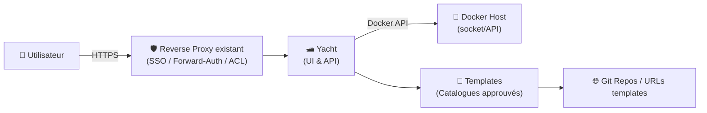
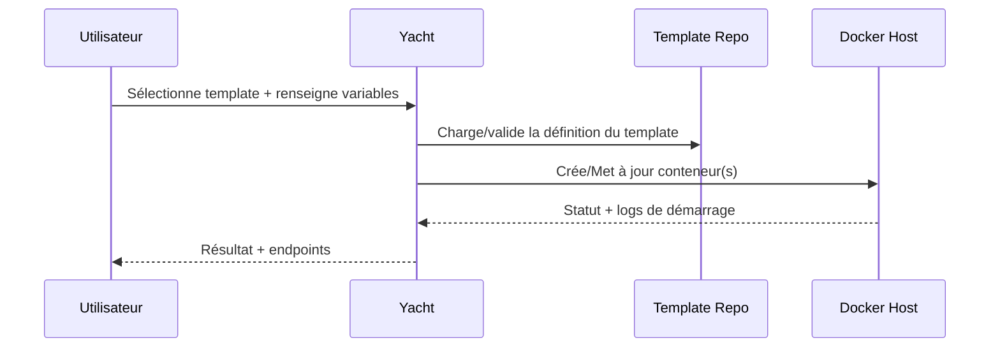

# 🛥️ Yacht — Présentation & Exploitation Premium (Docker Manager orienté Templates)

### UI web pour piloter des conteneurs avec une approche “App Store” (templates) + gestion de projets
Optimisé pour reverse proxy existant • Gouvernance par périmètre • Workflows ops • Validation & rollback

---

## TL;DR

- **Yacht** est une **interface web** pour gérer Docker avec un focus fort sur :
  - 🧩 **Templates** (déploiements “1-click” à partir de définitions communautaires)
  - 🗂️ **Projets** (import/gestion de projets type Compose selon la doc)
  - 🔎 **Visibilité** (containers, statuts, logs selon la version)
- En “premium ops” : **contrôle d’accès**, **périmètres**, **conventions**, **catalogue templates maîtrisé**, **tests & rollback**.

---

## ✅ Checklists

### Pré-usage (avant d’ouvrir Yacht à d’autres)
- [ ] Définir un périmètre : “prod” vs “lab” (Yacht plutôt **homelab**/non critique)
- [ ] Choisir une stratégie d’accès (SSO via proxy / auth interne / VPN)
- [ ] Définir conventions de labels/naming (`env`, `team`, `app`)
- [ ] Gouverner les templates (sources approuvées, revue, versioning)
- [ ] Écrire un runbook : “Déployer / Modifier / Revenir en arrière”

### Post-configuration (qualité opérationnelle)
- [ ] Un utilisateur “Team A” ne voit/agit que sur son périmètre (test réel)
- [ ] Les templates “approuvés” sont identifiés + documentés
- [ ] Les changements sont reproductibles (inputs, variables, version d’image)
- [ ] Les rollbacks sont simples (re-déploiement version précédente)

---

> [!TIP]
> Yacht est surtout utile quand tu veux un **catalogue d’apps** (templates) et une UX simple pour un homelab/équipe.

> [!WARNING]
> Sur certaines pages publiques, Yacht est présenté comme “alpha”/en évolution, et des retours récents indiquent un rythme de mise à jour variable. Utilise-le en connaissance de cause : idéalement **hors production critique**.

> [!DANGER]
> Comme tout gestionnaire Docker, Yacht peut donner des capacités très puissantes (déploiement, variables, secrets, sockets). Traite-le comme un **outil privilégié**.

---

# 1) Yacht — Vision moderne

Yacht n’est pas “juste une UI Docker”.

C’est :
- 🧩 Un **catalogue de templates** pour standardiser les déploiements
- 🏗️ Un **orchestrateur léger** (déploiements + paramètres)
- 🧠 Un outil de **standardisation** (variables, conventions, base images)
- 📦 Un **accélérateur** pour le self-hosting (expérience “app store”)

---

# 2) Architecture globale



---

# 3) Philosophie premium (5 piliers)

1. 🔐 **Accès & gouvernance** (qui peut faire quoi)
2. 🧩 **Templates maîtrisés** (sources, revue, versioning)
3. 🏷️ **Conventions de labels/naming** (retrouvabilité + périmètres)
4. 🧪 **Validation** (tests rapides après chaque changement)
5. 🔄 **Rollback** (retour arrière simple, documenté)

---

# 4) Gouvernance des templates (le cœur “pro”)

## 4.1 “Templates approuvés” (pattern recommandé)
- Un **catalogue officiel interne** (même si tu utilises des templates communautaires)
- Une règle : “on ne déploie que depuis la liste approuvée”
- Chaque template doit préciser :
  - Image(s) utilisées + versions/pins
  - Volumes attendus
  - Ports exposés
  - Variables sensibles (secrets)
  - Dépendances (DB, redis, reverse proxy)

> [!TIP]
> La meilleure pratique : **fork** des templates communautaires dans un repo interne, puis revue/PR pour chaque modification.

## 4.2 Matrice “risque template”
- ✅ Bas risque : apps stateless, sans secrets, sans accès privilégié
- ⚠️ Moyen : apps avec DB, credentials, volumes persistants
- ❌ Haut risque : besoin de `privileged`, accès direct au socket Docker, ou services exposés publiquement sans auth

---

# 5) Contrôle d’accès & périmètres

## Approches typiques
- **SSO / forward-auth via reverse proxy** (recommandé si tu as déjà une brique d’auth)
- **Auth interne** selon capacité de la version
- **Accès via VPN** (simple et efficace)

## Périmètres (scoping) via conventions
Même si l’outil ne fait pas un RBAC parfait, tu peux réduire les risques via :
- Instances séparées (ex: `yacht-lab` vs `yacht-prod`)
- Hosts séparés (prod hors yacht si besoin)
- Labels / naming (ex: `env=lab`, `team=media`)
- Process : qui peut “merge” un template approuvé

> [!WARNING]
> Le plus robuste reste la séparation : **un Yacht pour le lab**, et une gestion plus stricte (IaC / Portainer RBAC / GitOps) pour la prod.

---

# 6) Workflows premium (déploiement & exploitation)

## 6.1 Déploiement template (séquence)


## 6.2 Standard “Change management” (simple mais solide)
- Déploiement = **déclaratif** (template + paramètres)
- Chaque changement doit avoir :
  - le “avant/après”
  - la version d’image (pin)
  - la raison
  - un plan de rollback

---

# 7) Bonnes pratiques de configuration (sans recettes d’installation)

## 7.1 Naming
- `app-env` : `sonarr-lab`, `vault-prod`
- Ajoute `team` dans le label ou le nom si multi-tenant

## 7.2 Pins de versions
- Évite `latest` pour tout ce qui est persistant/critique
- Pin : `image:tag` (ou digest) + note dans la doc du template

## 7.3 Secrets
- Ne mets pas de secrets en clair dans un template public
- Utilise variables/secret store (selon ton écosystème) + rotation

---

# 8) Validation / Tests / Rollback

## Smoke tests (rapides)
```bash
# Vérifier que l’endpoint répond (adapter l’URL)
curl -I https://yacht.example.tld | head

# Vérifier qu’un service nouvellement déployé répond (exemple)
curl -I https://app.example.tld | head
```

## Tests fonctionnels (minimum)
- Le conteneur est “healthy” (si healthcheck)
- Les logs ne contiennent pas de boucle d’erreur au bout de 60–120s
- Le volume persistant est bien monté (si applicable)
- L’auth (si exposé) fonctionne

## Rollback (stratégies)
- Re-déployer le **template version précédente** (pin de tag/digest)
- Revenir aux paramètres précédents (variables/env)
- Restaurer la donnée (si DB) selon ton plan de sauvegarde applicatif

> [!TIP]
> Documente, pour chaque template approuvé, le rollback en 3 lignes : “quoi remettre”, “où vérifier”, “comment valider”.

---

# 9) Limitations & Positionnement réaliste

- Yacht vise une UX simple et des templates, souvent pour **homelab** / environnements non critiques.
- Pour des besoins “enterprise” (RBAC fin, audit, GitOps, multi-cluster), regarde plutôt des solutions orientées plateformes (selon ton contexte).

---

# 10) Sources — Images Docker & Projets (URLs brutes uniquement)

## 10.1 Image “classique” la plus citée (Docker Hub)
- `selfhostedpro/yacht` (Docker Hub) : https://hub.docker.com/r/selfhostedpro/yacht  
- Page “tags/layers” (exemple) : https://hub.docker.com/layers/selfhostedpro/yacht/v0.0.7-alpha-2023-01-12--05/images/sha256-da70f355009921c1e8697d360850b3271edc5f3b0109374ee16ede2fb8bcd2f3  

## 10.2 Documentation (site)
- Docs Yacht (site dev) : https://dev.yacht.sh/  

## 10.3 Références GitHub (projets)
- `SelfhostedPro/yacht-api` (backend) : https://github.com/SelfhostedPro/yacht-api  
- Organisation SelfhostedPro (références repos) : https://github.com/selfhostedpro  

## 10.4 LinuxServer.io (LSIO)
- Index des images LSIO (pour vérifier si une image “yacht” existe chez LSIO) : https://www.linuxserver.io/our-images  

---

# ✅ Conclusion

Yacht est un **Docker manager orienté templates** : parfait pour accélérer le self-hosting et standardiser des déploiements “catalogue”.
Version premium = **catalogue templates gouverné + accès maîtrisé + conventions + tests + rollback**.