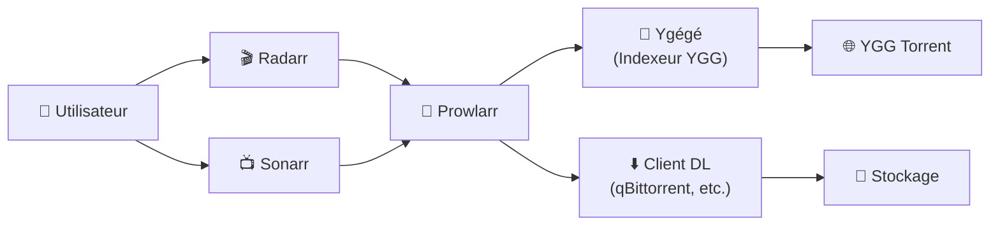
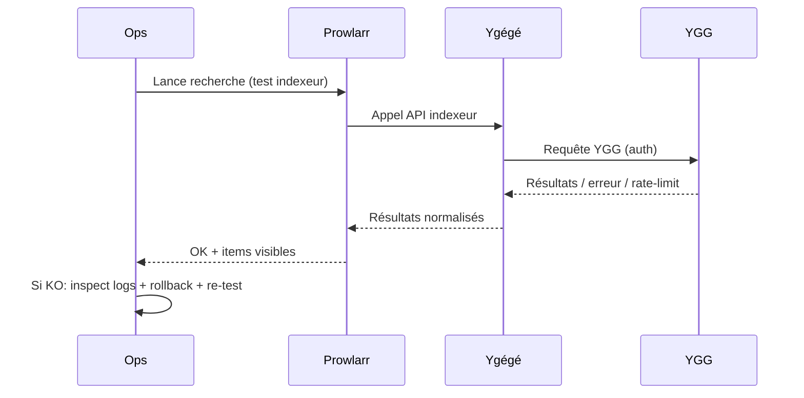

# 🧠 Ygégé — Présentation & Configuration Premium (Indexeur YGG pour Prowlarr/Jackett)

### Indexeur haute performance (Rust) pour relier YGG Torrent à ton écosystème *arr
Optimisé pour Prowlarr • Jackett (cardigann) • Qualité de recherche • Exploitation durable

---

## TL;DR

- **Ygégé** est un **indexeur** (pas un client de téléchargement) : il expose une API compatible pour que **Prowlarr/Jackett** puissent interroger **YGG Torrent**.
- Objectif : **recherches fiables**, **parsing propre**, **intégration simple** avec Radarr/Sonarr via Prowlarr.
- Version “premium” = **stabilité d’auth**, **limites/quotas**, **stratégie de recherche**, **observabilité**, **tests & rollback**.

---

## ✅ Checklists

### Pré-configuration
- [ ] Prowlarr (ou Jackett) opérationnel
- [ ] Identifiants YGG valides (et méthode d’auth stable)
- [ ] Stratégie de recherche définie (films/séries, qualité, langues, keywords)
- [ ] Réseau : Ygégé joignable par Prowlarr/Jackett (DNS/host/port)
- [ ] Politique “privacy” : logs sans credentials, rotation, accès restreint

### Post-configuration
- [ ] Test d’indexeur OK dans Prowlarr/Jackett
- [ ] Résultats pertinents (parsing titles correct)
- [ ] Pas de boucles d’erreurs auth / rate-limit
- [ ] Plan de rollback documenté
- [ ] Monitoring minimal : logs + erreurs + temps de réponse

---

> [!TIP]
> Ygégé est idéal quand tu veux un **pont performant** vers YGG dans un pipeline “Prowlarr → Sonarr/Radarr → client de téléchargement”.

> [!WARNING]
> Les trackers peuvent imposer des **limitations** (quotas, règles anti-abus, changements d’auth). Prévoyez une config résiliente + une stratégie de repli.

> [!DANGER]
> Ne mets pas Ygégé “grand ouvert” : c’est une surface d’accès à un tracker. Restreins l’accès (réseau privé / reverse proxy existant / SSO / ACL).

---

# 1) Ygégé — Vision moderne

Ygégé n’est pas “un indexeur de plus”.

C’est :
- ⚡ Un **indexeur haute performance** (Rust)
- 🧩 Un **bridge** entre YGG et tes outils (*arr via Prowlarr / Jackett)
- 🧠 Un **parsing engine** (titres, catégories, champs)
- 🧰 Un composant “ops” : logs, debug, stabilité auth

---

# 2) Architecture globale



---

# 3) Philosophie premium (5 piliers)

1. 🔐 **Auth stable** (éviter les “login loops”, cookies morts, etc.)
2. 🧭 **Qualité de requêtes** (titres propres, fallback search)
3. 🧩 **Intégration clean** (Prowlarr/Jackett, endpoints, timeouts)
4. 🧰 **Observabilité** (logs utiles, debug sans fuite de secrets)
5. 🔄 **Validation & rollback** (tests rapides, retour arrière maîtrisé)

---

# 4) Intégration Prowlarr (recommandée)

## Objectif
Ygégé est consommé par **Prowlarr** comme indexeur, puis redistribué à Radarr/Sonarr.

Points d’attention premium :
- **Base URL** : doit être stable et joignable depuis Prowlarr
- **Timeouts** : éviter les timeouts trop agressifs (mais pas infinis)
- **Catégories** : mapping correct (Movies/TV/General)
- **Qualité** : Prowlarr gère une grande partie de la normalisation, mais la pertinence dépend du parsing

---

# 5) Intégration Jackett (option “cardigann”)

Si tu utilises Jackett :
- Ygégé peut être ajouté comme **indexeur personnalisé** via une définition `ygege.yml` (cardigann).
- Objectif : même logique que Prowlarr, avec un workflow Jackett.

> [!TIP]
> Si tu es déjà “full *arr”, Prowlarr reste généralement plus cohérent (pilotage central des indexeurs).

---

# 6) Stratégie de recherche (ce qui fait la différence)

## 6.1 Normalisation des titres
Bonnes pratiques :
- préférer une recherche “titre simple” (sans tags inutiles)
- fallback sur variantes :
  - sans année / avec année
  - sans accents / avec accents
  - noms alternatifs (ex: titres FR/EN)

## 6.2 Requêtes “intelligentes”
- Films :
  - titre + année
  - TMDB (si supporté par la stack)
- Séries :
  - SxxEyy
  - packs saison (si tu les utilises)

> [!WARNING]
> Une recherche trop “large” = plus de faux positifs.  
> Une recherche trop “stricte” = rien ne remonte.  
> L’équilibre dépend de tes profils qualité dans Radarr/Sonarr.

---

# 7) Gestion des limites / fiabilité (anti-fragile)

Même si Ygégé est performant, la contrainte vient souvent de :
- règles côté tracker
- limitations compte (quotas)
- changements d’auth

Approche premium :
- réduire les scans inutiles (pas de “refresh indexers” en boucle)
- privilégier les recherches “au bon moment” (via Prowlarr)
- observer les erreurs : 401/403/429/timeouts
- prévoir un “mode dégradé” (autres indexeurs / sources)

---

# 8) Observabilité (logs utiles, sans secrets)

## Niveaux de logs (recommandation)
- default : `info` (propre)
- incident : `debug` temporaire (max 30–60 min)
- jamais : `trace` en production sauf cas extrême

## À capturer en incident
- timestamp + endpoint appelé
- code HTTP
- latence
- type d’erreur (auth/rate-limit/parsing)

> [!DANGER]
> Ne loggue pas (ou ne conserve pas) : mots de passe, cookies, tokens, passkeys.  
> Si tu dois debug : masque/rotate ensuite.

---

# 9) Validation / Tests / Rollback

## 9.1 Smoke tests (connectivité)
```bash
# Ping API (adapter host/port)
curl -sS http://YGEGE_HOST:8715/ | head -n 20 || true

# Health / status si exposé par l'app (selon version)
curl -sS http://YGEGE_HOST:8715/health || true
```

## 9.2 Tests fonctionnels (Prowlarr/Jackett)
- Dans Prowlarr :
  - “Test” indexeur : doit être OK
  - Lancer une recherche : vérifier résultats cohérents
- Dans Jackett :
  - Test indexeur : OK
  - Vérifier le parsing (title/seeders/leechers/category)

## 9.3 Rollback (stratégie simple)
- Revenir à une version précédente de l’image/du binaire
- Restaurer l’ancien `config.json` / sessions si pertinent
- Vérifier :
  - auth OK
  - parsing OK
  - pas d’erreurs en boucle

```bash
# Exemple générique : snapshot config avant changement
cp -a /path/to/ygege/config.json /path/to/ygege/config.json.bak.$(date +%F_%H%M%S)
```

---

# 10) Mermaid — Workflow “premium incident”



---

# 11) Sources — Images Docker (URLs brutes, comme demandé)

## 11.1 Image communautaire la plus citée
- `uwucode/ygege` (Docker Hub) : https://hub.docker.com/r/uwucode/ygege  
- Tags `uwucode/ygege` (Docker Hub) : https://hub.docker.com/r/uwucode/ygege/tags  

## 11.2 Références projet (amont)
- Repo GitHub (source) : https://github.com/UwUDev/ygege  
- Releases (versions) : https://github.com/UwUDev/ygege/releases  
- Documentation (site) : https://ygege.lila.ws/  
- Doc “Intégration Jackett” : https://ygege.lila.ws/integrations/jackett/  
- FAQ : https://ygege.lila.ws/faq/  

## 11.3 LinuxServer.io (LSIO)
- LSIO (catalogue images) : https://www.linuxserver.io/our-images  
- Note : LSIO est mentionné côté **Jackett** (image Jackett), mais **pas** comme image Ygégé dédiée dans les sources ci-dessus.

---

# ✅ Conclusion

Ygégé est une brique “pont” : petite, rapide, mais critique.
En version premium, tu cherches :
- stabilité auth
- pertinence de recherche
- intégration propre Prowlarr/Jackett
- observabilité + tests
- rollback rapide

Résultat : moins de frictions, moins d’erreurs silencieuses, et un pipeline *arr plus fiable.