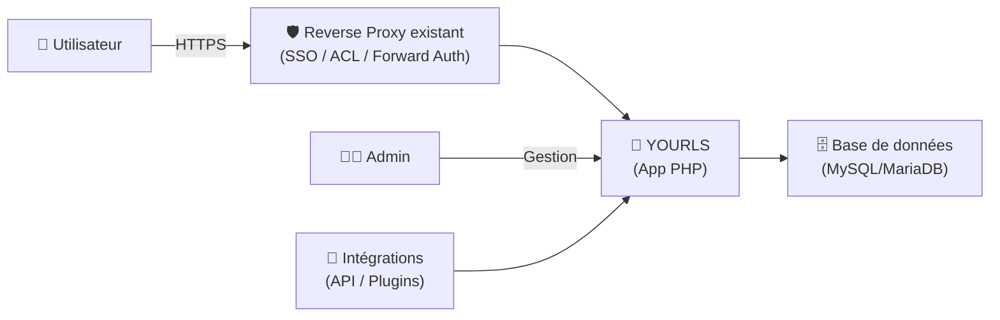

# 🔗 YOURLS — Présentation & Configuration Premium (URL Shortener auto-hébergé)

### “Your Own URL Shortener” : liens courts, contrôle total, stats, plugins, API
Optimisé pour reverse proxy existant • Gouvernance • Anti-abus • Exploitation durable

---

## TL;DR

- **YOURLS** te permet d’héberger **ton propre service de liens courts** (ex: `https://go.domaine.tld/abc`).
- Tu gardes le contrôle : **données**, **logs**, **stats**, **API**, **plugins**.
- Une config premium = **structure de permaliens cohérente**, **auth robuste**, **anti-abus**, **plugins maîtrisés**, **observabilité**, **tests/rollback**.

---

## ✅ Checklists

### Pré-configuration (avant d’ouvrir l’accès)
- [ ] Domaine + URL canonique définis (ex: `https://go.example.tld`)
- [ ] Politique de création : qui peut créer ? public vs privé
- [ ] Convention de slugs : longueur, lisibilité, règles (lowercase, etc.)
- [ ] Politique anti-abus : rate-limit, listes, sécurité admin
- [ ] Plugins nécessaires listés (et uniquement ceux-là)
- [ ] Plan d’export/backup (DB) + procédure de restauration

### Post-configuration (qualité opérationnelle)
- [ ] Redirections OK (301/302) + HTTPS stable via reverse proxy existant
- [ ] Admin accessible + identifiants durcis
- [ ] API testée (si utilisée) + clés gérées proprement
- [ ] Plugins validés (compat + perf)
- [ ] Observabilité minimale : erreurs + accès admin + métriques utiles
- [ ] Procédure “Validation / Rollback” documentée

---

> [!TIP]
> YOURLS est idéal pour : liens internes d’équipe, tracking simple, QR codes, redirections “vivantes” (tu changes la cible sans changer le lien court).

> [!WARNING]
> Si tu rends la création publique, tu deviens une cible à spam/phishing. Prévois **anti-abus + modération + rate-limit**.

> [!DANGER]
> La zone `/admin` et l’API sont sensibles : protège-les (auth forte / SSO / ACL) et évite toute exposition “ouverte”.

---

# 1) YOURLS — Vision moderne

YOURLS n’est pas juste “un raccourcisseur”.

C’est :
- 🧭 Un **routeur de redirections** (mapping slug → URL)
- 📊 Un **outil de stats** (clics, référents, etc.)
- 🧩 Une **plateforme extensible** (plugins)
- 🔌 Une **API** (intégrations CI, bots, outils internes)

Projet officiel : https://github.com/YOURLS/YOURLS

---

# 2) Architecture globale



---

# 3) Modèles d’usage (choisis ton mode)

## Mode A — Privé (recommandé par défaut)
- Création de liens réservée à des utilisateurs authentifiés
- Meilleur ratio sécurité / effort
- Moins de bruit dans les stats

## Mode B — Public contrôlé
- Création publique possible **mais** avec :
  - rate-limit
  - anti-spam (captcha / allowlist domaines / modération)
  - surveillance + purge
- À réserver aux cas d’usage maîtrisés

---

# 4) Gouvernance premium (la doc qui évite le chaos)

## Convention de slugs (recommandée)
Objectif : lisible, stable, mémorisable.

Exemples :
- `onboarding`
- `vpn`
- `status`
- `runbook-redis`
- `prd-incident-2026-03-02`

Règles simples :
- lowercase
- tirets `-`
- éviter `_` et caractères spéciaux
- éviter les slugs “trop courts” si public

## Politique de redirection
- **301** (permanent) pour des liens stables
- **302** (temporaire) si tu changes souvent la cible et veux éviter cache agressif

---

# 5) Sécurité & anti-abus (sans recettes firewall)

## Surface à protéger (priorité)
- `/admin`
- endpoints API (si activés)
- création de liens (surtout si public)

## Bonnes pratiques “premium”
- ✅ Accès admin derrière contrôle d’accès (SSO/ACL) via reverse proxy existant
- ✅ Mots de passe forts + rotation si équipe large
- ✅ Secrets/“salts” uniques (tokens/cookies) et gardés hors du code
- ✅ Logs d’accès admin + alertes sur anomalies
- ✅ Limiter création : allowlist de domaines autorisés si possible
- ✅ Rate-limit au niveau reverse proxy existant (ou middleware)

> [!TIP]
> Si ton cas d’usage est interne, **désactive tout ce qui ressemble à du public** : tu gagnes en sécurité et en sérénité.

---

# 6) Plugins (puissance, mais discipline)

## Stratégie plugin premium
- Installer **le minimum**
- Vérifier :
  - compat avec ta version
  - maintenabilité (repo actif)
  - impact perf (certaines stats/plugins alourdissent)

Catégories utiles :
- Auth/SSO (selon écosystème)
- Anti-spam / anti-abus (si public)
- UI/UX (si beaucoup d’utilisateurs)
- Intégrations (Slack/Discord/CI)

> [!WARNING]
> Les plugins sont le point d’entrée classique des problèmes (sécurité/perf). Traite-les comme du code en prod.

---

# 7) Observabilité (ce qui te sauve en incident)

## Ce qu’il faut voir rapidement
- erreurs applicatives (500, exceptions)
- spikes de création de liens (spam)
- spikes de clics sur un slug (abuse/phishing)
- accès admin (tentatives, IPs, user agents)

## “Dashboard mental” (questions à se poser)
- Le service redirige-t-il encore correctement ?
- Les slugs critiques (`status`, `vpn`, `docs`) répondent-ils ?
- Y a-t-il une campagne de spam (pics soudains) ?
- Les stats sont-elles cohérentes (pas d’explosion artificielle) ?

---

# 8) Validation / Tests / Rollback

## Tests de validation (smoke tests)
```bash
# 1) Un slug connu redirige correctement
curl -I https://go.example.tld/status | head

# 2) L'admin est accessible (sans révéler plus que nécessaire)
curl -I https://go.example.tld/admin | head
```

## Tests fonctionnels (manuel)
- créer un lien (si tu as le droit)
- vérifier :
  - redirection
  - slug exact
  - stats qui montent (1 clic = 1)
  - permissions (un non-admin ne doit pas tout voir)

## Rollback (stratégie simple)
- rollback “code/app” : revenir à une version précédente (image/tag ou release)
- rollback “data” : restaurer DB depuis backup
- rollback “plugins” : désactiver le plugin fautif, vider caches si nécessaire

> [!TIP]
> Avant toute mise à jour : snapshot DB + export de config + liste des plugins actifs.

---

# 9) Erreurs fréquentes

- ❌ Création publique sans rate-limit → spam & réputation du domaine détruite
- ❌ Admin exposé sans SSO/ACL → brute force
- ❌ Trop de plugins → instabilité/perf
- ❌ Pas de backups DB → perte irréversible
- ❌ Slugs non gouvernés → chaos (doublons, incohérences, liens “jetables”)

---

# 10) Sources — Images Docker (format “URLs brutes”)

## 10.1 Image officielle (Docker Official Image)
- `yourls` (Docker Hub) : https://hub.docker.com/_/yourls  
- Repo officiel des images conteneurs (référence de l’image) : https://github.com/YOURLS/containers  
- Repo YOURLS (application) : https://github.com/YOURLS/YOURLS  
- Repo “docker-library-official-images” (process image officielle) : https://github.com/YOURLS/docker-library-official-images  
- Package GitHub Container Registry (GHCR) : https://github.com/orgs/YOURLS/packages/container/package/yourls  

## 10.2 Images communautaires (alternatives fréquentes)
- `tiredofit/yourls` (Docker Hub) : https://hub.docker.com/r/tiredofit/yourls  
- `guessi/docker-yourls` (Docker Hub) : https://hub.docker.com/r/guessi/docker-yourls/  

## 10.3 LinuxServer.io (LSIO)
- Catalogue LSIO (pour vérifier si une image existe) : https://www.linuxserver.io/our-images  
- À ce jour, YOURLS n’apparaît pas comme image LSIO dédiée dans le catalogue (à revérifier via la page ci-dessus).

---

# ✅ Conclusion

YOURLS est une brique simple mais “prod-grade” si tu :
- verrouilles l’accès admin/API,
- cadres la création de liens (gouvernance + anti-abus),
- maîtrises les plugins,
- testes et sais rollback.

Résultat : un “go/” fiable, propre, durable — sans dépendre de services tiers.