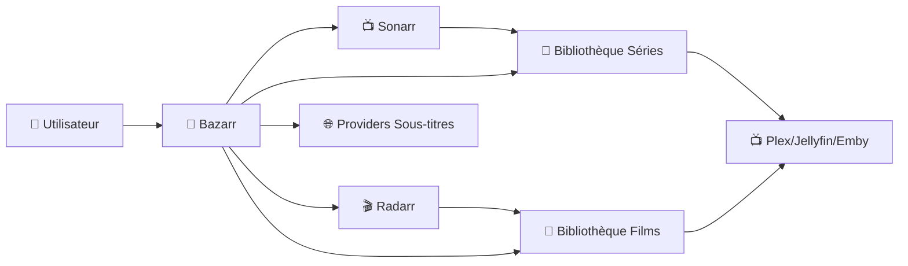
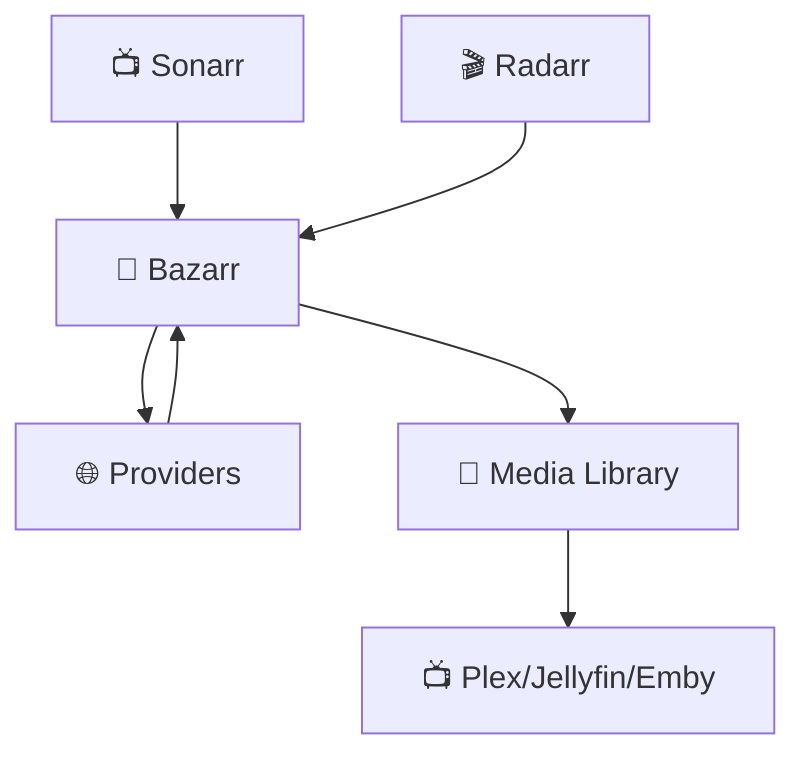

# 🧩 Bazarr — Présentation & Configuration Premium (Sans Docker Compose / Sans Nginx)

### Sous-titres automatisés pour Sonarr & Radarr
Optimisé pour Reverse Proxy existant • Qualité maîtrisée • Langues & Providers • Exploitation durable

---

## TL;DR

- **Bazarr** télécharge automatiquement des **sous-titres** pour tes médias, en s’intégrant à **Sonarr** (séries) et **Radarr** (films).
- Il surveille ta bibliothèque et récupère les subs manquants via des **providers** (OpenSubtitles, Subf2m, Addic7ed, etc.).
- Une config premium = **langues bien définies**, **providers fiables**, **anti-spam**, **synchronisation**, **monitoring**, **sécurité d’accès**.

---

## ✅ Checklists

### Pré-requis (avant installation)
- [ ] Sonarr et/ou Radarr fonctionnels
- [ ] Accès réseau stable vers Bazarr (même LAN/VPS)
- [ ] Chemins de bibliothèques **cohérents** (mêmes chemins vus par Bazarr et Sonarr/Radarr)
- [ ] Providers choisis + identifiants prêts (OpenSubtitles, etc.)
- [ ] Stratégie langues (ex: FR + EN forced)
- [ ] Accès sécurisé (reverse proxy existant, VPN, authent externe)

### Post-installation (validation)
- [ ] Bazarr voit bien Sonarr/Radarr via API
- [ ] Scan bibliothèque OK, index sans erreurs
- [ ] Test “Search missing subtitles” OK
- [ ] Sous-titres téléchargés dans le bon dossier (ou à côté du média)
- [ ] Permissions fichiers correctes (lecture/écriture)
- [ ] Logs propres (pas de boucle d’erreurs provider)

---

> [!TIP]
> Bazarr est le plus efficace quand tu as une **organisation de fichiers propre** (SSDV2, chemins stables) et des **providers bien scorés**.

> [!WARNING]
> Le problème #1 = **chemins incohérents** (Bazarr ne trouve pas les fichiers) → 80% des bugs viennent de là.

> [!DANGER]
> Ne mets pas Bazarr en accès public sans contrôle d’accès (auth, VPN, forward-auth). Les providers/clé API + la surface web = cible facile.

---

# 1) Bazarr — Vision moderne

Bazarr n’est pas un “téléchargeur de sous-titres”.

C’est :
- 🔁 Un **automateur** (subs manquants / upgrades)
- 🧠 Un **moteur de décision** (langue, forced, hearing-impaired, qualité)
- 🔗 Un **connecteur** Sonarr/Radarr (bibliothèques, épisodes, films)
- 🧰 Un **outil d’exploitation** (logs, planification, scans)

Il connecte :
- Sonarr/Radarr (sources de vérité)
- Providers de sous-titres
- Bibliothèques (stockage)
- Media server (Plex/Jellyfin/Emby)

---

# 2) Architecture globale



---

# 3) Philosophie premium (5 piliers)

1. 🌍 **Langues & règles forced** (priorités claires)
2. 🧩 **Providers fiables** + anti-spam + quotas
3. 🧭 **Chemins cohérents** (mapping parfait)
4. 🔄 **Planification saine** (scan, sync, retry)
5. 🛡️ **Sécurisation d’accès** (pas d’exposition directe)

---

# 4) Installation (sans compose)

## Option A — Docker “run” (si tu utilises Docker mais pas Compose)
> Exemple générique : adapte chemins, user, ports selon ton système.

```bash
docker run -d \
  --name=bazarr \
  -e PUID=1000 -e PGID=1000 -e TZ=Europe/Paris \
  -p 6767:6767 \
  -v /opt/bazarr/config:/config \
  -v /data/media:/data/media \
  --restart unless-stopped \
  lscr.io/linuxserver/bazarr:latest
```

## Option B — Installation native (Linux)
> Dépend de ta distro (apt, dockerless, etc.). Le point clé : **service + permissions + chemins**.

Checklist rapide :
- [ ] service systemd
- [ ] user dédié (ex: `bazarr`)
- [ ] accès RW sur dossiers média
- [ ] port exposé localement uniquement + reverse proxy existant

---

# 5) Configuration Bazarr (Premium)

## 5.1 Connexion Sonarr / Radarr (API)

Dans **Settings → Sonarr** :
- Host : `sonarr` (ou IP)
- Port : `8989`
- API Key : depuis Sonarr → Settings → General
- URL Base : vide (sauf si tu as un subpath)
- **Test** : doit être “OK”

Dans **Settings → Radarr** :
- Host : `radarr` (ou IP)
- Port : `7878`
- API Key : depuis Radarr → Settings → General
- Test : “OK”

> [!WARNING]
> Si tu utilises un reverse proxy en subpath (ex: `/sonarr`), respecte les URL Base. Une erreur ici = sync cassée.

---

## 5.2 Chemins (LE point critique)

### Règle d’or
Bazarr doit voir **exactement** les mêmes fichiers que Sonarr/Radarr.

Exemples recommandés (SSDV2) :
- Séries : `/data/media/tv`
- Films : `/data/media/movies`

Si Bazarr “voit” `/data/media/...` mais Sonarr voit `/tv/...` :
➡️ configure un **Path Mapping** dans Bazarr.

### Path Mappings (si nécessaire)
Dans **Settings → Path Mappings** :
- Sonarr path : `/tv`
- Bazarr path : `/data/media/tv`

- Radarr path : `/movies`
- Bazarr path : `/data/media/movies`

> [!TIP]
> Un mapping propre = zéro “not found” + sous-titres collés au bon fichier.

---

## 5.3 Langues (stratégie premium)

### Stratégie recommandée (FR + EN)
- Primary : **French**
- Secondary : **English**
- Forced : **English Forced** (optionnel selon besoin)
- Hearing impaired : désactivé sauf besoin

### Pourquoi cette stratégie marche
- FR = confort
- EN = fallback (souvent plus rapide et mieux synchronisé)
- Forced = scènes non traduites / alien language

> [!WARNING]
> Si tu demandes trop de variantes (FR/FR forced/EN/EN forced/HI…), tu augmentes la charge providers + risques de faux positifs.

---

## 5.4 Providers (qualité, fiabilité, limites)

Providers fréquents :
- OpenSubtitles (souvent indispensable)
- Subf2m (FR)
- Addic7ed (souvent séries, dépend des accès)
- Podnapisi (varié)
- Supersubtitles (selon langues)

### Scoring premium (logique)
Prioriser :
1. ✅ “Matched by hash” (quand possible)
2. ✅ “Matched by filename”
3. ✅ Haute note / bon uploaders
4. ✅ Release group correspondant

Éviter :
- sous-titres “auto” non relus
- releases mal taggées
- “LQ” / “cam” / “ts” (si ta bibliothèque est propre)

> [!TIP]
> Moins de providers, mais bien configurés, donne souvent de meilleurs résultats qu’une liste énorme.

---

## 5.5 Formats & nommage des sous-titres

Recommandations :
- Format : `.srt` (compat universelle)
- UTF-8
- Nom à côté du média :
  - `Movie (2021).fr.srt`
  - `Show.S01E01.en.srt`

Options premium :
- “Use language code in filename” ✅
- “Single subtitle per language” ✅
- “Upgrade subtitles” ✅ (si tu veux remplacer une version mauvaise)

---

# 6) Automatisation & Planification (éviter la surcharge)

## Scheduling recommandé
- Sync Sonarr/Radarr : toutes les 10–30 min
- Scan bibliothèque : 1–2 fois/jour
- Search missing : quotidien (ou hebdo si gros volume)
- Retry providers : laisser Bazarr gérer, mais éviter le spam

> [!WARNING]
> Trop de scans = bannissement providers / throttling. Ajuste selon ta taille de bibliothèque.

---

# 7) Sécurisation (sans Nginx, mais principes essentiels)

## Accès réseau
- Expose Bazarr **uniquement** sur le LAN / via reverse proxy existant / VPN.
- Bloque le port 6767 depuis Internet (firewall).

### UFW baseline (si tu l’utilises)
```bash
sudo ufw default deny incoming
sudo ufw default allow outgoing
sudo ufw allow OpenSSH

# Autoriser Bazarr uniquement en LAN (ex: 192.168.1.0/24)
sudo ufw allow from 192.168.1.0/24 to any port 6767 proto tcp

sudo ufw enable
sudo ufw status verbose
```

## Auth
- Active l’auth interne si disponible dans ton setup
- Ou utilise une auth externe (forward-auth) via ton reverse proxy existant
- Ou impose accès via VPN/WireGuard

> [!DANGER]
> Ne laisse pas Bazarr ouvert “sans auth” sur un domaine public, même en HTTPS.

---

# 8) Validation / Tests / Rollback

## Smoke tests
```bash
# Service répond
curl -I http://127.0.0.1:6767 | head

# Logs (chercher erreurs providers)
docker logs --tail=200 bazarr 2>/dev/null || true
```

## Tests fonctionnels
- Dans Bazarr : lancer “Search missing subtitles”
- Vérifier qu’un `.srt` est bien créé à côté d’un fichier média
- Vérifier la langue et la synchro sur 1 épisode/film test

## Rollback
- Avant mise à jour : backup du dossier config
- Revenir à une version d’image précédente (si Docker) :
  - pinner `lscr.io/linuxserver/bazarr:<version>`
- Restaurer config + redémarrer

---

# 9) Erreurs fréquentes (et fixes)

## “Bazarr ne trouve pas les fichiers”
Cause : paths/mappings
Fix :
- vérifier chemins vus par Sonarr/Radarr
- corriger Path Mappings
- vérifier permissions RW

## “Providers échouent / throttling”
Cause : trop de requêtes / mauvais identifiants
Fix :
- réduire schedule
- vérifier login/API
- limiter providers

## “Subs mauvais / désynchronisés”
Cause : mauvais match / release group différent
Fix :
- activer priorités hash/filename
- ajuster scoring
- limiter formats “auto”

---

# 10) Priorités 30 / 60 / 90 jours

## 0–30 jours : fiabilité
- [ ] Intégration Sonarr/Radarr stable (tests OK)
- [ ] Langues définies + forced si besoin
- [ ] 1–2 providers solides + creds valides
- [ ] Mapping chemins parfait
- [ ] Sécurité réseau (port non exposé)

## 31–60 jours : qualité
- [ ] Scoring affiné (hash > filename > rating)
- [ ] Upgrade subs activé (si souhaité)
- [ ] Ajustement schedules (pas de spam)
- [ ] Monitoring logs + alerting simple

## 61–90 jours : excellence
- [ ] Process “quality review” (échantillonnage mensuel)
- [ ] Nettoyage des subs doublons
- [ ] Documentation interne : conventions, providers, dépannage
- [ ] Plan de rollback testé

---

# 11) Workflow final optimisé



---

# ✅ Conclusion

Bazarr “premium”, c’est :
- 🌍 langues bien pensées
- 🧭 paths propres + mappings impeccables
- 🧩 providers fiables, sans spam
- 🔄 automatisation raisonnable
- 🛡️ accès sécurisé

Résultat :
- ✔ sous-titres présents automatiquement
- ✔ meilleure synchro et qualité
- ✔ moins d’intervention manuelle
- ✔ écosystème media plus propre et durable