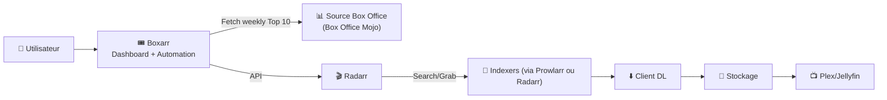
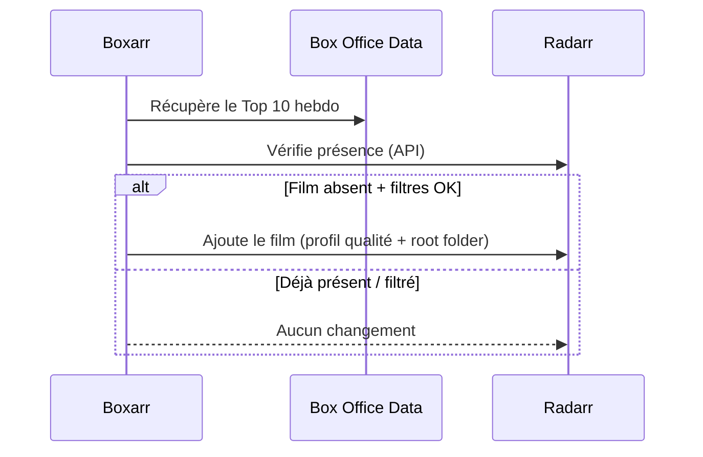

# 🎟️ Boxarr — Présentation & Configuration Premium (Box Office → Radarr)

### Automatisation “mainstream” : top box-office hebdo, vérification Radarr, ajout intelligent, dashboard clair
Optimisé pour reverse proxy existant • Filtres avancés • Root folders par genre • Exploitation durable

---

## TL;DR

- **Boxarr** suit chaque semaine le **Top 10 box-office** et s’intègre à **Radarr** pour **vérifier** si les films sont déjà présents et **ajouter** automatiquement ceux qui manquent. :contentReference[oaicite:0]{index=0}
- C’est un complément “mainstream coverage” : **zéro requêtes utilisateurs**, ça maintient la médiathèque pertinente en continu. :contentReference[oaicite:1]{index=1}
- Une config premium = **filtres propres**, **profil qualité maîtrisé**, **prévention des doublons**, **schedule raisonnable**, **tests + rollback**.

---

## ✅ Checklists

### Pré-configuration (avant d’activer l’auto-add)
- [ ] Radarr OK (accès API, profils qualité, root folders prêts)
- [ ] Stratégie “mainstream” définie : garder combien de films ? quels genres ? quelles années ?
- [ ] Politique “family-friendly” (exclure horreur/genres non désirés, ratings minimum)
- [ ] Choix du comportement : **auto-add ON** ou **review manuel** (si dispo dans ton usage)
- [ ] Accès web sécurisé (reverse proxy existant / SSO / ACL) — pas d’exposition brute

### Post-configuration (qualité opérationnelle)
- [ ] Boxarr communique avec Radarr (test API OK)
- [ ] Aucun doublon ajouté (contrôle via Radarr API)
- [ ] Les films ajoutés vont dans le bon root folder (option par genre si activée)
- [ ] Le schedule hebdo se déclenche comme prévu
- [ ] Logs propres (pas d’erreurs Box Office source / pas de boucles)

---

> [!TIP]
> Boxarr est idéal quand ta médiathèque sert des proches : ça maintient un socle “blockbusters récents” sans demandes.

> [!WARNING]
> Le vrai risque est “l’auto-add non maîtrisé” : sans filtres, tu peux polluer Radarr (genres non voulus, trop de titres).

> [!DANGER]
> Les dashboards/logs peuvent exposer ton catalogue et des infos réseau. Traite Boxarr comme une appli interne : auth + périmètres.

---

# 1) Boxarr — Vision moderne

Boxarr, ce n’est pas “un énième outil Arr”.

C’est :
- 📈 Un **tracker box-office** (hebdomadaire)
- 🔗 Un **connecteur Radarr** (vérifie / ajoute / gère)
- 🧠 Un **moteur de sélection** via filtres (genre, rating, année…)
- 🗂️ Un **organisateur** (root folders par genre) :contentReference[oaicite:2]{index=2}

Pourquoi pas juste Radarr Lists ?
- Boxarr s’appuie sur des données box-office (mainstream “prouvé”), rafraîchies hebdo, avec prévention de doublons via l’API Radarr. :contentReference[oaicite:3]{index=3}

---

# 2) Architecture globale



Données box-office : Boxarr indique utiliser Box Office Mojo. :contentReference[oaicite:4]{index=4}

---

# 3) Fonctionnement (cycle hebdo)



Concept “weekly tracking + Radarr integration + scheduled updates” : :contentReference[oaicite:5]{index=5}

---

# 4) Configuration premium (ce qui compte vraiment)

## 4.1 Intégration Radarr (API)
Dans l’assistant / settings Boxarr :
- URL Radarr (interne) + API Key Radarr
- Vérifier que Boxarr peut lire :
  - profils qualité
  - root folders
  - films existants (pour éviter doublons) :contentReference[oaicite:6]{index=6}

> [!TIP]
> Utilise une URL “réseau interne” (container network / LAN) plutôt qu’un domaine public.

---

## 4.2 Profils qualité (stratégie “mainstream”)
Approche recommandée :
- 1 profil “Mainstream 1080p” (ou 2160p si tu assumes le stockage)
- Upgrade autorisé (si Radarr est bien réglé)
- Limites de taille cohérentes (éviter les releases trop compressées)

Objectif : Boxarr ajoute, **Radarr décide** de la qualité.

---

## 4.3 Filtres avancés (le cœur premium)
Boxarr mentionne des filtres avancés (genre, rating, année). :contentReference[oaicite:7]{index=7}

Stratégies qui marchent :
- **Fenêtre temporelle** : ex. année courante + année précédente
- **Rating minimum** : évite une partie des “flops” (selon tes goûts)
- **Genres exclus** : ex. Horror si family server
- **Limiter l’auto-add** : top 10 uniquement (déjà le design), ou seulement certains genres

> [!WARNING]
> Commence conservateur : filtres stricts → tu desserres ensuite. L’inverse crée du ménage.

---

## 4.4 Root folders par genre (organisation)
Boxarr liste “Genre-Based Root Folders”. :contentReference[oaicite:8]{index=8}

Bon usage :
- `Movies/Action`, `Movies/Animation`, `Movies/Family`, etc.
- Avantage : tri simple + quotas possibles + délégation plus facile

> [!TIP]
> Si tu utilises déjà une structure unique “Movies/”, active l’option par genre uniquement si tu en as un vrai besoin (sinon complexité inutile).

---

## 4.5 Schedule (sans se faire piéger)
Boxarr “runs weekly on your preferred schedule”. :contentReference[oaicite:9]{index=9}

Recommandation :
- 1 exécution hebdo (logique box-office)
- Évite de relancer trop souvent : pas de gain, juste du bruit

---

# 5) Workflows premium (exploitation)

## 5.1 Mode “Review puis Add”
Si ton usage/ta gouvernance le nécessite :
- Boxarr sert de **radar** (top 10 + statuts dans Radarr)
- tu valides manuellement l’ajout (quand tu veux garder la main)

## 5.2 Mode “Auto-add silencieux”
Pour family server :
- auto-add ON
- filtres stricts
- 1 audit mensuel “qu’est-ce qui est entré ?”

---

# 6) Validation / Tests / Rollback

## Validation (smoke tests)
```bash
# 1) UI répond (selon ton URL interne/externe)
curl -I https://boxarr.example.tld | head

# 2) Vérifier que Radarr est joignable depuis l’environnement Boxarr
# (à adapter selon ton contexte réseau)
curl -s http://RADARR_HOST:7878/api/v3/system/status -H "X-Api-Key: RADARR_API_KEY" | head
```

## Tests fonctionnels (1 run contrôlé)
- Vérifie le Top 10 affiché
- Vérifie le statut “déjà dans Radarr / absent”
- Force un “dry run” (ou désactive l’auto-add) si tu veux observer sans écrire
- Ajoute 1 film test → confirmer :
  - bon profil qualité
  - bon root folder
  - pas de doublon

## Rollback (propre)
- Désactiver auto-add (immédiat)
- Supprimer la “liste des films ajoutés récemment” depuis Radarr (si tu veux nettoyer)
- Revenir à des filtres plus stricts
- En dernier recours : restaurer un snapshot Radarr (si tu en as)

> [!TIP]
> Le rollback le plus efficace = “auto-add OFF” + “filtres stricts” + audit.

---

# 7) Sources — Images Docker

## 10.1 Image officielle (GHCR)
- `ghcr.io/iongpt/boxarr:latest` (registry GHCR) : https://ghcr.io/iongpt/boxarr  
- Doc du projet (référence image) : https://github.com/iongpt/boxarr  
- Repo GitHub (upstream) : https://github.com/iongpt/boxarr

## LinuxServer.io (LSIO)
- À date, **pas d’image Boxarr officielle LSIO** listée dans leur catalogue d’images. :contentReference[oaicite:12]{index=12}

---

# ✅ Conclusion

Boxarr est une brique “mainstream automation” :
- il suit le box-office,
- compare avec Radarr,
- et ajoute intelligemment selon tes règles. :contentReference[oaicite:13]{index=13}

En premium : filtres + profils qualité + organisation + tests/rollback → **zéro pollution** et une médiathèque qui reste “pertinente” toute seule.