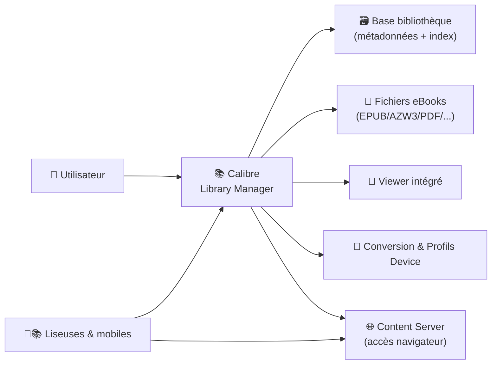
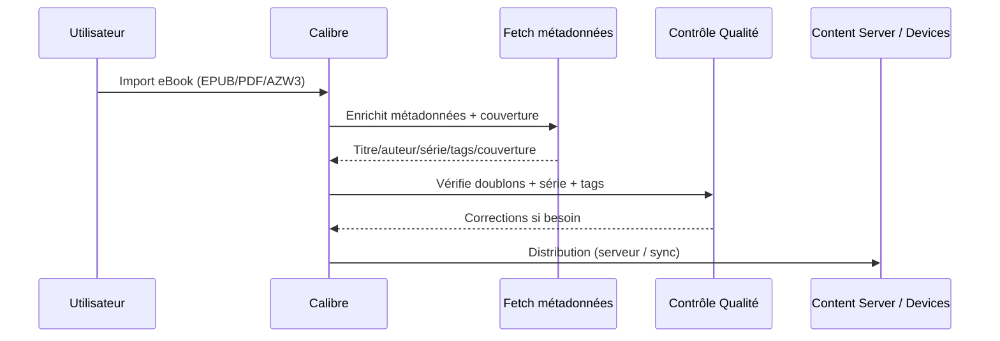

# 📚 Calibre — Présentation & Exploitation Premium (Bibliothèque eBooks + Conversion + Serveur)

### La “source de vérité” pour vos eBooks : catalogage, métadonnées, conversion, lecture, serveur web
Optimisé pour bibliothèque durable • Gouvernance • Qualité des métadonnées • Workflows pro

---

## TL;DR

- **Calibre** = gestionnaire de bibliothèque eBooks : **catalogue**, **métadonnées**, **conversion**, **lecture**, **synchronisation appareils**. :contentReference[oaicite:0]{index=0}  
- Bonus : **Content Server** intégré pour exposer votre bibliothèque via navigateur (accès + lecture). :contentReference[oaicite:1]{index=1}  
- Approche premium : **standards de métadonnées + workflow d’ingestion + contrôles qualité + tests + rollback**.

---

## ✅ Checklists

### Pré-usage (bibliothèque saine)
- [ ] Définir la structure : 1 bibliothèque “master” vs plusieurs (ex: Pro / Perso / Comics)
- [ ] Choisir les formats cibles (ex: EPUB pivot, AZW3 pour Kindle)
- [ ] Fixer un standard de métadonnées (titres, séries, auteurs, tags)
- [ ] Définir la politique couvertures (qualité, ratio, sources)
- [ ] Décider : exposition via **Content Server** ou accès local uniquement

### Post-configuration (qualité & durabilité)
- [ ] Import propre (doublons gérés, normalisation noms/auteurs)
- [ ] Conversions reproductibles (profils device, règles CSS si besoin)
- [ ] Recherche efficace (tags/séries cohérents)
- [ ] Content Server : accès validé + expérience lecture OK
- [ ] Backups testés + rollback documenté

---

> [!TIP]
> Calibre devient “premium” quand tu traites la bibliothèque comme un **produit** : règles claires, cohérence, revue régulière, et changements contrôlés.

> [!WARNING]
> Les 3 tueurs de bibliothèque : **doublons**, **métadonnées incohérentes**, **séries mal ordonnées**.

> [!DANGER]
> Évite les opérations massives (cleanup/conversions/imports en lot) sans filet : snapshot/backup avant, test sur échantillon, puis généralisation.

---

# 1) Calibre — Vision moderne

Calibre n’est pas “un lecteur d’eBooks”.

C’est :
- 🗂️ Un **gestionnaire de bibliothèque** (catalogage multi-formats)
- 🧠 Un **moteur de métadonnées** (récupération/enrichissement)
- 🔁 Un **convertisseur** (EPUB, AZW3, etc.)
- 📖 Un **viewer** (lecture avec fonctions avancées)
- 🌐 Un **serveur de contenu** (Content Server) :contentReference[oaicite:2]{index=2}

---

# 2) Architecture globale



---

# 3) Philosophie de configuration premium (5 piliers)

1. 🧾 **Métadonnées cohérentes** (auteurs, titres, séries, tags)
2. 🧱 **Formats maîtrisés** (format pivot + formats de sortie)
3. 🔎 **Découvrabilité** (tags, séries, collections, recherche)
4. 🌐 **Distribution contrôlée** (Content Server, accès, comptes)
5. 🛡️ **Résilience** (backups, tests, rollback)

---

# 4) Modèle de données “pro” (ce qui fait gagner du temps)

## 4.1 Séries (le secret d’une bibliothèque navigable)
- Toujours une **série** + un **index** (ex: `The Expanse [05]`)
- Règle : index **numérique** et stable

> [!TIP]
> Une série bien tenue = tri stable sur liseuses + navigation rapide + moins de doublons “tome 1/01/001”.

## 4.2 Tags (limiter mais standardiser)
Exemples de tags “premium” :
- `genre/sf`, `genre/fantasy`, `genre/tech`
- `status/to-read`, `status/reading`, `status/read`
- `source/kobo`, `source/oreilly`, `source/humble`

Règle : une **taxonomie courte** (20–60 tags max), pas un dumping infini.

## 4.3 Auteurs (normalisation)
- Format cohérent (ex: `Nom, Prénom`)
- Uniformiser variantes (accents, initiales, particules)

---

# 5) Formats & stratégie de conversion (qualité contrôlée)

Calibre gère de nombreux formats et conversions ; la qualité dépend surtout du **format source**. :contentReference[oaicite:3]{index=3}

## 5.1 Stratégie simple (recommandée)
- **Pivot** : EPUB (souvent le plus pratique)
- **Sortie Kindle** : AZW3 (souvent préférable à MOBI selon usages/époques)

## 5.2 Conversions “premium”
- Convertir en lot **après validation** d’un échantillon (5–10 livres)
- Conserver l’original (audit/rollback)
- Appliquer une règle : “une édition master” + variantes en formats secondaires

> [!WARNING]
> PDF → EPUB : résultat souvent variable (mise en page/notes/tableaux). Prévoir contrôle qualité ou conserver PDF en parallèle.

---

# 6) Content Server (accès web à la bibliothèque)

Le **Content Server** permet l’accès à la bibliothèque et la lecture via navigateur (avec fonctions côté web). :contentReference[oaicite:4]{index=4}

## Cas d’usage premium
- Lecture rapide sur mobile/tablette sans app dédiée
- “Kiosque” interne (ebooks de référence / docs d’équipe)
- Accès distant contrôlé (selon votre architecture)

## Gouvernance d’accès (pratique)
- Comptes distincts (admin vs lecteurs)
- Moindre privilège : lecture seule par défaut
- Revue périodique des accès

---

# 7) Workflows premium (import → qualité → distribution)

## 7.1 Workflow “ingestion propre”


## 7.2 Routine “qualité mensuelle” (20 min)
- Rechercher champs vides (auteur, série, tags)
- Vérifier séries importées récemment (index)
- Fusionner tags redondants
- Contrôler couvertures (ratio/résolution)

---

# 8) Validation / Tests / Rollback

## Tests fonctionnels (rapides)
```bash
# 1) Recherche : un auteur + une série doivent remonter instantanément
# 2) Ouvrir 3 livres (sources différentes) dans le viewer :
#    - Table of Contents OK
#    - Recherche OK
#    - Mise en page acceptable
# 3) Content Server (si activé) :
#    - accès bibliothèque
#    - ouverture d’un livre
#    - téléchargement depuis navigateur
```

## Ce qu’il faut sauvegarder (vraiment)
- La **bibliothèque complète** : fichiers + base/métadonnées (sinon tu perds classement, tags, séries, covers, etc.)
- Les réglages si tu veux restaurer une instance à l’identique (option)

## Rollback (principe)
- Snapshot/backup avant :
  - import massif
  - nettoyage tags/auteurs/séries
  - conversions en lot
- Retour à l’état T-1 si :
  - explosion de doublons
  - conversions dégradées
  - taxonomie polluée

---

# 9) Erreurs fréquentes (et remèdes)

- ❌ Doublons après import multi-sources  
  ✅ règle “édition master”, déduplication contrôlée, tags `source/*`

- ❌ Séries mal ordonnées / titres divergents  
  ✅ index numérique strict + routine mensuelle

- ❌ Tags anarchiques  
  ✅ taxonomie courte + fusion/suppression régulière

- ❌ Conversions en lot non vérifiées  
  ✅ validation sur échantillon + rollback prêt

---

# 10) Calibre vs Calibre-Web (clarification utile)

- **Calibre** : gestion complète (bibliothèque, conversion, viewer, Content Server). :contentReference[oaicite:5]{index=5}  
- **Calibre-Web** : application web séparée offrant une interface “bibliothèque/lecture/téléchargement” en s’appuyant sur une base Calibre existante. :contentReference[oaicite:6]{index=6}  

---

# 11) Sources — Images Docker (LinuxServer.io)
## 🐳 Images (noms à utiliser)
```bash
# LinuxServer.io (registry LSIO)
lscr.io/linuxserver/calibre:latest
lscr.io/linuxserver/calibre-web:latest
```

## 🔗 Sources officielles
```bash
# Docs LinuxServer.io
https://docs.linuxserver.io/images/docker-calibre/
https://docs.linuxserver.io/images/docker-calibre-web/

# Docker Hub
https://hub.docker.com/r/linuxserver/calibre
https://hub.docker.com/r/linuxserver/calibre-web

# GitHub (repos)
https://github.com/linuxserver/docker-calibre
https://github.com/linuxserver/docker-calibre-web
```

---

# ✅ Conclusion

Calibre “premium” = bibliothèque gouvernée (métadonnées/séries/tags), conversions maîtrisées, distribution contrôlée, et résilience réelle (backups + rollback).

Si tu me dis : Kindle vs Kobo, formats dominants, taille bibliothèque, et si tu utilises Content Server, je te sors un standard “métadonnées + tags + séries” prêt à appliquer.