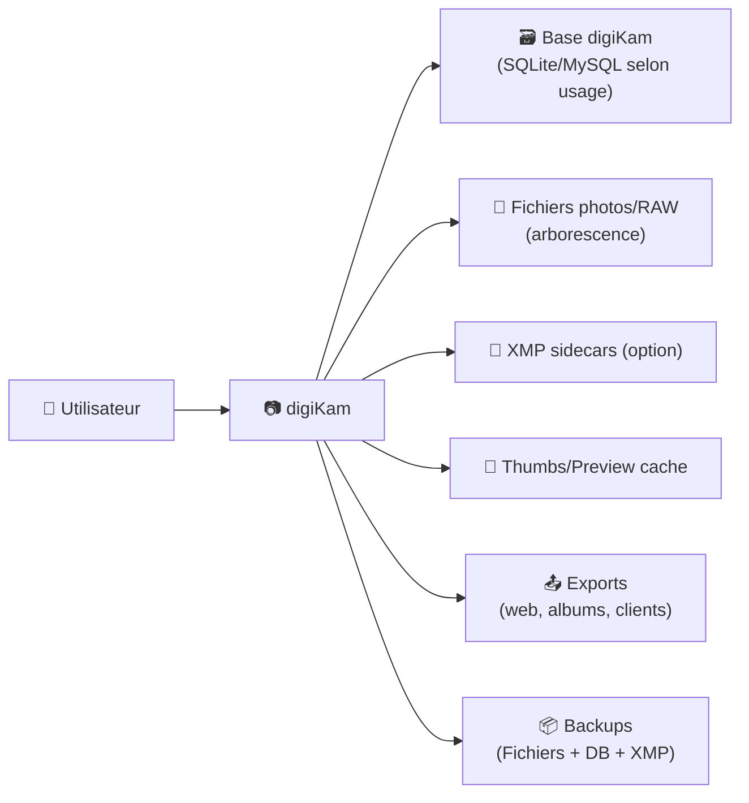
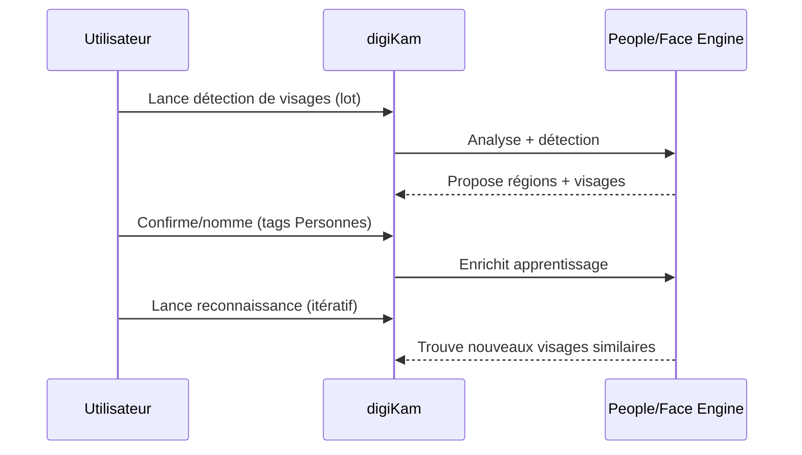

# 📷 digiKam — Présentation & Workflow Premium (Organisation • Métadonnées • Visages • Qualité)

### Gestion photo “pro” open-source : catalogue, tags, RAW, géoloc, face recognition, export
Optimisé pour une bibliothèque durable • Métadonnées maîtrisées • Recherche instantanée • Exploitation fiable

---

## TL;DR

- **digiKam** = gestionnaire de photos avancé (catalogue + albums) avec **métadonnées**, **tags**, **recherche**, **visages**, **RAW**, **batch**.
- Le vrai “premium” n’est pas dans les boutons : c’est dans ton **workflow de métadonnées** (écriture dans les fichiers vs XMP sidecars), tes **conventions** (tags, albums, scores), et tes **routines** (sync, maintenance, backups).
- Objectif : une bibliothèque **portable**, **résiliente**, et **retrouvable** en quelques secondes.

---

## ✅ Checklists

### Pré-usage (avant d’ingérer 50k photos)
- [ ] Choisir : **Albums (dossiers)** vs **Collections** (plusieurs racines)
- [ ] Définir une convention de dossiers (ex: `YYYY/YYYY-MM-DD_Événement/`)
- [ ] Définir une taxonomie tags (ex: Sujet/Lieu/Événement/Personnes)
- [ ] Définir une stratégie métadonnées : **dans le fichier**, **XMP sidecar**, ou **mix**
- [ ] Définir les règles d’import (renommage, doublons, RAW+JPEG)

### Post-configuration (qualité durable)
- [ ] Test “ingestion → tag → recherche → export” sur un lot pilote
- [ ] Vérifier l’écriture métadonnées (fichiers et/ou XMP)
- [ ] Vérifier la cohérence des dates (EXIF vs fichier)
- [ ] Lancer une maintenance initiale (thumbs, reconnaissance, scans)
- [ ] Documenter ton workflow (2 pages max) pour ne pas dériver

---

> [!TIP]
> Une bibliothèque photo “qui dure” = **métadonnées maîtrisées** + **taxonomie stable** + **routines de maintenance**.

> [!WARNING]
> Les choix métadonnées (écrire dans le fichier vs XMP) ont des impacts forts sur la portabilité et la compatibilité. Décide tôt.

> [!DANGER]
> Ne commence pas à tagger massivement avant d’avoir verrouillé :  
> 1) la stratégie métadonnées, 2) la convention de dossiers, 3) la taxonomie tags.

---

# 1) digiKam — Vision moderne

digiKam n’est pas juste “un viewer”.

C’est :
- 🧠 Un **catalogue** (base) + **albums** (dossiers)
- 🏷️ Un moteur **tags / catégories / notes / couleurs**
- 🔎 Une **recherche** puissante (métadonnées, tags, visages, texte)
- 🧬 Une **gestion RAW** + édition + batch
- 🙂 Une **gestion des personnes** (détection + reconnaissance)
- 🌍 Géolocalisation + cartes
- 📤 Export / partage (selon plugins)

---

# 2) Architecture globale (données & flux)



---

# 3) Le cœur “premium” : Métadonnées (le choix qui change tout)

## 3.1 Trois stratégies (et quand les choisir)

### A) Écrire dans le fichier (EXIF/IPTC/XMP intégré)
✅ Portabilité maximale (autres logiciels lisent)  
✅ Moins de fichiers “à côté”  
⚠️ Certains formats (RAW, vidéo) peuvent être plus délicats / non modifiables

### B) XMP sidecar seulement
✅ Très “safe” (pas de modification du média)  
✅ Parfait pour RAW / fichiers en lecture seule  
⚠️ Portabilité : il faut transporter les `.xmp` avec les médias  
⚠️ Certains outils ignorent ou gèrent mal les sidecars

### C) Mix intelligent (recommandé souvent)
- Écrire dans le fichier quand c’est sain
- Sidecar pour RAW / read-only
- Toujours pouvoir **sync** base ↔ fichiers/sidecars

> [!TIP]
> Si tu as plusieurs apps (ex: autres DAM), la stratégie A ou C est généralement plus simple pour la compatibilité.

---

## 3.2 Règle d’or : “DB ≠ vérité unique”
Considère 3 états :
- **Base digiKam** (catalogue)
- **Fichiers** (EXIF/IPTC/XMP intégrés)
- **XMP sidecars** (si activés)

Objectif premium :
- pouvoir **reconstruire** la base à partir des métadonnées stockées
- ne jamais dépendre d’un seul “point de vérité” fragile

---

# 4) Organisation Premium (dossiers + albums + collections)

## 4.1 Convention dossiers recommandée
Exemple simple et robuste :

- `Photos/2026/2026-02-27_Paris/`
- `Photos/2025/2025-08-15_Vacances/`

Avantages :
- tri naturel
- portable
- compréhensible hors logiciel

## 4.2 Albums vs tags
- **Albums** = structure physique (où est le fichier)
- **Tags** = structure logique (ce que c’est)

Premium = tu relies les deux :
- Album = “Événement”
- Tags = “Personnes / Lieux / Sujet / Projet”

---

# 5) Taxonomie tags (éviter le chaos)

## 5.1 Modèle “4 axes”
- **Personnes/**
- **Lieux/**
- **Événements/**
- **Sujets/** (ex: “Architecture”, “Cuisine”, “Concert”)

## 5.2 Règles simples
- Pas de doublons (“Paris” dans 3 endroits)
- Hiérarchie > tags plats
- Noms stables (pas de renames tous les mois)

> [!WARNING]
> Renommer/migrer des tags à grande échelle est faisable, mais coûteux (temps + risques d’incohérence).

---

# 6) Personnes (détection + reconnaissance) : workflow propre



Premium tips :
- commencer par un **lot représentatif**
- confirmer proprement (qualité > quantité)
- relancer plusieurs passes : l’IA est cumulative

---

# 7) Recherche & “retrouvabilité” (objectif : 5 secondes)

## Combos gagnants
- Tags (personne + lieu + sujet)
- Date/intervalle (timeline)
- Notes/étoiles + labels couleur
- Métadonnées (boîtier, objectif, focale)
- People view (visages)

> [!TIP]
> Mets en place 2–3 “requêtes favorites” :  
> “Meilleures photos (⭐4+) de 2025”, “Personne X + Lieu Y”, “Objectif 35mm”.

---

# 8) Maintenance & Qualité (ce qui évite les surprises)

## Routines recommandées
- Reconstruction/validation miniatures (si cache corrompu)
- Scan incohérences (doublons, fichiers manquants)
- Synchronisation métadonnées (DB ↔ fichiers/sidecars)
- Maintenance People/Visages (rebuild training si besoin)

> [!WARNING]
> Sur très grosses bibliothèques, fais les opérations lourdes en horaires creux.

---

# 9) Validation / Tests / Rollback (mode pro)

## Tests de validation (lot pilote)
- Import 200 photos
- Appliquer tags + note + géoloc
- Écrire métadonnées (fichier et/ou XMP selon stratégie)
- Rechercher via 3 axes (date + tag + personne)
- Exporter un album (ou un lot) et vérifier que les métadonnées suivent

## Rollback (si tu changes de stratégie métadonnées)
- Stopper les opérations automatiques
- Faire un **backup** (DB + fichiers + XMP)
- Changer un seul paramètre à la fois
- Re-synchroniser et re-tester sur un lot
- Si dérive : restaurer backup + revenir au paramètre précédent

---

# 10) Sources — URLs en bash (comme demandé)

```bash
# digiKam (site officiel)
echo "https://www.digikam.org/"

# Annonce release (exemple : 8.6.0) — utile pour vérifier features & évolutions
echo "https://www.digikam.org/news/2025-03-15-8.6.0_release_announcement/"

# Documentation officielle (métadonnées)
echo "https://docs.digikam.org/en/setup_application/metadata_settings.html"

# Documentation : organiser & retrouver (workflow + metadata save)
echo "https://docs.digikam.org/en/asset_management/organize_find.html"

# Documentation : détection/reconnaissance des visages (maintenance)
echo "https://docs.digikam.org/en/maintenance_tools/maintenance_faces.html"

# Code source digiKam (GitHub KDE)
echo "https://github.com/KDE/digikam"

# Documentation (repo source)
echo "https://github.com/KDE/digikam-doc"

# Image Docker LinuxServer.io (si tu en as besoin — source images docker)
echo "https://docs.linuxserver.io/images/docker-digikam/"
echo "https://hub.docker.com/r/linuxserver/digikam"
echo "https://github.com/linuxserver/docker-digikam"
echo "https://github.com/orgs/linuxserver/packages/container/package/digikam"
```