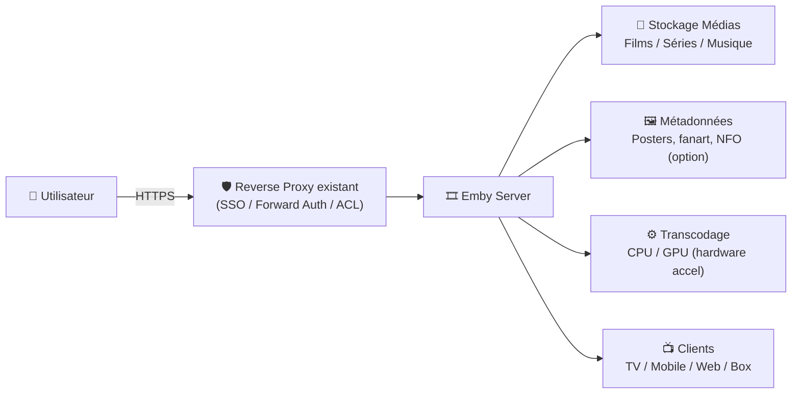
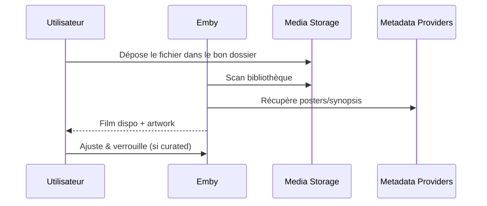

# 🎞️ Emby — Présentation & Configuration Premium (Exploitation + Qualité + Sécurité)

### Media server “hub” : bibliothèques propres, métadonnées maîtrisées, transcodage optimisé, accès gouverné
Optimisé pour reverse proxy existant • Multi-users • Parental control • Hardware accel • Backups & Rollback

---

## TL;DR

- **Emby** centralise tes médias (films/séries/musique/photos) et les diffuse vers TV, mobiles, apps, navigateurs.
- Le “premium” Emby = **bibliothèques propres**, **métadonnées verrouillées quand il faut**, **accès utilisateurs gouverné**, **transcodage maîtrisé (hardware accel)**, **tests & rollback**.
- Emby est excellent si tu veux un **contrôle fin** (users, tags, restrictions, qualité remote) et une expérience client riche.

---

## ✅ Checklists

### Pré-configuration (avant d’inviter des utilisateurs)
- [ ] Conventions de dossiers/noms stables (films/séries)
- [ ] Stratégie de métadonnées : “auto” vs “curated” (verrouillage)
- [ ] Stratégie d’accès : LAN/VPN/SSO via reverse proxy existant
- [ ] Stratégie transcodage : direct play d’abord, hardware accel si besoin
- [ ] Stratégie sous-titres : intégrés, externes, forced, préférences par user
- [ ] Plan sauvegarde/restauration validé (config + DB + assets)

### Post-configuration (go-live)
- [ ] 2–3 users tests (admin + adulte + enfant) validés
- [ ] Lecture sur 3 appareils différents (TV + mobile + web) validée
- [ ] Un film “lourd” (4K/HDR) testé en direct play + transcode
- [ ] Permissions/tags parental control vérifiés (aucune fuite)
- [ ] Procédure “incident streaming” documentée (logs, check réseau, codecs)

---

> [!TIP]
> La meilleure perf = **Direct Play** (pas de transcodage).  
> Ton job “premium” : rendre le direct play le plus fréquent possible (conteneurs/codecs adaptés + clients compatibles).

> [!WARNING]
> L’accès distant sans gouvernance (auth forte, rate-limit, SSO/VPN) augmente fortement la surface d’attaque. Emby = données perso + habitudes + parfois photos.

> [!DANGER]
> Le transcodage peut saturer CPU/GPU et dégrader tout le serveur. Sans limites (bitrate remote, max streams, priorités), tu peux “tuer” la machine en heure de pointe.

---

# 1) Emby — Vision moderne

Emby n’est pas juste “un Plex-like”.

C’est :
- 🧠 Un **moteur de bibliothèque** (métadonnées, collections, tags, images)
- 👥 Un **système multi-utilisateurs** (droits fins, profils enfants)
- 🎛️ Un **contrôleur de lecture** (qualité remote, transcodage, sous-titres)
- 📡 Un **hub clients** (TV, web, mobiles, boxes)
- 🧩 Un **point d’intégration** (API, plugins selon besoins)

---

# 2) Architecture globale



---

# 3) Modèle “Premium Library” (la base de tout)

## 3.1 Conventions de dossiers (stabilité = moins de bugs)
Recommandation simple et robuste :

- Films :
  - `/media/movies/Movie Title (Year)/Movie Title (Year).mkv`
- Séries :
  - `/media/tv/Show Title/Season 01/Show Title - S01E01 - Episode Title.mkv`

Objectif :
- scans rapides
- matching métadonnées fiable
- migration/restauration beaucoup plus simples

## 3.2 Bibliothèques Emby (philosophie)
- Une bibliothèque “Films” distincte d’une bibliothèque “Séries”
- Évite de mélanger “Anime”, “Kids”, “Concerts”, “Docs” dans la même si tu veux des règles différentes
- Utilise **collections** et **tags** pour la gouvernance

---

# 4) Métadonnées — contrôle fin (le vrai différenciateur)

## 4.1 Mode “auto” vs “curated”
- **Auto** : Emby récupère/refresh métadonnées régulièrement
- **Curated** : tu ajustes, puis tu **verrouilles** les éléments sensibles (titres, posters, synopsis, classement)

Bon compromis :
- auto au début (import massif)
- curated ensuite sur le “top 20%” le plus regardé / le plus visible

## 4.2 NFO / écriture sur disque (si tu veux l’exportabilité)
Si tu actives l’écriture de métadonnées sur disque (NFO, images), pense :
- droits d’écriture du service Emby sur les dossiers
- cohérence lors d’une migration
- sauvegarde : NFO + images peuvent réduire le temps de rescan après un restore

> [!WARNING]
> Si Emby n’a pas les droits d’écriture, tu verras des erreurs du type “permission denied” et les NFO ne seront pas mis à jour.

---

# 5) Utilisateurs, rôles, parental control (gouvernance propre)

## 5.1 Stratégie minimale “pro”
- 👑 Admin : 1 ou 2 maximum
- 👤 Adultes : accès complet, mais sans config serveur
- 🧒 Kids : bibliothèques dédiées + restrictions + tags de blocage

## 5.2 Tags & restrictions (pattern premium)
Pattern très efficace :
1) Tu **tagues** le contenu sensible (ex: `18+`, `Horror`, `NoKids`)
2) Tu bloques ce tag dans le profil enfant via la section contrôle parental

Résultat : pas besoin de micro-gérer film par film côté permissions.

---

# 6) Qualité de lecture — stratégie “Direct Play d’abord”

## 6.1 Priorités
1) **Direct Play** : conteneur/codec compatibles client
2) **Direct Stream** : remux sans ré-encodage quand possible
3) **Transcode** : uniquement quand nécessaire (réseau, client, sous-titres burn-in, codec)

## 6.2 Qualité distante (remote)
Approche premium :
- limiter le bitrate max en remote
- définir une qualité par défaut raisonnable pour éviter que les clients “auto” demandent trop
- limiter le nombre de transcodes simultanés si la machine est juste

> [!TIP]
> Un seul flux 4K transcodé peut consommer énormément. Si tu as plusieurs users, privilégie des versions 1080p/720p (multi-version) pour le remote.

---

# 7) Hardware Acceleration (maîtriser le transcodage)

Emby supporte différents modes d’accélération matérielle selon l’OS :
- Linux : NVENC/NVDEC (NVIDIA), VA-API, Intel Quick Sync
- Windows : NVENC/NVDEC, Quick Sync, AMD AMF

Approche premium :
- activer l’accélération uniquement si tu en as besoin (remote / clients hétérogènes)
- surveiller la qualité visuelle et la charge
- garder un “fallback” CPU si GPU indisponible

---

# 8) Sous-titres (qualité + compat)

## Stratégie simple et efficace
- préférer `.srt` externes quand possible (compat maximale)
- éviter le burn-in sauf obligation (ça force transcode)
- définir préférences par utilisateur (langues, forced)

Cas typiques qui déclenchent transcode :
- sous-titres image (PGS) sur client non compatible
- burn-in imposé par le client/appareil
- audio codec non supporté par le client

---

# 9) Workflows Premium (usage au quotidien)

## 9.1 “Ajout d’un film” (propre)


## 9.2 “Incident streaming” (triage rapide)
- vérifier si c’est **un seul client** ou **tous**
- vérifier si c’est **un seul titre** (fichier corrompu / codec exotique)
- identifier si c’est **direct play** ou **transcode**
- regarder :
  - réseau (wifi/4G)
  - charge CPU/GPU
  - limites remote
  - sous-titres (burn-in)

---

# 10) Validation / Tests / Rollback

## Tests de validation (tech + fonctionnels)
```bash
# 1) Vérifier que le service répond (LAN)
curl -I http://EMBY_HOST:PORT | head

# 2) Vérifier via URL reverse proxy (si applicable)
curl -I https://emby.example.tld | head

# 3) Test fonctionnel (manuel)
# - lancer un film en local : doit être Direct Play
# - lancer en remote : vérifier qualité par défaut
# - activer sous-titres : vérifier si burn-in déclenche transcode
```

## Tests de gouvernance (must-have)
- User “Kids” :
  - ✅ voit bibliothèques Kids
  - ❌ ne voit pas les contenus taggés “NoKids/18+”
- User “Adult” :
  - ✅ voit tout, mais pas les menus admin (si tu veux)

## Rollback (pratique et rapide)
- garder une sauvegarde régulière de :
  - configuration Emby (dossier config)
  - base/metadata locale (selon ton mode)
  - (option) NFO/images si écriture sur disque
- en cas de régression :
  - restaurer la config + base
  - rescan bibliothèque
  - tester lecture sur 2 clients

> [!TIP]
> Le rollback “premium” = tu sais restaurer sur une machine neuve, avec une bibliothèque identique, sans tout reconfigurer à la main.

---

# 11) Sources (URLs en bash — comme demandé)

```bash
# Emby - Documentation officielle
https://emby.media/support/
https://emby.media/support/articles/Metadata-manager.html
https://emby.media/support/articles/Hardware-Acceleration-Overview.html
https://emby.media/support/articles/Hardware-Acceleration-on-Linux.html
https://emby.media/support/articles/Hardware-Acceleration-on-Windows.html

# Emby - Image Docker officielle
https://hub.docker.com/r/emby/embyserver
https://hub.docker.com/r/emby/embyserver/tags

# LinuxServer.io (LSIO) - Image Docker Emby + docs
https://docs.linuxserver.io/images/docker-emby/
https://hub.docker.com/r/linuxserver/emby
https://hub.docker.com/r/linuxserver/emby/tags
https://github.com/linuxserver/docker-emby/releases

# (Contexte permissions/NFO : discussions Emby community)
https://emby.media/community/index.php?/topic/88519-editing-metadata-does-not-update-nfo-file/
https://emby.media/community/topic/114955-nfo-metadata-saver-permission-denied/
```

---

# ✅ Conclusion

Emby “premium”, c’est :
- 📚 bibliothèques propres + conventions stables
- 🖼️ métadonnées maîtrisées (auto puis curated/verrouillage)
- 👥 gouvernance users/kids solide (tags + restrictions)
- ⚙️ qualité de lecture optimisée (direct play d’abord, hardware accel quand nécessaire)
- 🧪 tests + rollback (tu peux casser, tu sais revenir)