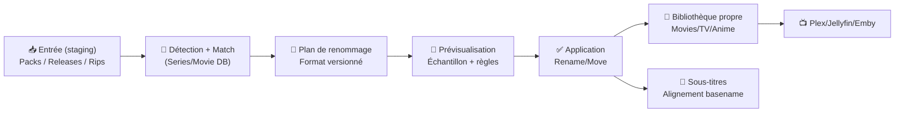
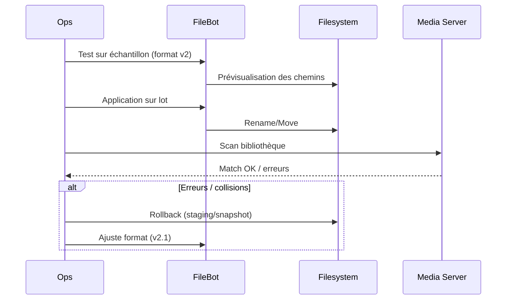

# 🧠 FileBot — Présentation & Workflow Premium (Renommage + Organisation + Automatisation)

### Le “moteur de normalisation” de ta médiathèque : noms propres, structure cohérente, scripts reproductibles
Optimisé pour pipelines Sonarr/Radarr/Plex/Jellyfin • Qualité maîtrisée • Formats robustes • Exploitation durable

---

## TL;DR

- **FileBot** sert à **renommer** et **organiser** tes médias (films/séries/anime/musique), avec des **formats** puissants et reproductibles. :contentReference[oaicite:0]{index=0}  
- Son super-pouvoir : transformer un chaos de fichiers en une bibliothèque **uniforme** (naming + arborescence), compatible Plex/Jellyfin. :contentReference[oaicite:1]{index=1}  
- Une approche premium = **conventions**, **formats versionnés**, **prévisualisation**, **tests**, **rollback**, et **séparation “staging → library”**.

---

## ✅ Checklists

### Pré-usage (avant de normaliser une grosse bibliothèque)
- [ ] Définir une convention cible (films vs séries) + versionner les formats
- [ ] Travailler d’abord en **staging** (copie / snapshot) sur un échantillon
- [ ] Identifier la source de vérité (TheMovieDB / TheTVDB / AniDB selon cas)
- [ ] Choisir stratégie langues (audio/subs) + suffixes (ex: `.fr`, `.en`)
- [ ] Définir règles “cas tordus” (multi-épisodes, specials, anime, duplicates)

### Post-normalisation (qualité & durabilité)
- [ ] Les noms produits sont stables (même entrée → même sortie)
- [ ] Les médias sont détectés correctement par Plex/Jellyfin (match OK)
- [ ] Les sous-titres sont alignés (même basename que la vidéo)
- [ ] Un plan de rollback existe (retour au staging / restore)
- [ ] La convention est documentée (1 page = règle unique)

---

> [!TIP]
> FileBot est idéal quand tu as des imports “sales” (rips, packs, releases hétérogènes) et que tu veux **une normalisation propre** avant ingestion.

> [!WARNING]
> Le risque #1 = renommer/déplacer **sans prévisualisation** et perdre la traçabilité. Toujours faire un **dry-run** mental / sur échantillon.

> [!DANGER]
> Ne lance jamais un renommage massif sur une bibliothèque “unique” sans snapshot / backup / staging. Un format mal écrit peut produire des collisions.

---

# 1) FileBot — Vision moderne

FileBot n’est pas juste un “renamer”.
C’est :
- 🧱 Un **standardiseur** (conventions de nommage)
- 🧠 Un **moteur de formats** (expressions/variables/bindings)
- 🔁 Un **outil d’automatisation** (CLI, tâches reproductibles)
- 🧩 Un **pont** entre sources de métadonnées et fichiers réels

Docs clés :
- Formats / expressions : :contentReference[oaicite:2]{index=2}  
- CLI : :contentReference[oaicite:3]{index=3}  

---

# 2) Architecture globale (pipeline premium)



---

# 3) Philosophie “premium” (5 piliers)

1. 🧾 **Conventions écrites** (naming + arborescence)
2. 🧠 **Formats versionnés** (ex: `v1`, `v2`, changelog)
3. 👀 **Prévisualisation & échantillonnage** (avant mass-apply)
4. 🧪 **Validation & contrôles** (collisions, matchs, duplicates)
5. 🔄 **Rollback simple** (staging, snapshot, restore)

---

# 4) Conventions recommandées (compat Plex/Jellyfin)

## Films (structure)
- Dossier : `Movie Title (Year)/`
- Fichier : `Movie Title (Year) - Quality - Codec.ext` (optionnel)

## Séries (structure)
- Dossier : `Series Name/Season 01/`
- Fichier : `Series Name - S01E01 - Episode Title.ext`

> [!TIP]
> FileBot fournit des “bindings” utiles (ex: `{plex}`) comme base de départ pour des formats compatibles. :contentReference[oaicite:4]{index=4}  

---

# 5) Formats & Naming (le cœur stratégique)

## 5.1 Principe
Tu écris un **format** (expression) qui produit le chemin final à partir des métadonnées.
Exemple CLI (principe) : :contentReference[oaicite:5]{index=5}

## 5.2 Stratégie premium : formats “lisibles + stables”
- Pas de magie cachée : un format = une règle claire
- Éviter les champs trop variables (release group volatile, tags incohérents)
- Préférer : titre officiel, année, saison/épisode, titre épisode

## 5.3 Sous-titres : alignement basename
Objectif : `Video.ext` ↔ `Video.fr.srt` (même basename) pour lecture automatique.
Approches possibles :
- Renommer les subs pour correspondre à la vidéo
- Ou intégrer une étape “replace / mass rename” si besoin :contentReference[oaicite:6]{index=6}

---

# 6) Workflows premium (reproductibles)

## 6.1 “Staging → Library” (propre)
- Tout ce qui arrive va en `staging/`
- FileBot normalise vers `library/`
- Les outils media (Plex/Jellyfin) ne lisent que `library/`

## 6.2 “Échantillon d’abord”
1. Prendre 20 fichiers représentatifs
2. Appliquer le format
3. Vérifier matchs (titres/années/épisodes)
4. Ensuite seulement : lot complet

---

# 7) Séquence incident : quand un lot “part mal”



---

# 8) Validation / Tests / Rollback

## Tests de validation (check rapide)
- Vérifier qu’un film devient un dossier unique `Title (Year)`
- Vérifier qu’une série produit `SxxEyy` correct
- Vérifier absence de collisions (2 entrées → même sortie)
- Vérifier que les subs suivent la vidéo (basename)

## “Rollbacks” réalistes
- **Rollback by design** : travailler depuis staging (tu peux re-run)
- **Rollback système** : snapshot/backup avant gros lot
- **Rollback logique** : conserver un export “avant → après” (mapping) pour rejouer inversement

> [!WARNING]
> La meilleure stratégie de rollback, c’est le **staging** : tu ne modifies jamais la source “irremplaçable”.

---

# 9) Licence & usage (point important)

- FileBot peut être **évalué** mais nécessite une **licence** pour un usage continu ; licence **par utilisateur** (multi-machines). :contentReference[oaicite:7]{index=7}  
- Page officielle achat/licence : :contentReference[oaicite:8]{index=8}  

---

# 10) Sources — Images Docker (comme demandé)

> NOTE : tu as demandé les **sources des images Docker**, notamment LinuxServer **si elle existe**.

## Image(s) Docker “officielles / upstream”
- **rednoah/filebot** (Node Service / interface web) : :contentReference[oaicite:9]{index=9}  

## Image(s) Docker “communautaires (unofficial)”
- **jlesage/filebot** (GUI via navigateur) — *unofficial* : :contentReference[oaicite:10]{index=10}  
- Autre image communautaire repérée : **coppit/filebot** : :contentReference[oaicite:11]{index=11}  

## LinuxServer.io (LSIO)
- À date, **pas d’image FileBot** listée dans la collection “Our Images” de LinuxServer.io. :contentReference[oaicite:12]{index=12}  

---

# 11) Sources (URLs) — en bash (copiable)

```bash
# FileBot — Officiel
https://www.filebot.net/
https://www.filebot.net/purchase.html
https://www.filebot.net/download.html
https://www.filebot.net/cli.html
https://www.filebot.net/naming.html

# Discussions utiles (officiel forum)
https://www.filebot.net/forums/viewtopic.php?t=620
https://www.filebot.net/forums/viewtopic.php?t=6056

# Docker images / sources
https://hub.docker.com/r/rednoah/filebot/
https://hub.docker.com/r/jlesage/filebot
https://hub.docker.com/r/jlesage/filebot/tags
https://github.com/jlesage/docker-filebot
https://hub.docker.com/r/coppit/filebot

# LinuxServer.io — catalogue images (vérif présence/absence)
https://www.linuxserver.io/our-images
```

---

# ✅ Conclusion

FileBot devient “premium” quand tu l’utilises comme un **compiler de conventions** :
- une entrée sale → une sortie standard
- un format versionné → une médiathèque durable
- staging + tests → zéro stress
- rollback simple → maîtrise totale