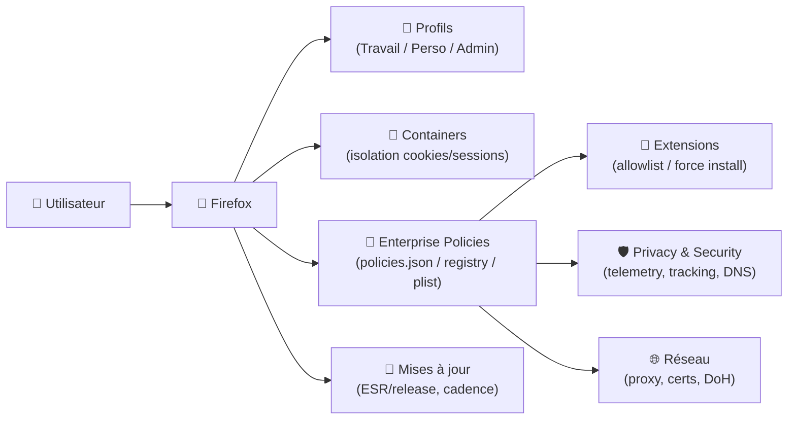
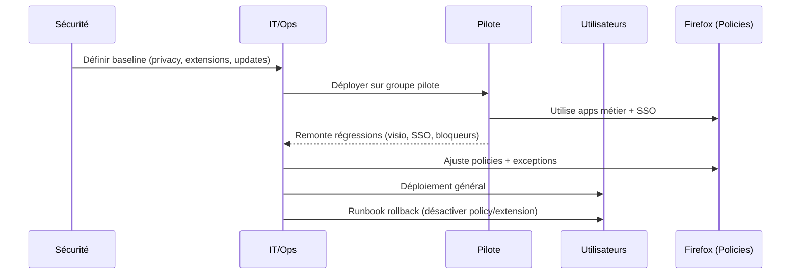

# 🦊 Firefox — Présentation & Configuration Premium (Poste utilisateur / Entreprise)

### Navigateur moderne axé vie privée • Gouvernance via policies • Profils isolés • Extensions maîtrisées
Optimisé pour environnements pro • Durcissement (hardening) • Déploiement par politiques • Exploitation durable

---

## TL;DR

- **Firefox** est un navigateur polyvalent qui peut être **gouverné proprement** en contexte pro via **Enterprise Policies**.
- Une approche “premium” = **profils séparés**, **politiques centralisées**, **extensions en allowlist**, **durcissement privacy**, **process de validation**.
- Objectif : **réduire la surface d’attaque**, stabiliser l’expérience, éviter les “réglages artisanaux poste par poste”.

---

## ✅ Checklists

### Pré-configuration (avant standardisation)
- [ ] Définir les profils : *Perso / Travail / Admin* (séparation nette)
- [ ] Définir une politique extensions : allowlist + blocage install sauvage
- [ ] Choisir canal : **ESR** (stabilité) vs release (features)
- [ ] Politique privacy : tracking protection, telemetry, password manager, DNS
- [ ] Stratégie certificats/proxy (si entreprise)
- [ ] Procédure de rollback (retour paramètres / désactivation policy)

### Post-configuration (qualité)
- [ ] Une machine “pilote” validée (sites métier, SSO, webapps)
- [ ] Vérif policies appliquées via `about:policies`
- [ ] Vérif extensions imposées/autoriséess (et rien d’autre)
- [ ] Test isolation (Containers / profils) sur 2–3 cas réels
- [ ] Test MAJ (canal choisi) + compat SSO/proxy

---

> [!TIP]
> La séparation **par profils** (et/ou Containers) fait gagner énormément en stabilité : moins de cookies pollués, moins de sessions SSO cassées, moins d’extensions “qui cassent tout”.

> [!WARNING]
> Trop de durcissement = régressions (SSO, WebRTC, visio, apps internes). Fais un **pilotage**, puis généralise.

> [!DANGER]
> Éviter les “tweaks about:config” non documentés à grande échelle. Préfère une politique reproductible (Enterprise Policies) + un changelog interne.

---

# 1) Firefox — Vision moderne

Firefox, en contexte “pro”, ce n’est pas juste “un navigateur”.

C’est :
- 🧭 Un **client applicatif** (SaaS, outils internes, consoles admin)
- 🔐 Un **point d’auth** (SSO, MFA, passkeys)
- 🧰 Un **runtime de travail** (extensions, devtools, containers)
- 🛡️ Une **surface d’attaque** à gouverner (policies, mises à jour, extensions)

---

# 2) Architecture d’usage (gouvernance premium)



---

# 3) Objectifs “premium” (ce que tu veux réellement)

1. 🔒 **Réduire les risques** (extensions, tracking, fuites)
2. 🧱 **Stabiliser** l’expérience (sites métier, SSO)
3. 🔁 **Standardiser** (policy reproductible)
4. 🧪 **Isoler** (profils/containers)
5. 🧯 **Pouvoir rollback** (désactiver une policy/extension rapidement)

---

# 4) Profils & Isolation (propre, maintenable)

## 4.1 Profils recommandés
- **Profil Travail** : webapps, SSO, extensions validées
- **Profil Perso** : usage hors périmètre (optionnel)
- **Profil Admin** : consoles sensibles (cloud, firewall, IAM) avec durcissement plus strict

## 4.2 Containers (quand c’est utile)
Cas d’usage :
- Isoler plusieurs tenants (ex: plusieurs comptes Google/M365)
- Séparer “admin cloud” du reste (cookies/session)
- Réduire la contamination SSO

> [!TIP]
> Même avec un seul profil, les **containers** évitent beaucoup de “déconnexions mystérieuses”.

---

# 5) Extensions (la vraie bataille)

## Stratégie premium (simple, efficace)
- ✅ **Allowlist** (liste autorisée)
- ✅ **Forced install** pour 1–3 extensions “socle”
- ❌ Bloquer l’installation libre (ou au minimum avertir/contrôler)

### “Socle” typique (à adapter)
- Bloqueur contenu (ex: uBlock Origin) — si compatible avec tes apps
- Gestionnaire mots de passe entreprise (si utilisé)
- Outil SSO/agent (si requis)

> [!WARNING]
> Certaines webapps internes cassent avec un bloqueur agressif. Prévois une **liste d’exceptions** (ou un profil dédié).

---

# 6) Privacy & Security (sans casser le métier)

## Réglages “premium” généralement safe
- **Enhanced Tracking Protection** : Strict (souvent OK, à tester)
- **Telemetry** : réduire/contrôler selon politique interne
- **Password Manager** : décider (Firefox vs vault d’entreprise)
- **HTTPS-Only mode** : utile, mais attention aux apps legacy
- **DNS over HTTPS (DoH)** : selon réseau entreprise (souvent à désactiver ou à imposer vers un resolver interne)

> [!DANGER]
> DoH peut contourner des résolutions internes/filtrages DNS. En environnement entreprise, décide-le explicitement (ON contrôlé / OFF).

---

# 7) Enterprise Policies (le cœur “pro”)

Firefox supporte des politiques pour :
- Extensions (installation forcée, blocage)
- Proxy / certificats
- Homepage / moteurs de recherche
- Désactivation de fonctions (telemetry, Pocket, etc.)
- Durcissement ciblé

## Vérification côté navigateur
- `about:policies` → montre ce qui est appliqué
- `about:support` → utile pour diagnostiquer

---

# 8) Workflow premium (déploiement & validation)



---

# 9) Validation / Tests / Rollback

## Tests de validation (smoke tests)
```bash
# Tests manuels guidés (liste à exécuter sur la machine pilote)
# 1) Policies appliquées :
#    Ouvrir about:policies -> "Active" doit montrer les règles attendues
#
# 2) Extensions :
#    Ouvrir about:addons -> vérifier que seules les extensions autorisées sont présentes
#
# 3) Apps critiques :
#    - SSO/MFA (Okta/AzureAD/etc.)
#    - Webmail / Drive / Outils internes
#    - Visio/WebRTC (Teams/Meet/Jitsi) si utilisé
#
# 4) Proxy/certs :
#    - Accès intranet (split DNS)
#    - Portails internes en TLS (certificat)
```

## Rollback (principe)
- **Rollback “soft”** : désactiver la policy incriminée (ou retirer l’extension forcée)
- **Rollback “profile”** : basculer sur un profil “safe” sans durcissement agressif
- **Rollback “scope”** : revenir à un canal/version stable (ex: ESR) si une release casse un workflow

> [!TIP]
> Documente un “rollback en 5 minutes” : *quelle policy*, *où*, *comment vérifier*.

---

# 10) Erreurs fréquentes (et comment les éviter)

- ❌ Bloquer trop d’extensions sans alternative → contournements utilisateurs
- ❌ Durcir DoH/HTTPS-only sans tester intranet → pannes “mystérieuses”
- ❌ Mélanger admin cloud et navigation quotidienne → cookies/SSO/risque
- ❌ Policies non vérifiées via `about:policies` → fausse impression de contrôle
- ❌ Pas de pilote → régression massive (visio, SSO, apps legacy)

---

# 11) Sources (URLs) — fournies en bash, sans marqueurs

```bash
# Firefox Enterprise Policies (documentation officielle)
echo "https://mozilla.github.io/policy-templates/"
echo "https://support.mozilla.org/kb/customizing-firefox-using-policiesjson"

# Vérification des policies côté navigateur
echo "about:policies"

# Firefox ESR (canal entreprise)
echo "https://www.mozilla.org/firefox/enterprise/"

# Conteneurs (Firefox Multi-Account Containers)
echo "https://addons.mozilla.org/firefox/addon/multi-account-containers/"

# uBlock Origin (si tu l’utilises en baseline)
echo "https://addons.mozilla.org/firefox/addon/ublock-origin/"
```

---

# ✅ Conclusion

Firefox “premium” en environnement pro = **policies + profils/containers + extensions contrôlées + validation + rollback**.

Tu obtiens :
- 📌 une expérience stable (apps métier & SSO)
- 🔐 une gouvernance réelle (pas du “réglage à la main”)
- 🛡️ un navigateur durci sans casser le quotidien