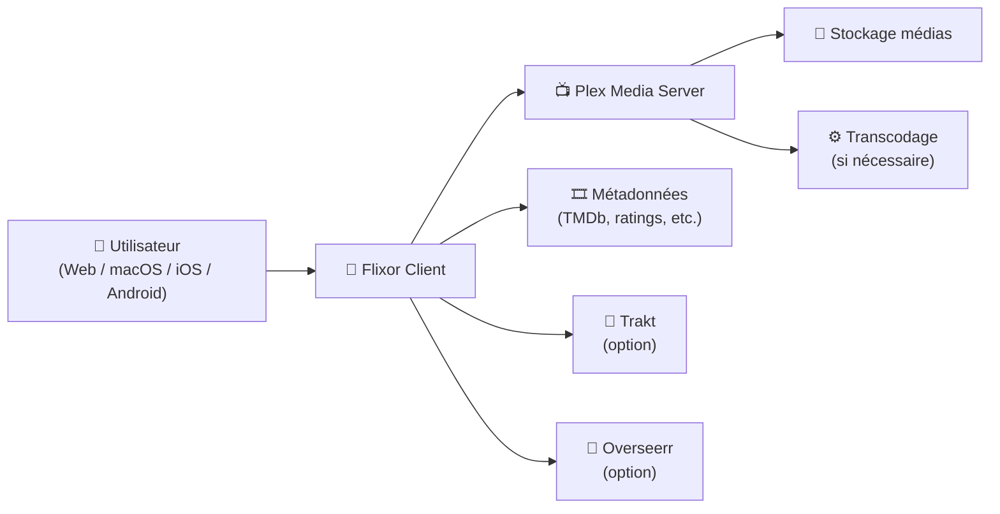
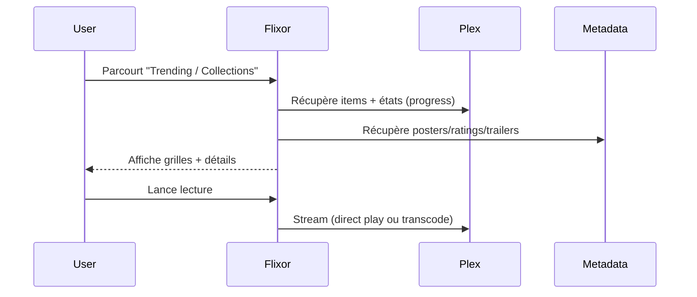

# 🍿 Flixor — Présentation Premium (Client Plex “Netflix-style”)

### Une expérience moderne, cross-platform, pour consommer ta bibliothèque Plex
Optimisé pour reverse proxy existant • Multi-profils • Métadonnées enrichies • Lecture adaptée par plateforme

---

## TL;DR

- **Flixor** est un **client Plex** moderne “Netflix-style” (Web, macOS, iOS, Android ; tvOS en dev).
- Il met l’accent sur : **UI rapide**, **découverte**, **métadonnées riches**, **sync multi-devices**.
- En usage “premium” : **gouvernance d’accès Plex**, **profils**, **performance**, **diagnostic**, **tests + rollback**.

---

## ✅ Checklists

### Pré-usage (avant de le proposer à d’autres)
- [ ] Plex Server stable + accès réseau correct (LAN/VPN/Reverse proxy existant)
- [ ] Stratégie “qui a accès à quoi” (users Plex / libraries / restrictions)
- [ ] Politique “profils” (famille / invités / enfants)
- [ ] Plan de dépannage (logs, lecture, subtitles, transcode vs direct play)
- [ ] Règles de confidentialité (tokens Plex, partage d’écran, etc.)

### Post-configuration (qualité d’expérience)
- [ ] Connexion Plex OK, navigation fluide (scroll/grids)
- [ ] Lecture OK sur 2 appareils (mobile + desktop)
- [ ] Subtitles OK (activation, langue, encodage)
- [ ] Tests “Continue Watching / Watchlist” OK
- [ ] Procédure de rollback (revenir à une version antérieure) documentée

---

> [!TIP]
> Flixor est “ROI immédiat” quand tu as une grosse médiathèque Plex : **grilles rapides**, **recherche efficace**, **présentation premium**.

> [!WARNING]
> La sécurité reste celle de **Plex** : si tes comptes Plex sont faibles (MFA absent, partage trop large), Flixor ne compensera pas.

> [!DANGER]
> Ne divulgue jamais les tokens/session secrets (captures d’écran, exports, logs). Traite Flixor comme un client riche qui manipule des accès Plex.

---

# 1) Flixor — Vision moderne

Flixor n’est pas un “serveur média”.

C’est :
- 🎛️ Un **client Plex** multi-plateforme
- 🧠 Un **outil de découverte** (collections, tendances, watchlist)
- 🏎️ Une **UI optimisée** pour de grosses bibliothèques
- 🔁 Un **sync d’état** entre appareils (progress, profils)

---

# 2) Architecture globale



---

# 3) Plateformes & lecture (ce que ça implique)

## Web
- Lecture via player web (HLS/DASH selon implémentation)
- Dépend fortement du navigateur + codecs supportés

## macOS
- Lecture via **MPV** (souvent excellent pour HDR/Dolby Vision selon setup)
- Intéressant pour une expérience “home cinema” propre

## Mobile (iOS/Android)
- Players natifs (varie selon plateforme)
- Très bon pour “Continue Watching” + consommation rapide

> [!TIP]
> Pour éviter les surprises : teste 1 film HEVC + 1 film AVC + 1 contenu HDR + 1 piste audio “exotique”.

---

# 4) Gouvernance & “profiling” (usage premium)

## Stratégie profils (simple et efficace)
- **Profil Principal** : accès complet (bibliothèques adultes)
- **Profil Famille** : bibliothèques filtrées / contenus safe
- **Profil Invité** : lecture restreinte (pas d’édition, pas de requêtes)

## Ce que tu gagnes
- Moins de “pollution” d’historique
- Un “Continue Watching” cohérent
- Une UX plus claire pour chaque type d’utilisateur

---

# 5) Performance & UX (ce qui fait la différence)

## Grands catalogues
- Nommage cohérent côté Plex (titres, posters, collections)
- Collections utiles :
  - “Saga / Universe”
  - “Réalisateur”
  - “Top IMDB / Top TMDB”
  - “4K / HDR / Atmos”

## Qualité perçue
- Backdrops propres, métadonnées complètes
- Trailers disponibles (si sources correctes)
- Badges techniques (résolution, HDR, audio) → décision rapide

> [!WARNING]
> Si Plex est mal nettoyé (doublons, posters incohérents, agents mal réglés), Flixor mettra… en valeur ces défauts.

---

# 6) Workflows premium (découverte + incident)

## 6.1 Découverte “Netflix-style”


## 6.2 Dépannage “lecture qui saccade”
- Vérifier : Wi-Fi, débit, device
- Vérifier côté Plex : transcode déclenché ? CPU saturé ?
- Vérifier codecs : HEVC/HDR/audio passthrough

---

# 7) Validation / Tests / Rollback

## Tests de validation (fonctionnels)
```bash
# Checklist manuelle (rapide)
# 1) Login Plex
# 2) Navigation (Home, Search, Library)
# 3) Lecture: Film + Episode
# 4) Subtitles: activer/désactiver + langue
# 5) Reprendre lecture ("Continue Watching")
echo "Valider: Login Plex, browse, play, subtitles, continue watching"
```

## Tests “qualité”
- Un contenu **1080p AVC** (baseline)
- Un contenu **4K HEVC**
- Un contenu **HDR / DV** (si tu en as)
- Une piste audio “lourde” (TrueHD/DTS-HD) si ton setup le permet

## Rollback (principe)
- Revenir à une version stable (ex: release précédente)
- Conserver config/cache si possible
- Documenter : “symptôme → version rollback”

---

# 8) Erreurs fréquentes (et fixes)

- **Pas de lecture / erreur player**
  - Souvent codecs / DRM / compat navigateur
- **Saccades**
  - Transcode Plex, CPU, réseau, débit
- **Sous-titres bizarres**
  - Encodage (UTF-8), forced, piste wrong
- **Bibliothèque “moche”**
  - Agents Plex / posters / collections à nettoyer

---

# 9) Sources (URLs) — en bash comme demandé

```bash
# Flixor (officiel)
echo "Repo GitHub: https://github.com/Flixorui/flixor"
echo "Releases: https://github.com/Flixorui/flixor/releases"
echo "Site projet: https://flixor.xyz/"

# Image Docker (officiel Flixor — GHCR)
echo "Package GHCR (versions): https://github.com/flixorui/flixor/pkgs/container/flixor/versions"
echo "Image (latest): ghcr.io/flixorui/flixor:latest"

# LinuxServer.io (vérification disponibilité image LSIO)
echo "Catalogue images LSIO: https://www.linuxserver.io/our-images"
echo "Docs LSIO (index images): https://docs.linuxserver.io/images/"
echo "Docker Hub publisher linuxserver: https://hub.docker.com/u/linuxserver"
# Note: à la date de consultation, aucune image LSIO 'flixor' n'est référencée dans ces index publics.
```

---

# ✅ Conclusion

Flixor est une excellente façon de rendre Plex **plus agréable** et **plus moderne** :
- UI “Netflix-style”
- multi-plateforme
- lecture adaptée par device
- découverte + métadonnées enrichies

Version “premium” = gouvernance Plex + profils + tests qualité + rollback documenté.