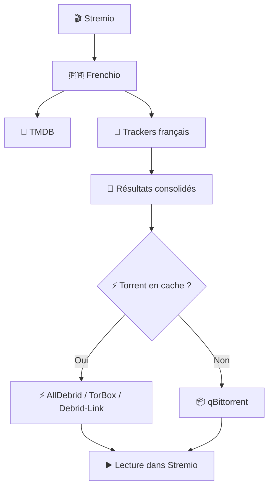
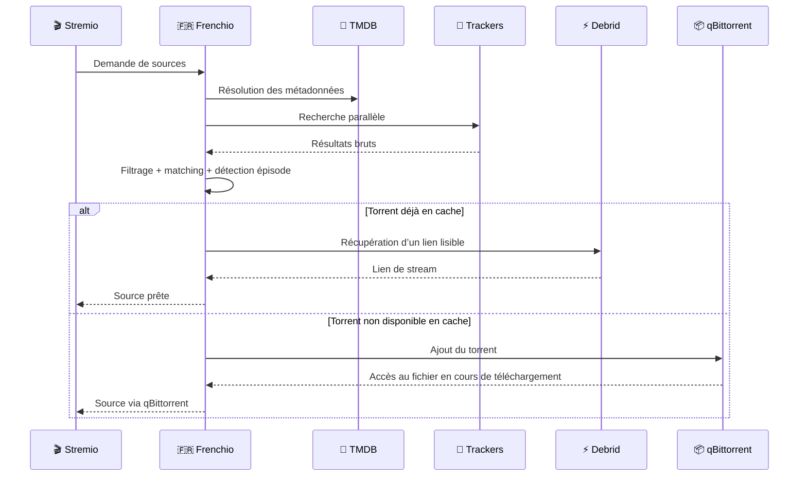

# Frenchio

> 🇫🇷 **Addon Stremio orienté contenu francophone**, pensé pour agréger plusieurs trackers français et transformer les résultats en **sources directement lisibles** via débridage ou qBittorrent.

<p align="center">
  <strong>🎬 Stremio</strong> ·
  <strong>🧠 TMDB</strong> ·
  <strong>🔎 Trackers FR</strong> ·
  <strong>⚡ Debrid</strong> ·
  <strong>📦 qBittorrent</strong>
</p>

---

## 🚀 TL;DR

Frenchio agit comme une **couche d’orchestration** entre **Stremio**, les **trackers français**, **TMDB** et les solutions de lecture comme **AllDebrid**, **TorBox**, **Debrid-Link** ou **qBittorrent**.

Son rôle :
- **chercher**
- **unifier**
- **filtrer**
- **rendre lisible dans Stremio**

> [!TIP]
> La vraie force de Frenchio n’est pas seulement de trouver des résultats, mais de **les convertir en sources exploitables immédiatement dans Stremio**.

---

## 🧠 Abstract

Frenchio est conçu pour un usage **Stremio centré sur les contenus francophones**.  
Il interroge plusieurs sources en parallèle, consolide les résultats puis choisit le meilleur chemin de lecture selon la disponibilité du torrent :

- **via un service de débridage** si le torrent est déjà en cache ;
- **via qBittorrent** si le contenu doit être récupéré autrement.

En complément, **TMDB** aide à fiabiliser la correspondance entre films, séries, saisons et épisodes, ce qui améliore fortement la pertinence des résultats.

---

## 🔎 Ce que fait Frenchio

- 🔍 Recherche sur plusieurs trackers français
- 🧩 Fusion et normalisation des résultats
- 🎯 Filtrage par pertinence
- 🧠 Enrichissement via TMDB
- 📺 Détection d’épisodes dans les packs de saisons
- ⚡ Intégration avec les services de débridage
- 📦 Fallback via qBittorrent

### Sources et services pris en charge

- **Trackers**
  - UNIT3D
  - Sharewood
  - YGG
  - ABNormal
  - La-Cale

- **Lecture**
  - AllDebrid
  - TorBox
  - Debrid-Link
  - qBittorrent

> [!TIP]
> Frenchio prend tout son sens quand plusieurs briques sont combinées : **métadonnées + trackers + lecture**.

---

## 🧭 Positionnement

Frenchio ne remplace pas **Stremio** : il **alimente Stremio en sources**.  
Il ne remplace pas non plus les trackers ou les débrideurs : il les **coordonne dans une seule chaîne logique**.



---

## 🔄 Flux de traitement

Frenchio suit une chaîne simple : résolution des métadonnées, recherche parallèle, filtrage, puis génération d’une source lisible.



---

## 🏗️ Architecture logique

Frenchio repose sur **4 briques principales**.

### 🧠 1. Métadonnées
TMDB aide à relier proprement films, séries, saisons et épisodes.

### 🔍 2. Recherche
Les trackers sont interrogés en parallèle pour accélérer le retour.

### 🎯 3. Sélection
Les résultats sont harmonisés puis triés selon leur pertinence.

### ▶️ 4. Lecture
La source finale est produite :
- soit via un débrideur ;
- soit via qBittorrent.

> [!WARNING]
> La qualité finale dépend fortement de la précision des métadonnées et des trackers réellement configurés.

---

## 🎬 Cas d’usage typiques

### 🌱 Usage simple
- TMDB
- un tracker
- un débrideur

### 🧩 Usage complet
- TMDB
- plusieurs trackers
- un débrideur
- qBittorrent en secours

### 🛟 Usage fallback
Même sans cache disponible chez un débrideur, Frenchio peut encore tenter une lecture via qBittorrent.

> [!TIP]
> Le meilleur compromis en pratique est souvent :
> **plusieurs trackers + un service de débridage + qBittorrent en secours**.

---

## ⚙️ Variables d’environnement utiles

Frenchio expose plusieurs variables pour adapter le comportement ou l’apparence de l’addon.

### 📦 Désactiver qBittorrent

```bash
QBITTORRENT_ENABLE=false
```

### 🏷️ Ajouter un suffixe au nom de l’addon

```bash
MANIFEST_TITLE_SUFFIX=| MonInstance
```

### ✍️ Ajouter un texte personnalisé dans le manifest

```bash
MANIFEST_BLURB=<b>Frenchio personnalisé</b>
```

### 🧪 Exemple

```bash
environment:
  - PORT=7777
  - QBITTORRENT_ENABLE=false
  - MANIFEST_TITLE_SUFFIX=| MonInstance
  - MANIFEST_BLURB=<b>Version personnalisée</b>
```

> [!TIP]
> Les variables liées au manifest sont pratiques pour **distinguer plusieurs instances** ou personnaliser une installation.

---

## 📦 À retenir sur qBittorrent

qBittorrent n’est pas la voie la plus immédiate, mais reste une **excellente roue de secours** lorsqu’un contenu n’est pas déjà disponible en cache chez un débrideur.

Il permet à Frenchio :
- d’ajouter un torrent ;
- d’exposer un fichier ;
- de rendre la lecture possible dans Stremio même sans cache préalable.

> [!WARNING]
> qBittorrent demande une configuration réseau plus propre, notamment côté **WebUI** et **exposition des fichiers**.

---

## 🔐 HTTPS et exposition distante

> [!DANGER]
> En dehors de `localhost`, un addon Stremio doit être exposé en **HTTPS** pour fonctionner correctement.

### En local
- `http://localhost:7777` fonctionne

### À distance
- il faut une URL de type `https://...`

Cette contrainte n’est pas propre à Frenchio, mais elle est **essentielle** pour un usage auto-hébergé accessible depuis l’extérieur.

---

## ✅ Forces

- 🇫🇷 Pensé pour un usage Stremio francophone
- 🔎 Recherche multi-trackers
- ⚡ Très bonne complémentarité entre débridage et qBittorrent
- 📺 Gestion plus intelligente des séries et épisodes
- ⚙️ Paramétrage souple via variables d’environnement

---

## ⚠️ Limites

- dépend fortement des trackers configurés ;
- repose sur plusieurs services externes et leurs accès ;
- impose du **HTTPS** en usage distant ;
- qBittorrent est plus technique à exploiter correctement.

> [!WARNING]
> Plus l’environnement est riche en sources et services, plus Frenchio devient puissant — mais aussi plus la configuration globale devient sensible.

---

## 🏁 Conclusion

Frenchio est surtout intéressant comme **couche d’orchestration premium pour Stremio** :

- il **cherche** ;
- il **unifie** ;
- il **choisit** ;
- il **rend la source lisible**.

Sa valeur vient du fait qu’il combine dans un même flux :
- des **trackers français** ;
- une logique de **matching** ;
- des services de **débridage** ;
- un **fallback qBittorrent**.

> [!TIP]
> En une phrase : **Frenchio transforme une recherche multi-sources en lecture exploitable dans Stremio.**