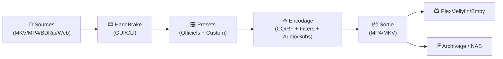
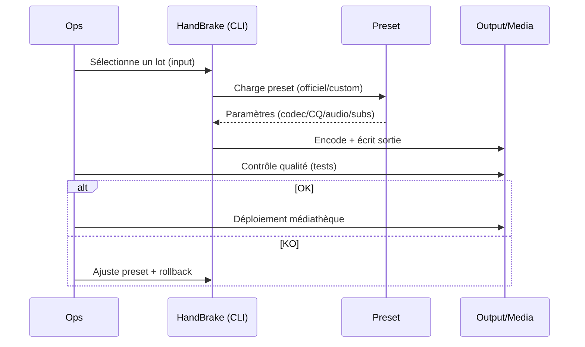

# 🎞️ HandBrake — Présentation & Usage Premium (Qualité, Presets, Workflows)

### Transcodage vidéo “propre” : presets maîtrisés • compat devices • qualité constante • automatisation CLI
Optimisé pour bibliothèques média • pipelines (NAS/VPS) • profils stables • validation/rollback

---

## TL;DR

- **HandBrake** convertit des vidéos vers des formats modernes (ex: **H.264/H.265/AV1**, audio AAC/Opus/EAC3 selon besoins).
- Une approche premium = **presets gouvernés**, **qualité cohérente**, **règles audio/sous-titres**, **tests** + **rollback**.
- HandBrake = excellent pour **standardiser** une médiathèque, réduire taille, améliorer compatibilité, et automatiser.

---

## ✅ Checklists

### Pré-usage (avant de lancer des batchs)
- [ ] Définir l’objectif : **compat**, **taille**, **qualité**, **archivage**
- [ ] Choisir le codec cible : **H.264 (compat max)** / **H.265 (efficacité)** / **AV1 (efficacité + lent)**
- [ ] Fixer une stratégie qualité : **CQ/RF** (recommandé) + limites
- [ ] Définir audio : pistes, langues, passthrough vs ré-encodage
- [ ] Définir sous-titres : burn-in rare, préférer **softsubs**
- [ ] Tester sur 3 fichiers représentatifs (action, sombre, animation)

### Post-encodage (contrôle qualité)
- [ ] Lecture OK (TV, mobile, Plex/Jellyfin)
- [ ] Audio OK (langue principale, fallback, passthrough si voulu)
- [ ] Sous-titres OK (forced si nécessaire)
- [ ] Taille conforme à la cible (et pas de macro-blocs)
- [ ] “Scènes difficiles” testées (noir, mouvement, grain)

---

> [!TIP]
> Pour une médiathèque, vise une **stratégie simple** : 1–2 presets officiels + 1 preset “maison” par usage (Films, Séries, Anime).

> [!WARNING]
> Ne mélange pas 10 presets différents : tu perds la cohérence (bitrate/qualité/audio), et tu complexifies la maintenance.

> [!DANGER]
> Évite les encodages “au bitrate fixe” pour des contenus variés : tu obtiens soit trop gros, soit trop dégradé.  
> Préfère **CQ/RF** (qualité constante) et impose des garde-fous (résolution max, fps, audio).

---

# 1) HandBrake — Vision moderne

HandBrake n’est pas “juste un convertisseur”.

C’est :
- 🧠 Un **moteur de standardisation** (format, audio, subs, conteneur)
- 🎯 Un **système de profils** (presets officiels + custom)
- 🔄 Un **outil d’automatisation** (CLI + files/batch)
- ✅ Un **compromis contrôlé** entre qualité, taille et compat

---

# 2) Architecture globale (usage typique médiathèque)



---

# 3) Les décisions “premium” (qui font la différence)

## 3.1 Codec — choisir selon ton objectif
- **H.264 (x264)** : compatibilité maximale (anciens devices)
- **H.265 (x265)** : meilleur ratio qualité/taille, plus lourd à décoder
- **AV1** : ratio excellent, mais encodage plus lent et compat variable

> [!TIP]
> Pour un parc hétérogène : **H.264**.  
> Pour “médiathèque moderne” : **H.265**.  
> Pour archivage long terme (si tu sais pourquoi) : **AV1**.

## 3.2 Qualité — CQ/RF (recommandé)
- HandBrake propose une qualité “constante” (CQ/RF) :
  - plus simple à maintenir qu’un bitrate fixe
  - bonne qualité moyenne, taille variable mais maîtrisable

> [!WARNING]
> CQ/RF trop agressif = fichiers énormes. Trop élevé = artefacts.  
> Fixe une plage et valide sur tes contenus “difficiles”.

## 3.3 FPS — règle simple
- Généralement : **“Same as source”**
- Ne force un FPS que si tu as une contrainte de compat.

## 3.4 Conteneur (MP4 vs MKV)
- **MP4** : compat large (TV/Apple/etc.)
- **MKV** : flexible (pistes multiples, subs, etc.)

---

# 4) Presets (officiels + custom) — gouvernance

## 4.1 Presets officiels : base stable
Les presets officiels sont une excellente fondation (compat + limites raisonnables).

## 4.2 Custom preset : “un seul vrai preset par usage”
Exemples d’usages (à adapter) :
- **Films 1080p** (qualité + efficacité)
- **Séries 1080p** (plus rapide, audio standard)
- **Anime** (attention aux lignes/fins détails)

> [!TIP]
> Documente ton preset : objectif, codec, CQ/RF, audio, subs, limites, version.  
> Un preset non documenté = dette technique.

---

# 5) Audio — stratégie premium (pratique et robuste)

## 5.1 Règle d’or
- Garde au moins :
  - 1 piste **langue principale**
  - 1 piste **fallback** (souvent EN) si ton besoin le justifie

## 5.2 Passthrough vs encode
- **Passthrough** (conserver) : si tu veux garder la piste d’origine (ex: 5.1)
- **Encode** (AAC/Opus…) : si tu vises compat/taille

> [!WARNING]
> Attention aux devices : certains lisent mal certains codecs audio.  
> Si compat max : AAC stéréo + (option) passthrough multicanal.

---

# 6) Sous-titres — “propre” (éviter les pièges)

- Préfère les **softsubs** (activables/désactivables)
- **Burn-in** seulement si nécessaire (ex: sous-titres forcés hardcodés)
- Gère “forced” intelligemment (scènes non traduites)

---

# 7) Workflows premium (batch, debug, qualité)

## 7.1 Encodage en série (logique)


## 7.2 Patterns de debug “rapides”
- Artefacts dans le noir :
  - tester un CQ/RF légèrement plus “qualité”
  - vérifier filters/denoise (attention : ça peut lisser trop)
- Fichiers trop gros :
  - CQ/RF un cran plus “compression”
  - vérifier résolution max / downscale raisonnable
- Audio incompatible :
  - ajouter une piste AAC stéréo fallback

---

# 8) Validation / Tests / Rollback

## Tests recommandés (smoke tests)
```bash
# 1) Vérifier la version et options CLI (selon ton OS)
HandBrakeCLI --help | head -n 30

# 2) Lister les presets disponibles
HandBrakeCLI --preset-list | head -n 80

# 3) Encoder un court extrait (test rapide)
# (Exemple générique : adapte les chemins/preset)
HandBrakeCLI -i "input.mkv" -o "output.mp4" -Z "Fast 1080p30"
```

## Tests “qualité”
- 3 scènes :
  - action/mouvement
  - sombre/noir
  - peau/visages (banding)
- Lecture sur 2 devices réels (TV + mobile) ou via Plex/Jellyfin

## Rollback
- Toujours conserver le **fichier source** (ou un backup)
- Conserver les presets versionnés (export/JSON)
- Si un preset évolue :
  - incrémente la version (ex: `MOV-1080P-x265-v3`)
  - revalide sur ton set de tests

> [!TIP]
> Le “rollback” le plus simple : ne jamais écraser la source, et encoder dans un dossier `encoded/` séparé.

---

# 9) Sources — adresses (en bash comme demandé)

```bash
# HandBrake — documentation officielle (CLI / presets / docs générales)
https://handbrake.fr/docs/en/latest/cli/command-line-reference.html
https://handbrake.fr/docs/en/latest/cli/cli-options.html
https://handbrake.fr/docs/en/latest/technical/official-presets.html
https://handbrake.fr/docs/en/1.9.0/advanced/custom-presets.html

# HandBrake — repo (presets template, code source)
https://github.com/HandBrake/HandBrake
https://github.com/HandBrake/HandBrake/blob/master/preset/preset_template.json

# Docker images (si tu veux référencer les sources d’images)
# LinuxServer.io (image HandBrake)
https://docs.linuxserver.io/images/docker-handbrake/
https://hub.docker.com/r/linuxserver/handbrake
https://github.com/linuxserver/docker-handbrake

# Autres images Docker courantes (non officielles HandBrake)
https://hub.docker.com/r/jlesage/handbrake
https://github.com/jlesage/docker-handbrake
```

---

# ✅ Conclusion

HandBrake “premium” = **moins de magie, plus de gouvernance** :
- presets stables (officiels + custom minimal)
- CQ/RF + règles audio/subs cohérentes
- tests systématiques sur scènes difficiles
- rollback simple (ne jamais écraser la source, versionner les presets)