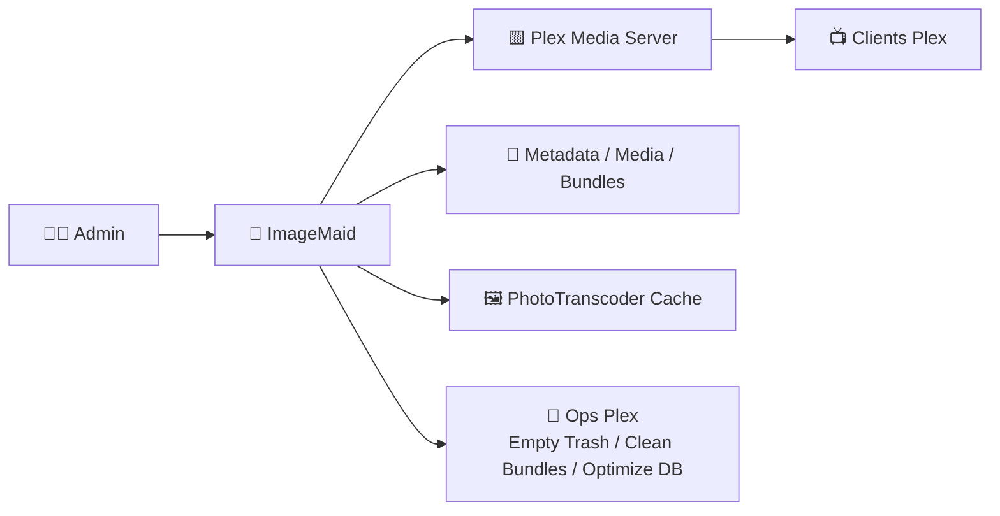
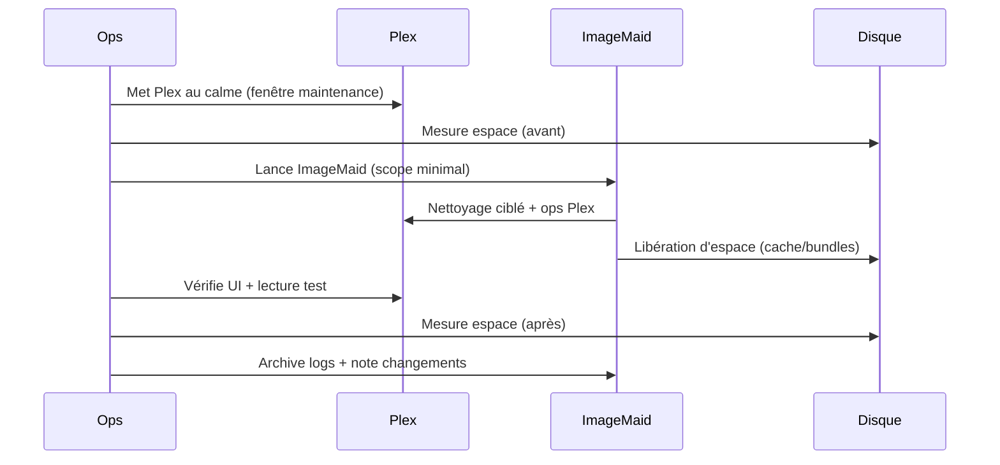

# 🧹 ImageMaid (Plex Image Cleanup) — Présentation & Exploitation Premium

### Nettoyage intelligent des images Plex (métadonnées / PhotoTranscoder) + opérations Plex
Optimisé pour maintenance contrôlée • Gains d’espace • Risque maîtrisé • Procédures de validation & rollback

---

## TL;DR

- **ImageMaid** sert à **réduire la taille** de Plex en supprimant des **images/métadonnées** devenues inutiles (souvent après overlays, posters, title cards, etc.).
- Il peut aussi déclencher des opérations Plex : **Empty Trash**, **Clean Bundles**, **Optimize Database**, et nettoyer le **PhotoTranscoder**.
- Mode premium = **exécution contrôlée**, **fenêtres de maintenance**, **backups**, **dry-run/limites**, **validation post-run**, **rollback prêt**.

---

## ✅ Checklists

### Pré-exécution (obligatoire)
- [ ] Fenêtre de maintenance définie (charge Plex faible)
- [ ] **Backup** disponible (au minimum le dossier `Plex Media Server` + DB)
- [ ] Accès clair aux chemins Plex (Metadata/Media/PhotoTranscoder) selon ton OS
- [ ] Stratégie “scope” : quoi nettoyer, quoi préserver (uploads/custom art ?)
- [ ] Plan de rollback documenté (restaurer DB + dossiers critiques)

### Post-exécution (qualité)
- [ ] Plex démarre correctement
- [ ] Navigation UI OK (posters/collections se chargent)
- [ ] Lecture d’un média test OK
- [ ] Taille disque mesurée (avant/après)
- [ ] Logs ImageMaid archivés (preuve + audit)

---

> [!TIP]
> ImageMaid est particulièrement utile si tu utilises des outils type **Kometa/overlays** ou que tu changes souvent d’artwork : Plex accumule vite.

> [!WARNING]
> Ce n’est pas “gratuit” : tu peux perdre des affiches/covers personnalisés si tu nettoies trop agressivement. Toujours définir le **périmètre**.

> [!DANGER]
> Ne lance pas ImageMaid “en aveugle” sur une grosse bibliothèque sans backup. Une suppression agressive peut forcer Plex à re-télécharger/reconstruire beaucoup d’éléments.

---

# 1) ImageMaid — Vision moderne

ImageMaid n’est pas un simple “rm -rf”.

C’est :
- 🧠 un **outil de maintenance Plex** (nettoyage ciblé)
- 🧹 un **réducteur d’empreinte disque** (images inutiles, PhotoTranscoder)
- 🔧 un **orchestrateur d’opérations Plex** (Empty Trash / Clean Bundles / Optimize DB)
- 🛡️ un outil qui exige une **gouvernance** (scope, sauvegarde, validation)

---

# 2) Architecture globale



---

# 3) Ce que ça nettoie (et pourquoi ça gonfle)

## 3.1 Images & bundles (souvent le gros du volume)
Causes typiques :
- Overlays (Kometa), title cards, posters custom
- Changements d’artwork fréquents
- Restes d’anciennes versions de médias / métadonnées
- Cache d’images “orphelines”

## 3.2 PhotoTranscoder (cache)
- Plex génère des variantes (tailles/formats) pour l’affichage
- Avec le temps, ce cache peut devenir énorme
- Nettoyer peut libérer beaucoup d’espace mais provoque parfois une **reconstruction progressive** (regénération) selon usage

---

# 4) Philosophie “Premium maintenance” (5 piliers)

1. 🎯 **Scope minimal au départ** (petit nettoyage → valider → élargir)
2. 🧪 **Runbook** (quoi lancer, dans quel ordre, et comment valider)
3. 📦 **Backup & rollback** prêts AVANT
4. 🕒 **Fenêtre de maintenance** (éviter de perturber streaming et scans)
5. 📋 **Traçabilité** (logs + métriques avant/après)

---

# 5) Stratégie d’exécution (ordonnancement recommandé)

## Ordre conseillé (safe-first)
1. **Nettoyage PhotoTranscoder** (souvent gros gain, risque modéré)
2. **Opération “Empty Trash”** (si cohérent avec ta stratégie)
3. **Clean Bundles** (libère des bundles orphelins)
4. **Optimize DB** (fin de run, pendant période calme)

> [!WARNING]
> “Empty Trash” peut supprimer des entrées si Plex pense que des médias ont disparu. À utiliser quand tu es certain de la cohérence bibliothèque/chemins.

---

# 6) Workflow premium (séquence opératoire)



---

# 7) Validation / Tests / Rollback

## 7.1 Tests de validation (post-run)
```bash
# 1) Plex répond (adapter host/port)
curl -I http://PLEX_HOST:32400/web | head

# 2) Vérifier que le process Plex tourne (Linux)
ps aux | grep -i "Plex Media Server" | head

# 3) Vérifier qu'un client charge posters/écrans d'accueil (test manuel)
# - Ouvrir Plex (web/app)
# - Aller sur une section Films/Séries
# - Vérifier posters + lecture d’un élément
```

## 7.2 Indicateurs “OK”
- UI Plex fluide, pas de chargements infinis
- Posters visibles (ou se régénèrent progressivement de façon normale)
- Lecture OK
- Logs Plex sans avalanche d’erreurs DB

## 7.3 Rollback (principe)
- Si ça tourne mal :
  - arrêter Plex
  - restaurer la DB Plex + dossiers critiques depuis backup
  - relancer Plex
- Objectif : **retour arrière reproductible**, pas improvisé

> [!DANGER]
> Le rollback dépend de tes sauvegardes. Sans backup, “revenir en arrière” peut être impossible.

---

# 8) Erreurs fréquentes (et comment les éviter)

- ❌ Nettoyage trop agressif d’un coup  
  ✅ Commencer petit, valider, puis élargir

- ❌ Pas de backup / rollback non testé  
  ✅ Toujours un point de restauration avant

- ❌ Lancer en pleine activité (streaming, scans, maintenance Plex)  
  ✅ Fenêtre calme + monitoring après

- ❌ Confondre cache et données “source”  
  ✅ Savoir ce que tu touches (PhotoTranscoder ≠ médias)

---

# 9) Sources (URLs) — en bash (comme demandé)

```bash
# Projet / Docs
echo "https://github.com/Kometa-Team/ImageMaid"
echo "https://docs.ultra.cc/community/imagemaid"

# Images Docker (officielles/usuelles)
echo "https://hub.docker.com/r/kometateam/imagemaid"
echo "https://hub.docker.com/r/meisnate12/plex-image-cleanup"

# LinuxServer.io (pour vérifier si une image existe)
echo "https://www.linuxserver.io/our-images"
echo "https://hub.docker.com/u/linuxserver"
```

---

# ✅ Conclusion

ImageMaid est un **outil de maintenance Plex** extrêmement efficace pour reprendre le contrôle sur la taille disque, à condition de l’utiliser en mode **opérations** :

- scope progressif
- backups + rollback
- validation post-run
- traçabilité

Utilisé correctement, c’est l’équivalent d’un “grand ménage” Plex sans devoir refaire une bibliothèque entière.