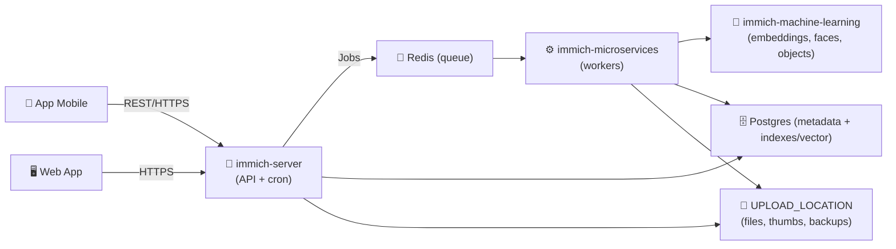
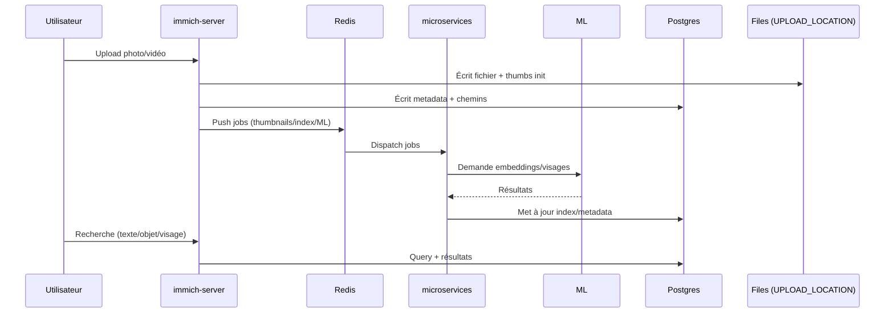

# 🖼️ Immich — Présentation & Exploitation Premium (Google Photos self-hosted)

### Sauvegarde + bibliothèque photos/vidéos avec IA (recherche, visages, objets)
Optimisé pour reverse proxy existant • Multi-utilisateurs • Gouvernance • Backups & Rollback • Performance durable

---

## TL;DR

- **Immich** = plateforme **self-hosted** pour **backup automatique** depuis mobile + **bibliothèque** + **IA** (recherche par objets/visages/texte). :contentReference[oaicite:0]{index=0}  
- Architecture moderne : **clients (mobile/web)** → **API (server)** → **jobs (microservices via Redis)** → **DB Postgres** + **ML** + **stockage fichiers**. :contentReference[oaicite:1]{index=1}  
- Points “pro” : **APP_URL / reverse proxy** cohérent, **permissions & partage** maîtrisés, **backups testés**, **stratégie d’upgrade** (notamment Postgres/vector). :contentReference[oaicite:2]{index=2}  

---

## ✅ Checklists

### Pré-usage (avant d’ouvrir aux utilisateurs)
- [ ] Politique de **stockage** : où sont les originaux, qui a accès, rétention
- [ ] Politique de **partage** : albums partagés, liens publics (autorisé ?)
- [ ] Politique **multi-user** : rôles/permissions (au minimum : admin + users)
- [ ] Politique de **backup** : DB + fichiers upload/library + test restauration
- [ ] Politique d’**upgrade** : cadence + snapshot + rollback

### Post-configuration (qualité opérationnelle)
- [ ] Backups automatiques DB visibles et compris (et contrôlés) :contentReference[oaicite:3]{index=3}  
- [ ] Restauration testée sur un échantillon (DB + fichiers)
- [ ] Recherche IA (ML) active et temps de traitement acceptable
- [ ] L’import / scan / thumbnails ne saturent pas CPU/IO (observé en charge)
- [ ] Les partages publics sont explicitement activés/désactivés selon politique

---

> [!TIP]
> Immich est excellent comme **source de vérité “photos personnelles/famille/équipe”** si tu assumes la discipline “backup + upgrades contrôlés”.

> [!WARNING]
> Immich **enregistre des chemins de fichiers en base** ; si la base est perdue/corrompue, tu peux perdre la “connaissance” des assets. Les backups sont cruciaux. :contentReference[oaicite:4]{index=4}  

> [!DANGER]
> Les dumps DB ne contiennent **pas** les photos/vidéos : il faut **DB + fichiers** (UPLOAD_LOCATION) pour restaurer correctement. :contentReference[oaicite:5]{index=5}  

---

# 1) Immich — Vision moderne

Immich n’est pas juste un “album photo”.

C’est :
- 📲 **Backup automatique** depuis mobile (anti-duplication, sélection d’albums, etc.) :contentReference[oaicite:6]{index=6}  
- 🗂️ **Bibliothèque** (timeline, métadonnées, RAW, cartes/EXIF) :contentReference[oaicite:7]{index=7}  
- 🧠 **Recherche IA** (objets/visages/CLIP selon config) :contentReference[oaicite:8]{index=8}  
- 👥 **Multi-user** + **partage** (albums partagés) :contentReference[oaicite:9]{index=9}  

---

# 2) Architecture globale



- Séparation **server** vs **microservices** (jobs via Redis) : :contentReference[oaicite:10]{index=10}  
- Services typiques en environnement : server, web, machine-learning, redis, postgres : :contentReference[oaicite:11]{index=11}  

---

# 3) “Premium ops mindset” (5 piliers)

1. 🔐 **Accès & exposition maîtrisés** (reverse proxy existant, auth/SSO si besoin)
2. 🗃️ **Stockage & chemins stables** (UPLOAD_LOCATION cohérent, permissions)
3. 🧠 **IA sous contrôle** (charge CPU/GPU, batch, retours en arrière)
4. 💾 **Backups + restore testés** (DB + fichiers, pas juste DB)
5. 🧪 **Validation / rollback** à chaque upgrade (surtout DB/vector) :contentReference[oaicite:12]{index=12}  

---

# 4) Gouvernance & partage (ce qui “évite le chaos”)

## Modèle simple recommandé
- **Admin(s)** : configuration, upgrades, sauvegardes, gestion utilisateurs
- **Users** : upload/gestion de leurs médias
- **Partage** : autoriser uniquement ce qui est conforme (albums partagés, liens publics)

Bonnes pratiques :
- Décider si les **liens publics** sont autorisés (souvent “non” en contexte pro)
- Préférer **partage par album** plutôt que “toute la librairie”
- Documenter : “qui peut partager quoi” + “durée des liens”

---

# 5) IA & Indexation (qualité vs performance)

## Ce que fait la partie ML
- Génère des **embeddings** (recherche sémantique/CLIP selon options)
- Détection/cluster des **visages**
- Classement/objets (selon pipeline)
Architecture ML mentionnée dans l’archi : :contentReference[oaicite:13]{index=13}  

## Pilotage premium
- Sur gros imports : surveiller **queue jobs** (Redis) + latence microservices
- Si machine limitée : réduire la cadence, traiter hors heures de pointe
- Si GPU dispo : vérifier support/paramétrage (selon ton stack), sinon CPU assumé

> [!TIP]
> Pour une première mise en prod : vise “fonctionnel + stable”, puis active les features IA progressivement, avec mesures (CPU/IO/temps de traitement).

---

# 6) Backups & Restauration (propre, réaliste)

## Ce qu’il faut sauvegarder (indispensable)
- **Base Postgres** (métadonnées, chemins, index)
- **UPLOAD_LOCATION** (originaux, thumbnails, fichiers internes…)
- Les dumps auto DB sont stockés dans `UPLOAD_LOCATION/backups` et gérables via l’interface d’admin. :contentReference[oaicite:14]{index=14}  

> [!WARNING]
> Les dumps automatiques servent surtout au **disaster recovery DB** et ne remplacent pas un vrai plan (offsite + vérification). :contentReference[oaicite:15]{index=15}  

## Stratégie recommandée (robuste)
- **Quotidien** : snapshot/dump DB + sync UPLOAD_LOCATION
- **Hebdo** : copie offsite chiffrée (S3/Backblaze/rsync)
- **Mensuel** : test de restauration (au moins 1 fois / mois)

---

# 7) Workflow incident & vérification (opérationnel)



- Server vs microservices + jobs via Redis : :contentReference[oaicite:16]{index=16}  

---

# 8) Validation / Tests / Rollback

## Tests de validation (smoke + fonctionnel)
```bash
# 1) UI accessible via ton reverse proxy existant
curl -I https://immich.example.tld | head

# 2) Sanity check: upload + lecture
# (manuel) Upload 1 photo -> vérifier timeline -> télécharger -> comparer checksum

# 3) IA (si activée)
# (manuel) Lancer une recherche "chien" / "plage" / visage -> vérifier résultats
```

## Rollback (principe)
- **Avant upgrade** : backup DB + UPLOAD_LOCATION (snapshot)
- **Après upgrade** : smoke tests + 1 upload + 1 recherche
- **Si problème** : restaurer snapshot DB + fichiers

> [!WARNING]
> Les upgrades peuvent impliquer des changements côté Postgres/vector ; suivre les recommandations d’upgrade Immich et pinner les images cohérentes. :contentReference[oaicite:17]{index=17}  

---

# 9) Limitations & attentes réalistes

- Immich ≠ “SIEM logs” : tu as une app média, pas une plateforme d’audit
- Les performances dépendront fortement :
  - du volume média
  - du CPU/GPU
  - de l’IO disque
  - de la config ML/indexation

---

# 10) Sources — images Docker & docs (URLs en bash comme demandé)

```bash
# Docs officielles (Immich)
https://docs.immich.app/
https://docs.immich.app/developer/architecture
https://docs.immich.app/administration/backup-and-restore
https://docs.immich.app/install/upgrading
https://github.com/immich-app/immich
```

```bash
# Images Docker Immich (références officielles via GHCR)
# (Immich publie ses images sur GitHub Container Registry - GHCR)
https://github.com/immich-app/immich/pkgs/container/immich-server
https://github.com/immich-app/immich/pkgs/container/immich-microservices
https://github.com/immich-app/immich/pkgs/container/immich-machine-learning
https://github.com/immich-app/immich/pkgs/container/immich-web
https://github.com/immich-app/immich/pkgs/container/postgres
```

```bash
# LinuxServer.io (LSIO) — statut image Immich
# À date, la communauté LSIO discute/sollicite une image Immich, mais ce n'est pas listé comme image LSIO “our-images”.
https://www.linuxserver.io/our-images
https://github.com/orgs/linuxserver/discussions/4
https://discourse.linuxserver.io/t/request-immich/4482
```

---

# ✅ Conclusion

Immich “premium”, c’est :
- une **bibliothèque média** stable,
- une **IA** activée de façon contrôlée,
- et surtout un vrai **plan de backup/restore** (DB + fichiers) avec tests. :contentReference[oaicite:18]{index=18}  