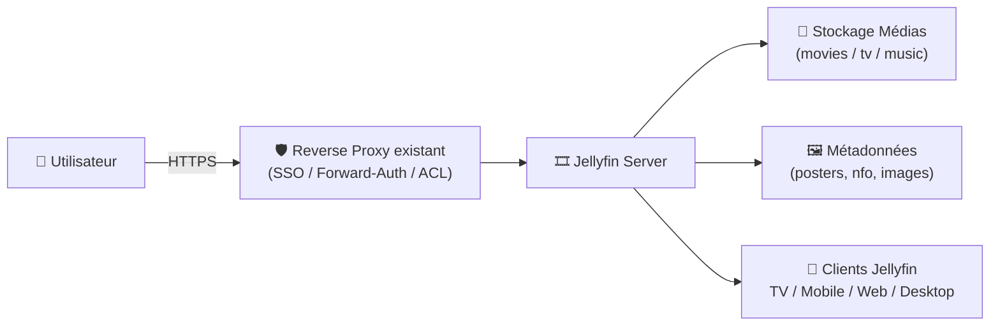
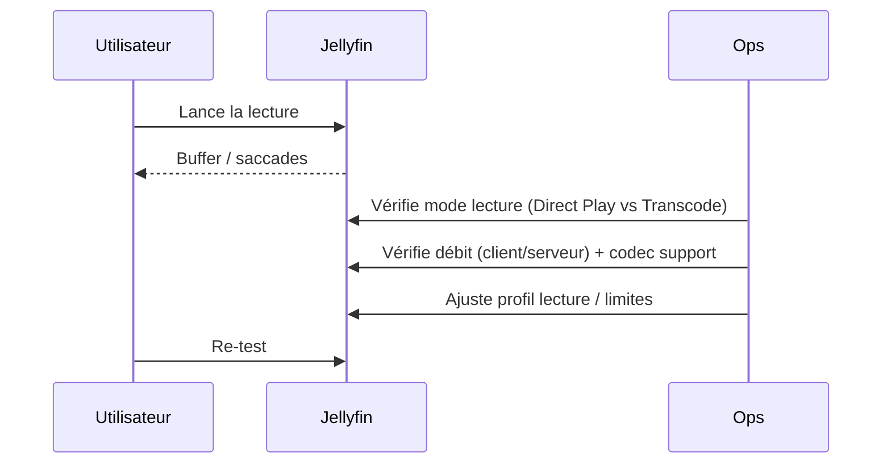

# 🎞️ Jellyfin — Présentation & Configuration Premium (Sans install / Sans Docker / Sans Nginx)

### Media server open-source : streaming, bibliothèques, comptes, contrôle parental, transcodage
Optimisé pour Reverse Proxy existant • Qualité maîtrisée • Accès sécurisé • Exploitation durable

---

## TL;DR

- **Jellyfin** = serveur multimédia **100% open-source** pour organiser et streamer films/séries/musique.
- Points forts : **bibliothèques**, **comptes**, **profils de lecture**, **clients multiples**, **transcodage**.
- Une config premium = **structure des médias**, **métadonnées propres**, **utilisateurs & droits**, **réseau (proxy connu / base URL)**, **qualité de lecture**, **tests & rollback**.

Référence produit : repo officiel. https://github.com/jellyfin/jellyfin :contentReference[oaicite:0]{index=0}

---

## ✅ Checklists

### Pré-configuration (avant d’ouvrir aux utilisateurs)
- [ ] Structure de médiathèque stable (films/séries séparés, noms propres)
- [ ] Stratégie comptes : admin, users, enfants (contrôle parental)
- [ ] Politique accès : LAN/VPN/SSO via reverse proxy existant
- [ ] Choix lecture : direct play prioritaire, transcodage en fallback
- [ ] Décider : sous-domaine vs subpath (Base URL si subpath)

### Post-configuration (qualité perçue)
- [ ] Scan OK : affiches, titres, saisons, épisodes corrects
- [ ] 2–3 appareils tests (TV / mobile / navigateur) → lecture fluide
- [ ] Permissions : un user n’accède qu’aux bibliothèques prévues
- [ ] Réseau proxy : IP du proxy déclarée “Known Proxies”
- [ ] Plan rollback documenté (retour config + annulation changements)

---

> [!TIP]
> Le “premium” sur Jellyfin, ce n’est pas le serveur : c’est **l’hygiène de bibliothèque + la gouvernance users + le réseau proxy bien réglé**.

> [!WARNING]
> Si tu utilises un reverse proxy, Jellyfin peut ignorer certains en-têtes `X-Forwarded-*` tant que ton proxy n’est pas déclaré “Known Proxy”. :contentReference[oaicite:1]{index=1}

> [!DANGER]
> Évite de bricoler Base URL/proxy sans test : une mauvaise Base URL ou un proxy non déclaré peut casser les liens web et/ou fausser l’IP source. :contentReference[oaicite:2]{index=2}

---

# 1) Jellyfin — Vision moderne

Jellyfin n’est pas “juste” une interface pour lire des fichiers.

C’est :
- 📚 Un **catalogueur** (bibliothèques + métadonnées)
- 👥 Un **système multi-utilisateurs** (droits + restrictions)
- 📺 Un **hub clients** (TV, mobile, desktop, web)
- ⚙️ Un **moteur de lecture** (Direct Play / Direct Stream / Transcodage)

Positionnement officiel (serveur + clients) : https://jellyfin.org/downloads/ :contentReference[oaicite:3]{index=3}

---

# 2) Architecture globale



---

# 3) Modèle “premium” de bibliothèque

## 3.1 Structure recommandée (simple et robuste)
- `/media/movies/Movie Title (Year)/Movie Title (Year).mkv`
- `/media/tv/Show Title/Season 01/Show Title - S01E01.mkv`
- `/media/music/Artist/Album/01 - Track.flac`

## 3.2 Pourquoi c’est crucial
- Meilleure identification des œuvres
- Moins de “mismatch” posters/titres
- Navigation plus rapide sur TV
- Maintenance & migration beaucoup plus simples

> [!TIP]
> Si tu corriges 100 fichiers mal nommés aujourd’hui, tu évites 1 000 corrections UI demain.

---

# 4) Gouvernance utilisateurs (ce qui rend Jellyfin “pro”)

## Stratégie minimale recommandée
- 👑 **Admin** (1–2 comptes max) : gestion serveur/bibliothèques
- 👤 **Users** : accès à leurs bibliothèques
- 🧒 **Kids** : contrôle parental + bibliothèques dédiées

## Permissions “premium”
- Bibliothèques par profil (ex: “Kids Movies” séparé)
- Masquer les contenus non adaptés
- Limiter la création/édition de playlists selon le besoin
- Bloquer l’accès admin sur les devices partagés

---

# 5) Réseau + Reverse proxy existant (les 2 réglages qui évitent 80% des bugs)

## 5.1 Known Proxies (indispensable derrière proxy)
Quand Jellyfin est derrière un reverse proxy, il est recommandé de déclarer l’IP du proxy dans **Known Proxies** pour que Jellyfin fasse confiance aux en-têtes `X-Forwarded-*` (proto/host/ip). :contentReference[oaicite:4]{index=4}

Impact :
- IP source correcte (utile logs / limites / sécurité)
- URLs cohérentes (proto/host)
- Comportement plus stable derrière HTTPS

## 5.2 Base URL (si tu utilises un subpath)
Si tu exposes Jellyfin via un chemin type `https://domaine.tld/jellyfin`, utilise la **Base URL** (ex: `/jellyfin`). :contentReference[oaicite:5]{index=5}

> [!WARNING]
> Base URL = seulement si tu es en **subpath**.  
> En sous-domaine (`https://jellyfin.domaine.tld`), laisse généralement vide.

---

# 6) Lecture : Direct Play d’abord, transcodage ensuite

## Les 3 modes (à connaître)
- ✅ **Direct Play** : fichier lu tel quel (qualité top, CPU minimal)
- ✅ **Direct Stream** : remux (conteneur change, codec identique)
- ⚠️ **Transcodage** : ré-encodage (CPU/GPU + latence + qualité variable)

Objectif premium :
- maximiser Direct Play (formats compatibles clients)
- réserver transcodage au “dernier recours”

## Bonnes pratiques
- Uniformiser les codecs “compatibles” (selon ton parc TV)
- Éviter audio exotique si tes clients ne le supportent pas
- Préférer un fichier “bien encodé” à une bibliothèque hétérogène

---

# 7) Métadonnées & qualité catalogue

## Approche premium
- Corriger les identifications “au début” (séries homonymes, éditions)
- Utiliser des images de qualité (posters/backdrops)
- Uniformiser les titres (langue, titres alternatifs)
- Verrouiller les éléments une fois corrects (selon ton workflow)

Résultat :
- UX TV propre
- Recherche efficace
- Moins de “ça a changé tout seul” après rescan

---

# 8) Workflows premium (opérations & incidents)

## 8.1 Triage “lecture qui saccade”


## 8.2 Démarche “catalogue incohérent”
- Fix naming (dossiers/fichiers)
- Rescan ciblé (pas forcément global)
- Verrouillage/ajustement métadonnées
- Contrôle sur TV (là où ça se voit)

---

# 9) Validation / Tests / Rollback

## Tests fonctionnels (check rapide)
```bash
# 1) Le serveur répond (LAN / via proxy existant)
curl -I https://JELLYFIN_FQDN | head

# 2) Si subpath (Base URL), vérifier /web
curl -I https://JELLYFIN_FQDN/jellyfin/web/ | head
```

## Tests “expérience utilisateur”
- 1 film 1080p → direct play attendu
- 1 film “lourd” → vérifier transcodage acceptable
- 1 série → navigation saisons/épisodes propre
- 1 compte kids → restrictions effectives

## Rollback (pragmatique)
- Si tu modifies réseau/proxy/base URL : documente “avant/après”
- Revenir au dernier état stable :
  - annuler Base URL
  - annuler Known Proxies ajoutés (si erreur)
  - restaurer paramètres lecture (bitrate/limites)

> [!TIP]
> Un rollback efficace = “retour en < 5 minutes”.  
> Note exactement quels champs tu as changés.

---

# 10) Sources — Images Docker (demandé) + Docs officielles (en bash, URLs brutes)

```bash
# Jellyfin (docs officielles)
https://jellyfin.org/docs/general/post-install/networking/
https://jellyfin.org/docs/general/post-install/networking/reverse-proxy/

# Jellyfin (containers officiels)
https://jellyfin.org/docs/general/installation/container/
https://jellyfin.org/downloads/docker/
https://hub.docker.com/r/jellyfin/jellyfin
https://hub.docker.com/r/jellyfin/jellyfin/tags
https://github.com/jellyfin/jellyfin

# LinuxServer.io (image Docker Jellyfin)
https://docs.linuxserver.io/images/docker-jellyfin/
https://hub.docker.com/r/linuxserver/jellyfin
https://github.com/linuxserver/docker-jellyfin/releases
```

---

# ✅ Conclusion

Jellyfin “premium”, c’est :
- 📚 bibliothèque propre (noms + structure)
- 👥 users & permissions cohérents
- 🌐 reverse proxy correctement déclaré (Known Proxies) + Base URL si besoin
- 🎬 lecture optimisée (Direct Play prioritaire)
- 🧪 tests & rollback simples et documentés

Docs réseau/proxy & Base URL : https://jellyfin.org/docs/general/post-install/networking/ et https://jellyfin.org/docs/general/post-install/networking/reverse-proxy/ :contentReference[oaicite:6]{index=6}