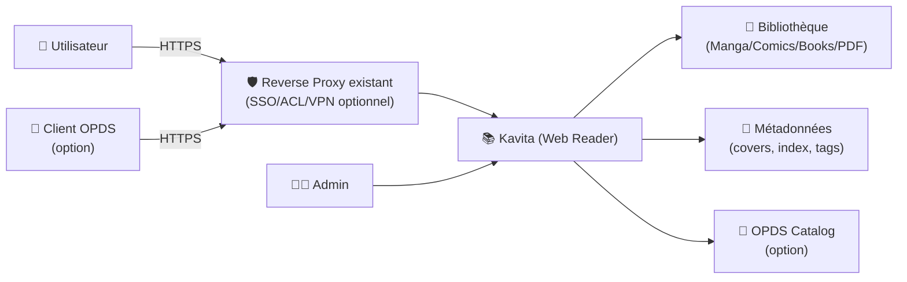
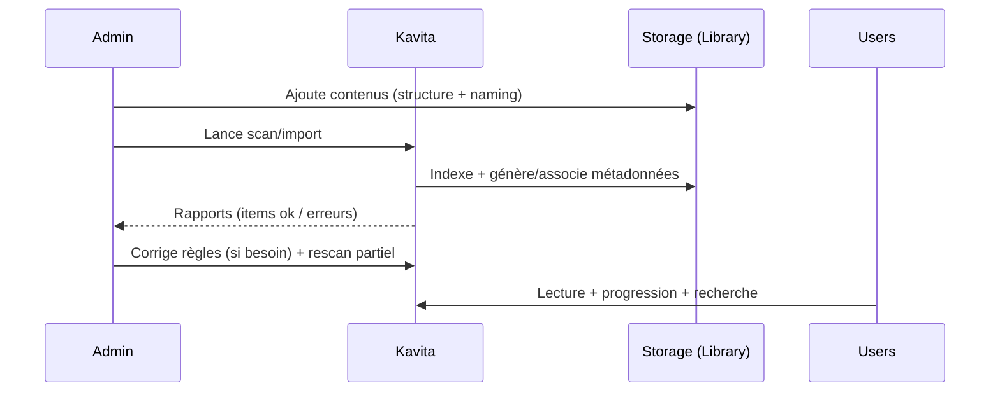

# 📚 Kavita — Présentation & Exploitation Premium (Sans install / Sans Nginx / Sans Docker / Sans UFW)

### Bibliothèque numérique auto-hébergée : mangas, comics, ebooks, PDF — avec users, progression, métadonnées
Optimisé pour reverse proxy existant • Accès multi-utilisateurs • OPDS • Gouvernance & qualité durable

---

## TL;DR

- **Kavita** = serveur de lecture web pour **manga/comics/ebooks/PDF** avec **comptes utilisateurs**, progression, collections et métadonnées.
- Les clés “premium” : **structure de bibliothèque**, **règles d’import**, **permissions**, **base URL** (si subpath), **OPDS**, **procédures de validation** + **rollback**.
- Kavita est idéal si tu veux une expérience “Netflix de la lecture” : lecture web, suivi, recommandations/collections (selon versions), partage contrôlé.

---

## ✅ Checklists

### Pré-configuration (qualité & gouvernance)
- [ ] Conventions de dossiers décidées (manga vs comics vs books)
- [ ] Politique de métadonnées (embedded vs sidecar vs scraping)
- [ ] Règles de nommage (séries / volumes / chapitres)
- [ ] Stratégie utilisateurs & rôles (admin / lecteurs)
- [ ] Décision “sous-domaine” vs “subpath” (base URL)
- [ ] OPDS : usages (apps mobiles, liseuses compatibles)

### Post-configuration (exploitation)
- [ ] Une librairie test importée (manga + epub + pdf) sans erreurs
- [ ] Recherche OK, progression OK, couverture OK
- [ ] 1 user non-admin validé (visibilité + permissions)
- [ ] OPDS testé sur un client (si utilisé)
- [ ] Procédure de backup/restauration validée (config + base de données si utilisée)
- [ ] Runbook “incidents fréquents” écrit (imports, permissions, base URL)

---

> [!TIP]
> Le meilleur gain vient d’une **bibliothèque bien structurée** : Kavita est très agréable quand tes séries/volumes sont propres.

> [!WARNING]
> Si tu utilises un **subpath** (ex: `/kavita/`) derrière ton reverse proxy existant, pense à régler la **Base URL** côté Kavita. Sinon : assets cassés, OPDS étrange, redirections.

> [!DANGER]
> Ne mélange pas des conventions différentes dans un même dossier (chapitres “scantrad” + volumes + one-shots) sans règles : tu obtiens une bibliothèque incohérente et difficile à maintenir.

---

# 1) Kavita — Vision moderne

Kavita n’est pas juste un “lecteur web”.

C’est :
- 🧠 Un **gestionnaire** de bibliothèque (séries, collections, progression)
- 👥 Un **serveur multi-utilisateurs** (partage famille/amis)
- 🔎 Un **indexeur** de contenu (recherche, navigation par séries)
- 📡 Un **pont OPDS** (si tu consommes via apps/clients compatibles)
- 🧰 Un outil “ops-friendly” (logs, réglages, migrations)

---

# 2) Architecture globale



---

# 3) Structure de bibliothèque (ce qui fait “pro”)

## Recommandations de base
- Séparer au minimum :
  - `Manga/`
  - `Comics/`
  - `Books/`
  - `PDF/` (si tu en as beaucoup)
- Une série = un dossier (quand c’est possible)
- Éviter les archives “fourre-tout” à plat (500 fichiers dans un seul dossier)

## Exemple de structure lisible
```
/library
  /Manga
    /One Piece
      One Piece - v01.cbz
      One Piece - v02.cbz
  /Books
    /Dune
      Dune - Frank Herbert.epub
  /PDF
    /Cours
      Linux - Admin avancée.pdf
```

> [!TIP]
> Plus la structure est claire, plus les imports sont rapides et les erreurs sont rares.

---

# 4) Utilisateurs, accès et partage (gouvernance simple)

## Stratégie “safe” (recommandée)
- 1 compte **Admin** (usage rare)
- 1 compte **Ops** (gestion quotidienne)
- Comptes **Lecteurs** (lecture only) pour le reste

Bonnes pratiques :
- limiter l’admin au strict nécessaire
- si tu partages, privilégier une auth centralisée via ton reverse proxy existant (si dispo)

---

# 5) Base URL (subpath) & OPDS (points sensibles)

## Base URL (si tu es en subpath)
Si tu exposes Kavita en `/kavita/`, la Base URL doit être réglée en conséquence :
- Base URL doit **commencer ET finir** par `/`
- Exemple : `/kavita/`

> [!WARNING]
> Changer la base URL peut être soumis à contraintes selon la manière dont Kavita est exécuté (droits utilisateur). Anticipe avant de “publier” l’URL aux utilisateurs.

## OPDS (si tu l’utilises)
- OPDS est pratique pour consommer via des apps externes.
- Valide systématiquement :
  - l’URL annoncée
  - l’auth
  - la cohérence des liens si subpath

---

# 6) Workflows premium (import, qualité, incidents)

## 6.1 Import “propre” (séquence)


## 6.2 “Qualité continue”
- Échantillonnage mensuel :
  - 10 séries au hasard → covers OK, volumes dans l’ordre, progression OK
- Standardiser :
  - formats préférés (cbz/cbr/epub/pdf)
  - gestion des doublons (ne garde qu’une source “canon”)

---

# 7) Validation / Tests / Rollback

## Tests de validation (smoke)
```bash
# 1) Santé HTTP (adapte l'URL)
curl -I https://kavita.example.tld | head

# 2) Si subpath, vérifier que ça répond bien
curl -I https://kavita.example.tld/kavita/ | head

# 3) Test OPDS (si utilisé) — vérifier qu'une réponse arrive
curl -I https://kavita.example.tld/kavita/opds | head
```

## Tests fonctionnels (manuel, 5 minutes)
- importer 1 manga (cbz) + 1 epub + 1 pdf
- vérifier :
  - lecture OK
  - progression enregistrée
  - recherche retrouve les titres
  - couverture affichée

## Rollback (principe)
- Revenir à un état stable = restaurer :
  - la **configuration** Kavita
  - la **base**/données applicatives (si applicable)
  - et éventuellement la bibliothèque (si corruption/erreur d’import)
- Toujours : snapshot/backup avant changement de base URL, gros rescan, migration

> [!TIP]
> Le rollback “premium” est celui que tu as déjà **testé** une fois.

---

# 8) Erreurs fréquentes (et comment les éviter)

- ❌ Bibliothèque en vrac → imports incohérents  
  ✅ impose une structure + conventions de nommage

- ❌ Subpath sans Base URL → assets/OPDS cassés  
  ✅ règle la Base URL (`/kavita/`) et revalide

- ❌ Permissions fichiers → scans incomplets / erreurs d’accès  
  ✅ harmonise les droits lecture/écriture là où Kavita en a besoin

---

# 9) Sources — Images Docker & docs (URLs en bash comme demandé)

```bash
# Kavita — docs (base URL / settings)
https://wiki.kavitareader.com/guides/admin-settings/general/

# Kavita — images (LinuxServer.io)
https://docs.linuxserver.io/images/docker-kavita/
https://hub.docker.com/r/linuxserver/kavita
https://hub.docker.com/r/linuxserver/kavita/tags

# Kavita — images (officiel GHCR)
https://wiki.kavitareader.com/installation/docker/github/
https://github.com/orgs/Kareadita/packages/container/kavita

# Kavita — migration officiel <-> LSIO (diff config path)
https://wiki.kavitareader.com/installation/docker/lsio/
```

---