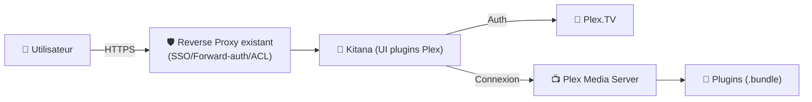
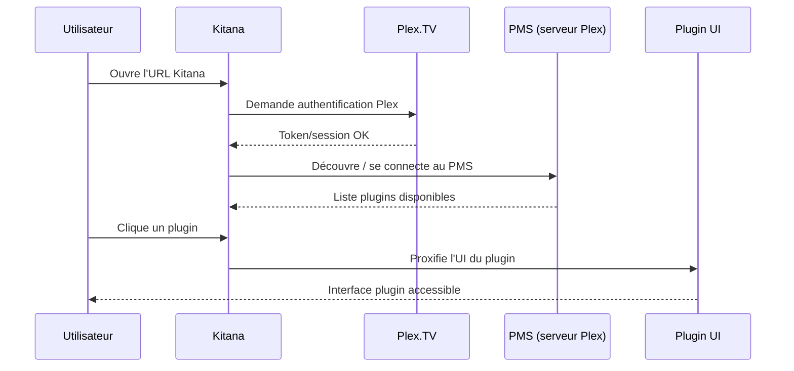

# 🧩 Kitana — Présentation & Usage Premium (UI web pour plugins Plex)

### Accès moderne aux interfaces des plugins Plex (web responsive, mobile-friendly)
Optimisé pour reverse proxy existant • Auth Plex.TV • Connexion PMS locale/distance/relay • Exploitation durable

---

## TL;DR

- **Kitana** expose l’interface des **plugins Plex** via une **UI web responsive**.
- Il s’authentifie via **Plex.TV**, puis se connecte au **Plex Media Server (PMS)** que tu sélectionnes.
- En “premium ops” : **accès strict**, **périmètre clair**, **logs & diagnostic**, **tests** et **rollback**.

---

## ✅ Checklists

### Pré-usage (avant de l’ouvrir à d’autres)
- [ ] PMS accessible et ton compte Plex a les droits nécessaires
- [ ] Plugins Plex réellement présents (et compatibles) côté serveur
- [ ] Accès à Kitana limité (SSO / VPN / ACL via reverse proxy existant)
- [ ] Documentation interne : “quoi faire avec Kitana” (cas d’usage, limites)
- [ ] Un plan simple de rollback (désactivation / restriction / retour arrière)

### Post-configuration (qualité opérationnelle)
- [ ] Auth Plex fonctionnelle (login OK)
- [ ] PMS détecté et sélectionnable
- [ ] Au moins un plugin apparaît et s’ouvre (test sur 1 plugin)
- [ ] Aucun mixed-content / erreurs console (HTTP/HTTPS cohérents)
- [ ] Logs exploitables en cas d’incident

---

> [!TIP]
> Kitana est surtout utile si tu utilises encore des **plugins Plex** qui n’exposent pas une UI confortable ailleurs (ou si tu veux les gérer facilement sur mobile/tablette).

> [!WARNING]
> L’écosystème “plugins Plex” a évolué au fil des années : certains plugins sont obsolètes, et l’expérience peut varier.  
> Attends-toi à faire du “best effort” selon les plugins réellement installés.

> [!DANGER]
> Kitana donne un accès aux interfaces de plugins : **ne le rends pas public**.  
> Contrôle d’accès strict recommandé (SSO/forward-auth/VPN/ACL).

---

# 1) Kitana — Vision moderne

Kitana n’est pas un “plugin manager” de Plex.

C’est :
- 🌐 Un **proxy UI** : il “projette” l’interface des plugins Plex vers le web
- 🔐 Un **flux authentifié** : login Plex.TV → sélection PMS → UI plugins
- 📱 Une **UI responsive** : usage mobile plus pratique que les interfaces natives de certains plugins

---

# 2) Architecture globale



---

# 3) Philosophie premium (5 piliers)

1. 🔐 **Accès contrôlé** (Kitana = surface sensible)
2. 🧭 **Chemins & compatibilité plugins** (sinon “no valid plugins”)
3. 🧪 **Validation systématique** (login → PMS → plugin → action)
4. 🧯 **Dépannage rapide** (logs, erreurs UI, mixed content)
5. 🔄 **Rollback simple** (désactiver / restreindre / revenir à l’état stable)

---

# 4) Parcours utilisateur (ce que Kitana fait réellement)



---

# 5) Cas d’usage “propre” (là où Kitana apporte de la valeur)

## 5.1 Administration “terrain”
- Activer/désactiver des options de plugin depuis un mobile
- Vérifier rapidement un état/config (sans SSH/desktop)

## 5.2 Dépannage plugin
- Accéder aux pages internes d’un plugin (settings, status)
- Reproduire un bug facilement (même réseau / même URL)

## 5.3 Utilisation multi-serveurs (si tu en as)
- Choisir le PMS correct selon le compte Plex
- Réduire les confusions “quel serveur ? quel plugin ?”

---

# 6) Risques & limites (pour éviter les mauvaises attentes)

- 🧩 Dépend fortement de **la présence et compatibilité** des plugins Plex installés.
- 🌐 Selon ton exposition (HTTPS, subpath, headers), tu peux rencontrer :
  - erreurs de **mixed content**
  - soucis de **cookies / redirections**
- 🧠 Kitana n’est pas une plateforme de logs : pour diagnostiquer à fond, il faut aussi regarder PMS + plugin.

---

# 7) Dépannage premium (symptômes → causes probables → actions)

## “No valid plugins”
Causes fréquentes :
- Le serveur n’a pas de plugins réellement chargés
- Emplacement plugins non pris en compte
- Plugin obsolète ou non compatible

Actions :
- Vérifier côté PMS que des plugins existent et sont détectés
- Tester avec un plugin connu (si tu en as un)
- Redémarrer PMS après ajout/modif de plugins

## “Page ne charge pas / blanc”
Causes fréquentes :
- Reverse proxy/headers mal alignés
- Subpath/base path incorrect
- Mixed content (HTTPS front, HTTP back)

Actions :
- Ouvrir console navigateur, relever erreurs
- Vérifier cohérence HTTP/HTTPS
- Tester en accès direct interne (bypass proxy) pour isoler

## “Login boucle / token refusé”
Causes fréquentes :
- Cookies bloqués / headers
- Décalage d’URL, proxy qui réécrit mal
- Restrictions navigateur (third-party cookies)

Actions :
- Tester en navigation privée
- Tester autre navigateur
- Vérifier que le reverse proxy conserve correctement `Host`, `X-Forwarded-*`

---

# 8) Validation / Tests / Rollback

## Tests de validation (smoke)
```bash
# 1) Vérifier que l'endpoint répond
curl -I http://KITANA_HOST:PORT | head

# 2) Vérifier que la page renvoie du HTML
curl -s http://KITANA_HOST:PORT | head -n 20

# 3) Test fonctionnel (manuel)
# - Ouvrir l'UI → login Plex → sélectionner PMS → ouvrir un plugin
```

## Tests de sécurité (indispensables)
- [ ] Sans authent (ou hors périmètre ACL) → accès refusé
- [ ] Avec user autorisé → accès OK
- [ ] Vérifier que l’URL Kitana n’expose pas de détails sensibles (bannières, endpoints)

## Rollback (rapide)
- Restreindre l’accès via reverse proxy (VPN only / allowlist)
- Désactiver temporairement Kitana si incident
- Revenir à la dernière config reverse proxy stable si régression (headers/subpath)

---

# 9) Sources (URLs) — y compris images Docker & LinuxServer

```bash
# Kitana (upstream / docs)
https://github.com/pannal/Kitana

# Image Docker Kitana (Docker Hub)
https://hub.docker.com/r/pannal/kitana/
https://hub.docker.com/r/pannal/kitana/tags

# LinuxServer.io — catalogue d’images (pour vérifier si une image Kitana existe chez LSIO)
https://www.linuxserver.io/our-images
```