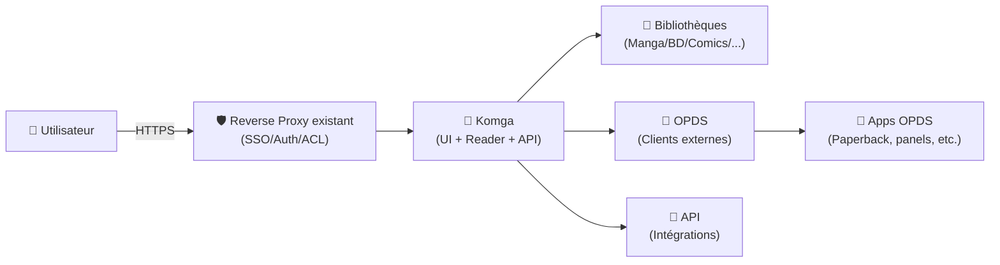
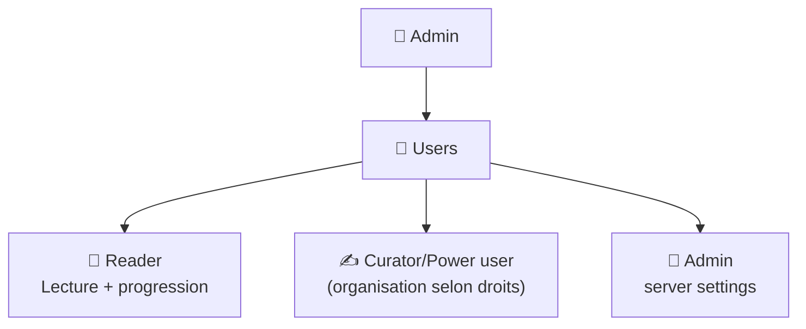
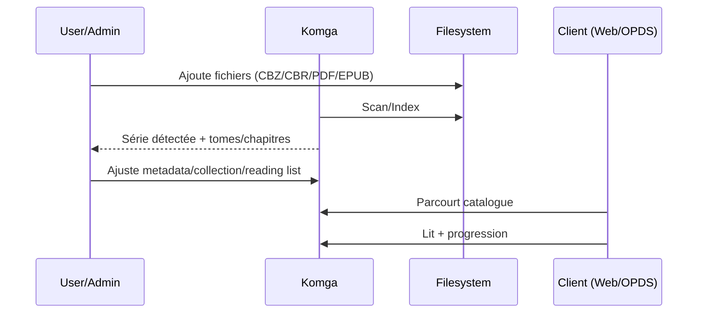

# 📖 Komga — Présentation & Configuration Premium (Sans installation)

### Media server “comics-first” : bibliothèques, OPDS, web reader, utilisateurs & permissions
Optimisé pour reverse proxy existant • Organisation durable • Qualité metadata • Exploitation propre

---

## TL;DR

- **Komga** est un **media server** pour **comics/mangas/BDs**, avec **web UI + web reader + API + OPDS**.
- Son “super pouvoir” = transformer un dossier de fichiers (CBZ/CBR/PDF/EPUB) en **bibliothèques structurées** : séries, tomes, collections, tags, lecture en cours, progression.
- Une config premium = **bibliothèques bien découpées**, **scanning maîtrisé**, **metadata propre**, **permissions strictes**, **OPDS** bien cadré, **workflows de validation/rollback**.

---

## ✅ Checklists

### Pré-configuration (avant de remplir la bibliothèque)
- [ ] Définir la **taxonomie** : 1 bibliothèque = 1 logique (ex: Manga / BD / Comics / Magazines)
- [ ] Valider le **format** et la **qualité** des fichiers (CBZ/CBR propres, PDF/EPUB cohérents)
- [ ] Choisir la stratégie metadata : “minimaliste fiable” vs “enrichie”
- [ ] Définir la stratégie d’accès : interne / via reverse proxy existant / OPDS (lecteurs externes)
- [ ] Préparer rôles : Admin / Lecteurs / Éditeurs (si tu délègues)

### Post-configuration (qualité & exploitation)
- [ ] Scan initial sans erreurs (logs propres)
- [ ] Séries bien reconnues + numérotation correcte
- [ ] Couvertures / titres / auteurs OK (échantillon sur 10 séries)
- [ ] Un utilisateur “lecteur” ne voit que ce qu’il doit voir
- [ ] OPDS fonctionne (si activé) sur un client test

---

> [!TIP]
> Komga devient “premium” quand tu **stabilises ta structure** : bibliothèques claires + conventions de noms + collections/reading lists utiles.

> [!WARNING]
> La plupart des “bugs Komga” sont en réalité des soucis de **naming / numérotation / archives CBZ/CBR**.  
> Corrige la source → l’index devient propre.

> [!DANGER]
> OPDS + accès distant = surface d’exposition. Traite ça comme un service sensible : auth obligatoire et périmètres testés.

---

# 1) Komga — Vision moderne

Komga n’est pas un simple catalogue.

C’est :
- 🗃️ Un **gestionnaire de bibliothèques** (plusieurs librairies)
- 🧭 Un **indexeur** (séries, tomes, metadata)
- 📚 Un **lecteur web** (lecture, progression, reprise)
- 🔌 Un **serveur OPDS** (pour lecteurs externes)
- 🧩 Une **API** (intégrations, automatisations)

---

# 2) Architecture globale (usage)



---

# 3) Modèle de contenu (ce qui rend Komga “clean”)

## Les objets principaux
- **Library** : collection de fichiers sous une logique commune
- **Series** : regroupement (ex: *One Piece*)
- **Book** : volume/chapitre (selon ton organisation)
- **Collection** : regroupement transversal (ex: “Univers Marvel”, “Lire plus tard”)
- **Reading list** : liste ordonnée (ex: ordre de lecture conseillé)

> [!TIP]
> Les **Collections** servent à organiser “par thème/univers”.  
> Les **Reading lists** servent à “parcours de lecture”.

---

# 4) Stratégie bibliothèques (recommandée)

## Découpage premium (simple & efficace)
- **Manga** (CBZ/CBR majoritairement)
- **BD** (albums)
- **Comics** (runs/volumes)
- **Magazines** (si tu en as)

### Pourquoi séparer ?
- Paramètres de scan et de tri plus cohérents
- Permissions plus simples (partage “famille” vs “perso”)
- Résultats plus propres (même logique de numérotation)

---

# 5) Naming & Numérotation (le vrai “quality gate”)

## Règles qui évitent 80% des soucis
- Toujours inclure un **numéro de tome/chapitre** (même implicite)
- Éviter les variations “Vol.1 / Volume 01 / v1” au sein d’une même série
- Préférer un format stable, ex:
  - `Series Name - v01.cbz`
  - `Series Name - v02.cbz`
  - `Series Name - v10.cbz`

## Cas “chapitres”
- `Series Name - c001.cbz`
- `Series Name - c002.cbz`

> [!WARNING]
> Les fichiers “spéciaux” (oneshot, extra, bonus) sont souvent mal triés :  
> mets un suffixe clair (`- extra`, `- oneshot`) et garde une logique constante.

---

# 6) Metadata (propre, pragmatique)

## Deux approches saines

### A) Minimaliste fiable
- Titre série correct
- Numérotation stable
- Couverture OK
- Tags essentiels (langue, genre)

### B) Enrichie
- Auteurs, genres détaillés
- Résumés
- Tags d’univers/collections
- Liens via API/intégrations

> [!TIP]
> Commence minimaliste, puis enrichis progressivement sur les séries “top”.  
> Ça évite de passer 20 heures sur 3 000 tomes.

---

# 7) Utilisateurs & rôles (gouvernance)

Komga permet à un administrateur de gérer les utilisateurs via l’interface (Server Settings → Users), avec rôles/droits associés.



> [!TIP]
> Crée un compte “lecteur” pour tester les permissions : c’est le meilleur audit.

---

# 8) OPDS (lecture via apps externes)

## À quoi ça sert
- Lire via des **clients OPDS** (mobile/tablette)
- Parcourir le catalogue sans passer par le navigateur
- Télécharger/streamer selon client

## Bon usage premium
- OPDS pour mobilité (tablette), UI web pour administration (collections/gestion)
- Valider 1 client OPDS “référence” et documenter la config interne

> [!WARNING]
> Les clients OPDS n’exposent pas tous les mêmes fonctions (progression, collections, etc.).  
> Choisis ton client “standard” et formalise-le.

---

# 9) Workflows premium (lecture & maintenance)

## Lecture “propre”
- Collection “En cours”
- Reading list “Ordre de lecture”
- Collection “À relire”
- Tag “famille” / “kids” si tu partages

## Maintenance récurrente (hygiène)
- Chaque mois : échantillonner 20 séries, vérifier tri/cover/numérotation
- Corriger à la source (fichiers) plutôt que bricoler à la main partout

---

# 10) Validation / Tests / Rollback

## Tests de validation (fonctionnels)
```bash
# 1) UI répond via reverse proxy
curl -I https://komga.example.tld | head

# 2) Auth fonctionne (test utilisateur lecteur)
# (manuel) Connexion lecteur -> vérifier périmètre visible

# 3) OPDS (si utilisé) répond
curl -I https://komga.example.tld/opds | head
```

## Tests “qualité bibliothèque”
- Série test : numérotation 1→10 correcte
- Série test : couvertures cohérentes
- Recherche : titre/auteur renvoie des résultats attendus

## Rollback (sans installation)
- Si un changement de config casse l’accès (base path / reverse proxy) :
  - revenir à la config précédente du proxy
- Si un scan a “salit” l’index (naming douteux) :
  - corriger les noms/archives côté fichiers
  - relancer une réindexation contrôlée
- Documenter “ce qu’on change” + “comment on revient en arrière”

---

# 11) Diagramme “cycle de vie” d’une nouvelle série



---

# 12) Sources (adresses en bash)

```bash
# Komga — site & documentation
https://komga.org/
https://komga.org/docs/

# Guides (ex: comptes utilisateurs)
https://komga.org/docs/guides/user-accounts/

# API / OpenAPI (ex: users)
https://komga.org/docs/openapi/get-users/

# Komga — GitHub (upstream)
https://github.com/gotson/komga

# Docker images “officielles Komga” (registries mentionnés)
https://komga.org/docs/installation/docker/
https://hub.docker.com/r/gotson/komga

# LinuxServer.io — vérification image Komga
# (à date, pas d'image "komga" publiée par LinuxServer.io dans leur catalogue public, seulement une demande historique)
https://www.linuxserver.io/our-images
https://discourse.linuxserver.io/t/request-komga-free-and-open-source-comics-mangas-server/1632