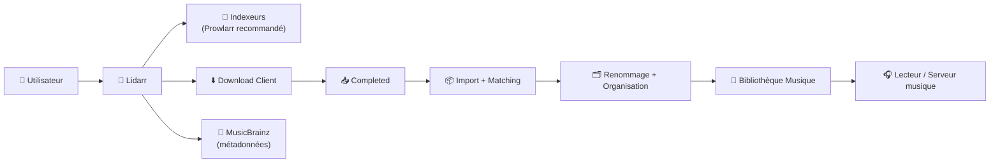
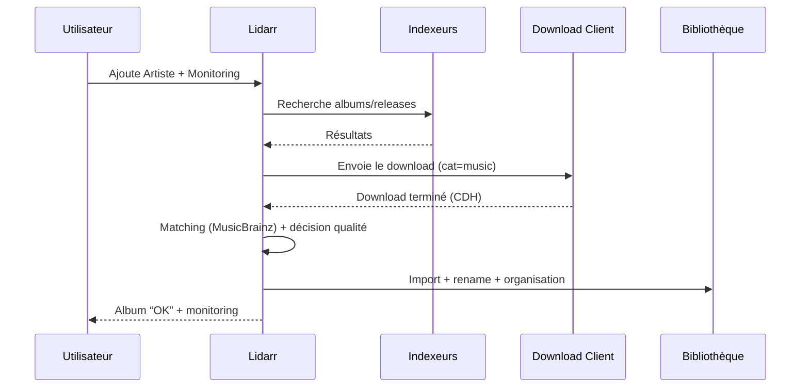

# 🎵 Lidarr — Présentation & Configuration Premium (Sans install / Sans Docker / Sans Nginx / Sans UFW)

### Automatisation intelligente de votre bibliothèque musique
Optimisé pour Reverse Proxy existant • Qualité maîtrisée • Métadonnées propres • Organisation durable • Exploitation “ops-ready”

---

## TL;DR

- **Lidarr** = gestionnaire de musique “à la Radarr/Sonarr” : il **surveille**, **cherche**, **télécharge**, **importe**, **renomme** et **met à niveau** tes albums.
- Il s’appuie fortement sur **MusicBrainz** (métadonnées) et fonctionne au mieux avec une **bibliothèque bien structurée**.
- Une config premium = **profils qualité cohérents**, **règles de releases propres**, **métadonnées maîtrisées**, **chemins/hardlinks OK**, **monitoring + rollback**.

---

## ✅ Checklists

### Pré-configuration (avant de “laisser tourner tout seul”)
- [ ] Bibliothèque cible définie (un chemin unique, stable)
- [ ] Stratégie qualité choisie (FLAC / MP3 V0 / 320, etc.)
- [ ] Politique “upgrade” décidée (autoriser ou non)
- [ ] Règles de releases prêtes (éviter WEB low-quality, scènes douteuses, etc.)
- [ ] Source d’indexation centralisée (Prowlarr recommandé si tu l’utilises déjà)
- [ ] Download client catégorisé “music” et CDH activé (completed handling)

### Post-configuration (validation)
- [ ] Ajout d’un artiste + album test → import OK
- [ ] Renommage conforme au standard choisi
- [ ] Upgrade test (si activé) : une meilleure release remplace proprement l’ancienne
- [ ] Pas d’erreurs récurrentes dans les logs (permissions, chemins, tags)
- [ ] Un plan de rollback existe (config + DB + bibliothèque)

---

> [!TIP]
> Lidarr est “premium” quand tu as **des règles simples et strictes** : peu d’exceptions, une convention de nommage stable, et des profils qualité clairs.

> [!WARNING]
> La musique est plus “sale” que les films/séries : tags incohérents, releases mal nommées, éditions multiples.  
> Ta meilleure arme = **Metadata Profile + Release Profile** bien réglés.

> [!DANGER]
> Si tes chemins (downloads ↔ bibliothèque) ne sont pas cohérents, tu auras : imports qui échouent, duplications, “missing files”, et upgrades cassés.

---

# 1) Lidarr — Vision moderne

Lidarr n’est pas juste “chercher un album”.

C’est :
- 🧠 Un moteur de **décision qualité**
- 🎼 Un **normalisateur** de métadonnées (MusicBrainz)
- 📦 Un **gestionnaire de bibliothèque** (structure + renommage)
- 🔄 Un automatisateur (monitoring + upgrades + imports)

Il connecte :
- Indexeurs / sources
- Download client
- Stockage (bibliothèque)
- Écosystème media (Plex/Jellyfin via dossiers, si usage musique)

---

# 2) Architecture globale



---

# 3) Philosophie “Premium” (5 piliers)

1. 🎯 **Profils Qualité** clairs (FLAC vs MP3 320 vs V0)
2. 🧾 **Release Profiles** stricts (éviter mauvais encodes / éditions indésirables)
3. 🎼 **Metadata Profile** maîtrisé (quels champs Lidarr peut réécrire)
4. 🗂️ **Organisation/Nommage** stable (zéro bricolage)
5. 🧪 **Validation + Rollback** (tests, backups, retour arrière)

---

# 4) Profils Qualité — Le cœur stratégique

## 4.1 Stratégies types (recommandées)

### Option A — “Audiophile simple”
- Qualité cible : **FLAC**
- Upgrade : ✅ autorisé (meilleure source / meilleure édition)
- Avantage : cohérence maximale
- Risque : taille disque

### Option B — “Efficace”
- Qualité cible : **MP3 320**
- Upgrade : ✅ autorisé (320 > V0 > 256)
- Avantage : léger + compatible partout
- Risque : variations de tags selon sources

### Option C — “Mix intelligent”
- FLAC pour certains artistes + MP3 320 pour le reste  
→ possible, mais demande une discipline de profils/étiquettes (plus complexe).

> [!TIP]
> Commence par **un seul profil** (ex: MP3 320 ou FLAC). Tu affines après, sinon tu te crées une usine à exceptions.

---

# 5) Release Profiles — Éviter les mauvaises releases

Objectif : dire à Lidarr ce qui est **désirable** / **à éviter**.

## 5.1 Règles premium (exemples)
- ✅ Préférer certains tags/encodeurs fiables
- ✅ Favoriser “CD / WEB / Vinyl” selon ta stratégie
- ❌ Bloquer :
  - transcodes douteux
  - “upscaled”
  - releases mal taggées
  - “scene packs” non cohérents

> [!WARNING]
> Trop de règles = faux négatifs (Lidarr ne trouve “rien”).  
> Mets d’abord 3–5 règles “massives”, puis ajuste sur cas réels.

---

# 6) Metadata Profile — Contrôler ce que Lidarr réécrit

## 6.1 Pourquoi c’est crucial
Lidarr peut “corriger” (ou casser) :
- artistes (alias, featuring)
- titres
- numéros de piste
- années / éditions
- genres

## 6.2 Politique premium recommandée
- Autoriser les mises à jour **structurantes** (IDs, track numbers, artwork si souhaité)
- Être prudent sur :
  - genres (trop variables)
  - renommage agressif si tu as une bibliothèque déjà “curée”

> [!TIP]
> Si tu migres une bibliothèque existante, commence en mode “conservateur”, observe, puis ouvre progressivement.

---

# 7) Organisation & Nommage (durable)

## 7.1 Structure recommandée
```
/data/media/music/
  Artist/
    Album (Year)/
      01 - Track Title.flac
      02 - Track Title.flac
```

## 7.2 Nommage premium (principes)
- Toujours inclure **numéro de piste**
- Garder l’album comme unité (pas un tas de fichiers à plat)
- Éviter les caractères exotiques si tes lecteurs ont des limites

> [!WARNING]
> La majorité des “médias introuvables” vient d’un renommage non stable ou d’une structure ambiguë.

---

# 8) Intégration indexeurs & download client (sans recettes d’install)

## 8.1 Indexeurs
- Centraliser via **Prowlarr** si tu l’utilises déjà (moins de duplication)
- Sinon : config directe dans Lidarr (ok, mais maintenance plus lourde)

## 8.2 Download client (principes premium)
- Catégorie dédiée : `music`
- Completed Download Handling activé côté Lidarr
- Éviter les paths incohérents : Lidarr doit pouvoir importer sans bricolage

---

# 9) Workflow premium (end-to-end)



---

# 10) Validation / Tests / Rollback

## 10.1 Tests de validation (smoke + fonctionnel)

```bash
# 1) Santé HTTP (adapter host/URL)
curl -I http://LIDARR_HOST:PORT | head

# 2) Test fonctionnel (manuel)
# - Ajouter 1 artiste test
# - Lancer une recherche d’album
# - Vérifier import + renommage + tags cohérents

# 3) Contrôle d’import
# - vérifier qu’un album se retrouve dans /music/Artist/Album (Year)/
# - vérifier que les pistes ont un numéro (01, 02, …)
```

## 10.2 Signaux de qualité
- Peu de “failed import”
- Peu de “unknown album”
- Upgrades contrôlés (pas de boucle)
- Pas de “permissions denied”
- Library stable (pas de renommage permanent)

## 10.3 Rollback (propre)
- Backups : **config/app + DB** (et idéalement snapshot du dossier musique si grosse refonte)
- Retour arrière :
  - restaurer DB/config
  - annuler règles agressives (release/metadata)
  - relancer un “rescan” contrôlé

> [!DANGER]
> Ne lance pas des “mass updates metadata” sans backup : c’est exactement le genre d’action difficile à défaire.

---

# 11) Erreurs fréquentes (et fixes rapides)

## “Downloads import échoue”
Causes :
- permissions
- chemins incohérents (downloads vs bibliothèque)
- catégorie download client mauvaise

Fix :
- vérifier la catégorie `music`
- vérifier l’accès RW à la bibliothèque
- corriger mapping de chemins si ton écosystème n’utilise pas les mêmes paths

## “Mauvaises métadonnées / albums dupliqués”
Causes :
- matching MusicBrainz ambigu (éditions multiples)
- metadata profile trop agressif

Fix :
- rendre le metadata profile plus conservateur
- corriger l’artiste/albums problématiques manuellement, puis verrouiller la stratégie

## “Boucle d’upgrades”
Cause :
- profil qualité + règles release trop permissifs

Fix :
- fixer un “maximum acceptable”
- limiter les tags préférés
- réduire la fréquence de scan/research si besoin

---

# 12) Sources — Images Docker (format demandé)

## 12.1 Image LinuxServer.io (la plus utilisée)
- `linuxserver/lidarr` (Docker Hub) : https://hub.docker.com/r/linuxserver/lidarr/  
- Doc LinuxServer “docker-lidarr” : https://docs.linuxserver.io/images/docker-lidarr/  
- Repo de packaging (référence de l’image) : https://github.com/linuxserver/docker-lidarr  
- Variante GHCR (package) : https://github.com/linuxserver/lidarr/pkgs/container/lidarr  

## 12.2 Alternative populaire (hotio)
- `hotio/lidarr` (Docs container) : https://hotio.dev/containers/lidarr/  
- Repo hotio (référence de l’image) : https://github.com/hotio/lidarr  
- Package GHCR hotio : https://github.com/orgs/hotio/packages/container/package/lidarr  

## 12.3 Image communautaire (autre)
- `11notes/lidarr` (Docker Hub) : https://hub.docker.com/r/11notes/lidarr  

## 12.4 Référence projet Lidarr
- Site officiel : https://lidarr.audio/  

---