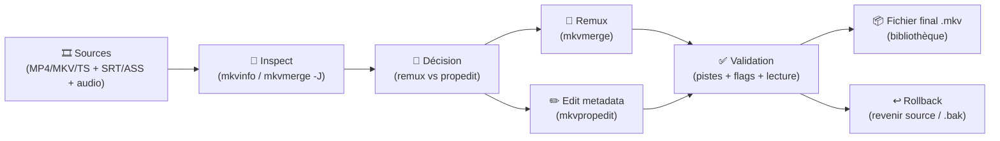
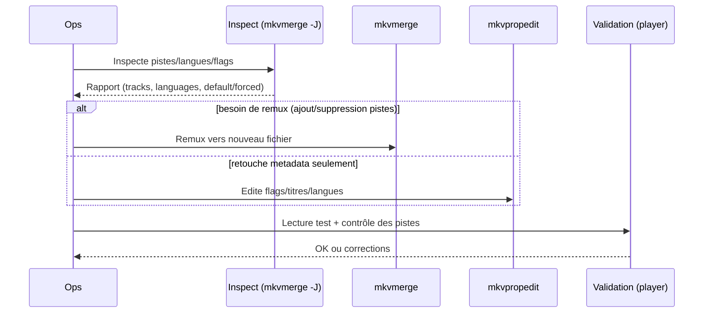

# 🎞️ MKVToolNix — Présentation & Usage Premium (Matroska .mkv)

### Toolbox “pro” pour créer, inspecter et éditer des fichiers Matroska (mkvmerge, mkvinfo, mkvextract, mkvpropedit)
Optimisé pour workflows qualité • Subtitles/Audio tracks • Automation CLI • Exploitation durable

---

## TL;DR

- **MKVToolNix** = l’arsenal de référence pour **assembler (merge)**, **démuxer (extract)**, **inspecter (info)** et **éditer des métadonnées** dans des `.mkv`.
- Le cœur opérationnel : **mkvmerge** (assemblage), **mkvextract** (extraction), **mkvinfo** (diagnostic), **mkvpropedit** (édition sans remux complet).
- “Premium” = **standardisation des conventions**, **workflows reproductibles**, **tests/validation**, **rollback**, et **traçabilité**.

Docs officielles (navigateur) : https://mkvtoolnix.download/docs.html  
Page d’accueil / actualités : https://mkvtoolnix.download/

---

## ✅ Checklists

### Pré-usage (avant d’automatiser)
- [ ] Définir conventions : langue (`fre/fra`, `eng`), “default/forced”, ordre des pistes
- [ ] Définir règles de nommage : titres de pistes, tags (commentaires, “SDH”, “Forced”)
- [ ] Définir pipeline : remux vs propedit (sans remux) selon les changements
- [ ] Prévoir validation : lecture rapide + comparaison des pistes (avant/après)
- [ ] Prévoir rollback : conserver l’original ou générer un fichier “.bak”

### Post-usage (contrôle qualité)
- [ ] Pistes attendues présentes (vidéo/audio/subs/chapitres)
- [ ] Langues correctes + flags `default/forced` cohérents
- [ ] Timecodes OK (pas de désync)
- [ ] Lecture sur le player cible (Plex/Jellyfin/MPV/VLC) validée
- [ ] Fichier final unique, propre, sans doublons inutiles

---

> [!TIP]
> Pour 80% des cas “propre”, tu n’as besoin que de **mkvmerge** (remux) + **mkvpropedit** (retouches rapides).

> [!WARNING]
> Modifier des flags/metadata est souvent faisable **sans remux** via **mkvpropedit** → plus rapide, moins risqué.

> [!DANGER]
> Ne remplace jamais l’original sans filet : garde un `.mkv` source ou utilise une sortie vers un nouveau fichier, puis swap.

---

# 1) Vision moderne

MKVToolNix n’est pas un “convertisseur vidéo”.

C’est :
- 🧩 Un **assembleur de conteneur** (Matroska) : réorganiser des pistes sans ré-encoder
- 🔎 Un **outil de diagnostic** : comprendre exactement ce que contient un fichier
- 🛠️ Un **éditeur de métadonnées** : langues, flags, titres, chapitres, attachments

Outils principaux (docs) :
- mkvmerge : https://mkvtoolnix.download/doc/mkvmerge.html
- mkvinfo / mkvextract / mkvpropedit : index documentation : https://mkvtoolnix.download/doc/

---

# 2) Architecture globale (workflow)



---

# 3) Philosophie premium (5 piliers)

1. 🎯 **Zéro ré-encodage** (quand possible) : conteneur uniquement  
2. 🧭 **Conventions strictes** : langues, titres, ordre, flags  
3. 🧪 **Validation systématique** : inspect + test lecture  
4. 🔁 **Automatisation reproductible** : commandes “idempotentes”  
5. ↩️ **Rollback simple** : source conservée / swap contrôlé  

---

# 4) Cas d’usage “premium” (ce que MKVToolNix fait très bien)

## 4.1 Remux propre (sans ré-encoder)
- Mettre une vidéo, 2 audios (VO/VF), des sous-titres (FR/EN/Forced/SDH) dans **un seul MKV**
- Réordonner les pistes (ex: audio VO par défaut)
- Ajouter chapitres / attachments (fonts pour ASS)

## 4.2 Nettoyage (anti-doublons)
- Supprimer pistes inutiles (commentaires, doublons)
- Uniformiser titres (“French 5.1”, “English Stereo”)

## 4.3 Corrections rapides (sans remux) via mkvpropedit
- Corriger la langue d’une piste
- Changer `default/forced`
- Modifier le titre de piste
- Ajouter/supprimer tags simples

---

# 5) Conventions recommandées (très important)

## 5.1 Langues
- Utiliser des codes cohérents (souvent `eng`, `fra`/`fre`) selon ton écosystème.
- Choisir **un standard** et s’y tenir (important pour Plex/Jellyfin).

## 5.2 Ordre & flags (exemple “cinéma”)
- Vidéo : 1 piste
- Audio :
  1) VO (default=yes)
  2) VF (default=no)
- Sous-titres :
  - FR (default=no)
  - EN (default=no)
  - Forced (forced=yes) si pertinent

> [!TIP]
> Le “default” ne doit pas être mis partout. Un seul default cohérent = expérience utilisateur stable.

---

# 6) Exemples CLI (réutilisables)

## 6.1 Inspect rapide (liste des pistes)
```bash
mkvmerge -i "input.mkv"
```

## 6.2 Sortie JSON (pratique pour automatisation)
```bash
mkvmerge -J "input.mkv" | head -n 40
```

## 6.3 Remux : ajouter SRT + définir langue/titre (exemple)
```bash
mkvmerge -o "output.mkv" \
  --language 0:eng --track-name 0:"Video" "video_source.mkv" \
  --language 0:eng --track-name 0:"English 5.1" "audio_eng.ac3" \
  --language 0:fra --track-name 0:"French 5.1" "audio_fra.ac3" \
  --language 0:fra --track-name 0:"French" "subs_fra.srt"
```

## 6.4 Ajuster metadata sans remux (mkvpropedit)
```bash
# Exemple : mettre la piste audio 1 en default, et renommer une piste
mkvpropedit "output.mkv" \
  --edit track:a1 --set flag-default=1 \
  --edit track:a2 --set flag-default=0 \
  --edit track:a1 --set name="English 5.1"
```

> [!WARNING]
> Les index `track:a1`, `track:s1`, etc. dépendent du fichier. Inspecte avant (mkvmerge -J / mkvinfo).

---

# 7) Workflows premium (incident & qualité)

## 7.1 “Qualité audio/subs” — séquence recommandée


---

# 8) Validation / Tests / Rollback

## 8.1 Tests de validation (techniques)
```bash
# 1) Vérifier les pistes
mkvmerge -i "output.mkv"

# 2) Vérifier flags/langues en JSON (utile pour scripts)
mkvmerge -J "output.mkv" | grep -i -E '"language"|flag-default|flag-forced|track_name' | head -n 80
```

## 8.2 Tests fonctionnels (humains, rapides)
- Ouvrir dans un player (VLC/MPV) :
  - bascule audio VO/VF
  - activer subs FR/EN/Forced
  - vérifier 2–3 scènes clés (timing, forced réellement forced)

## 8.3 Rollback (simple)
- Toujours produire `output.mkv` en **nouveau fichier**
- Si OK → remplacer (swap)
- Si KO → garder source intacte

---

# 9) Erreurs fréquentes (et comment les éviter)

- ❌ “Forced” mis sur des subs complets → UX mauvaise  
  ✅ réserver `forced=yes` aux forced réels

- ❌ Langues non définies / incohérentes → Plex/Jellyfin se trompent  
  ✅ standardiser `eng/fra` + titres explicites

- ❌ Plusieurs pistes `default=yes` → comportement imprévisible  
  ✅ un seul default par type (audio, éventuellement subs)

- ❌ Remux inutile alors qu’un propedit suffit  
  ✅ commencer par “est-ce juste metadata ?”

---

# 10) Sources — Images Docker (format demandé, URLs brutes)

## 10.1 Image communautaire la plus citée (GUI via navigateur)
- `jlesage/mkvtoolnix` (Docker Hub) : https://hub.docker.com/r/jlesage/mkvtoolnix  
- Repo de packaging (référence de l’image) : https://github.com/jlesage/docker-mkvtoolnix  
- Doc officielle MKVToolNix “Downloads → Docker” (mentionne l’image Jocelyn Le Sage) : https://mkvtoolnix.download/downloads.html  

## 10.2 LinuxServer.io (si tu veux une image LSIO)
- Documentation LSIO (répertoire global des images) : https://www.linuxserver.io/our-images  
- Documentation LSIO (portail docs) : https://docs.linuxserver.io/  

> Note : si tu veux **la page exacte** de l’image LSIO MKVToolNix (si elle est publiée/renommée), je peux te la lister au même format dès que tu me donnes le nom exact attendu (ex: `linuxserver/mkvtoolnix`) ou l’URL de la page.

---

# ✅ Conclusion

MKVToolNix = le standard “pro” pour rendre une médiathèque **propre** :
- pistes ordonnées, bien nommées, langues correctes
- flags default/forced maîtrisés
- automatisation possible et contrôlable
- validation + rollback simples

Quand tu veux, donne-moi le prochain outil/app — j’applique le même format (sans install/nginx/docker/ufw/30-60-90, mais avec les sources d’images Docker si elles existent).