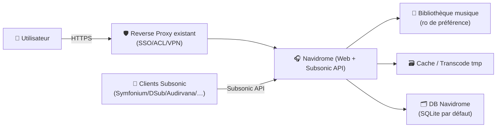
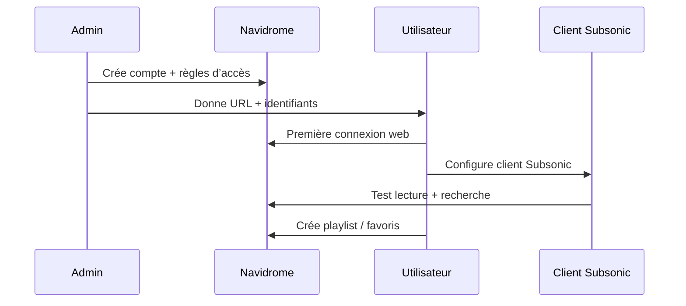

# 🎧 Navidrome — Présentation & Configuration Premium (Music Server + Subsonic API)

### Votre “Spotify perso” auto-hébergé : bibliothèque locale, streaming, multi-clients, API Subsonic
Optimisé pour reverse proxy existant • Qualité audio maîtrisée • Scan & métadonnées propres • Exploitation durable

---

## TL;DR

- **Navidrome** = serveur de musique web + **compatible Subsonic API** (donc clients mobiles/desktop très nombreux).
- Une config premium repose sur : **tags propres**, **scan maîtrisé**, **transcodage rationnel**, **droits/accès**, **tests + rollback**.
- Navidrome ne “répare” pas une bibliothèque mal taggée : la qualité vient d’abord de **vos métadonnées**.

---

## ✅ Checklists

### Pré-configuration (qualité & cohérence)
- [ ] Bibliothèque taggée correctement (Artist/Album/Title/Year/Track/Disc)
- [ ] Arborescence stable (éviter les renommages sauvages après import)
- [ ] Artwork cohérent (embedded cover si possible)
- [ ] Décider : lecture **direct play** vs **transcodage** (mobile/4G)
- [ ] Définir le modèle d’accès (comptes, permissions, partage famille)

### Post-configuration (validation “propre”)
- [ ] Scan initial OK (pas d’erreurs de droits/chemins)
- [ ] Recherche rapide (artistes/albums instant)
- [ ] Un client Subsonic se connecte et lit un album complet
- [ ] Transcodage (si activé) validé sur un fichier lourd
- [ ] Sauvegarde/restauration de la DB validée (au moins 1 test)

---

> [!TIP]
> Si tu veux une expérience “premium”, investis d’abord 1h dans les **tags** (MusicBrainz Picard / beets) : c’est le multiplicateur #1.

> [!WARNING]
> Les logs et la DB peuvent contenir des infos sensibles (noms d’utilisateurs, chemins). Traite Navidrome comme un service interne.

> [!DANGER]
> Une bibliothèque déplacée/renommée sans stratégie peut provoquer une “reconstruction” partielle : playlists, favoris, stats peuvent devenir incohérents selon les cas. Fais des changements structurels **avec backup**.

---

# 1) Navidrome — Vision moderne

Navidrome, c’est :
- 🎼 Un serveur de streaming **centré bibliothèque locale**
- 🌐 Une interface web rapide (recherche, playlists, radios)
- 🔌 Un serveur **Subsonic-API** compatible (gros écosystème clients)
- 🧠 Un moteur “bibliothèque” : indexation + métadonnées + lecture

Docs (overview) : https://www.navidrome.org/docs/overview/  
Repo (référence) : https://github.com/navidrome/navidrome

---

# 2) Architecture globale



---

# 3) “Premium config mindset” (5 piliers)

1. 🏷️ **Métadonnées fiables** (tags > noms de fichiers)
2. 🔍 **Scan contrôlé** (fréquence + incrémental)
3. 🎛️ **Transcodage raisonné** (mobile vs LAN)
4. 👥 **Accès gouverné** (comptes, partage, limites)
5. 🧪 **Validation + rollback** (tests simples, restauration)

---

# 4) Bibliothèque & Métadonnées (le vrai cœur)

## 4.1 Règle d’or : tags > filenames
Navidrome s’appuie fortement sur :
- Artist / AlbumArtist
- Album
- Track number + Disc number
- Year / Date
- Title
- Genres (optionnel mais utile)
- Artwork (embedded ou fichiers cover)

> [!TIP]
> “AlbumArtist” cohérent évite l’explosion d’artistes quand tu as des feat./VA/compilations.

## 4.2 Arborescence recommandée (lisible & stable)
Objectif : stabilité, pas “parfait” :
- Artiste/Année - Album/NN - Titre.ext
- Multi-disques : CD1/CD2 ou Disc 1/Disc 2

> [!WARNING]
> Évite de renommer/déplacer en continu après import : fais une passe “nettoyage”, puis stabilise.

---

# 5) Scan & Indexation (performance + fiabilité)

Navidrome peut scanner à intervalle. Une stratégie premium :
- Scan fréquent si bibliothèque change souvent (ajouts journaliers)
- Scan plus rare si bibliothèque stable

Points clés :
- Un scan trop agressif = charge disque + CPU
- Un scan trop rare = retards d’apparition des nouveaux albums

Doc options config : https://www.navidrome.org/docs/usage/configuration/options/

---

# 6) Transcodage (quand et pourquoi)

## 6.1 Philosophie
- **LAN / Hi-Fi** : privilégie **direct play** (zéro perte, zéro CPU)
- **Mobile / 4G** : transcode vers un bitrate raisonnable (ex: Opus/AAC)

## 6.2 Choix premium (pragmatiques)
- FLAC en LAN : direct
- FLAC en mobile : transcode (Opus recommandé si clients OK)
- MP3 déjà compressé : éviter de re-transcoder (perte cumulative)

> [!WARNING]
> Le transcodage dépend d’outils système (souvent ffmpeg). Si le transcode “rame”, vérifie CPU et paramètres (bitrate trop élevé / codecs lourds).

---

# 7) Comptes, Partage & Gouvernance

## 7.1 Modèle d’accès simple
- 1 compte admin
- 1 compte par utilisateur (famille/amis)
- Permissions limitées si nécessaire

Bonnes pratiques :
- Mots de passe uniques
- Désactiver les comptes inutilisés
- Ne pas partager le compte admin

## 7.2 Multi-clients Subsonic (expérience premium)
Navidrome étant Subsonic-compatible, tu peux utiliser des clients riches :
- offline sync
- smart playlists côté client
- cache local

Doc “Getting Started” : https://www.navidrome.org/docs/getting-started/

---

# 8) Workflows premium (ops & usage)

## 8.1 Onboarding d’un utilisateur


## 8.2 Runbook “nouvelle musique n’apparaît pas”
- Vérifier que les fichiers sont bien dans le dossier musique
- Vérifier droits de lecture (ro OK, mais lisible)
- Vérifier scan schedule / dernier scan
- Vérifier logs (erreurs parsing tags / fichiers illisibles)

---

# 9) Validation / Tests / Rollback

## 9.1 Smoke tests (réseau + service)
```bash
# Réponse HTTP (adapter host/port/URL)
curl -I http://NAVIDROME_HOST:PORT | head

# Si exposé via ton reverse proxy existant
curl -I https://music.example.tld | head
```

## 9.2 Tests fonctionnels (bibliothèque)
- Recherche : un artiste + un album
- Lecture : un album complet
- Client Subsonic : login + lecture + (option) offline sync
- Transcode (si activé) : lire un FLAC depuis mobile

## 9.3 Rollback (principe)
- Navidrome s’appuie sur une DB (souvent SQLite) + config + cache
- Rollback propre = restaurer :
  - DB (navidrome.db si SQLite)
  - config
  - (éventuellement) cache si tu veux un état identique

> [!TIP]
> Avant toute évolution “structurante” (changement de dossiers musique / gros retag), fais un backup DB + config.

---

# 10) Sources — Images Docker (URLs brutes, comme demandé)

## 10.1 Image officielle la plus citée
- `deluan/navidrome` (Docker Hub) : https://hub.docker.com/r/deluan/navidrome  
- Tags (révisions & plateformes) : https://hub.docker.com/r/deluan/navidrome/tags  
- Doc officielle “Installing with Docker” (référence l’image officielle) : https://www.navidrome.org/docs/installation/docker/  
- Repo Navidrome (référence upstream) : https://github.com/navidrome/navidrome  

## 10.2 Image officielle (GitHub Container Registry)
- `ghcr.io/navidrome/navidrome` (GitHub Packages) : https://github.com/orgs/navidrome/packages/container/package/navidrome  

## 10.3 LinuxServer.io (LSIO) — statut
- Doc LSIO (index des images) : https://docs.linuxserver.io/images/  
- Liste “Our Images” (LSIO) : https://www.linuxserver.io/our-images  
- Note : je n’ai pas trouvé de page officielle LSIO dédiée à `lscr.io/linuxserver/navidrome` dans la doc LSIO via recherche web. Si tu as un lien LSIO précis, envoie-le et je l’intégrerai ici tel quel.

---

# ✅ Conclusion

Navidrome est excellent quand :
- ta musique est bien taggée,
- ton scan est maîtrisé,
- tu transcodes uniquement quand ça a du sens,
- et tu valides/rollback comme un service “sérieux”.

Résultat : une bibliothèque fluide, multi-clients, “Spotify perso” — sans dépendre d’un cloud.