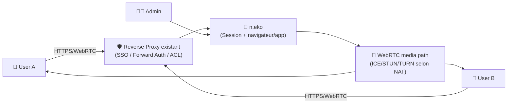
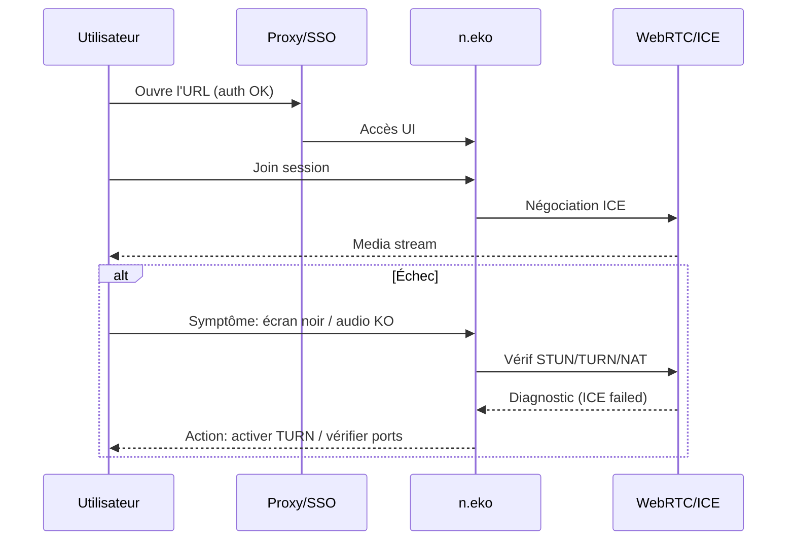

# 🧑‍🤝‍🧑 n.eko (Neko) — Présentation & Exploitation Premium

### Navigateur virtuel auto-hébergé, collaboratif, streamé en WebRTC (latence faible)
Optimisé pour reverse proxy existant • Sessions partagées • Multi-navigateurs • Gouvernance & sécurité

---

## TL;DR

- **n.eko** permet d’exécuter un **navigateur (ou une app Linux)** côté serveur et de le **streamer dans le navigateur** des utilisateurs via **WebRTC**.
- Usage typique : **navigation partagée**, **support/assistance**, **démo produit**, **sandbox isolée**, **browsing “jetable”**.
- “Premium ops” = **contrôle d’accès**, **isolation**, **politiques de session**, **multi-rooms**, **tests** + **rollback**.

---

## ✅ Checklists

### Pré-usage (avant d’ouvrir à une équipe)
- [ ] Définir le périmètre : usage “collab” vs “support” vs “sandbox”
- [ ] Définir la stratégie d’accès : SSO/forward-auth/VPN (via proxy existant)
- [ ] Choisir le navigateur : Firefox / Chromium / Chrome (selon contraintes)
- [ ] Décider : instance unique vs “rooms” (multi-salles)
- [ ] Définir la politique de secrets : **aucun token/API** dans l’instance, clipboard maîtrisé

### Post-configuration (qualité opérationnelle)
- [ ] Un utilisateur non autorisé ne peut pas joindre une session
- [ ] La latence reste acceptable (test réseau + codec)
- [ ] Les permissions/limites (audio, clipboard, file access) sont conformes
- [ ] Un runbook “incident WebRTC” existe (ports, STUN/TURN, NAT)
- [ ] Procédure de rollback prête (désactivation rooms / retour config auth)

---

> [!TIP]
> n.eko est particulièrement utile pour :  
> **pair debugging**, **support en live**, **démo sans installer**, **navigation isolée** (session éphémère).

> [!WARNING]
> Les sessions peuvent exposer des données (cookies, historique, clipboard, audio).  
> Pense “poste partagé” : **zéro secret**, **isolement**, **sessions courtes**.

> [!DANGER]
> Sans contrôle d’accès strict, n.eko devient une surface d’attaque majeure (UI web + navigateur côté serveur).  
> Mets-le derrière ton reverse proxy existant + auth solide.

---

# 1) n.eko — Vision moderne

n.eko n’est pas “juste un navigateur à distance”.

C’est :
- 🎥 Un **stream** (WebRTC) d’un navigateur/app exécuté côté serveur
- 🧑‍🤝‍🧑 Un mode **collaboratif** (plusieurs utilisateurs dans la même session)
- 🧩 Une plateforme “virtual app” (browser, outils, apps Linux)
- 🧰 Un outil de **support** (voir/agir en direct)

---

# 2) Architecture globale (concept)



---

# 3) “Premium config mindset” (5 piliers)

1. 🔐 **Contrôle d’accès** (SSO/forward-auth/VPN via proxy existant)
2. 🧱 **Isolation & hygiène** (sessions jetables, pas de secrets persistants)
3. 🎛️ **Politique de session** (audio, clipboard, permissions, timeouts)
4. 🌐 **Qualité WebRTC** (réseau, NAT, STUN/TURN si nécessaire)
5. 🧪 **Validation / Rollback** (tests simples + retour arrière rapide)

---

# 4) Modes d’usage (et comment choisir)

## 4.1 Session collaborative (partage)
- Une session “salle de réunion”
- Démo produit, debug, co-browsing

## 4.2 Support / assistance
- L’utilisateur explique, l’opérateur agit
- Capturer contexte via logs + timeline

## 4.3 Sandbox isolée (navigation “jetable”)
- Réduire l’exposition du poste client
- Session courte, réinitialisée (stateless autant que possible)

> [!TIP]
> Pour du multi-salles à la demande, regarde **neko-rooms** (gestion de rooms et orchestration).

---

# 5) Gouvernance & Sécurité (sans recettes de proxy)

## 5.1 Contrôle d’accès
Objectif : aucune session accessible sans auth.

Approches courantes :
- Auth via ton **reverse proxy existant** (SSO/headers/forward-auth)
- Accès via **VPN** (WireGuard / Tailscale) + ACL
- Limiter qui peut créer/joindre une salle (si rooms)

## 5.2 Politique “zéro secrets”
- Ne te connecte pas à des services avec tokens sensibles dans n.eko
- Utilise des comptes dédiés “demo/support”
- Nettoie cookies/historique entre sessions (ou sessions jetables)

## 5.3 Surface WebRTC (NAT/ICE)
- Les environnements NAT complexes peuvent nécessiter **STUN/TURN**
- Avoir un runbook “WebRTC ne connecte pas” (ports, firewall, symNAT)

> [!WARNING]
> Les navigateurs Chromium/Chrome peuvent nécessiter des capacités/permissions particulières selon l’image choisie. Lis la doc des tags avant de standardiser.

---

# 6) Workflows premium (opérations)

## 6.1 Triage “ça lag / pas de vidéo”


## 6.2 Runbook “support session”
- Identifier la salle + utilisateur
- Confirmer règles : audio/clipboard/permissions
- Reproduire le problème
- Capturer : timestamp + URL + logs + contexte
- Fermer session + purge (si politique jetable)

---

# 7) Validation / Tests / Rollback

## Tests de validation (smoke)
```bash
# 1) L'UI répond (depuis réseau autorisé)
curl -I https://neko.example.tld | head

# 2) Vérifier que l'auth est bien active
# Attendu: 302 vers SSO ou 401/403 sans cookie
curl -I https://neko.example.tld | head -n 20
```

## Tests fonctionnels (manuels, indispensables)
- Join session à 2 utilisateurs (A/B)
- Test actions :
  - scroll / clic
  - plein écran
  - clipboard (si autorisé)
  - audio (si autorisé)
- Test réseau :
  - depuis 4G (NAT) si c’est un cas d’usage
  - depuis réseau entreprise (proxy/firewall)

## Rollback (simple)
- Désactiver l’accès externe (ACL/proxy) → mode maintenance
- Revenir à la config “safe” :
  - désactiver rooms (si orchestration)
  - réduire permissions (clipboard/audio)
  - forcer accès via VPN uniquement
- Documenter un rollback “5 minutes” (objectif)

---

# 8) Limitations (à poser clairement)

- Ce n’est pas un SIEM/logging historique : c’est une **session interactive**
- La qualité dépend du réseau (WebRTC, NAT, bandwidth)
- Les usages “haute conformité” demandent durcissement (isolement, audit, ephemeral)

---

# 9) Sources — Images Docker (format demandé : URLs brutes)

## 9.1 Image officielle la plus citée (Docker Hub)
- `m1k1o/neko` (Docker Hub) : https://hub.docker.com/r/m1k1o/neko  
- Tags `m1k1o/neko` (Docker Hub) : https://hub.docker.com/r/m1k1o/neko/tags  
- Repo upstream (référence) : https://github.com/m1k1o/neko  

## 9.2 Images recommandées (GHCR, docs v3)
- Doc “Docker Images” (recommande GHCR par navigateur) : https://neko.m1k1o.net/docs/v3/installation/docker-images  
- Doc “Installation” (cadre général) : https://neko.m1k1o.net/docs/v3/installation  

## 9.3 Multi-salles (rooms) — utile si tu veux des sessions à la demande
- `m1k1o/neko-rooms` (Docker Hub) : https://hub.docker.com/r/m1k1o/neko-rooms  
- Tags `m1k1o/neko-rooms` : https://hub.docker.com/r/m1k1o/neko-rooms/tags  
- Repo `neko-rooms` : https://github.com/m1k1o/neko-rooms  

## 9.4 LinuxServer.io (LSIO)
- Catalogue images LSIO (vérif) : https://www.linuxserver.io/our-images  
- À ce jour, n.eko n’apparaît pas comme image LSIO dédiée dans leur catalogue public : https://www.linuxserver.io/our-images  

---

# ✅ Conclusion

n.eko est une brique “premium” quand tu veux :
- collaborer en live dans un navigateur,
- faire du support/démo sans installer,
- ou isoler la navigation via sessions jetables.

La vraie différence en prod : **auth solide, hygiène de session, runbooks WebRTC, tests et rollback**.